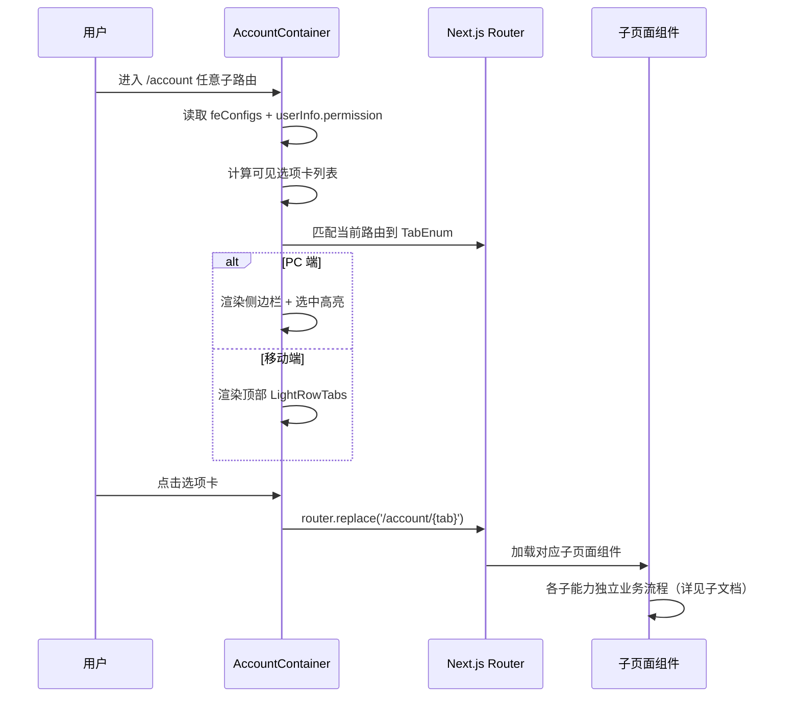

# 账户 — 业务流程详解

> 账户模块为分组节点，本身不承载具体业务操作。所有业务流程散布在各子能力中。

## 子能力业务流程索引

| 子能力 | 业务描述 | 业务流程索引 | 业务流程详解 |
|--------|---------|------------|------------|
| 用量统计 | 查看团队 AI 用量消耗仪表盘和明细 | [09-业务流程索引](../用量统计/业务流程索引.md) | [10-业务流程详解](../用量统计/业务流程详解.md) |
| 账号信息 | 管理个人资料、订阅套餐、优惠券 | [09-业务流程索引](../账号信息/业务流程索引.md) | [10-业务流程详解](../账号信息/业务流程详解.md) |
| 团队管理 | 管理团队成员、角色和权限 | [09-业务流程索引](../团队管理/业务流程索引.md) | [10-业务流程详解](../团队管理/业务流程详解.md) |
| 账单 | 查看订单历史和发票管理 | [09-业务流程索引](../账单/业务流程索引.md) | [10-业务流程详解](../账单/业务流程详解.md) |
| 第三方集成 | 配置 Laf、OpenAI 和工作流变量 | [09-业务流程索引](../第三方集成/业务流程索引.md) | [10-业务流程详解](../第三方集成/业务流程详解.md) |
| 自定义域名 | 管理应用自定义域名和 DNS 配置 | [09-业务流程索引](../自定义域名/业务流程索引.md) | [10-业务流程详解](../自定义域名/业务流程详解.md) |
| 模型管理 | 管理 AI 模型供应商和模型列表 | [09-业务流程索引](../模型管理/业务流程索引.md) | [10-业务流程详解](../模型管理/业务流程详解.md) |
| 推广 | 查看推广统计和邀请链接 | [09-业务流程索引](../推广/业务流程索引.md) | [10-业务流程详解](../推广/业务流程详解.md) |
| API 密钥 | 创建和管理 API 访问密钥 | [09-业务流程索引](../API 密钥/业务流程索引.md) | [10-业务流程详解](../API 密钥/业务流程详解.md) |
| 通知 | 配置通知接收偏好 | [09-业务流程索引](../通知/业务流程索引.md) | [10-业务流程详解](../通知/业务流程详解.md) |
| 个性化设置 | 切换语言等个人偏好 | [09-业务流程索引](../个性化设置/业务流程索引.md) | [10-业务流程详解](../个性化设置/业务流程详解.md) |

## 公共导航流程

账户模块通过 `AccountContainer` 组件提供统一的导航框架：

- **PC 端**：左侧可折叠侧边栏，展示所有可用选项卡（用量统计、账号信息、团队管理、账单、第三方集成、自定义域名、模型管理、推广、API 密钥、通知、个性化设置、退出登录）
- **移动端**：顶部横向滚动的 LightRowTabs 选项卡组件
- **导航切换**：点击选项卡通过 `router.replace('/account/' + tab)` 切换路由，激活态由当前路径末尾段匹配
- **退出登录**：点击退出登录选项卡 → 弹出确认弹窗（"确认退出登录？"）→ 确认后清除用户状态 → 跳转至 `/login`
- **选项卡可见性**：由 `feConfigs`（isPlus、show_pay、show_promotion、customDomain.enable）和 `userInfo.team.permission` 联合控制

## Mermaid 附录

> 各子能力的详细业务流程见上方「子能力业务流程索引」表中的链接。
