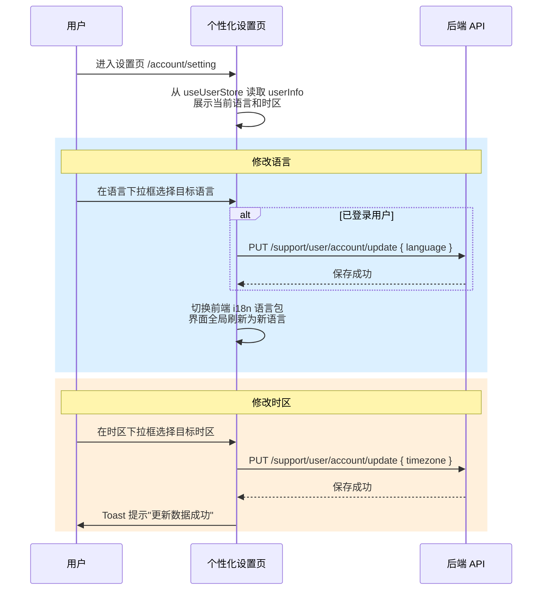

# 个性化设置 — 业务流程详解

## 页面总览

个性化设置页为用户提供语言和时区两项偏好配置。页面以"设置"为标题，包含两个下拉选择器：语言切换和时区选择。修改语言时，系统同时更新后端用户数据并切换前端国际化语言包；修改时区时，系统自动保存变更并显示成功提示。

> **Tab 检测结果**：本页面无 Tab 结构，为单一表单页。

---

### 修改个人偏好设置

> 用户在个性化设置页中修改语言或时区偏好，系统自动或手动保存至用户账户。

#### 步骤 1：页面加载，展示当前设置

| 用户操作 | 触发 API | 分支条件 | 页面变化 |
|---------|---------|---------|---------|
| 通过账户侧边栏点击"语言与时区"进入页面 | GET /support/user/account/tokenLogin（由 useUserStore.initUserInfo 在应用初始化时调用） | — | 页面显示"设置"标题；语言下拉框显示当前语言；时区下拉框显示当前时区；页面以 AccountContainer 包裹，PC 端显示侧边栏，移动端显示顶部 Tab 导航条 |

#### 步骤 2：修改界面语言

| 用户操作 | 触发 API | 分支条件 | 页面变化 |
|---------|---------|---------|---------|
| 点击语言下拉框，选择目标语言（如从"中文"切换至"English"） | PUT /support/user/account/update（参数：`{ language: "en" }`） | **已登录用户**：先调用 updateUserInfo 保存语言偏好至后端，再切换前端语言包。 **未登录用户**（如在登录页使用）：跳过后端保存，仅切换前端语言包。 | 前端界面语言立即切换为目标语言；语言下拉框选中值更新；若后端保存失败，前端语言仍已切换（乐观更新），后端语言偏好回滚。 |

#### 步骤 3：修改时区

| 用户操作 | 触发 API | 分支条件 | 页面变化 |
|---------|---------|---------|---------|
| 点击时区下拉框，选择目标时区（如从 "Asia/Shanghai" 切换至 "America/New_York"） | PUT /support/user/account/update（参数：`{ timezone: "America/New_York" }`） | 时区变更自动触发保存（下拉框 onChange 直接调用 onclickSave）。 **前置条件**：userInfo 已加载，否则不执行保存。 | 显示加载中状态（toast 提示）；保存成功后弹出"更新数据成功"的绿色 toast 提示；时区下拉框显示新选中的时区。若保存失败，时区回滚至旧值。 |

---

#### 表单字段清单

| 字段名 | 控件类型 | 必填 | 默认值 | 可选值/约束 | 说明 |
|--------|---------|------|--------|------------|------|
| 语言 (language) | 下拉选择器 (MySelect) | 否 | 用户注册时选择或系统默认语言 | 中文简体 / 中文繁體 / English（由 langMap 定义） | 登录用户修改后同步保存至后端 |
| 时区 (timezone) | 下拉选择器 (Chakra Select) | 否 | 用户注册时选择或系统默认时区 | 全球 IANA 时区列表（如 Asia/Shanghai, America/New_York 等） | 选择后自动保存，无需手动确认 |

#### 校验规则

本页面无前端输入校验。语言和时区均为下拉选择，值来自预定义列表，不存在非法输入场景。

#### 前后置条件

- **前置条件**：用户已登录，userInfo 已通过 `initUserInfo` 加载完毕
- **后置影响**：语言变更 → 全局 i18n 语言切换，所有页面文案立即更新；时区变更 → 系统中时间展示基于新时区计算
- **失败场景**：网络异常或后端保存失败时，Store 中的 userInfo 回滚至旧值，用户可重新尝试

---

### Mermaid 附录

