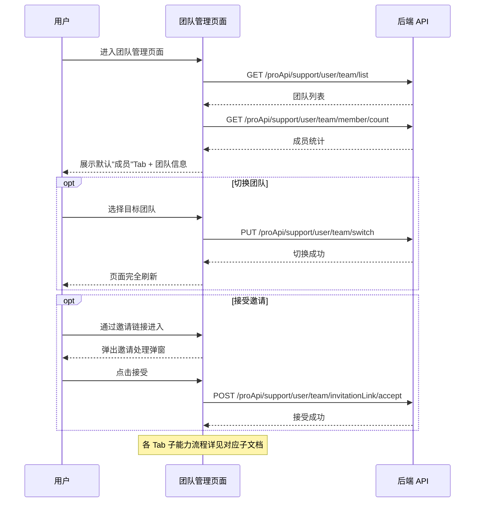

# 团队管理 — 业务流程详解

## 页面总览

团队管理页面是 FastGPT 团队协作的核心入口，提供成员管理、组织架构、权限分配和操作审计等能力。页面在 AccountContainer 布局容器内渲染，顶部展示团队名称和成员统计，下方通过 5 个 Tab 组织各子功能。仅已加入团队的用户可访问。

## Tab 结构索引

| Tab | 业务描述 | 步骤数 | API 数 | 来源 | 详细文档 |
|-----|---------|--------|--------|------|---------|
| 成员 | 成员列表查看、邀请、移除、状态管理 | 8 | 6 | 本模块 | [业务流程详解](../成员/业务流程详解.md) |
| 组织 | 组织树管理、成员分配、移动 | 5 | 4 | 本模块 | [业务流程详解](../组织/业务流程详解.md) |
| 分组 | 分组创建/编辑/删除、成员分配 | 4 | 3 | 本模块 | [业务流程详解](../分组/业务流程详解.md) |
| 权限管理 | 成员/组织/分组的资源创建权限分配 | 4 | 4 | 本模块 | [业务流程详解](../权限管理/业务流程详解.md) |
| 审计日志 | [条件可见] 团队操作记录查看与筛选 | 3 | 2 | 本模块 | [业务流程详解](../审计日志/业务流程详解.md) |

> 审计日志 Tab 仅在订阅计划含审计日志存储时长时对管理员可见。

## 公共业务流程

### 场景：进入团队管理页面

> 用户从账户侧边栏选择"团队"进入团队管理页面，页面自动加载当前团队数据。

#### 步骤 1：页面初始化与权限校验

| 用户操作 | 触发 API | 分支条件 | 页面变化 |
|---------|---------|---------|---------|
| 从账户侧边栏点击"团队"菜单项 | — | 当前用户未加入任何团队（userInfo.team 为空）：页面不渲染任何内容 | 路由跳转至 /account/team |
| 等待页面加载 | GET /proApi/support/user/team/list（获取团队列表，参数 status=active） | 同步模式团队：不显示邀请按钮；企业微信团队：不显示邀请按钮，显示同步和转让按钮 | 页面加载中显示 Loading |
| 等待成员统计加载 | GET /proApi/support/user/team/member/count（获取成员总数） | — | 头部右侧显示"共 N 位成员"标签 |
| 页面渲染完成 | — | hasManagePer 为 true：Tab 栏显示"审计日志"选项；为 false：不显示审计日志 Tab | 默认激活"成员"Tab，加载成员列表内容 |

#### 步骤 2：Tab 默认激活

页面初始化时默认选中"成员"Tab（teamTab=member），通过 router.query 控制当前激活的 Tab。Tab 切换通过更新 URL query 参数实现，不触发页面完整刷新，只切换内容区域渲染的子组件。

### 场景：切换团队

> 用户通过头部团队选择器切换到其他团队。

| 用户操作 | 触发 API | 分支条件 | 页面变化 |
|---------|---------|---------|---------|
| 点击头部团队选择器下拉按钮 | — | — | 展开下拉菜单，展示已加入的团队列表（含团队头像和名称） |
| 在下拉列表中点击目标团队 | PUT /proApi/support/user/team/switch（参数 teamId） | 切换成功：页面重新加载；切换失败：弹出错误提示"切换团队失败" | 切换期间系统全局 Loading，切换成功后页面完全刷新 |

### 场景：编辑团队信息

> 团队所有者点击编辑图标修改团队基本信息。

| 用户操作 | 触发 API | 分支条件 | 页面变化 |
|---------|---------|---------|---------|
| 点击头部编辑图标（仅 owner 角色可见） | — | 团队所有者且 userInfo.team 存在时图标可见 | 弹出编辑团队信息弹窗 |
| 在弹窗中修改团队名称/头像/通知账号 | — | — | 表单实时更新（非受控模式或受控校验） |
| 提交修改 | PUT /support/user/team/update | 成功：刷新团队列表并重新初始化用户信息；失败：停留在弹窗 | 弹窗关闭，团队列表刷新，名称/头像即时更新 |

### 场景：接受团队邀请

> 被邀请用户通过邀请链接进入，自动弹出接受/拒绝弹窗。

| 用户操作 | 触发 API | 分支条件 | 页面变化 |
|---------|---------|---------|---------|
| 通过邀请链接进入 /account/team?invitelinkid={id} | — | URL 中存在有效 invitelinkid 参数 | 页面正常加载团队管理页 + 自动弹出邀请处理弹窗 |
| 在弹窗中点击"接受" | POST /proApi/support/user/team/invitationLink/accept（参数 linkId） | 成功：关闭弹窗并跳转工作台 | 弹窗关闭 |
| 在弹窗中点击"拒绝" | — | — | 弹窗关闭 |

### 场景：Tab 切换

> 用户在 5 个 Tab 间切换。

| 用户操作 | 触发 API | 分支条件 | 页面变化 |
|---------|---------|---------|---------|
| 点击 Tab 标签 | — | 切换至"审计日志"且当前订阅计划不含审计日志存储时长：弹出警告"无权限"，不切换 | Tab 切换时 URL query 更新；若切换成功，内容区域渲染对应 Tab 的子组件 |
| Tab 内容区加载 | 各 Tab 自行发起数据请求 | — | 内容区域显示对应 Tab 的 Loading + 数据内容 |

## Mermaid 附录

