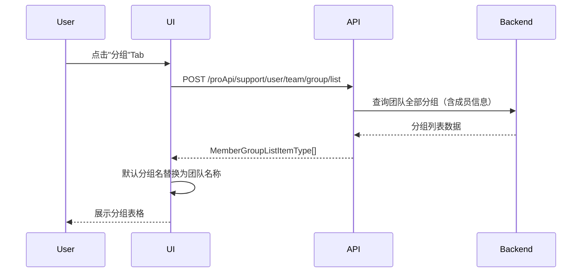
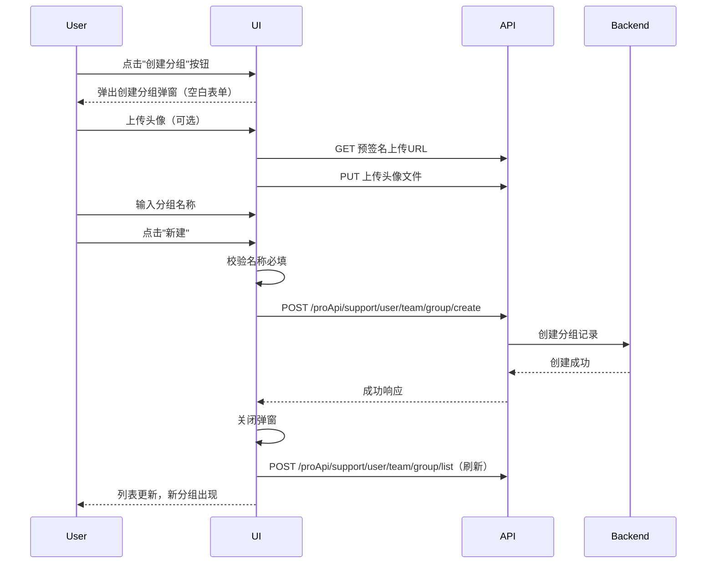
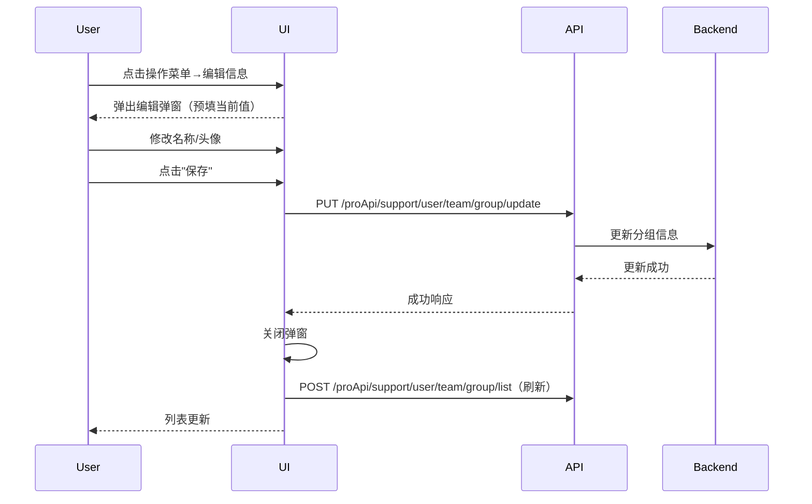
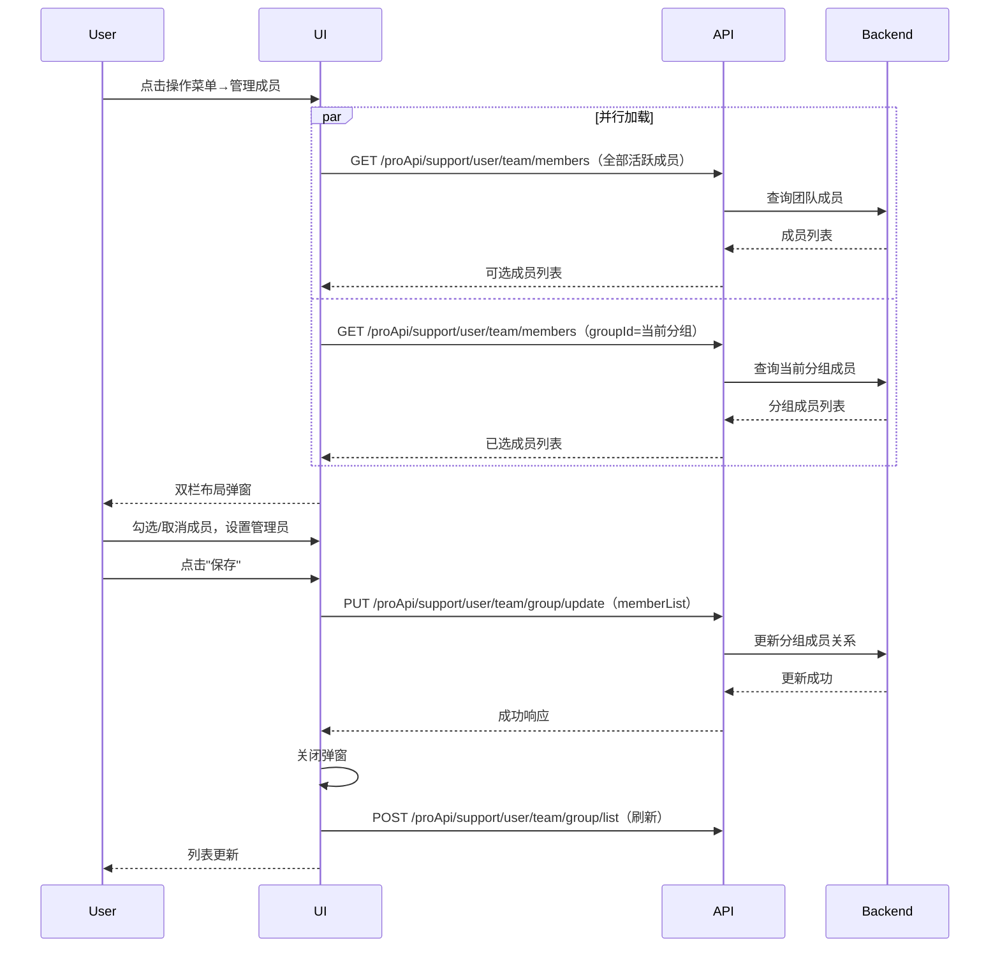
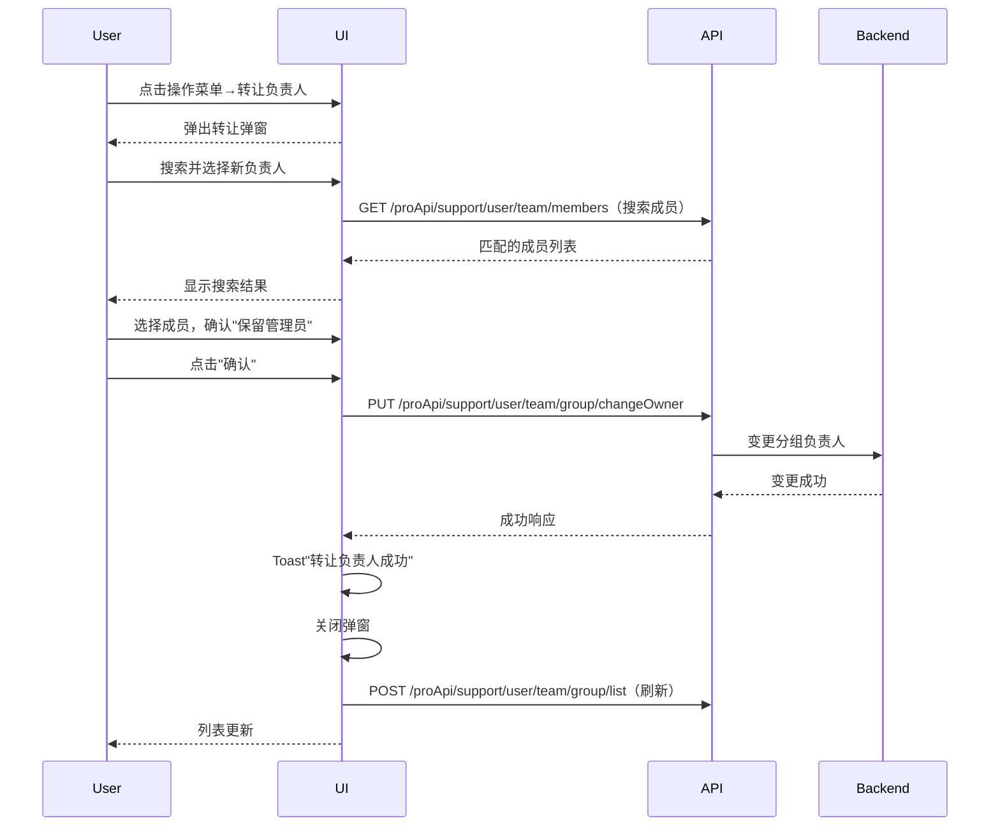
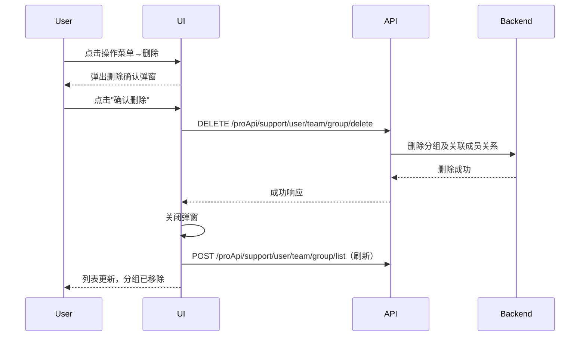

# 分组 — 业务流程详解

## 页面总览

分组模块是团队管理页面中"分组"Tab 对应的面板，以表格形式展示团队内所有分组的列表。团队管理员可在页面顶部看到"创建分组"按钮，每个分组行显示名称、负责人、成员头像总览和操作菜单。所有增删改操作均通过弹窗完成，操作成功后自动刷新列表。

本模块无嵌套 Tab，所有功能集中在一个列表页面中。

---

## S01：查看分组列表

> **业务描述**: 用户切换到分组 Tab 后，查看当前团队下所有分组的完整列表，了解每个分组的基本信息和成员概况。

### 步骤 1：进入分组列表

| 用户操作 | 触发 API | 分支条件 | 页面变化 |
|---------|---------|---------|---------|
| 在团队管理页面点击"分组"Tab | POST /proApi/support/user/team/group/list（参数：withMembers: true） | 无分支，直接加载 | Tab 切换为"分组"高亮状态，列表区域显示加载动画（MyBox isLoading），数据返回后渲染分组表格 |

### 步骤 2：浏览分组列表

| 用户操作 | 触发 API | 分支条件 | 页面变化 |
|---------|---------|---------|---------|
| 查看分组列表（无操作） | 无（列表已加载） | 默认分组（DEFAULT_GROUP）名称显示为团队名称 | 表格每行展示：分组名称+头像（MemberTag）、负责人名称+头像、成员头像组（AvatarGroup）+人数、操作按钮（三个点图标） |

### 数据加载详情

| 加载阶段 | API | 关键参数 | 数据处理 | 渲染结果 |
|---------|-----|---------|---------|---------|
| Tab 切换时首次加载 | POST /proApi/support/user/team/group/list | withMembers: true | 默认分组名替换为团队名称 | 表格展示所有分组 |
| 依赖刷新 | POST /proApi/support/user/team/group/list | 同上（refreshDeps: [teamId]） | 同上 | 团队切换时自动重新加载 |

- 分页：当前为一次性全量加载，无分页参数
- 排序：按后台返回顺序展示
- 筛选：无前端筛选器
- 特殊列渲染：默认分组（name === 'DEFAULT_GROUP'）的名称列显示当前团队名称而非 'DEFAULT_GROUP'；操作菜单仅对 `hasManagePer` 为 true 的分组显示

### Mermaid 附录

---

## S02：创建分组

> **业务描述**: 团队管理员创建新分组，设置分组名称和头像，便于后续成员分配和权限管理。

### 步骤 1：打开发起入口

| 用户操作 | 触发 API | 分支条件 | 页面变化 |
|---------|---------|---------|---------|
| 点击"创建分组"按钮 | 无 | 仅团队管理员（hasManagePer）可见此按钮 | 按钮带左图标（协作者图标），点击后弹出分组信息编辑弹窗 |

### 步骤 2：填写分组信息

| 用户操作 | 触发 API | 分支条件 | 页面变化 |
|---------|---------|---------|---------|
| 查看弹窗表单 | 无 | 创建模式：弹窗标题为"创建分组"，名称为空，头像为默认团队头像 | 弹窗显示名称输入框（placeholder："分组名称"）和头像选择区域 |
| 点击头像区域 | GET /proApi/support/file/upload/avatar（预签名上传URL） | 无分支 | 打开文件选择器，选择图片后头像预览更新 |
| 输入分组名称 | 无 | 名称为必填字段 | 输入框中显示输入的内容 |

### 步骤 3：提交创建

| 用户操作 | 触发 API | 分支条件 | 页面变化 |
|---------|---------|---------|---------|
| 点击"新建"按钮 | POST /proApi/support/user/team/group/create（参数：name, avatar） | 名称必填校验不通过时阻止提交 | 按钮显示加载动画（isLoading），API 成功后弹窗关闭，分组列表自动刷新 |

### 表单与交互详情

**表单字段清单**:

| 字段名 | 控件类型 | 必填 | 默认值 | 可选值/约束 | 编辑时只读 | 说明 |
|--------|---------|------|--------|------------|-----------|------|
| 头像 | 图片选择 | 否 | DEFAULT_TEAM_AVATAR | 通过预签名 URL 上传至文件服务 | 否 | 点击头像触发上传 |
| 名称 | 文本输入 | 是 | 空 | 无特殊约束 | 否 | 分组名称，用于列表展示 |

**校验规则**:

| 规则 | 触发时机 | 错误提示文案 |
|------|---------|-------------|
| 名称必填 | 提交时（react-hook-form required 校验） | 浏览器默认必填提示 |

**前后置条件**:
- **前置条件**: 用户拥有团队管理权限（hasManagePer）
- **后置影响**: 创建成功后，新分组出现在分组列表中；系统自动为分组创建默认的 owner 角色（创建者）
- **失败场景**: 网络异常或服务端错误时，弹窗保持打开，用户可重试

### Mermaid 附录

---

## S03：编辑分组信息

> **业务描述**: 分组负责人或管理员修改分组的名称和头像。

### 步骤 1：进入编辑

| 用户操作 | 触发 API | 分支条件 | 页面变化 |
|---------|---------|---------|---------|
| 点击分组行操作菜单（三点图标） | 无 | 仅 hasManagePer 为 true 时显示操作菜单 | 展开 MyMenu 下拉菜单 |
| 选择"编辑信息" | 无 | 无分支 | 弹出编辑弹窗，预填当前分组名称和头像 |

### 步骤 2：修改信息并提交

| 用户操作 | 触发 API | 分支条件 | 页面变化 |
|---------|---------|---------|---------|
| 修改头像/名称 | 无 | 操作同创建流程 | 表单控件实时更新 |
| 点击"保存" | PUT /proApi/support/user/team/group/update（参数：groupId, name, avatar） | 编辑模式（editGroup 存在）：调用更新 API | 按钮显示加载动画，成功后弹窗关闭，列表刷新 |

### 表单字段清单

| 字段名 | 控件类型 | 必填 | 默认值 | 可选值/约束 | 编辑时只读 | 说明 |
|--------|---------|------|--------|------------|-----------|------|
| 头像 | 图片选择 | 否 | 当前分组头像 | 同创建流程 | 否 | 点击可更换 |
| 名称 | 文本输入 | 是 | 当前分组名称 | 同创建流程 | 否 | 显示当前值，可修改 |

### Mermaid 附录

---

## S04：管理分组成员

> **业务描述**: 分组负责人或管理员添加、移除分组成员，设置和取消分组管理员。

### 步骤 1：进入成员管理

| 用户操作 | 触发 API | 分支条件 | 页面变化 |
|---------|---------|---------|---------|
| 点击操作菜单→"管理成员"（或点击成员头像区域） | GET /proApi/support/user/team/members（两路并行加载） | 仅 hasManagePer 为 true 时入口可用 | 弹出成员管理弹窗，左右双栏布局 |

### 步骤 2：浏览和选择成员

| 用户操作 | 触发 API | 分支条件 | 页面变化 |
|---------|---------|---------|---------|
| 查看左侧可选成员列表 | GET /proApi/support/user/team/members（参数：status=active, pageSize=20, searchKey） | 无分支，首次加载 | 左侧显示活跃团队成员列表，每项带复选框和所属组织信息 |
| 搜索成员 | GET /proApi/support/user/team/members（参数：searchKey 更新） | 搜索防抖 200ms | 列表按搜索关键词过滤刷新 |
| 滚动加载更多 | GET /proApi/support/user/team/members（参数：翻页） | 节流 500ms | 追加加载下一页数据 |
| 勾选/取消勾选成员 | 无 | 管理员不能移除负责人和管理员；不能移除负责人自身 | 选中项出现在右侧已选列表，角色默认为 member |
| 查看右侧已选成员 | GET /proApi/support/user/team/members（参数：groupId, pageSize=100000） | 无分支，一次性全量加载 | 右侧显示当前分组所有成员，含角色标签 |

### 步骤 3：设置/取消管理员

| 用户操作 | 触发 API | 分支条件 | 页面变化 |
|---------|---------|---------|---------|
| 点击普通成员旁的"设为管理员"标签 | 无（本地状态暂存） | 仅负责人可见此操作；hover 普通成员时显示黄色标签 | 该成员角色切换为 admin，显示管理员标签 |
| 点击管理员标签上的关闭图标 | 无（本地状态暂存） | 仅负责人可操作 | 该成员角色切换回 member |

### 步骤 4：移除成员

| 用户操作 | 触发 API | 分支条件 | 页面变化 |
|---------|---------|---------|---------|
| 点击成员旁的关闭图标 | 无（本地状态暂存） | 管理员只能移除 member 角色成员 | 该成员从已选列表中移除 |
| 尝试移除负责人 | 无 | 阻止操作，弹出 Toast 提示 | Toast："无法删除负责人" |

### 步骤 5：保存变更

| 用户操作 | 触发 API | 分支条件 | 页面变化 |
|---------|---------|---------|---------|
| 点击"保存" | PUT /proApi/support/user/team/group/update（参数：groupId, memberList: [{tmbId, role}]) | 有变更时才提交 | 按钮显示加载动画，成功后弹窗关闭，分组列表刷新 |

### 表单与交互详情

**已选成员的角色标签**:

| 角色 | 标签样式 | 可执行操作 |
|------|---------|-----------|
| 负责人 (owner) | 灰色 Tag，文字"负责人" | 不可删除，不可降级（负责人操作） |
| 管理员 (admin) | 默认色 Tag，文字"管理员" | 负责人可点击关闭图标降级为 member |
| 普通成员 (member) | 无标签（hover 时显示黄色"设为管理员"标签） | 负责人可升级为 admin；管理员可移除 |

**前后置条件**:
- **前置条件**: 用户拥有该分组的 hasManagePer 权限（分组负责人或管理员角色）
- **后置影响**: 保存后成员变更生效，相关成员的权限立即更新
- **失败场景**: 网络异常时弹窗保持打开，用户可重试

### Mermaid 附录

---

## S05：转让分组负责人

> **业务描述**: 分组负责人将所有权转让给团队内另一个成员。

### 步骤 1：打开发起入口

| 用户操作 | 触发 API | 分支条件 | 页面变化 |
|---------|---------|---------|---------|
| 点击操作菜单→"转让负责人" | 无 | 仅分组负责人（isOwner）可见 | 弹出转让负责人弹窗，显示当前分组名称和头像 |

### 步骤 2：选择新负责人

| 用户操作 | 触发 API | 分支条件 | 页面变化 |
|---------|---------|---------|---------|
| 点击搜索输入框 | GET /proApi/support/user/team/members（参数：pageSize=20, searchKey） | 搜索防抖 200ms | 聚焦输入框，可输入搜索关键词 |
| 输入搜索关键词 | GET /proApi/support/user/team/members（参数：searchKey 更新） | 搜索防抖 200ms，节流 500ms | 下拉列表显示匹配的团队成员 |
| 从下拉列表中点击选择成员 | 无 | 无分支 | 选中成员头像和名称显示在输入框左侧，下拉列表关闭 |

### 步骤 3：确认转让

| 用户操作 | 触发 API | 分支条件 | 页面变化 |
|---------|---------|---------|---------|
| 勾选/取消"保留管理员权限"选项 | 无 | 默认勾选，表示转让后原负责人保留 admin 角色 | 复选框状态切换 |
| 点击"确认" | PUT /proApi/support/user/team/group/changeOwner（参数：groupId, tmbId） | 未选择成员时按钮置灰（isDisabled） | 按钮加载中；成功 Toast："转让负责人成功"；失败 Toast："转让负责人失败" |

### 状态转换详情

- **状态转换**: 原负责人（owner）→ 新负责人上任（原 owner 变为 admin（如勾选保留）或 member（如取消保留））
- **前置检查**: 必须从团队成员中选择一个新负责人（已选中状态通过 tmbId 传递）
- **确认提示**: 弹窗标题"转让负责人"，含"保留管理员权限"复选框（默认勾选），提示用户选择新负责人
- **级联更新**: 转让成功后弹窗关闭，分组列表刷新

### Mermaid 附录

---

## S06：删除分组

> **业务描述**: 分组负责人删除一个不再需要的分组。

### 步骤 1：触发删除

| 用户操作 | 触发 API | 分支条件 | 页面变化 |
|---------|---------|---------|---------|
| 点击操作菜单→"删除" | 无 | 仅分组负责人（isOwner）可见（"转让负责人"和"删除"菜单项在 isOwner 条件下渲染） | 弹出删除确认弹窗 |

### 步骤 2：确认删除

| 用户操作 | 触发 API | 分支条件 | 页面变化 |
|---------|---------|---------|---------|
| 查看确认弹窗 | 无 | type='delete'，内容提示用户确认删除分组 | 弹窗显示删除类型图标，文案为删除确认提示 |
| 点击"确认删除" | DELETE /proApi/support/user/team/group/delete（参数：groupId） | 无分支 | API 成功后弹窗关闭，分组列表刷新，该分组消失 |
| 点击"取消" | 无 | 无分支 | 弹窗关闭，无变更 |

### 删除链路详情

- **确认弹窗**: 使用 useConfirm hook 生成，type 为 'delete'，内容文案使用 i18n key `account_team:confirm_delete_group`
- **批量与单条差异**: 当前仅支持单条删除
- **级联影响**: 删除分组后，该分组下的成员关系全部解除，关联的权限设置失效

### Mermaid 附录

