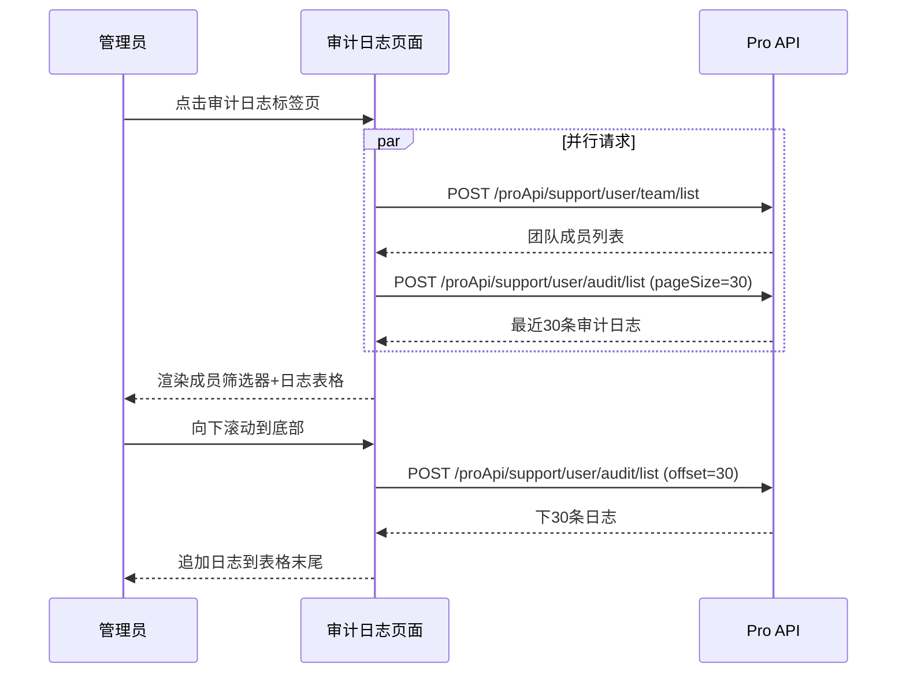
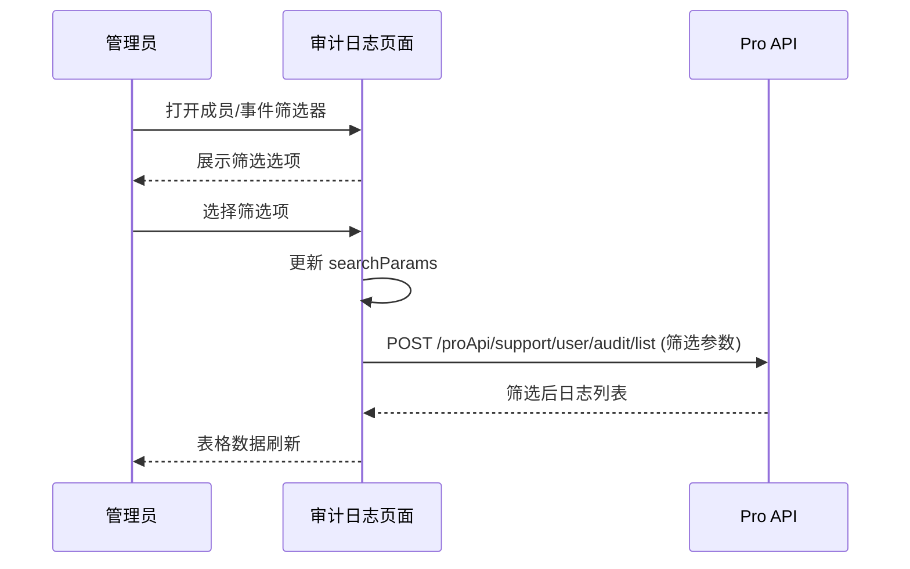

# 审计日志 — 业务流程详解

## 页面总览

审计日志页面为团队管理员提供团队内所有成员操作行为的集中查阅入口。页面分为筛选区（顶部）和数据表格区（主体），管理员通过筛选器缩小日志范围后，在表格中以无限滚动方式浏览操作记录。

---

### S01：查看审计日志

> 管理员进入审计日志标签页，查看团队成员的历史操作记录。

#### 步骤 1：进入审计日志页面

| 用户操作 | 触发 API | 分支条件 | 页面变化 |
|---------|---------|---------|---------|
| 在团队管理页面点击"审计日志"标签页 | 无 | 套餐不含 `auditLogStoreDuration` → Toast 提示"无权限"，阻止切换 | 标签页高亮切换为"审计日志"；筛选区和空表格框架渲染 |

#### 步骤 2：初始加载成员列表和日志数据

| 用户操作 | 触发 API | 分支条件 | 页面变化 |
|---------|---------|---------|---------|
| 页面自动加载（无需用户操作） | `POST /proApi/support/user/team/list`（获取团队成员）；`POST /proApi/support/user/audit/list`（获取日志，pageSize=30） | 并行请求 | 表格区域显示加载遮罩（MyBox isLoading）；成员筛选器渲染为"全部成员"选中状态；事件类型筛选器渲染为"全部类型"选中状态 |
| 等待数据返回 | — | 成员列表返回 → 成员筛选器下拉选项生成（含头像+名称）；日志列表返回 → 表格渲染前30条记录 | 加载遮罩消失；表格显示日志行：操作用户（UserBox头像+名称）、操作时间（YMDHMS格式）、操作类型（i18n标签）、操作详情（i18n模板+元数据插值） |

#### 步骤 3：滚动加载更多日志

| 用户操作 | 触发 API | 分支条件 | 页面变化 |
|---------|---------|---------|---------|
| 向下滚动表格至底部 | `POST /proApi/support/user/audit/list`（offset=N, pageSize=30） | 已有更多数据 → 继续加载；已无更多数据 → 停止加载 | 表格底部追加新加载的30条记录；无更多数据时不再触发请求 |

### 数据加载详情

| 加载阶段 | API | 关键参数 | 数据处理 | 渲染结果 |
|---------|-----|---------|---------|---------|
| 首次加载 | POST /proApi/support/user/audit/list | pageSize=30, 无筛选参数 | 按时间戳倒序排列 | 表格最近30条日志 |
| 滚动加载 | POST /proApi/support/user/audit/list | offset=N, pageSize=30 | 追加到现有列表末尾 | 表格追加30条 |
| 筛选变更 | POST /proApi/support/user/audit/list | tmbIds=[...], events=[...] | 清空旧数据，重新加载第1页 | 表格刷新为筛选后数据 |

- 分页参数：默认每页30条，通过 `useScrollPagination` 实现无限滚动
- 排序规则：按时间戳倒序（服务端排序）
- 筛选条件：成员筛选器（tmbIds）、事件类型筛选器（events），全选时传空对象

### Mermaid 附录

---

### S02：按成员筛选日志

> 管理员选择特定成员，筛选出该成员的操作日志。

#### 步骤 1：打开成员筛选器

| 用户操作 | 触发 API | 分支条件 | 页面变化 |
|---------|---------|---------|---------|
| 点击成员筛选下拉框 | 无 | 成员列表已加载 → 直接展示选项 | 下拉面板展开，显示成员列表（头像+名称）；当前选中项高亮；面板支持滚动加载更多成员 |

#### 步骤 2：选择/取消成员

| 用户操作 | 触发 API | 分支条件 | 页面变化 |
|---------|---------|---------|---------|
| 点击某个成员选项 | 无 | — | 该成员变为选中状态；"全选"自动取消 |
| 点击"全选"选项 | 无 | — | 所有成员选中，筛选参数中 tmbIds 置空 |

#### 步骤 3：筛选生效

| 用户操作 | 触发 API | 分支条件 | 页面变化 |
|---------|---------|---------|---------|
| 关闭下拉面板（筛选器值变更触发 useEffect） | `POST /proApi/support/user/audit/list`（tmbIds=[选中成员ID列表], events=[当前事件筛选]） | 非全选 → 传 tmbIds 参数；全选 → 不传 tmbIds | 加载遮罩显示；表格数据重新加载为筛选后结果 |

### 筛选器交互详情

- **多选模式**: 使用 `useMultipleSelect` Hook 管理选中状态，支持全选/取消全选
- **成员选项**: 每项显示成员头像（Avatar）和名称，由 `getTeamMembers` API 获取
- **状态联动**: 成员筛选器变更时，通过 `useEffect` 监听 `selectedTmbIds` 和 `isSelectAllTmb` 自动更新 `searchParams`，触发日志重新加载

---

### S03：按事件类型筛选日志

> 管理员选择特定事件类型，筛选出该类操作日志。

#### 步骤 1：打开事件类型筛选器

| 用户操作 | 触发 API | 分支条件 | 页面变化 |
|---------|---------|---------|---------|
| 点击事件类型筛选下拉框 | 无 | 事件类型列表已生成 → 直接展示 | 下拉面板展开，显示事件类型选项列表 |

#### 步骤 2：选择/取消事件类型

| 用户操作 | 触发 API | 分支条件 | 页面变化 |
|---------|---------|---------|---------|
| 点击某个事件类型选项 | 无 | — | 该类型变为选中状态；"全选"自动取消 |
| 点击"全选"选项 | 无 | — | 所有类型选中，筛选参数中 events 置空 |

#### 步骤 3：筛选生效

| 用户操作 | 触发 API | 分支条件 | 页面变化 |
|---------|---------|---------|---------|
| 关闭下拉面板（筛选器值变更触发 useEffect） | `POST /proApi/support/user/audit/list`（events=[选中事件类型列表], tmbIds=[当前成员筛选]） | 非全选 → 传 events 参数；全选 → 不传 events | 加载遮罩显示；表格数据重新加载为筛选后结果 |

### 事件类型动态过滤

事件类型列表根据系统配置动态生成：
- 系统配置 `feConfigs.show_evaluation === false` 时，过滤掉包含 "EVALUATION" 的事件类型
- 事件类型选项标签通过 `auditLogMap[event].typeLabel` i18n 映射获取

### 筛选器交互详情

- **多选模式**: 使用 `useMultipleSelect` Hook 管理选中状态，支持全选/取消全选
- **事件类型选项**: 从 `AuditEventEnum` 枚举值生成，经过系统配置过滤
- **状态联动**: 事件类型筛选器变更时，通过 `useEffect` 监听 `selectedEvents` 和 `isSelectAllEvent` 自动更新 `searchParams`，触发日志重新加载

### Mermaid 附录

