# 成员 — 业务流程详解

## 页面总览

成员管理页面以表格为核心展示团队成员数据，顶部工具栏根据用户角色和系统模式（普通模式/同步模式/企业微信模式）动态展示不同的操作按钮。成员列表通过滚动分页加载，支持搜索和状态筛选。

## 查看成员列表

> 用户进入团队管理页面（默认展示成员 Tab），系统自动加载成员列表数据，以表格形式展示，支持滚动加载更多。

### 步骤 1：进入成员列表

| 用户操作 | 触发 API | 分支条件 | 页面变化 |
|---------|---------|---------|---------|
| 点击侧边栏"账户"→"团队管理"；或已在团队管理页切换至"成员"Tab | GET /proApi/support/user/team/member/count（获取成员总数） | — | 页面框架渲染：团队选择器、Tab 栏（成员/组织/分组/权限/审计日志）、成员总数徽标 |

**前置条件**: 用户已登录并已加入团队（userInfo.team 非空）。路由参数 `teamTab=member` 时渲染 MemberTable 组件。

### 步骤 2：加载成员列表

| 用户操作 | 触发 API | 分支条件 | 页面变化 |
|---------|---------|---------|---------|
| 页面自动加载 | POST /proApi/support/user/team/member/list（pageSize=20, withPermission=true, withOrgs=true, searchKey="", status=undefined） | — | MyBox 显示加载遮罩（isLoading=true）→ 请求返回后表格渲染前 20 条成员数据 |

### 步骤 3：滚动加载更多

| 用户操作 | 触发 API | 分支条件 | 页面变化 |
|---------|---------|---------|---------|
| 向下滚动列表至底部 | POST /proApi/support/user/team/member/list（pageSize=20, offset=当前已加载数量） | — | 下一页数据追加到表格末尾，无加载遮罩（静默加载） |

### 数据加载详情

| 加载阶段 | API | 关键参数 | 数据处理 | 渲染结果 |
|---------|-----|---------|---------|---------|
| 首次加载 | POST /proApi/support/user/team/member/list | pageSize=20, withPermission=true, withOrgs=true | 按创建时间排序 | 表格展示前 20 条成员 |
| 滚动翻页 | POST /proApi/support/user/team/member/list | pageSize=20, offset=N×20 | 追加到现有列表 | 表格追加 20 条 |
| 筛选/搜索触发刷新 | POST /proApi/support/user/team/member/list | 更新 searchKey 或 status 参数 | 清空旧列表，重新加载 | 表格重置到第一页 |

- **分页参数**: 默认每页 20 条，通过 useScrollPagination 实现滚动自动加载
- **排序规则**: 默认按创建时间排序
- **筛选条件**: searchKey（成员名称模糊搜索）、status（active/leave/forbidden/全部）
- **特殊列的渲染逻辑**:
  - "用户名称"列：显示头像 + 成员名称，非活跃成员附带灰色标签（"已离开"/"已禁用"）
  - "联系方式"列：无数据时显示 "-"
  - "组织"列：通过 OrgTags 组件以标签形式展示成员所属组织路径
  - "加入/更新时间"列：分两行显示创建时间和更新时间，更新时间不存在时显示 "-"
  - "操作"列：根据操作者角色和目标成员状态动态展示不同操作按钮

### Mermaid 附录

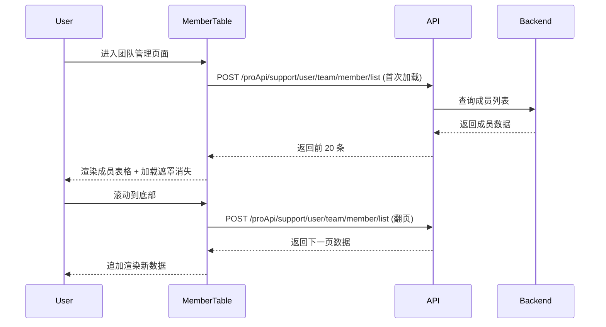

---

## 搜索成员

> 用户在搜索框中输入成员名称关键词，系统通过防抖机制自动触发列表刷新。

### 步骤 1：输入搜索关键词

| 用户操作 | 触发 API | 分支条件 | 页面变化 |
|---------|---------|---------|---------|
| 在搜索框中输入文字 | POST /proApi/support/user/team/member/list（searchKey 更新为输入值，offset 重置） | 输入变化触发 debounceWait=200ms 防抖 | 列表重新加载（有加载遮罩），展示匹配搜索关键词的成员 |

- **防抖机制**: 用户停止输入 200ms 后触发请求
- **搜索范围**: 成员名称字段

### Mermaid 附录

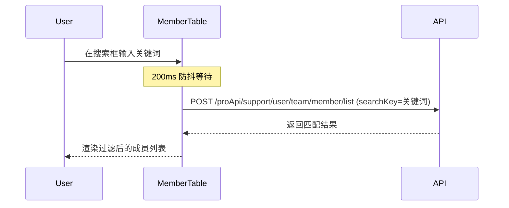

---

## 按状态筛选成员

> 用户通过状态下拉框选择筛选条件，列表立即刷新。

### 步骤 1：选择状态

| 用户操作 | 触发 API | 分支条件 | 页面变化 |
|---------|---------|---------|---------|
| 点击状态下拉框，选择一个状态选项 | POST /proApi/support/user/team/member/list（status 更新为选中值） | isSyncMode=true 时额外显示"已禁用"选项 | 列表重新加载（有加载遮罩），展示对应状态的成员 |

**筛选选项**:
- 全部（status=undefined）
- 活跃（status=active）
- 已离开（status=leave）
- 已禁用（status=forbidden）— 仅同步模式显示

### Mermaid 附录

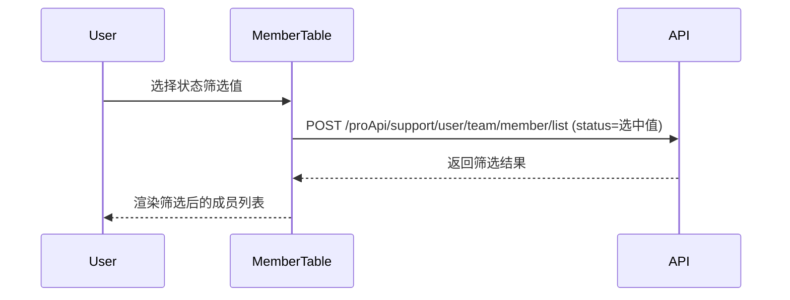

---

## 邀请成员

> 管理员或所有者通过邀请链接方式邀请新成员。弹窗中展示已有邀请链接列表，支持创建、复制和禁用邀请链接。

### 步骤 1：打开邀请弹窗

| 用户操作 | 触发 API | 分支条件 | 页面变化 |
|---------|---------|---------|---------|
| 点击"邀请成员"按钮 | GET /proApi/support/user/team/invitationLink/list | 按钮仅在非同步模式且非企业微信团队时可见（!isSyncMode && !isWecomTeam && hasManagePer） | 弹窗打开，显示加载状态，加载邀请链接列表 |

### 步骤 2：查看已有邀请链接

| 用户操作 | 触发 API | 分支条件 | 页面变化 |
|---------|---------|---------|---------|
| 弹窗自动加载 | —（步骤 1 已触发） | — | 表格展示已有邀请链接：描述、过期时间、使用次数上限、已邀请成员头像组 |

### 步骤 3：复制邀请链接

| 用户操作 | 触发 API | 分支条件 | 页面变化 |
|---------|---------|---------|---------|
| 点击某链接的"复制链接"按钮 | —（纯前端操作） | 链接未被禁用且未过期 | 复制包含团队名、系统名、用户名的邀请文案和 URL 到剪贴板，提示复制成功 |

### 步骤 4：创建新邀请链接

| 用户操作 | 触发 API | 分支条件 | 页面变化 |
|---------|---------|---------|---------|
| 点击"创建邀请链接"按钮 | —（打开子弹窗） | — | CreateInvitationModal 子弹窗打开 |
| 填写描述、有效期、使用次数限制，点击确认 | POST /proApi/support/user/team/invitationLink/create | — | 创建成功后自动复制新链接，邀请链接列表刷新 |

### 步骤 5：禁用邀请链接

| 用户操作 | 触发 API | 分支条件 | 页面变化 |
|---------|---------|---------|---------|
| 点击某链接的"禁用"按钮→确认弹窗中点击确认 | PUT /proApi/support/user/team/invitationLink/forbid | — | 按钮变为加载态→该链接标记为"已禁用"（红色标签），不再可复制 |

### 补充说明

- **过期判断**: 链接在过期时间后自动视为禁用状态
- **已邀请成员**: 鼠标悬停或点击头像组可查看已通过该链接加入的成员列表
- **底部提示**: 弹窗底部显示"邀请链接将在使用完毕后自动清理"提示

### Mermaid 附录

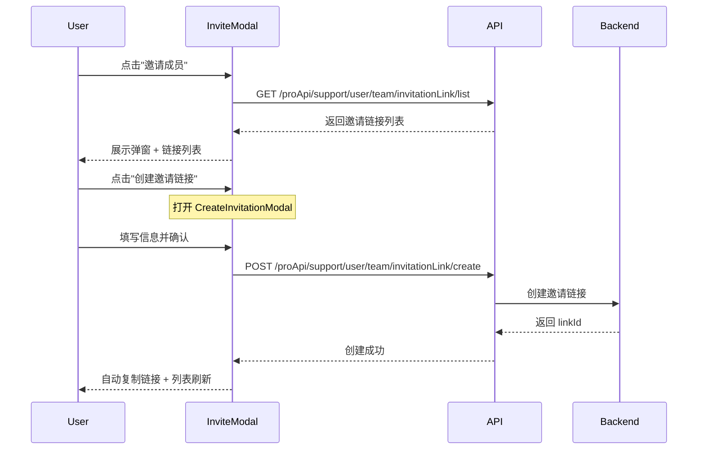

---

## 编辑成员名称

> 管理员修改成员的显示名称。

### 步骤 1：点击编辑图标

| 用户操作 | 触发 API | 分支条件 | 页面变化 |
|---------|---------|---------|---------|
| 点击成员行操作列的编辑图标 | —（打开编辑弹窗） | 操作者需有管理权限且目标成员非所有者、非本人 | 编辑弹窗打开，输入框预填当前成员名称 |

### 步骤 2：提交新名称

| 用户操作 | 触发 API | 分支条件 | 页面变化 |
|---------|---------|---------|---------|
| 修改名称后点击确认 | PUT /proApi/support/user/team/member/updateNameByManager（tmbId, name） | — | 弹窗关闭 → 成员列表刷新，名称更新 |

### 表单字段清单

| 字段名 | 控件类型 | 必填 | 默认值 | 可选值/约束 | 编辑时只读 | 说明 |
|--------|---------|------|--------|------------|-----------|------|
| 成员名称 | 文本输入 | ✅ | 当前成员名称 | 不可为空 | 否 | 修改成员的显示名称 |

### 校验规则

| 规则 | 触发时机 | 错误提示文案 |
|------|---------|-------------|
| 名称不可为空 | 提交时 | 输入框不可为空 |

### 前后置条件

- **前置条件**: 操作者具有管理权限（hasManagePer）；目标成员角色非所有者；目标成员非操作者本人
- **后置影响**: 成员名称更新后列表自动刷新
- **失败场景**: API 调用失败时显示错误 Toast 提示

### Mermaid 附录

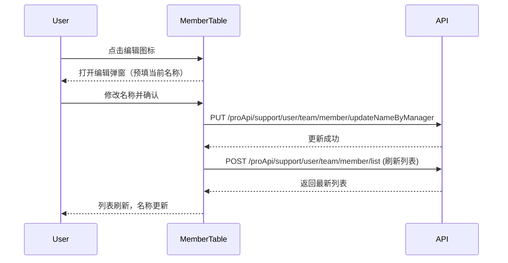

---

## 移除/禁用成员

> 管理员将成员从团队中移除（普通模式）或禁用（同步模式）。

### 步骤 1：点击删除图标

| 用户操作 | 触发 API | 分支条件 | 页面变化 |
|---------|---------|---------|---------|
| 点击成员行的删除图标 | —（弹出确认弹窗） | 操作者需有管理权限且目标成员非所有者、非本人；目标成员状态为活跃（active） | 确认弹窗打开 |

### 步骤 2：确认操作

| 用户操作 | 触发 API | 分支条件 | 页面变化 |
|---------|---------|---------|---------|
| 在确认弹窗中点击确认 | DELETE /proApi/support/user/team/member/delete（tmbId） | isSyncMode=true 时弹窗文案为禁用提示（"将禁用用户 {username}"）；isSyncMode=false 时弹窗文案为移除提示（"将移除用户 {username}"） | 弹窗关闭 → 成员列表刷新，目标成员状态变更 |

### 删除链路详情

- **确认弹窗**: 
  - 同步模式提示文案：`account_team:forbidden_tip`（"将禁用用户 {username}"）
  - 非同步模式提示文案：`account_team:remove_tip`（"将移除用户 {username}"）
  - 弹窗类型为 delete，确认按钮为红色
- **级联影响**: 移除/禁用后成员列表自动刷新，目标成员在列表中显示为"已离开"/"已禁用"状态

### Mermaid 附录

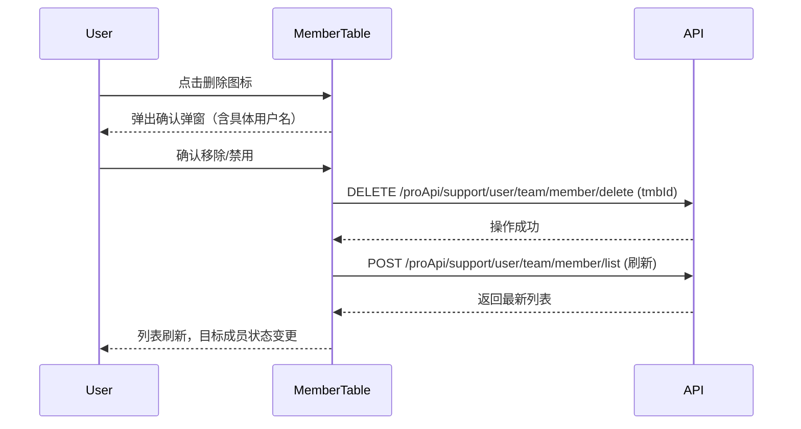

---

## 恢复成员

> 管理员将已离开或已禁用的成员恢复为活跃状态。

### 步骤 1：点击恢复图标

| 用户操作 | 触发 API | 分支条件 | 页面变化 |
|---------|---------|---------|---------|
| 点击非活跃成员行的恢复图标 | —（弹出确认弹窗） | 操作者有管理权限；目标成员状态为非活跃 | 确认弹窗打开 |

### 步骤 2：确认恢复

| 用户操作 | 触发 API | 分支条件 | 页面变化 |
|---------|---------|---------|---------|
| 在确认弹窗中点击确认 | POST /proApi/support/user/team/member/restore（tmbId） | — | 弹窗关闭 → 成功提示 → 列表刷新 |

### 状态转换详情

- **状态转换**: 已离开（leave）/ 已禁用（forbidden）→ 恢复操作 → 活跃（active）
- **确认弹窗**: 类型为 info，提示文案 `account_team:restore_tip`（"将恢复用户 {username}"）
- **后置影响**: 列表刷新后目标成员恢复活跃状态，操作列显示编辑和移除按钮

### Mermaid 附录

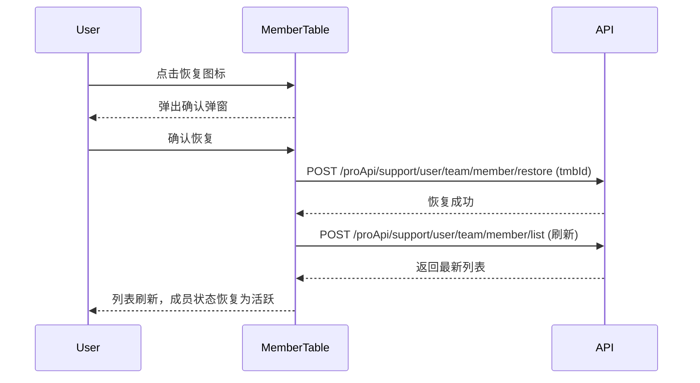

---

## 转让团队所有权

> 团队所有者将所有权转让给另一位活跃成员，转让后自动切换到其他团队。

### 步骤 1：打开转让弹窗

| 用户操作 | 触发 API | 分支条件 | 页面变化 |
|---------|---------|---------|---------|
| 点击"转让团队所有权"按钮 | —（打开弹窗） | 按钮仅在非同步模式且企业微信团队时可见（!isSyncMode && isWecomTeam && isOwner） | 转让弹窗打开，显示当前团队信息 |

### 步骤 2：搜索并选择新所有者

| 用户操作 | 触发 API | 分支条件 | 页面变化 |
|---------|---------|---------|---------|
| 在搜索框中输入成员名称 | POST /proApi/support/user/team/member/list（searchKey=输入值, status=active） | debounceWait=200ms | 下拉列表展示匹配的活跃成员（过滤掉当前所有者本人） |
| 点击选择目标成员 | — | — | 搜索框回填选中成员名称，显示头像，"确认转让"按钮变为可用 |

### 步骤 3：确认转让

| 用户操作 | 触发 API | 分支条件 | 页面变化 |
|---------|---------|---------|---------|
| 点击"确认转让"按钮 | PUT /proApi/support/user/team/changeOwner（userId） | — | 按钮变为加载态 → 成功后刷新用户信息 → 自动切换到其他可用团队 → 页面重新加载 |

### 表单字段清单

| 字段名 | 控件类型 | 必填 | 默认值 | 可选值/约束 | 编辑时只读 | 说明 |
|--------|---------|------|--------|------------|-----------|------|
| 搜索成员 | 搜索输入框 | ✅ | 空 | 仅搜索活跃成员 | 否 | 用于查找目标转让对象 |

### 前后置条件

- **前置条件**: 操作者为团队所有者；非同步模式；企业微信团队
- **后置影响**: 所有权转让后用户权限变更为普通成员；自动切换到其他团队；如无其他团队则停留在当前页
- **确认弹窗**: 弹窗顶部显示警告"转让后您将失去团队所有者权限"
- **失败场景**: 调用失败时显示 `account_team:transfer_failed` 错误提示

### Mermaid 附录

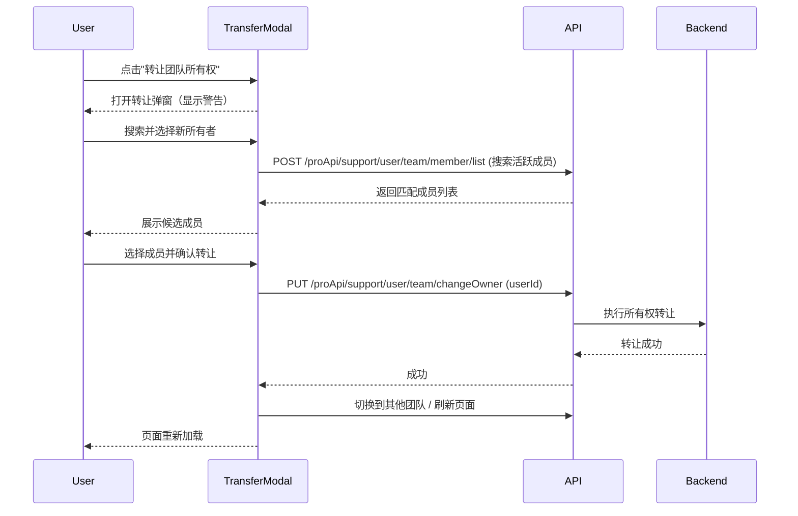

---

## 同步成员

> 在同步模式下，管理员手动触发从外部系统同步成员数据。

### 步骤 1：触发同步

| 用户操作 | 触发 API | 分支条件 | 页面变化 |
|---------|---------|---------|---------|
| 点击"立即同步"按钮 | POST /proApi/support/user/api（同步成员接口） | 按钮仅在同步模式且有管理权限时可见（isSyncMode && hasManagePer） | 按钮变为加载态（isSyncing=true）→ 整个表格显示加载遮罩 → 成功后显示"同步成员成功"提示 → 列表刷新 |

### 状态转换详情

- **前置条件**: isSyncMode=true；操作者有管理权限
- **后置影响**: 成员列表刷新，展示最新的同步结果
- **失败场景**: 调用失败时显示 `account_team:sync_member_failed` 错误提示

### Mermaid 附录

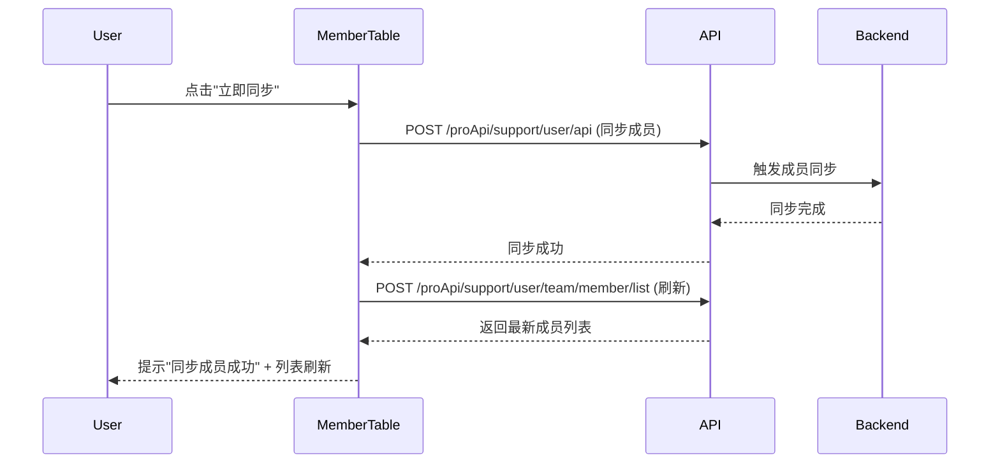

---

## 导出成员

> 在同步模式下，团队所有者将成员列表导出为 CSV 文件。

### 步骤 1：触发导出

| 用户操作 | 触发 API | 分支条件 | 页面变化 |
|---------|---------|---------|---------|
| 点击"导出成员"按钮 | GET /api/proApi/support/user/team/member/export | 按钮仅在同步模式且为所有者时可见（isSyncMode && isOwner） | 浏览器触发文件下载，文件名为 `{团队名}-{时间戳}.csv` |

### 前后置条件

- **前置条件**: isSyncMode=true；操作者为团队所有者
- **后置影响**: 下载的 CSV 文件包含当前团队所有成员数据
- **失败场景**: 下载失败时浏览器默认处理

### Mermaid 附录

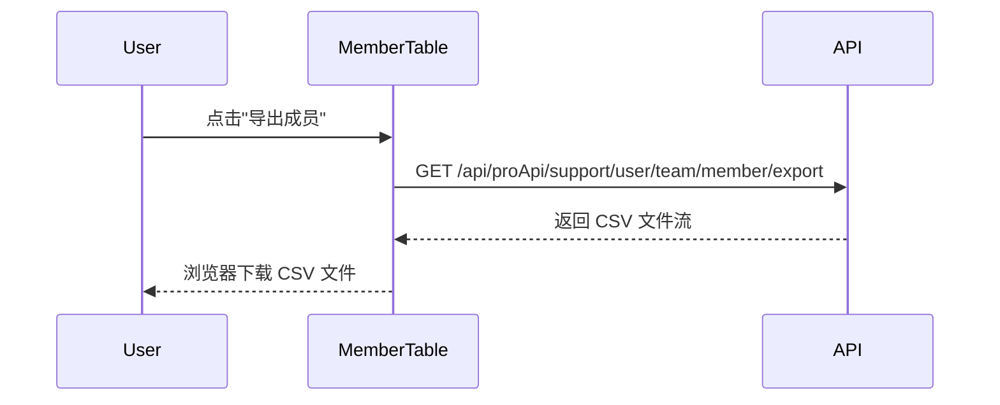

---

## 退出团队

> 非所有者的普通成员主动退出当前团队，退出后自动切换到其他可用团队。

### 步骤 1：点击退出按钮

| 用户操作 | 触发 API | 分支条件 | 页面变化 |
|---------|---------|---------|---------|
| 点击"退出团队"按钮 | —（弹出确认弹窗） | 按钮仅在非同步模式、非企业微信团队且非所有者时可见（!isSyncMode && !isWecomTeam && !isOwner） | 确认弹窗打开 |

### 步骤 2：确认退出

| 用户操作 | 触发 API | 分支条件 | 页面变化 |
|---------|---------|---------|---------|
| 在确认弹窗中点击确认 | DELETE /proApi/support/user/team/member/leave | — | 弹窗关闭 → 自动切换到第一个可用团队 → 页面重新加载 |

### 删除链路详情

- **确认弹窗**: 类型为 delete，提示文案 `account_team:confirm_leave_team`
- **级联影响**: 退出后自动切换到 myTeams[0]；如无其他团队则停留在当前页（可能显示空状态）
- **失败场景**: 调用失败时显示 `account_team:user_team_leave_team_failed` 错误提示

### Mermaid 附录

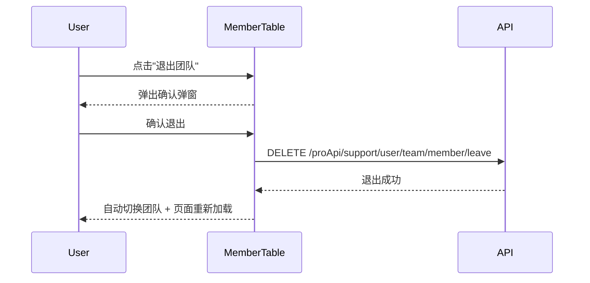
