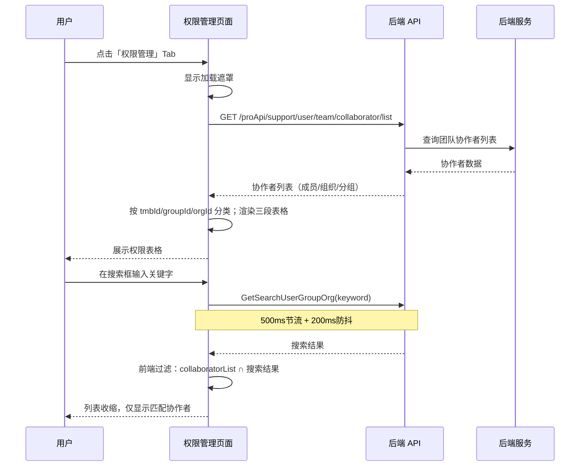
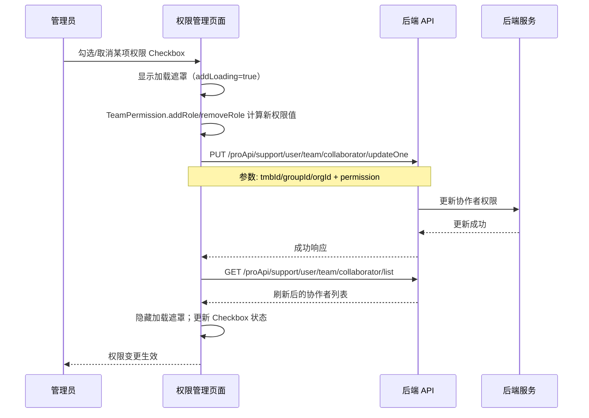
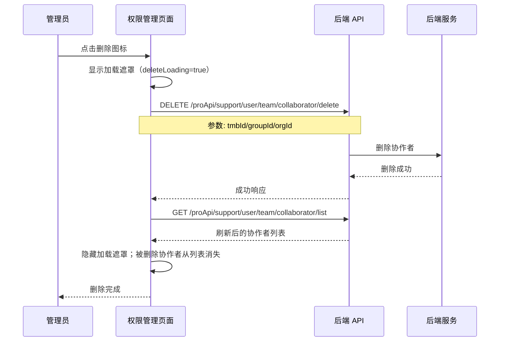
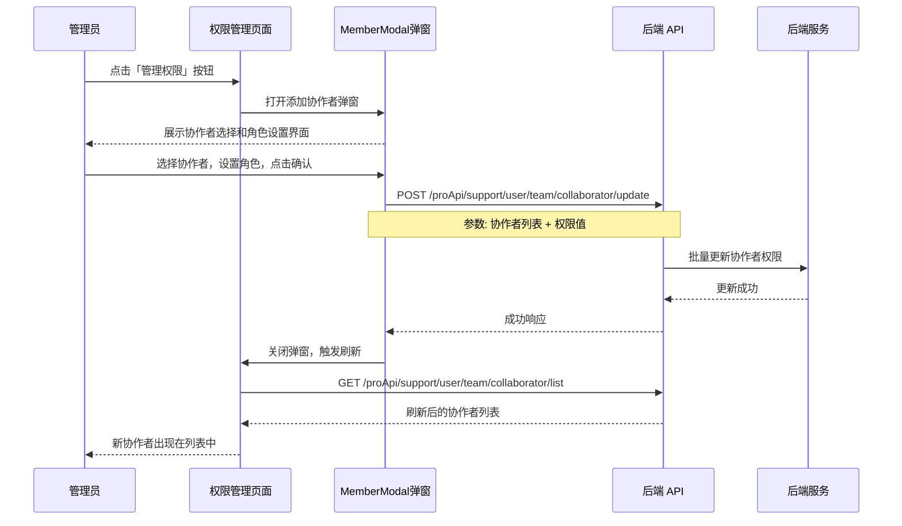

# 权限管理 — 业务流程详解

## 页面总览

权限管理页面是团队管理下的一个 Tab 页面，以表格形式集中展示和管理团队协作者的资源创建权限。页面顶部提供搜索框和「管理权限」按钮（仅管理员可见），主体为按成员/组织/分组三组折叠展开的权限表格，每一行对应一个协作者，每一列对应一项权限的勾选框。

页面通过 `CollaboratorContextProvider` 上下文管理协作者列表数据，权限变更操作通过 Provider 暴露的回调方法执行，操作成功后自动刷新列表。

---

### S01: 查看协作者权限列表

> 业务描述：用户从团队管理页面切换到权限管理 Tab，页面加载并展示所有协作者及其权限状态的表格视图。

#### 步骤 1：进入权限管理页面

| 用户操作 | 触发 API | 分支条件 | 页面变化 |
|---------|---------|---------|---------|
| 在团队管理页面点击「权限管理」Tab | GET /proApi/support/user/team/collaborator/list | 用户必须已加入团队（userInfo.team 不为空），否则页面不渲染 | URL 参数变更为 teamTab=permission；页面切换至权限管理视图；表格区域显示加载状态（MyBox 的 isLoading） |

#### 步骤 2：协作者数据加载

| 用户操作 | 触发 API | 分支条件 | 页面变化 |
|---------|---------|---------|---------|
| 无需操作（自动触发） | GET /proApi/support/user/team/collaborator/list（由 CollaboratorContextProvider 自动发起） | feConfigs.isPlus 为 true 时发起请求；为 false 时返回空列表 | 加载完成后：协作者数据按 tmbId/groupId/orgId 分类展示为成员、组织、分组三段；每段默认展开（isExpandMember/isExpandGroup/isExpandOrg 均为 true）；每行显示协作者头像/名称和对应权限勾选状态 |

#### 步骤 3：查看权限详情

| 用户操作 | 触发 API | 分支条件 | 页面变化 |
|---------|---------|---------|---------|
| 查看各列权限勾选状态 | 无（纯前端渲染） | 每列的 Checkbox 状态由 clbPer.checkRole(role) 结果决定 | 已授权的权限列显示勾选状态；禁用状态的 Checkbox 呈灰色不可点击（由 isDisabled 属性控制） |
| 鼠标悬停在列标题的问号图标上 | 无 | — | 显示该权限列的说明 Tooltip（如"允许成员创建应用"） |

**数据加载详情**:

| 加载阶段 | API | 关键参数 | 数据处理 | 渲染结果 |
|---------|-----|---------|---------|---------|
| 首次加载 | GET /proApi/support/user/team/collaborator/list | 无参数 | 返回数据按 id 字段分类：有 tmbId 的归为成员列表、有 groupId 的归为分组列表、有 orgId 的归为组织列表 | 三段可折叠表格，每段分别展示成员/组织/分组及其权限 |
| 刷新 | GET /proApi/support/user/team/collaborator/list | 同首次 | 同首次 | 表格数据更新，折叠状态保持不变 |

---

### S02: 搜索协作者

> 业务描述：用户通过搜索框输入关键字，实时过滤协作者列表。

#### 步骤 1：输入搜索关键字

| 用户操作 | 触发 API | 分支条件 | 页面变化 |
|---------|---------|---------|---------|
| 在搜索框内输入文字 | GetSearchUserGroupOrg(searchKey)（500ms 节流 + 200ms 防抖） | searchKey 为空时不过滤 | 搜索框显示输入内容 |

#### 步骤 2：搜索结果过滤

| 用户操作 | 触发 API | 分支条件 | 页面变化 |
|---------|---------|---------|---------|
| 等待搜索结果返回 | GetSearchUserGroupOrg 返回后，前端按结果过滤 | searchKey 不为空时：成员列表仅保留匹配搜索结果的成员；组织列表仅保留匹配搜索结果的组织；分组列表仅保留匹配搜索结果的分组。搜索结果按 members/groups/orgs 三类分别匹配 | 列表实时收缩，只显示匹配的协作者；不符合的协作者行被隐藏；空的分类段（无匹配项）仍显示折叠标题但内容为空 |

**搜索特点**：
- 搜索是纯前端过滤，不重新请求协作者列表 API
- 搜索接口 GetSearchUserGroupOrg 返回全局用户/组织/分组搜索结果，权限页面将其与本地 collaboratorList 取交集过滤
- 搜索条件影响所有三个分类段（成员/组织/分组）

---

### S03: 修改单个协作者权限

> 业务描述：管理员勾选或取消勾选某个协作者的某项权限 Checkbox，实时生效。

#### 步骤 1：点击权限 Checkbox

| 用户操作 | 触发 API | 分支条件 | 页面变化 |
|---------|---------|---------|---------|
| 勾选某项权限的 Checkbox | PUT /proApi/support/user/team/collaborator/updateOne（{tmbId/groupId/orgId, permission: 新的权限值}） | Checkbox 必须处于非禁用状态（isDisabled 为 false）；当前用户为团队所有者时所有 Checkbox 均可用；当前用户为管理员时：对于有管理权限（hasManagePer）的协作者，其 Checkbox 被禁用（除非当前用户是团队所有者）；管理权限列的 Checkbox 仅团队所有者可操作 | 操作期间页面显示全局加载状态（addLoading 为 true），表格高度增加时 MyBox 显示加载遮罩 |

#### 步骤 2：权限计算与提交

| 用户操作 | 触发 API | 分支条件 | 页面变化 |
|---------|---------|---------|---------|
| 无需额外操作（自动执行） | —（前端的 TeamPermission.addRole/removeRole 计算新的权限位掩码值，然后调用 API） | 勾选时 addRole(per) 将对应权限位加入角色值；取消勾选时 removeRole(per) 将对应权限位从角色值中移除 | 无额外页面变化（计算过程不可见） |

#### 步骤 3：列表刷新

| 用户操作 | 触发 API | 分支条件 | 页面变化 |
|---------|---------|---------|---------|
| 无需操作（自动触发） | GET /proApi/support/user/team/collaborator/list（onSuccess 回调中自动 refetchCollaborators） | 更新成功时触发 | 加载遮罩消失；该协作者行的 Checkbox 状态更新为新的权限值 |

**禁用逻辑详情**：

| 协作者类型 | Checkbox 禁用条件 | 说明 |
|-----------|-------------------|------|
| 成员（member） | member.permission.hasManagePer && !userInfo.permission.isOwner | 管理员成员不能被非所有者修改权限 |
| 组织（org） | org.permission.isOwner \|\| !userManage | 组织所有者不能被修改；无管理权限者不能修改 |
| 分组（group） | group.permission.isOwner \|\| !userManage | 分组所有者不能被修改；无管理权限者不能修改 |
| 管理权限列 | !userInfo.permission.isOwner | 仅团队所有者可授予/撤销管理权限 |

**校验规则**：

| 规则 | 触发时机 | 错误提示文案 |
|------|---------|-------------|
| 权限不足 | 点击 Checkbox 时（前端禁用拦截） | Checkbox 置灰不可点击，无文字提示 |
| API 调用失败 | 提交后（后端校验） | 由 useRequest 的错误处理统一展示，Checkbox 状态回滚（列表刷新恢复原值） |

---

### S04: 删除协作者

> 业务描述：管理员从权限列表中移除某个协作者。

#### 步骤 1：点击删除图标

| 用户操作 | 触发 API | 分支条件 | 页面变化 |
|---------|---------|---------|---------|
| 点击目标协作者行最右侧的删除图标 | DELETE /proApi/support/user/team/collaborator/delete（{tmbId} 或 {groupId} 或 {orgId}） | 删除图标仅在 hasDeletePer(member.permission) 为 true 且当前用户不是该成员自己（userInfo.team.tmbId !== member.tmbId）时显示；hasDeletePer 判断：团队所有者可删除任何人，管理员只能删除无管理权限的协作者 | 操作期间页面显示全局加载状态（deleteLoading 为 true） |

#### 步骤 2：列表刷新

| 用户操作 | 触发 API | 分支条件 | 页面变化 |
|---------|---------|---------|---------|
| 无需操作（自动触发） | GET /proApi/support/user/team/collaborator/list（onSuccess 回调中自动 refetchCollaborators） | 删除成功时触发 | 该协作者从列表中消失；所属分类段的计数更新 |

**删除链路详情**：
- **引用检查**：无前置引用检查（删除直接执行）
- **确认弹窗**：无二次确认弹窗（直接删除）
- **级联影响**：删除后该协作者失去团队内所有权限，需重新添加才能恢复

---

### S05: 添加协作者

> 业务描述：管理员通过弹窗为团队添加新的协作者（成员/组织/分组）并设置初始权限。

#### 步骤 1：点击管理权限按钮

| 用户操作 | 触发 API | 分支条件 | 页面变化 |
|---------|---------|---------|---------|
| 点击页面顶部「管理权限」按钮 | 无 | 按钮仅在 userInfo.team.permission.hasManagePer 为 true 时可见 | 打开添加协作者弹窗（MemberModal，通过 CollaboratorContextProvider 动态加载） |

#### 步骤 2：在弹窗中选择协作者并设置权限

| 用户操作 | 触发 API | 分支条件 | 页面变化 |
|---------|---------|---------|---------|
| 在弹窗内选择要添加的成员/组织/分组，设置初始角色 | POST /proApi/support/user/team/collaborator/update（批量更新） | 默认角色为 ReadRoleVal（只读）；角色列表为 TeamRoleList | 弹窗内展示可选择的协作者列表和角色下拉选项 |

#### 步骤 3：提交并刷新

| 用户操作 | 触发 API | 分支条件 | 页面变化 |
|---------|---------|---------|---------|
| 点击弹窗确认按钮 | POST /proApi/support/user/team/collaborator/update（提交选中的协作者和角色） | 提交成功后触发 | 弹窗关闭；协作者列表自动刷新（refetchCollaborators + refetchResource）；新添加的协作者出现在列表中 |

**前后置条件**：
- **前置条件**：当前用户拥有团队管理权限（hasManagePer）
- **后置影响**：新协作者加入团队，拥有初始角色对应的权限；操作记录写入审计日志（如已开启）
- **失败场景**：API 调用失败时弹窗不关闭，错误信息由统一错误处理展示

---

## Mermaid 附录

### S01-S02: 查看与搜索

### S03: 修改权限

### S04: 删除协作者

### S05: 添加协作者

