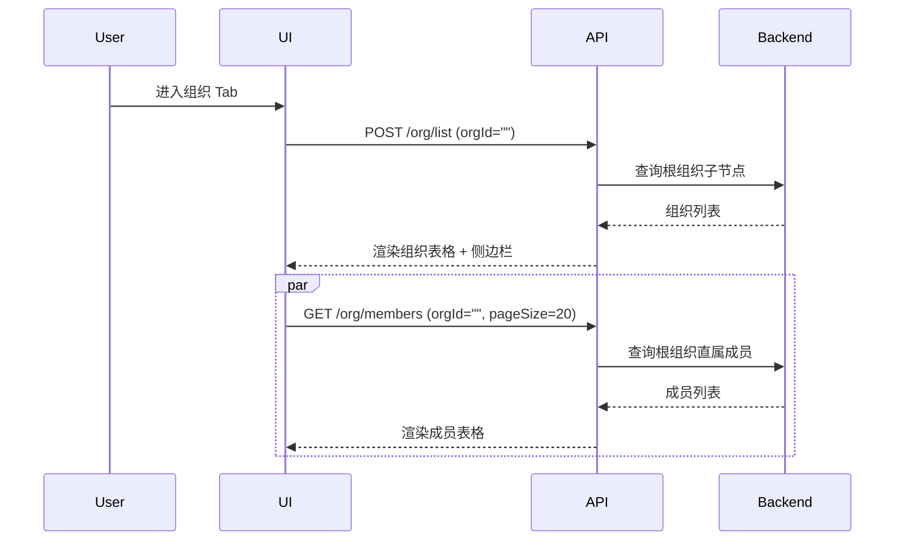
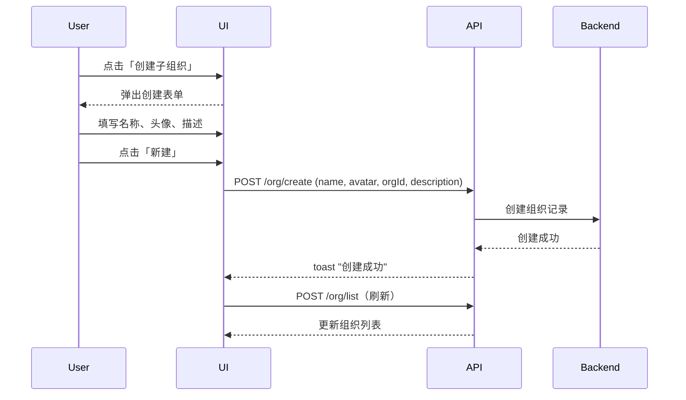
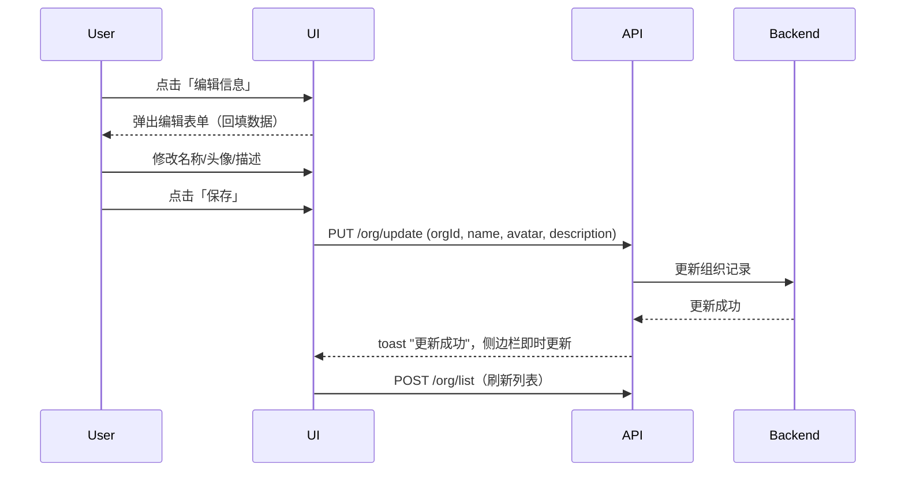
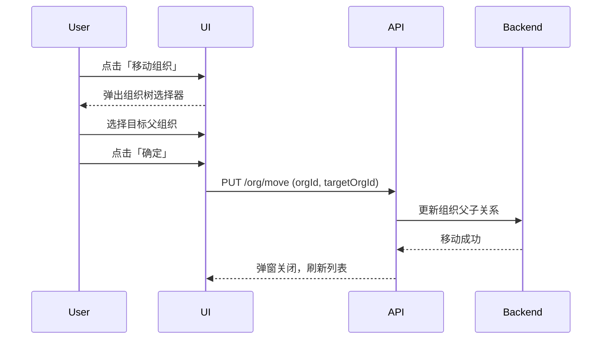
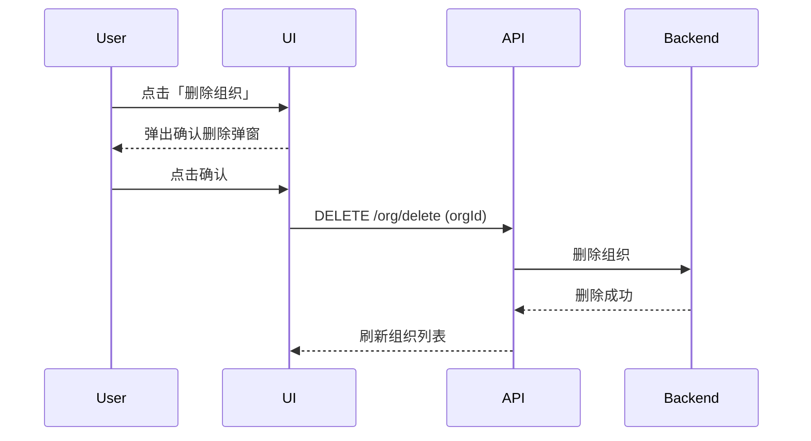
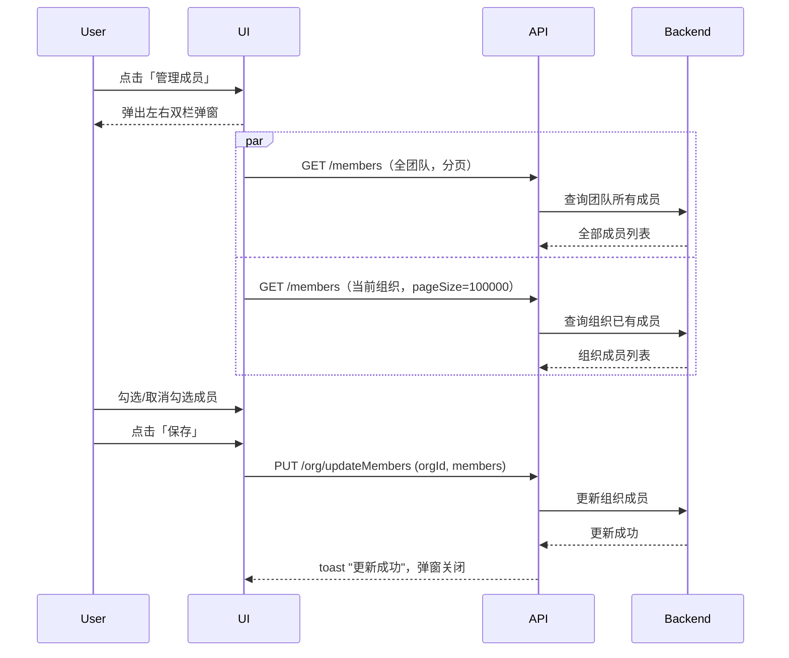

# 组织 — 业务流程详解

## 页面总览

组织管理页采用左右分栏布局：左侧为主区域，展示当前层级下的子组织列表和直属成员列表；右侧为侧边栏，展示当前选中组织的详情和操作入口（仅管理员可见操作按钮）。顶部包含 Tab 切换栏和搜索框，支持按组织名称搜索。

### 查看组织架构与层级导航

> 用户进入组织管理 Tab 后，从根组织（团队）开始查看组织层级结构和成员分布，通过点击组织深入下级，通过面包屑路径返回上级。

#### 步骤 1：页面初始化加载

| 用户操作 | 触发 API | 分支条件 | 页面变化 |
|---------|---------|---------|---------|
| 进入团队管理页 → 点击「组织」Tab | `POST /proApi/support/user/team/org/list`（查询根组织子节点，orgId 为空） + `GET /proApi/support/user/team/org/members`（获取根组织直属成员，分页） | 无 | 左侧加载中状态 → 表格展示子组织列表（每行含组织头像、名称、成员总数标签）和直属成员列表；右侧边栏展示根组织（团队）名称和头像 |

**数据加载详情**：

| 加载阶段 | API | 关键参数 | 数据处理 | 渲染结果 |
|---------|-----|---------|---------|---------|
| 首次加载 | `POST /proApi/support/user/team/org/list` | `orgId=""`, `withPermission=true`, `searchKey=""` | 过滤 `path !== ''` 的子组织并渲染 | 子组织表格行 + 成员表格行 |
| 切换组织 | `POST /proApi/support/user/team/org/list` | `orgId={selectedOrg._id}`, `withPermission=true`, `searchKey=""` | 基于 `currentOrg._id` 和 `path` 刷新 | 更新为新层级下的子组织列表 |
| 成员翻页 | `GET /proApi/support/user/team/org/members` | `pageSize=20`, `orgId={currentOrg._id}`, `withOrgs=false`, `withPermission=true`, `status=active` | 滚动触底自动加载下一页 | 成员列表追加新页数据 |

- 分页参数：每页 20 条，滚动触底自动加载
- 排序规则：无用户可控排序，默认按后端排序
- 筛选条件：搜索框支持按组织名称筛选

#### 步骤 2：进入下级组织

| 用户操作 | 触发 API | 分支条件 | 页面变化 |
|---------|---------|---------|---------|
| 点击组织列表中的某个组织名称 | `POST /proApi/support/user/team/org/list`（orgId 为目标组织 _id） + `GET /proApi/support/user/team/org/members`（orgId 为目标组织 _id） | 搜索模式下点击 → 替换组织栈为单层（清空历史栈）并清空搜索关键词；非搜索模式 → 追加到组织栈末尾 | 加载中 → 表格更新为子组织列表和直属成员列表；面包屑路径追加一层；右侧边栏更新为选中组织详情 |

#### 步骤 3：通过面包屑返回上级

| 用户操作 | 触发 API | 分支条件 | 页面变化 |
|---------|---------|---------|---------|
| 点击面包屑路径中的某一级 | 同步骤 1 的 API 列表，参数为对应层级的 orgId | 面包屑路径 ID 与组织栈 pathId 匹配过滤 | 加载中 → 表格恢复到对应层级视图；清空搜索关键词 |

### 搜索组织

> 用户在搜索框中输入关键词，按组织名称过滤当前团队下的所有组织。

#### 步骤 1：输入搜索关键词

| 用户操作 | 触发 API | 分支条件 | 页面变化 |
|---------|---------|---------|---------|
| 在搜索框中输入关键词 | `POST /proApi/support/user/team/org/list`（searchKey 为输入值）, 300ms 防抖后触发 | 无 | 输入框内容实时更新；防抖等待 300ms 后发起请求 |

#### 步骤 2：查看搜索结果

| 用户操作 | 触发 API | 分支条件 | 页面变化 |
|---------|---------|---------|---------|
| 等待搜索完成 | 同上 API 返回结果 | 搜索模式下隐藏面包屑路径、不显示成员列表 | 表格展示匹配的组织列表；面包屑路径隐藏 |

#### 步骤 3：点击搜索结果中的组织

| 用户操作 | 触发 API | 分支条件 | 页面变化 |
|---------|---------|---------|---------|
| 点击搜索结果中的某个组织 | 同"进入下级组织" | 搜索模式 → 替换组织栈为该组织、清空搜索关键词 | 进入该组织详情视图，恢复正常显示 |

### 创建子组织

> 团队管理员在当前选中的组织下创建一个新的子组织。

#### 步骤 1：打开发起入口

| 用户操作 | 触发 API | 分支条件 | 页面变化 |
|---------|---------|---------|---------|
| 在右侧边栏中点击「创建子组织」 | 无 | `isTeamAdmin === true` 且非同步成员模式（`isSyncMember === false`）时按钮可见 | 弹出创建组织弹窗，表单字段初始化为默认值 |

#### 步骤 2：填写组织信息并提交

| 用户操作 | 触发 API | 分支条件 | 页面变化 |
|---------|---------|---------|---------|
| 填写组织名称（必填）、上传头像、填写描述 → 点击「新建」 | `POST /proApi/support/user/team/org/create`（参数: `name`, `avatar`, `orgId=parentId`, `description`） | 名称必填校验通过 | 提交按钮显示加载状态（`isLoading`）；成功后 toast 提示"创建成功"，弹窗关闭，刷新组织列表 |

**表单字段清单**：

| 字段名 | 控件类型 | 必填 | 默认值 | 可选值/约束 | 编辑时只读 | 说明 |
|--------|---------|------|--------|------------|-----------|------|
| 名称 | 文本输入 | ✅ | — | 无特殊约束 | 否 | 组织的显示名称 |
| 头像 | 图片上传 | 否 | 默认组织头像 | 点击头像触发上传 | 否 | 组织的展示头像 |
| 描述 | 多行文本输入 | 否 | — | 无特殊约束 | 否 | 组织的简要描述 |

**校验规则**：

| 规则 | 触发时机 | 错误提示文案 |
|------|---------|-------------|
| 名称为空 | 提交时（前端校验，required: true） | 表单校验阻止提交 |

**前后置条件**：
- **前置条件**: 用户已是团队管理员；当前已选中一个组织作为父组织；非同步成员模式
- **后置影响**: 创建成功后，组织列表刷新，新组织出现在父组织下
- **失败场景**: 网络异常 → toast 显示错误信息

### 编辑组织信息

> 团队管理员修改组织的名称、头像或描述信息。

#### 步骤 1：打开编辑入口

| 用户操作 | 触发 API | 分支条件 | 页面变化 |
|---------|---------|---------|---------|
| 在组织行的更多菜单中点击「编辑信息」，或点击侧边栏组织名旁的编辑图标 | 无 | `isTeamAdmin === true` 且目标组织非根组织（`path !== ''`）时编辑按钮可见 | 弹出编辑弹窗，表单回填当前组织数据（名称、头像、描述） |

#### 步骤 2：修改信息并提交

| 用户操作 | 触发 API | 分支条件 | 页面变化 |
|---------|---------|---------|---------|
| 修改名称/头像/描述 → 点击「保存」 | `PUT /proApi/support/user/team/org/update`（参数: `orgId`, `name`, `avatar`, `description`） | 编辑模式（`isEdit = true`，根据 `editOrg._id` 是否为空判断） | 提交按钮加载中 → toast"更新成功" → 弹窗关闭；侧边栏组织名和头像即时更新（updateCurrentOrg） |

**表单字段清单**：

| 字段名 | 控件类型 | 必填 | 默认值 | 可选值/约束 | 编辑时只读 | 说明 |
|--------|---------|------|--------|------------|-----------|------|
| 名称 | 文本输入 | ✅ | 回填当前值 | 无特殊约束 | 否 | 组织名称 |
| 头像 | 图片上传 | 否 | 回填当前值 | 点击触发上传 | 否 | 组织头像 |
| 描述 | 多行文本输入 | 否 | 回填当前值 | 无特殊约束 | 否 | 组织描述 |

**校验规则**：

| 规则 | 触发时机 | 错误提示文案 |
|------|---------|-------------|
| 名称为空 | 提交时 | 表单校验阻止提交 |

**前后置条件**：
- **前置条件**: 用户为团队管理员；目标组织非根组织
- **后置影响**: 更新成功后刷新组织列表，侧边栏即时更新组织名和描述
- **失败场景**: 网络异常 → toast 显示错误信息

### 移动组织

> 团队管理员将某个组织移动到树中的另一个位置（更改父组织）。

#### 步骤 1：打开移动弹窗

| 用户操作 | 触发 API | 分支条件 | 页面变化 |
|---------|---------|---------|---------|
| 在组织行更多菜单中点击「移动」，或侧边栏点击「移动组织」 | 无 | `isTeamAdmin === true` 且目标组织非根组织时按钮可见 | 弹出移动弹窗，展示组织树供选择目标父节点 |

#### 步骤 2：选择目标位置并确认

| 用户操作 | 触发 API | 分支条件 | 页面变化 |
|---------|---------|---------|---------|
| 在组织树中点选目标父组织 → 点击「确定」 | `PUT /proApi/support/user/team/org/move`（参数: `orgId`, `targetOrgId`） | 必须选中一个目标组织（`selectedOrg` 非空）后确定按钮才可用；当前移动的组织节点在树中隐藏不显示 | 确定按钮加载中 → 成功后弹窗关闭，刷新组织列表 |

**前后置条件**：
- **前置条件**: 用户为团队管理员；目标组织非根组织
- **后置影响**: 组织及其子树移动到新的父组织下
- **失败场景**: 目标组织不可选（如移动到自身或子组织）→ 前端树已做过滤

### 删除组织

> 团队管理员删除一个组织及其中包含的所有子组织和成员关联。

#### 步骤 1：触发删除

| 用户操作 | 触发 API | 分支条件 | 页面变化 |
|---------|---------|---------|---------|
| 在组织行更多菜单点击「删除」，或侧边栏点击「删除组织」 | 无 | `isTeamAdmin === true` 且目标组织非根组织时按钮可见 | 弹出确认删除弹窗（类型为 `delete`） |

#### 步骤 2：确认删除

| 用户操作 | 触发 API | 分支条件 | 页面变化 |
|---------|---------|---------|---------|
| 在确认弹窗中点击确认 | `DELETE /proApi/support/user/team/org/delete`（参数: `orgId`） | 用户可取消操作 | 确认后执行删除 → 成功后刷新组织列表 |

**删除链路详情**：
- **确认弹窗**: 标题/内容为 i18n key `account_team:confirm_delete_org`（"确认删除组织"）
- **级联影响**: 删除组织后，该组织下的所有子组织、组织与成员的关联关系均被移除

### 管理组织成员

> 团队管理员在弹窗中为当前组织选择成员（添加/移除）。

#### 步骤 1：打开成员管理弹窗

| 用户操作 | 触发 API | 分支条件 | 页面变化 |
|---------|---------|---------|---------|
| 侧边栏点击「管理成员」 | `GET /proApi/support/user/team/org/members`（分页加载当前组织已有成员，`pageSize=100000`，获取全量） + `GET /proApi/support/user/team/org/members`（分页加载全部团队成员，`pageSize=20`，带搜索和滚动加载） | `isTeamAdmin === true` 且非同步成员模式时按钮可见 | 弹出左右双栏弹窗：左侧为全部团队成员列表（支持搜索和滚动分页），右侧为当前组织已选成员列表 |

**数据加载详情**：

| 加载阶段 | API | 关键参数 | 数据处理 | 渲染结果 |
|---------|-----|---------|---------|---------|
| 首次加载 | `GET /proApi/support/user/team/org/members`（全团队） | `pageSize=20`, `withOrgs=true`, `withPermission=false`, `status=active`, `searchKey=""` | 按 `tmbId` 去重 | 左侧全成员列表 |
| 加载已有成员 | `GET /proApi/support/user/team/org/members`（当前组织） | `pageSize=100000`, `orgId={currentOrg._id}`, `withOrgs=false`, `withPermission=false` | 提取 `tmbId`、`memberName`、`avatar` | 右侧已选成员列表 |
| 搜索成员 | `GET /proApi/support/user/team/org/members` | `searchKey={输入值}` | 按名称筛选 | 左侧成员列表更新 |

#### 步骤 2：选择成员

| 用户操作 | 触发 API | 分支条件 | 页面变化 |
|---------|---------|---------|---------|
| 点击勾选/取消勾选某个成员卡片 | 无（本地状态更新） | 成员已选中 → 取消选中并从已选列表移除；成员未选中 → 添加到已选列表 | 左侧成员卡片勾选状态切换；右侧已选成员列表更新，计数实时变化 |

#### 步骤 3：提交变更

| 用户操作 | 触发 API | 分支条件 | 页面变化 |
|---------|---------|---------|---------|
| 点击「保存」按钮 | `PUT /proApi/support/user/team/org/updateMembers`（参数: `orgId`, `members: [{tmbId}]`） | 无额外分支 | 保存按钮加载中 → toast"更新成功" → 弹窗关闭 → 刷新组织列表和成员列表 |

**前后置条件**：
- **前置条件**: 用户为团队管理员；非同步成员模式
- **后置影响**: 当前组织成员列表更新，组织行上方成员计数标签刷新
- **失败场景**: 网络异常 → toast 显示错误信息

### 从组织中移除成员

> 团队管理员将某个成员从当前组织中移除（成员仍属于团队）。

#### 步骤 1：触发移除

| 用户操作 | 触发 API | 分支条件 | 页面变化 |
|---------|---------|---------|---------|
| 成员行的更多菜单中点击「从组织移除」 | 无 | `isTeamAdmin === true` 且非同步成员模式（`isSyncMember === false`）时此菜单项可见；同步成员模式下仅显示「从团队移除」 | 弹出确认弹窗 |

#### 步骤 2：确认移除

| 用户操作 | 触发 API | 分支条件 | 页面变化 |
|---------|---------|---------|---------|
| 在确认弹窗中点击确认 | `DELETE /proApi/support/user/team/org/deleteMember`（参数: `orgId=currentOrg._id`, `tmbId`） | 需要当前已选中一个组织（currentOrg 非空） | 移除成功后刷新成员列表和组织列表 |

**删除链路详情**：
- **确认弹窗**: 自定义内容 `account_team:confirm_delete_from_org`（提示"{username} 将从组织中被移除"）
- **级联影响**: 仅解除成员与组织的关联，成员仍属于团队

### 从团队移除成员

> 团队管理员将某个成员从团队中彻底移除。

#### 步骤 1：触发移除

| 用户操作 | 触发 API | 分支条件 | 页面变化 |
|---------|---------|---------|---------|
| 成员行的更多菜单中点击「从团队移除」 | 无 | `isTeamAdmin === true` 时此菜单项始终可见 | 弹出确认弹窗 |

#### 步骤 2：确认移除

| 用户操作 | 触发 API | 分支条件 | 页面变化 |
|---------|---------|---------|---------|
| 在确认弹窗中点击确认 | `DELETE /proApi/support/user/team/member/delete`（参数: `tmbId`） | 无 | 移除成功后刷新成员列表和组织列表；该成员从团队中彻底删除 |

**删除链路详情**：
- **确认弹窗**: 自定义内容 `account_team:confirm_delete_from_team`（提示"{username} 将从团队中被移除"）
- **菜单样式**: 此菜单项 hover 时红色高亮（`color: 'red.600', backgroundColor: 'red.50'`），以示危险操作
- **级联影响**: 成员完全从团队中移除，其在所有组织中的关联也一并清除

## Mermaid 附录

### 查看组织架构

### 创建子组织

### 编辑组织信息

### 移动组织

### 删除组织

### 管理组织成员

