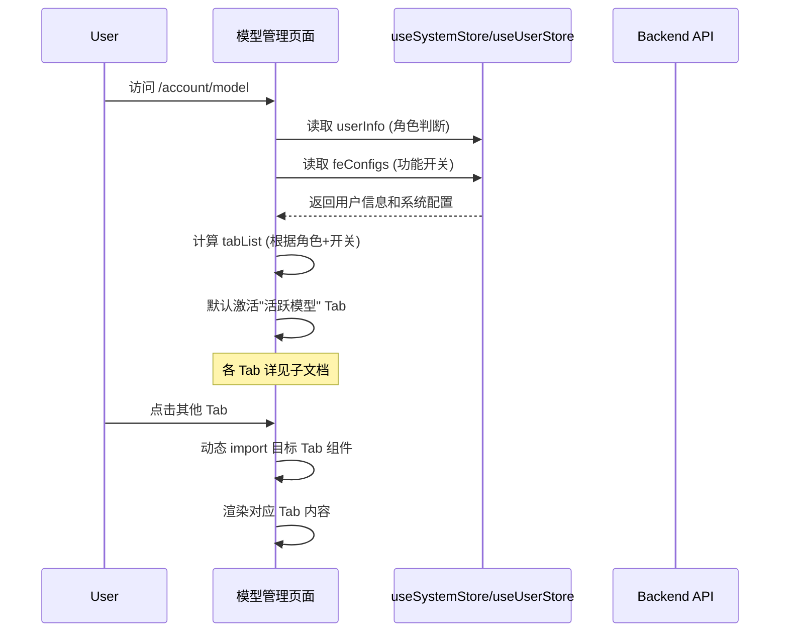

# 模型管理 — 业务流程详解

## 页面总览

模型管理页面是账户中心下 AI 模型相关功能的统一入口。页面在 `/account/model` 路由下工作，通过顶部 MyTabs 组件在 5 个 Tab 间切换。页面整体嵌入 `AccountContainer` 布局中，共享账户侧边栏导航和统一的页面头部。

## Tab 结构索引

| Tab | 业务描述 | 详细文档 |
|-----|---------|---------|
| 活跃模型 | 展示系统启用的模型列表，分基础模型和自定义模型两个子 Tab，支持筛选（提供商/模型类型/搜索）和批量权限操作 | [10-业务流程详解](../活跃模型/业务流程详解.md) |
| 配置模型 | 以表格形式展示全量系统模型的配置信息（模型名、类型、价格、创建者、权限、启用状态），支持创建、编辑、删除和测试模型 | [10-业务流程详解](../配置模型/业务流程详解.md) |
| 渠道管理 | [动态可见] 管理 API 代理渠道（如 OpenAI 渠道），支持创建、编辑、删除、启用/禁用和优先级调整 | [10-业务流程详解](../渠道管理/业务流程详解.md) |
| 渠道日志 | [动态可见] 查看和筛选渠道 API 的请求日志，支持按日期、渠道、模型、状态和请求 ID 过滤，可展开详情 | [10-业务流程详解](../渠道日志/业务流程详解.md) |
| 模型监控 | [动态可见] 以图表和表格展示模型调用量、Token 消耗、成本、响应时间等 Dashboard 数据 | [10-业务流程详解](../模型监控/业务流程详解.md) |

> 动态可见 Tab 仅在用户为 root 且 `feConfigs.show_aiproxy` 启用时显示。

## 公共业务流程

### 页面初始化

| 步骤 | 用户操作 | 触发 API | 分支条件 | 页面变化 |
|------|---------|---------|---------|---------|
| 1 | 点击账户侧边栏"模型管理"菜单项或直接访问 `/account/model` | 无（前端路由跳转） | — | Next.js 执行 `getServerSideProps`，加载 i18n 资源（account, account_model, user, app, train, chat 命名空间）；页面显示 AccountContainer 布局 |
| 2 | 页面初始化完成，默认 Tab 激活 | 无 | 活跃模型 Tab 内：ModelTable 从 `useSystemStore` 读取模型列表（已在应用初始化时预加载） | 页面头部显示"模型管理"标题 + MyTabs 选项卡（居中）；默认激活"活跃模型" Tab，渲染 ValidModelTable 组件 |

### 角色感知的 Tab 可见性

| 步骤 | 用户操作 | 触发 API | 分支条件 | 页面变化 |
|------|---------|---------|---------|---------|
| 1 | 页面加载 | 无 | `isRoot === true && feConfigs.show_aiproxy === true` | Tab 列表中增加"渠道管理""渠道日志""模型监控"三个选项 |
| 2 | 页面加载 | 无 | `isRoot === false || feConfigs.show_aiproxy === false` | Tab 列表仅显示"活跃模型""配置模型"两个选项 |

> 角色判断来自 `useUserStore().userInfo.username === 'root'`；功能开关来自 `useSystemStore().feConfigs.show_aiproxy`。判断逻辑在 `tabList` 的 `useMemo` 中执行。

### Tab 切换

| 步骤 | 用户操作 | 触发 API | 分支条件 | 页面变化 |
|------|---------|---------|---------|---------|
| 1 | 点击顶部 MyTabs 中的目标 Tab 标签 | 无 | — | `tab` 状态更新为对应值；当前 Tab 标签高亮，其他恢复默认样式 |
| 2 | Tab 内容条件渲染 | 无 | `tab === 'model'` → 渲染 ValidModelTable（`ModelTable`） | 显示活跃模型内容区域 |
| 3 | Tab 内容条件渲染 | 无 | `tab === 'config'` → 渲染 `ModelConfigTable`（动态导入） | 显示配置模型内容区域（加载时可能有短暂加载状态） |
| 4 | Tab 内容条件渲染 | 无 | `tab === 'channel'` → 渲染 `ChannelTable`（动态导入） | 显示渠道管理内容区域 |
| 5 | Tab 内容条件渲染 | 无 | `tab === 'channel_log'` → 渲染 `ChannelLog`（动态导入） | 显示渠道日志内容区域 |
| 6 | Tab 内容条件渲染 | 无 | `tab === 'account_model'` → 渲染 `ModelDashboard`（动态导入） | 显示模型监控内容区域 |

> 配置模型、渠道管理、渠道日志和模型监控 Tab 的内容组件使用 Next.js `dynamic(() => import(...))` 实现按需加载，首次切换到对应 Tab 时才会触发代码下载和执行。

## Mermaid 附录

> 各 Tab 的业务流程细节（模型筛选、批量操作、渠道 CRUD、日志查询、监控数据加载等）请参见各 Tab 子文档。
