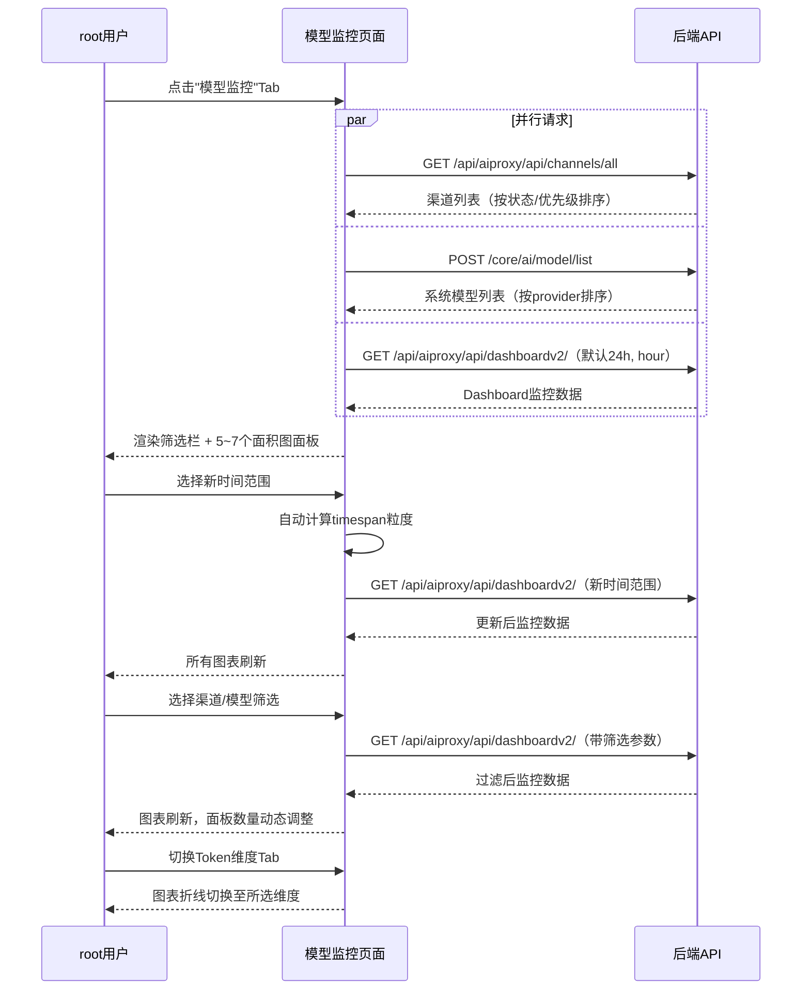
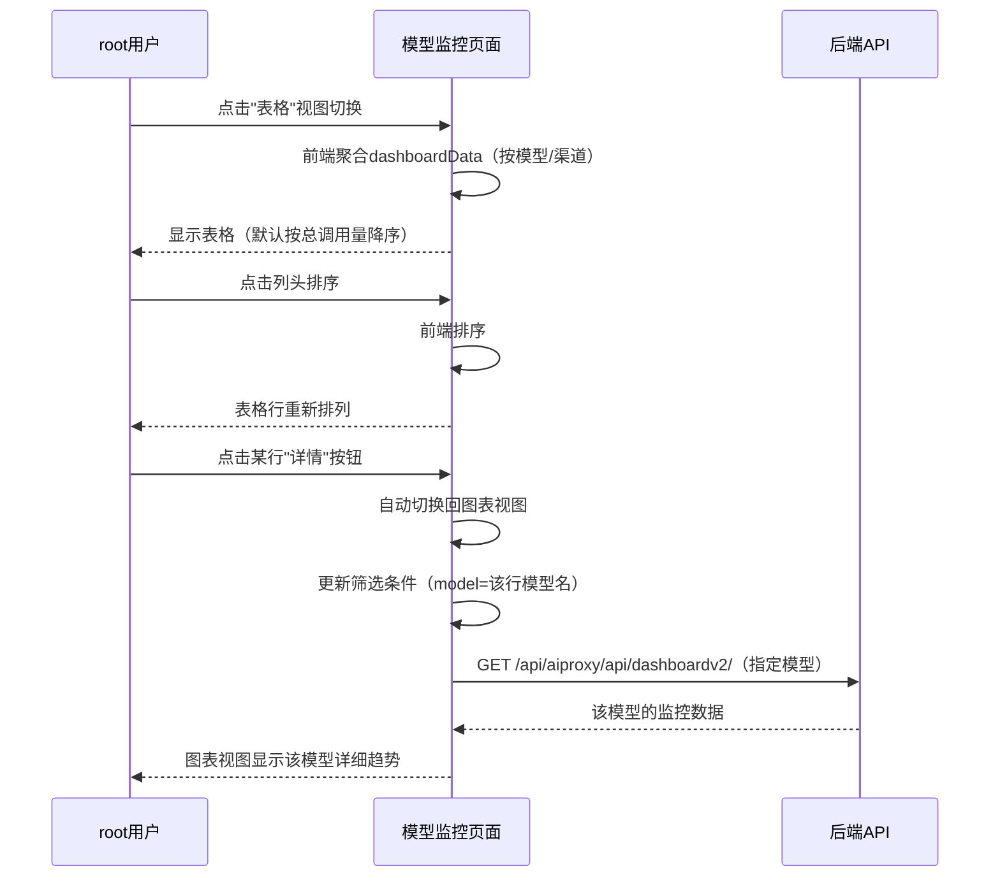

# 模型监控 — 业务流程详解

## 页面总览

模型监控页面为 root 管理员提供 AI 模型调用数据的多维度可视化分析。页面默认以图表视图展示监控数据，用户可通过顶部筛选栏选择时间范围、渠道和模型，并可在图表和表格两种视图间自由切换。

### 场景 S01：模型调用数据监控（图表视图）

> 业务描述：用户进入模型监控 Tab 后，默认展示图表视图，包含多个图表面板展示不同维度的监控指标。用户可通过筛选条件聚焦特定数据范围。

#### 步骤 1：页面初始化加载

| 用户操作 | 触发 API | 分支条件 | 页面变化 |
|---------|---------|---------|---------|
| 点击模型管理页面顶部"模型监控" Tab | 1. GET `/api/aiproxy/api/channels/all`（获取渠道列表） 2. POST `/core/ai/model/list`（获取系统模型列表） 3. GET `/api/aiproxy/api/dashboardv2/`（获取监控数据，参数：默认最近 24 小时、timespan=hour、无渠道和模型筛选） | — | 页面显示 MyBox 加载遮罩 → 渠道下拉框和模型下拉框填充选项 → 图表区域渲染 5~7 个面积图面板 |

三个 API 为并行请求，分别负责填充筛选器选项和渲染图表数据。页面使用 `useRequest` hook 管理异步请求状态。

数据加载详情：

| 加载阶段 | API | 关键参数 | 数据处理 | 渲染结果 |
|---------|-----|---------|---------|---------|
| 首次加载 | GET `/api/aiproxy/api/dashboardv2/` | 默认最近 24 小时（start_timestamp/end_timestamp）、timezone=浏览器时区、timespan=hour | 1. 补全缺失时间段（根据 timespan 生成完整周期列表） 2. 聚合每个时间点的 summary 数据（请求数、异常数、Token、耗时等） 3. 按 modelPriceMap 计算 AI 积分花费 4. 区分 LLM 模型（用于缓存命中率计算） | 图表视图展示 5~7 个面积图面板 |
| 渠道列表加载 | GET `/api/aiproxy/api/channels/all` | page=1, perPage=10 | 按状态排序（活跃优先），再按优先级降序；前置"全部"选项 | 渠道筛选下拉框 |
| 模型列表加载 | POST `/core/ai/model/list` | 无 | 按模型提供商 order 排序；前置"全部"选项 | 模型筛选下拉框 |

- **分页参数**：Dashboard V2 数据不涉及前端分页，按时间范围一次性返回（时间点数 = 时间段跨度 / timespan 粒度）
- **排序规则**：图表数据按时间戳升序排列
- **筛选条件**：时间范围选择器、渠道下拉框、模型下拉框、时间粒度选择器（自动按时间跨度调整可用选项）

#### 步骤 2：切换时间范围

| 用户操作 | 触发 API | 分支条件 | 页面变化 |
|---------|---------|---------|---------|
| 在 DateRangePicker 中选择新的起止时间 | GET `/api/aiproxy/api/dashboardv2/`（参数更新：新的 start_timestamp/end_timestamp） | 时间跨度 ≤ 1 天时，时间粒度选项仅显示"分钟"和"小时"；时间跨度 ≥ 1 天时，选项显示"小时"和"天" | DateRangePicker 显示新日期 → 时间粒度下拉框选项自动更新 → 图表数据重新加载（显示加载中状态）→ 所有图表面板刷新数据 |

DateRangePicker 默认显示最近 24 小时（`from` = 24 小时前，整分；`to` = 1 小时后，整分）。切换时间范围后，系统自动计算新的时间跨度（小时数），并按以下规则调整时间粒度和默认值：

- 跨度 < 1 小时 → 默认粒度"分钟"
- 跨度 < 2 天 → 默认粒度"小时"
- 跨度 ≥ 2 天 → 默认粒度"天"

#### 步骤 3：筛选渠道和模型

| 用户操作 | 触发 API | 分支条件 | 页面变化 |
|---------|---------|---------|---------|
| 在渠道下拉框中选择特定渠道 | GET `/api/aiproxy/api/dashboardv2/`（参数更新：channel=渠道ID） | — | 渠道下拉框显示选中项 → 图表数据重新加载（按所选渠道过滤） |
| 在模型下拉框中选择特定模型 | GET `/api/aiproxy/api/dashboardv2/`（参数更新：model=模型名） | 选择了单个模型时：额外显示"最大 RPM"和"最大 TPM"两个图表面板、缓存命中分析仅 LLM 模型时显示；未选择模型时：不显示 RPM/TPM 面板 | 模型下拉框显示选中项 → 图表数据重新加载 → 图表区域面板数量动态变化 |

渠道和模型的筛选可组合使用。下拉框均支持搜索功能（`isSearch`），用户可输入关键词快速定位选项。

#### 步骤 4：切换 Token 用量维度

| 用户操作 | 触发 API | 分支条件 | 页面变化 |
|---------|---------|---------|---------|
| 在 Token 用量图表面板的子 Tab 中切换维度（总量/输入/输出） | 无（纯前端切换） | — | Token 用量图表的折线数据切换到所选维度（totalTokens/inputTokens/outputTokens），图表累加模式保持启用 |

#### 步骤 5：查看各监控图表

页面默认展示以下图表面板（无需额外操作）：

1. **模型请求次数**：面积图，启用累加模式，展示 `totalCalls` 数据，色值为主题色 primary.600
2. **模型错误请求次数**（左）+ **模型错误率**（右）：双列网格布局，不启用累加模式；错误次数色值 #f98e1a，错误率色值 #e84738
3. **Token 用量**：面积图，启用累加模式，顶部左侧含输入/输出/总量三个子 Tab 切换
4. **AI 积分消耗**：面积图，启用累加模式，色值 #8774EE；仅在 `feConfigs.isPlus` 为 true 时显示
5. **平均响应时间**（左）+ **平均首 Token 时间**（右）：双列网格布局，不启用累加模式；响应时间色值 #36B37E，TTFB 色值 #FF5630；数值精确到小数点后 2 位
6. **最大 RPM**（左）+ **最大 TPM**（右）：双列网格布局，仅在筛选了单个模型时显示；RPM 色值 #6554C0，TPM 色值 #FF8B00
7. **缓存命中分析**：面积图，启用累加模式，展示缓存命中率 + 缓存命中次数两条折线；仅在未筛选模型或筛选的模型为 LLM 类型时显示

### 场景 S02：模型监控表格查看

> 业务描述：用户从图表视图切换到表格视图，以表格形式查看按模型或渠道维度聚合的汇总数据，支持排序和详情跳转。

#### 步骤 1：切换到表格视图

| 用户操作 | 触发 API | 分支条件 | 页面变化 |
|---------|---------|---------|---------|
| 点击右上角"表格"切换按钮 | 无（仅切换视图模式） | — | FillRowTabs 切换到"表格" → 图表区域隐藏 → 表格组件渲染 |

#### 步骤 2：查看表格数据

| 用户操作 | 触发 API | 分支条件 | 页面变化 |
|---------|---------|---------|---------|
| 表格视图自动渲染 | 无（基于已加载的 dashboardData 数据聚合） | 存在模型筛选时：按渠道维度聚合数据，显示"渠道"列；无模型筛选时：按模型维度聚合数据 | 表格显示聚合后的行数据 |

数据加载详情：

| 加载阶段 | 数据来源 | 聚合维度 | 排序规则 | 渲染结果 |
|---------|---------|---------|---------|---------|
| 表格渲染 | 使用已获取的 `dashboardData`（纯前端聚合） | 按模型或有模型筛选时按渠道 | 默认按总调用量降序 | 表格含模型名/渠道名、总调用量、失败量、AI积分、平均响应时间、平均TTFB、缓存命中率、"详情"按钮 |

- **排序规则**：默认按总调用量降序，点击列头可在总调用量/失败量/AI 积分/缓存命中率之间切换排序，再次点击同列切换升降序
- **筛选条件**：表格使用与图表相同的时间范围和筛选条件（由 filterProps 传递）
- **特殊标识**：平均响应时间 > 10 秒时，数值以黄色高亮显示（`yellow.700`）；非 LLM 模型的缓存命中率列显示"-"

#### 步骤 3：排序操作

| 用户操作 | 触发 API | 分支条件 | 页面变化 |
|---------|---------|---------|---------|
| 点击表格列头（总调用量/失败量/AI积分/缓存命中率） | 无（前端排序） | 点击当前排序列：切换升降序方向；点击新列：切换到该列，默认降序 | 列头显示排序方向箭头（↓/↑）→ 表格行重新排列 |

#### 步骤 4：查看模型详情

| 用户操作 | 触发 API | 分支条件 | 页面变化 |
|---------|---------|---------|---------|
| 点击某行的"详情"按钮 | 无（前端状态更新） | — | 视图模式自动切换回图表 → 筛选条件更新（model 设为该行模型名）→ 图表数据按新条件重新加载 |

点击"详情"按钮后，系统调用父组件的 `handleViewDetail` 函数，将筛选条件更新为指定模型并自动切回图表视图，用户可在图表视图中查看该模型的详细趋势数据。

## Mermaid 附录

### 场景 S01：模型调用数据监控

### 场景 S02：模型监控表格查看

