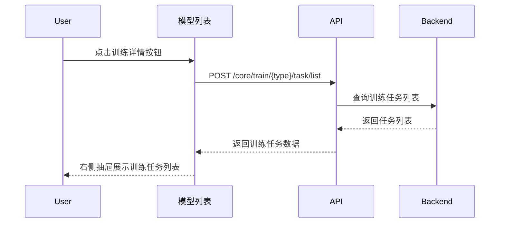
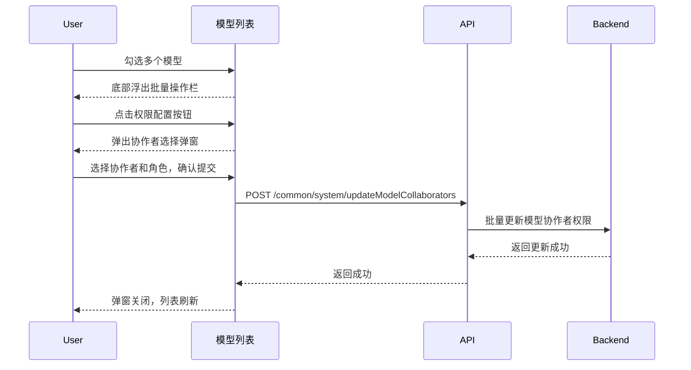
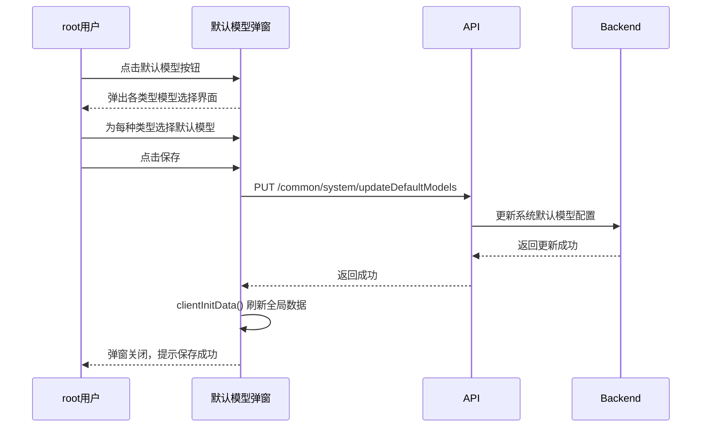
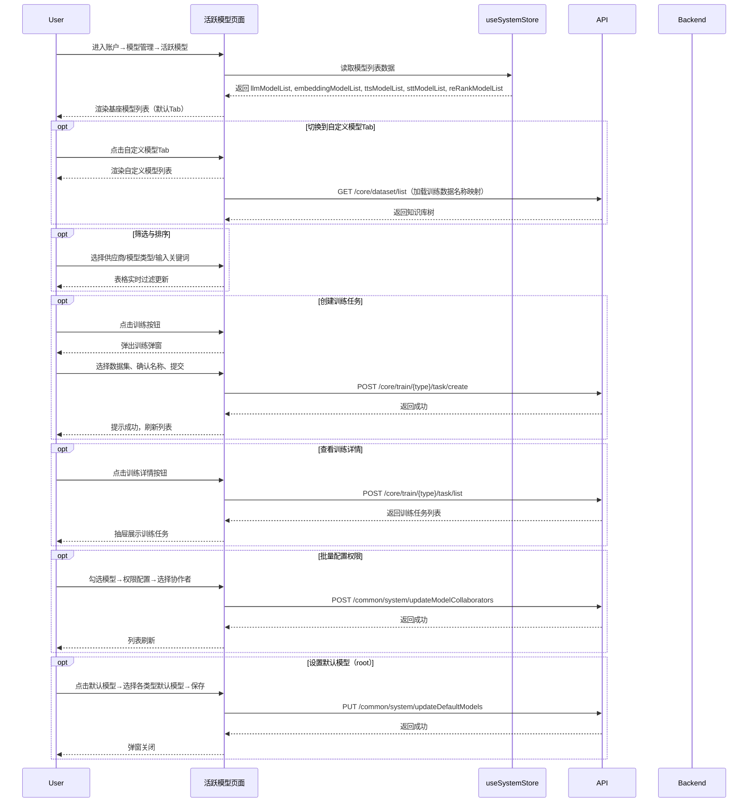

# 活跃模型 — 业务流程详解

## 页面总览

活跃模型页面是模型管理的核心视图，通过基座模型和自定义模型两个 Tab 呈现团队的完整模型资产。页面以表格为主体，上方提供供应商、模型类型、关键词三维筛选，表格列根据 Tab 不同动态展示训练信息或计费信息。管理员可在此页面完成模型训练、权限配置、默认模型设置等关键运维操作。

---

### 查看基座模型列表

> 业务描述：进入活跃模型页面时默认展示基座模型 Tab，以表格形式列出系统所有官方基座模型，含模型名称、类型标签、计费价格、训练任务数量等信息。

#### 步骤 1：页面加载与数据获取

| 用户操作 | 触发 API | 分支条件 | 页面变化 |
|---------|---------|---------|---------|
| 通过侧边栏导航进入「账户 → 模型管理」页面 | 无（数据由父组件通过 Store 传入） | — | 页面渲染，显示基座模型 Tab 激活状态 |

> 说明：模型列表数据（llmModelList、embeddingModelList、ttsModelList、sttModelList、reRankModelList）由系统初始化时通过 `getInitData` API 一次性获取并存储在 `useSystemStore` 中。活跃模型组件从 Store 读取并经过本地筛选、排序后渲染，不额外发起列表请求。

#### 步骤 2：基座模型列表渲染

| 用户操作 | 触发 API | 分支条件 | 页面变化 |
|---------|---------|---------|---------|
| 页面加载完成，等待数据就绪 | 无（纯客户端计算） | 模型列表为空时显示空状态提示 | 表格渲染：模型名、模型类型筛选下拉、计费价格列、训练任务数列（可点击排序） |

**数据加载详情**：

| 加载阶段 | 数据来源 | 关键处理 | 渲染结果 |
|---------|---------|---------|---------|
| 首次加载 | useSystemStore 中的模型列表 | 过滤 `isTuned !== true` 的模型（排除已微调），按供应商和模型类型筛选，按训练任务数量排序 | 基座模型表格 |
| Tab 切换 | 同上（已在内存中） | 切换筛选条件为自定义模型 Tab 的筛选状态，过滤 `isTuned === true` | 自定义模型表格 |
| 刷新 | 调用 `clientInitData()` 强制重新获取全局数据 | 静默更新，表格数据自动刷新 | 表格数据更新 |

- **分页**：前端全量渲染，不涉及分页
- **排序规则**：训练任务数量列支持点击切换升降序（默认无排序 → 降序 → 升序 → 无排序）；自定义模型 Tab 的训练时间列同样支持排序
- **筛选条件**：供应商下拉（按模型实际归属的供应商动态生成）、模型类型下拉（LLM/TTS/Embedding/STT/ReRank）、关键词搜索（匹配模型名称）

---

### 查看自定义模型列表

> 业务描述：用户切换到自定义模型 Tab，查看团队通过训练生成的微调模型，含训练时间、训练人、训练数据等专属列。

#### 步骤 1：切换 Tab

| 用户操作 | 触发 API | 分支条件 | 页面变化 |
|---------|---------|---------|---------|
| 点击「自定义模型」Tab 标签 | 无（纯客户端切换） | — | Tab 高亮切换为「自定义模型」；表格列重新布局 |

#### 步骤 2：自定义模型列表渲染

| 用户操作 | 触发 API | 分支条件 | 页面变化 |
|---------|---------|---------|---------|
| 等待列表计算完成 | 无（纯客户端过滤） | 自定义模型为空时显示空状态 | 表格渲染：模型名、模型类型筛选、训练时间（可排序）、训练人、训练数据列 |

**数据加载详情**：

| 加载阶段 | 数据来源 | 关键处理 | 渲染结果 |
|---------|---------|---------|---------|
| 首次进入 | useSystemStore 中的模型列表 | 过滤 `isTuned === true` 的模型 | 自定义模型表格 |
| 加载训练数据关联 | GET `/core/dataset/list`（通过 getDatasetsWithChildren） | 获取知识库树，构建 datasetId → 知识库名称映射，用于渲染训练数据列 | 训练数据列显示关联知识库名称 |

---

### 筛选和排序模型

> 业务描述：用户通过供应商、模型类型下拉框和关键词搜索框筛选模型，点击表头排序图标切换排序。

#### 步骤 1：供应商筛选

| 用户操作 | 触发 API | 分支条件 | 页面变化 |
|---------|---------|---------|---------|
| 点击供应商下拉，选择一个供应商 | 无（客户端筛选） | 选择「全部」时不过滤 | 表格仅显示该供应商的模型；若该供应商无模型则显示空状态 |

#### 步骤 2：模型类型筛选

| 用户操作 | 触发 API | 分支条件 | 页面变化 |
|---------|---------|---------|---------|
| 点击模型类型下拉，选择一种类型 | 无（客户端筛选） | 选择「全部类型」时不过滤 | 表格仅显示该类型的模型；空选项自动排除 |

#### 步骤 3：关键词搜索

| 用户操作 | 触发 API | 分支条件 | 页面变化 |
|---------|---------|---------|---------|
| 在搜索框输入关键词 | 无（客户端筛选） | 输入为空时不过滤 | 表格实时过滤，仅显示名称匹配关键词的模型 |

#### 步骤 4：排序切换

| 用户操作 | 触发 API | 分支条件 | 页面变化 |
|---------|---------|---------|---------|
| 点击「训练任务数」列表头 | 无（客户端排序） | 无排序 → 降序 → 升序 → 无排序，循环切换 | 排序图标切换状态（灰色→蓝色），表格数据重新排列 |
| 点击「训练时间」列表头（仅自定义 Tab） | 无（客户端排序） | 同上循环逻辑 | 同上 |

---

### 查看训练详情

> 业务描述：在自定义模型列表中，点击某个模型的「训练详情」按钮，右侧弹出抽屉展示该模型的训练任务历史。

#### 步骤 1：打开训练详情抽屉

| 用户操作 | 触发 API | 分支条件 | 页面变化 |
|---------|---------|---------|---------|
| 点击自定义模型行操作列的「训练详情」按钮 | POST `/core/train/embedding/task/list` 或 POST `/core/train/rerank/task/list`（根据模型类型） | — | 右侧滑出抽屉，加载中显示加载状态 |

#### 步骤 2：查看训练任务列表

| 用户操作 | 触发 API | 分支条件 | 页面变化 |
|---------|---------|---------|---------|
| 等待数据加载完成 | 同上（TrainDetailDrawer 内 useRequest 自动发起） | 训练任务为空时显示空状态 | 抽屉内展示训练任务列表，每条含任务状态、创建时间、进度等信息 |

#### 步骤 3：关闭抽屉

| 用户操作 | 触发 API | 分支条件 | 页面变化 |
|---------|---------|---------|---------|
| 点击关闭按钮或遮罩 | 无 | — | 抽屉关闭，回到列表视图 |



---

### 创建模型训练任务

> 业务描述：用户选择一个基座模型，在弹窗中选择训练数据集，输入新模型名称，提交训练任务。

#### 步骤 1：打开训练弹窗

| 用户操作 | 触发 API | 分支条件 | 页面变化 |
|---------|---------|---------|---------|
| 点击模型行操作列的「训练」按钮 | — | 仅对支持训练（supportTrain）的可训练类型模型显示训练按钮 | 弹出训练弹窗，显示加载状态（获取知识库树） |

#### 步骤 2：加载知识库数据

| 用户操作 | 触发 API | 分支条件 | 页面变化 |
|---------|---------|---------|---------|
| 等待弹窗加载 | GET `/core/dataset/list`（getDatasetsWithChildren） | 加载失败时弹出错误提示「操作失败」 | 知识库树加载完成，显示可选数据集列表 |

#### 步骤 3：配置训练参数

| 用户操作 | 触发 API | 分支条件 | 页面变化 |
|---------|---------|---------|---------|
| 在「新模型名称」输入框输入名称 | 无 | 自动生成默认名称（基座模型名-日期-随机数），仅首次填入 | 输入框显示名称 |
| 在知识库树中勾选训练数据集 | 无 | 正在处理中的知识库不可选（置灰 + 提示）；embedding 训练时向量模型不匹配的知识库不可选 | 已选数据集计数更新；文件夹全选/半选图标更新 |

#### 步骤 4：提交训练任务

| 用户操作 | 触发 API | 分支条件 | 页面变化 |
|---------|---------|---------|---------|
| 点击确认按钮 | POST `/core/train/embedding/task/create`（embedding 类型）或 POST `/core/train/rerank/task/create`（reRank 类型） | 提交失败时弹出错误提示「操作失败」 | 按钮显示加载状态；成功后弹出成功提示，弹窗关闭，调用 `clientInitData()` 刷新全局数据 |

**表单字段清单**：

| 字段名 | 控件类型 | 必填 | 默认值 | 可选值/约束 | 编辑时只读 | 说明 |
|--------|---------|------|--------|------------|-----------|------|
| 基座模型类型 | 自动确定 | ✅ | 来自入口参数或默认 reRank | embedding / reRank | ✅ 只读 | 由训练入口决定 |
| 基座模型 | 自动确定 | ✅ | 来自入口参数 | 系统内置的可训练基座模型 | ✅ 只读 | 排除已微调和不支持训练的模型 |
| 新模型名称 | 文本输入 | ✅ | 自动生成（基座模型名-日期-随机数） | 自定义字符串 | 否 | 自动填充仅首次生效 |
| 训练数据集 | 知识库树多选 | ✅ | 无 | 团队下所有知识库 | 否 | 处理中的知识库和向量模型不匹配的知识库不可选 |

**校验规则**：

| 规则 | 触发时机 | 错误提示文案 |
|------|---------|-------------|
| 知识库正在处理中 | 渲染时 | 「该知识库正在处理中，无法用于训练」 |
| 知识库向量模型不匹配（embedding 训练） | 渲染时 | 「该知识库的向量模型与所选基座模型不一致」 |

**前后置条件**：
- **前置条件**：当前用户有管理权限；所选基座模型 `supportTrain` 为 true 且 `isTuned` 不为 true
- **后置影响**：创建训练任务后，系统异步执行训练，完成后生成微调模型出现在自定义模型列表中
- **失败场景**：训练任务提交失败时，弹窗保持打开，显示错误提示，用户可修改参数后重试

```mermaid
sequenceDiagram
  participant User
  participant UI as 训练弹窗
  participant API
  participant Backend

  User->>UI: 点击训练按钮
  UI->>API: GET /core/dataset/list（获取知识库树）
  API-->>UI: 返回知识库树数据
  UI-->>User: 展示知识库树，自动填充模型名称
  User->>UI: 选择训练数据集，确认名称
  User->>UI: 点击确认
  par embedding 或 reRank 训练
    UI->>API: POST /core/train/embedding/task/create
  else
    UI->>API: POST /core/train/rerank/task/create
  end
  API->>Backend: 创建训练任务
  Backend-->>API: 返回任务创建成功
  API-->>UI: 返回成功
  UI->>UI: clientInitData() 刷新全局数据
  UI-->>User: 显示成功提示，关闭弹窗
```

---

### 批量配置模型权限

> 业务描述：管理员勾选多个有管理权限的模型，通过底部浮出的批量操作栏统一修改这些模型的团队协作权限。

#### 步骤 1：进入权限配置模式并选择模型

| 用户操作 | 触发 API | 分支条件 | 页面变化 |
|---------|---------|---------|---------|
| 页面以权限配置模式打开（permissionConfig=true） | 无 | 仅团队管理员可见复选框 | 模型列表每行出现复选框，表头出现全选框 |

#### 步骤 2：勾选模型

| 用户操作 | 触发 API | 分支条件 | 页面变化 |
|---------|---------|---------|---------|
| 勾选一个或多个模型复选框 | 无 | 仅 `item.permission.hasManagePer` 为 true 的行可勾选；无可管理模型时不显示复选框 | 勾选行高亮；底部浮出批量操作栏，显示已选数量 |

#### 步骤 3：配置权限

| 用户操作 | 触发 API | 分支条件 | 页面变化 |
|---------|---------|---------|---------|
| 点击底部操作栏的「权限配置」按钮 | 无 | — | 弹出协作者选择弹窗（LazyCollaboratorProvider） |

#### 步骤 4：选择协作者并提交

| 用户操作 | 触发 API | 分支条件 | 页面变化 |
|---------|---------|---------|---------|
| 在弹窗中选择团队成员和角色 | 无 | — | 协作者列表实时更新 |
| 点击确认提交 | POST `/common/system/updateModelCollaborators` | 提交失败时弹出错误提示 | 弹窗关闭，模型列表刷新 |



---

### 设置默认模型

> 业务描述：root 用户在弹窗中为每种模型类型（LLM/TTS/Embedding/STT/ReRank）指定默认模型。

#### 步骤 1：打开设置弹窗

| 用户操作 | 触发 API | 分支条件 | 页面变化 |
|---------|---------|---------|---------|
| 点击右上角「默认模型」按钮 | 无 | 仅 root 用户（username === 'root'）可见此按钮 | 弹出默认模型设置弹窗 |

#### 步骤 2：选择各类型默认模型

| 用户操作 | 触发 API | 分支条件 | 页面变化 |
|---------|---------|---------|---------|
| 在各模型类型区域的下拉选择器中选取模型 | 无（从 useSystemStore 读取模型列表填充选项） | — | 选中的模型实时高亮显示 |

#### 步骤 3：保存设置

| 用户操作 | 触发 API | 分支条件 | 页面变化 |
|---------|---------|---------|---------|
| 点击保存按钮 | PUT `/common/system/updateDefaultModels` | 保存失败时弹出错误提示 | 弹窗关闭，调用 `clientInitData()` 刷新全局数据 |

**前后置条件**：
- **前置条件**：当前登录用户为 root
- **后置影响**：系统默认模型更新后，所有新建应用将默认使用新设置的模型



---

## Mermaid 附录


