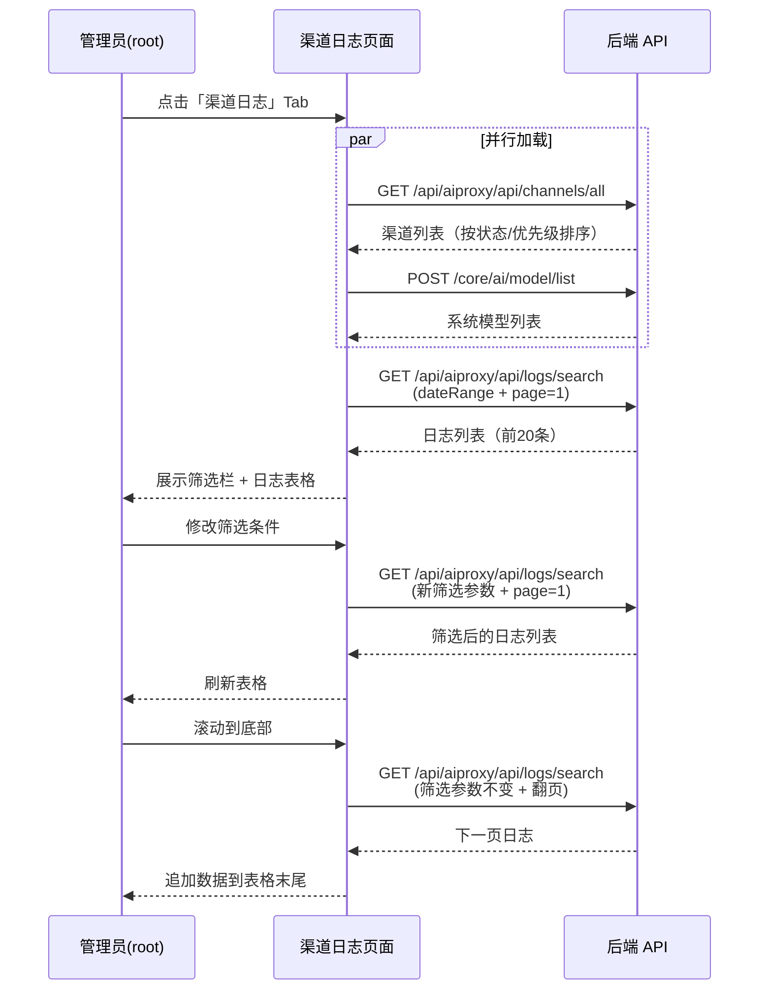
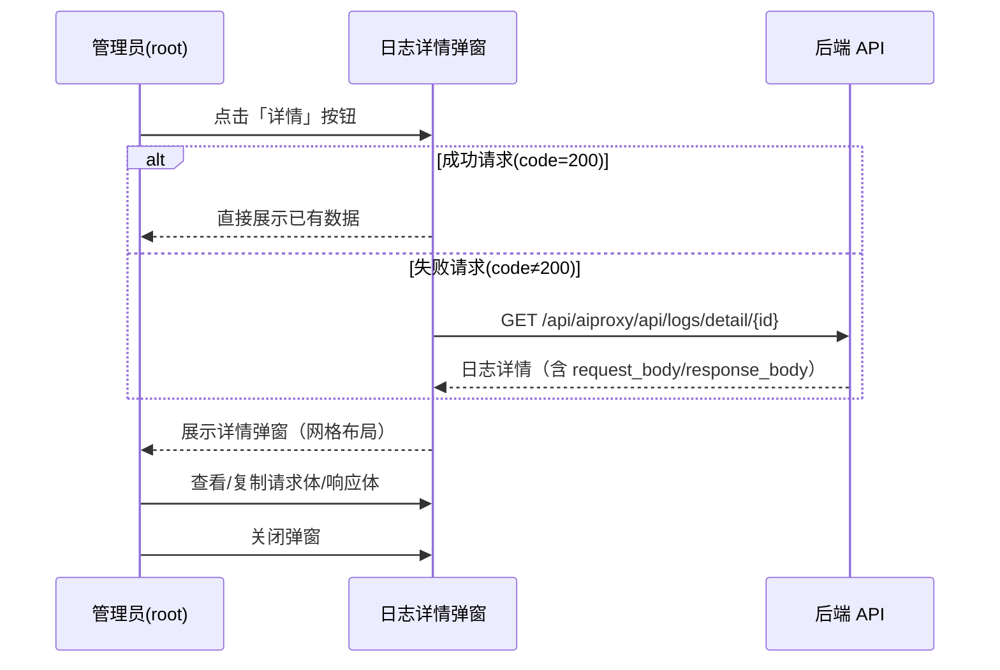

# 渠道日志 — 业务流程详解

## 页面总览

渠道日志是模型管理页面中 root 管理员专属的 Tab 子页面。页面顶部提供多维筛选栏，下方以表格形式展示日志列表并支持无限滚动加载，点击单条记录可弹出详情弹窗查看请求完整信息。

本模块为叶子节点（无子 Tab），包含两个核心场景：日志查询和日志详情查看。

---

### 渠道日志查询

> 业务描述：root 管理员进入渠道日志 Tab 后，通过筛选条件搜索和浏览渠道请求日志。

#### 步骤 1：页面初始化

| 用户操作 | 触发 API | 分支条件 | 页面变化 |
|---------|---------|---------|---------|
| 进入模型管理页面，点击「渠道日志」Tab | 并行发起： ① `GET /api/aiproxy/api/channels/all`（获取渠道列表） ② `POST /core/ai/model/list`（获取系统模型列表） ③ `GET /api/aiproxy/api/logs/search`（获取日志首页数据） | `isRoot && feConfigs.show_aiproxy` 为 true 时 Tab 才可见 | 显示筛选栏和数据表格，加载遮罩覆盖表格区域；渠道下拉和模型下拉在各自 API 返回后填充选项并移除加载态；日志表格显示第一页 20 条数据 |

**数据加载详情**：

| 加载阶段 | API | 关键参数 | 数据处理 | 渲染结果 |
|---------|-----|---------|---------|---------|
| 渠道列表加载 | GET /api/aiproxy/api/channels/all | page=1, perPage=10 | 按 status 升序、priority 降序排列；转换为 `{label: name, value: id}` 格式，前置「全部」选项 | 渠道筛选下拉框 |
| 模型列表加载 | POST /core/ai/model/list | 无 | 按供应商 order 排序；转换为 `{label: model, value: model}` 格式（含供应商图标），前置「全部」选项 | 模型筛选下拉框 |
| 日志首次加载 | GET /api/aiproxy/api/logs/search | result_only=true, start_timestamp=昨天00:00, end_timestamp=今天23:59, p=1, per_page=20 | 数据格式化：计算 duration=created_at-request_at，匹配渠道名称和模型供应商图标，格式化时间戳 | 日志表格（前 20 条） |

**分页参数**：默认每页 20 条，使用 `useScrollPagination` 无限滚动加载，滚动到底部自动加载下一页。

**排序规则**：按请求时间倒序（由后端 API 返回）。

**筛选条件**：
- **日期范围**（DateRangePicker）：默认昨天 00:00 至今天 23:59
- **渠道名称**（下拉搜索）：可选全部或指定渠道
- **模型名称**（下拉搜索）：可选全部或指定模型
- **请求状态**（下拉）：全部 / 成功（code=200）/ 失败（code≠200）
- **Request ID**（文本搜索，仅 root）：模糊搜索 request_id

#### 步骤 2：筛选日志

| 用户操作 | 触发 API | 分支条件 | 页面变化 |
|---------|---------|---------|---------|
| 修改任一筛选项（日期、渠道、模型、状态、Request ID） | `GET /api/aiproxy/api/logs/search`（携带更新后的筛选参数，页码重置为第 1 页） | 每次筛选条件变化时自动触发请求，`refreshDeps` 依赖 `filterProps` 整体对象 | 表格区域显示加载状态，数据刷新为筛选后的第一页结果；如无匹配数据则显示空列表 |

#### 步骤 3：滚动加载更多

| 用户操作 | 触发 API | 分支条件 | 页面变化 |
|---------|---------|---------|---------|
| 向下滚动日志表格至底部 | `GET /api/aiproxy/api/logs/search`（page=N+1，其余筛选参数不变） | 仅当还有更多数据时（`total > 已加载条数`）触发；加载过程中底部显示加载指示器 | 新数据追加到表格末尾，表格总高度增加；若已加载全部数据则不再触发 |

#### 步骤 4：特殊列的渲染

日志表格包含以下特殊渲染逻辑：

| 列名 | 渲染规则 |
|------|---------|
| 模型 | 显示供应商图标 + 模型名称（图标通过 `getModelProvider` 从系统 Store 获取） |
| Token 消耗 | 显示 `input_tokens / output_tokens` 格式 |
| 耗时 | 显示秒数（保留 2 位小数）；若耗时超过 10 秒，文字变为红色（`red.600`） |
| 状态码 | 200 时显示绿色（`green.600`），非 200 时显示红色（`red.600`）；若 content 有值则附加 `QuestionTip` 图标提示 |
| 请求时间 | 经 `formatTime2YMDHMS` 格式化为 YYYY-MM-DD HH:mm:ss |

**空列表展示**：当筛选结果为空时，表格区域不显示数据行。

**权限不足的表现**：非 root 用户不显示渠道日志 Tab。Request ID 搜索框仅在 root 用户下可见。

---

### 渠道日志详情查看

> 业务描述：在日志列表中点击某条记录查看完整的请求和响应信息。

#### 步骤 1：打开详情弹窗

| 用户操作 | 触发 API | 分支条件 | 页面变化 |
|---------|---------|---------|---------|
| 点击日志列表中某条记录的「详情」按钮 | 状态码为 200 时：不发起额外请求，直接使用列表数据 状态码非 200 时：`GET /api/aiproxy/api/logs/detail/{id}` | 成功请求（code=200）通常已包含完整数据；失败请求需额外获取详情 | 弹出 Modal 弹窗（最大宽度 800px）；弹窗内以两列网格布局展示基本信息 |

#### 步骤 2：查看详情信息

基本信息网格展示以下字段（按行顺序）：

| 行 | 左列 | 右列 |
|----|------|------|
| 1 | Request ID | Request IP |
| 2 | 状态码（200 绿色 / 非200 红色） | Endpoint |
| 3 | 渠道名称 | 模型（图标+名称） |
| 4 | 请求时间 | 耗时（秒） |
| 5 | TTFB 时间（ms 或 -） | Token 消耗（input / output） |

条件展示字段（仅在数据存在时显示）：

| 字段 | 展示条件 |
|------|---------|
| 重试次数 | `retry_times !== undefined` |
| Content（错误内容） | `content` 字段存在 |
| Request Body | `request_body` 字段存在（userSelect='all' 可全选复制） |
| Response Body | `response_body` 字段存在 |

**错误处理**：获取详情 API 失败时，回退使用列表中的已有数据展示基本信息。

---

### Mermaid 附录

#### 渠道日志查询

#### 渠道日志详情查看

