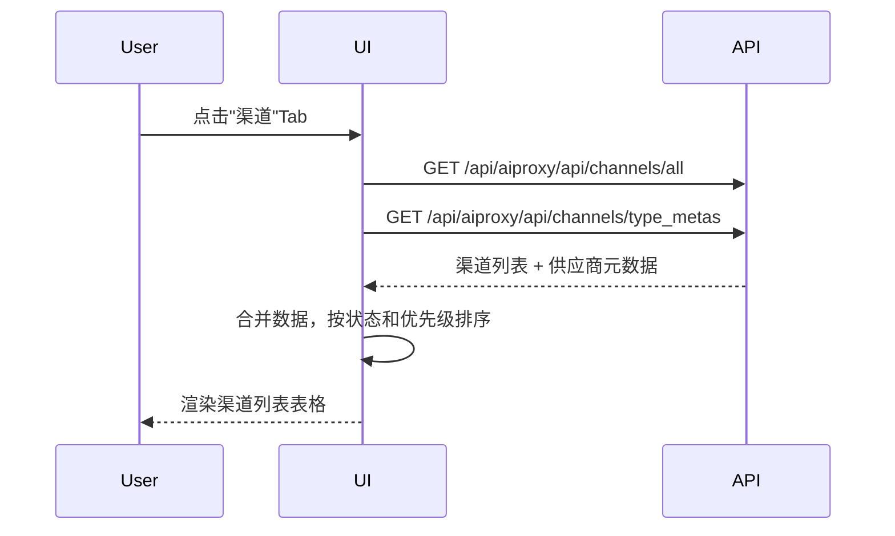
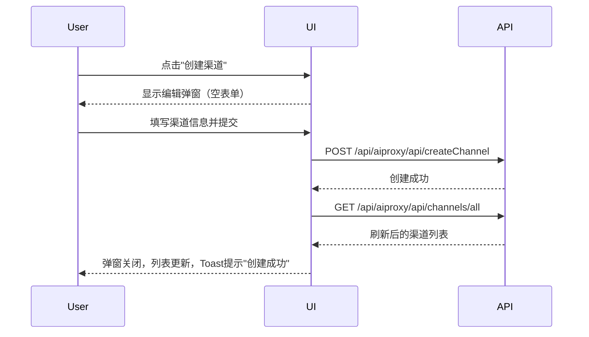
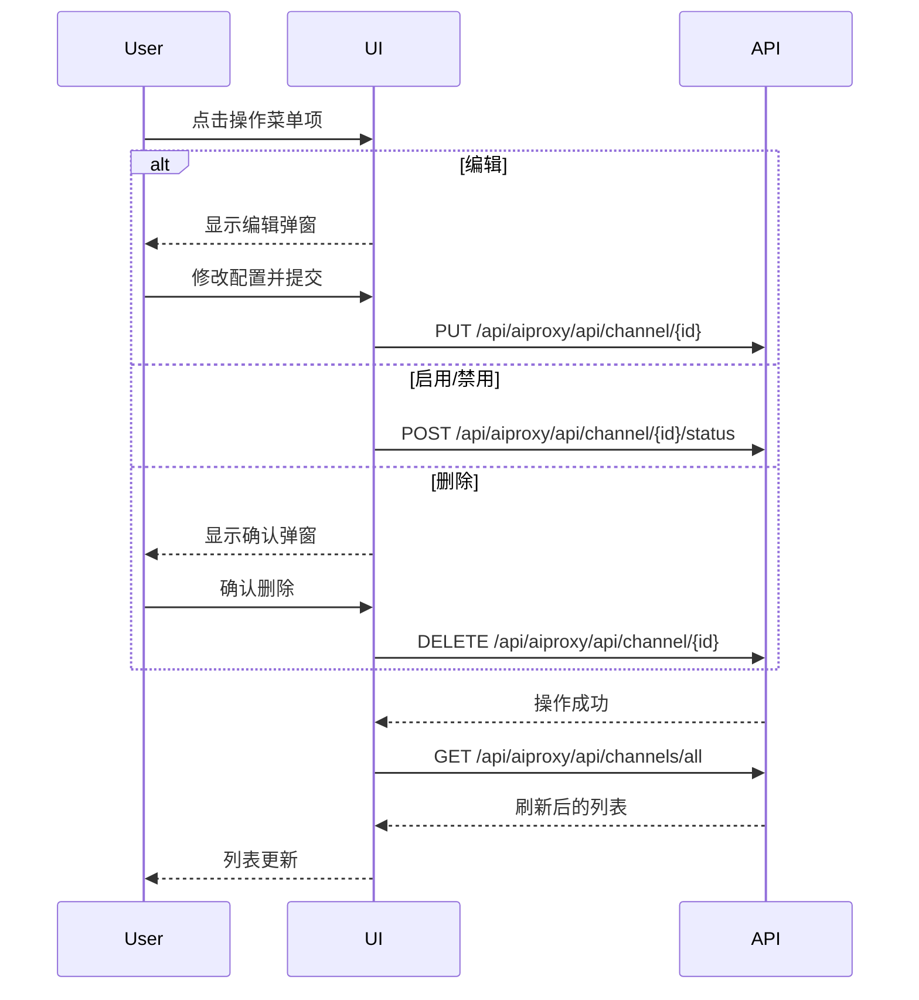
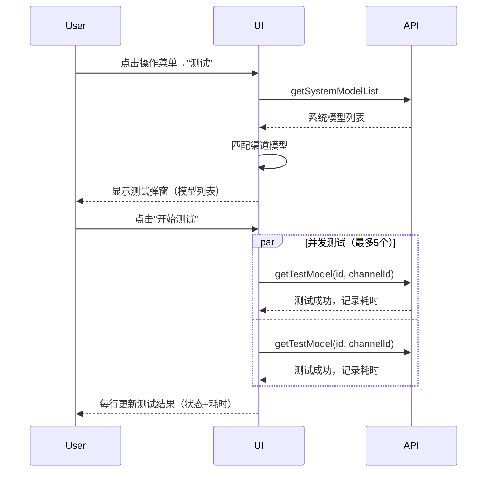
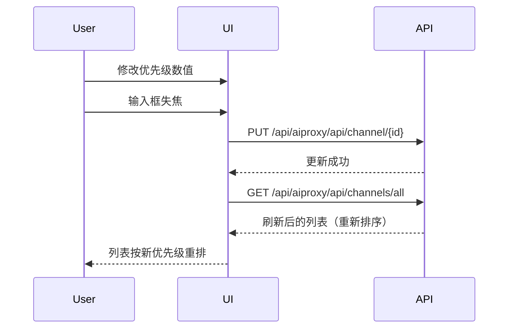

# 渠道管理 — 业务流程详解

## 页面总览

渠道管理是 AI 模型供应商渠道的集中管理页面，以表格形式展示所有已配置渠道，提供创建、编辑、启停、删除、测试和优先级调整等操作入口。页面仅对 root 超级管理员可见，且需要系统配置开启 `show_aiproxy`。

## 非 Tab 业务流程

### 查看渠道列表

> 进入渠道管理 Tab 时自动加载并展示所有已配置的 AI 供应商渠道。

#### 步骤 1：进入渠道管理页面

| 用户操作 | 触发 API | 分支条件 | 页面变化 |
|---------|---------|---------|---------|
| 在模型管理页点击"渠道"Tab | — | 用户为 root 且 feConfigs.show_aiproxy 为 true 时，渠道 Tab 才可见 | Tab 切换，渠道列表组件开始渲染 |

#### 步骤 2：加载渠道列表

| 用户操作 | 触发 API | 分支条件 | 页面变化 |
|---------|---------|---------|---------|
| 无需操作，自动触发 | `GET /api/aiproxy/api/channels/all?page=1&perPage=10` | 无 | 显示表格加载状态（MyBox isLoading），表格区域等待数据 |

#### 步骤 3：加载供应商元数据（并行）

| 用户操作 | 触发 API | 分支条件 | 页面变化 |
|---------|---------|---------|---------|
| 无需操作，与渠道列表并行加载 | `GET /api/aiproxy/api/channels/type_metas` | 无 | 无独立加载状态，与渠道列表共用同一个 loading |

#### 步骤 4：数据合并与渲染

| 用户操作 | 触发 API | 分支条件 | 页面变化 |
|---------|---------|---------|---------|
| 无需操作 | — | 渠道列表按状态排序（启用在前），同状态按优先级降序 | 表格展示渠道列表：ID、渠道名称、供应商类型（图标+名称）、状态（彩色标签）、优先级（数字输入框）、操作菜单按钮；加载状态消失 |

**数据加载详情**:

| 加载阶段 | API | 关键参数 | 数据处理 | 渲染结果 |
|---------|-----|---------|---------|---------|
| 首次加载 | GET /api/aiproxy/api/channels/all | page=1, perPage=10 | 按状态排序（启用优先），同状态按优先级降序 | 表格展示全部渠道 |
| 供应商信息 | GET /api/aiproxy/api/channels/type_metas | 无 | 与 aiproxyChannels 合并，取供应商名称和头像 | 每行展示供应商图标和名称 |

**特殊列的渲染逻辑**:
- **状态列**: 通过 `ChannelStautsMap` 映射状态枚举到颜色和文案，使用 `MyTag` 展示，borderFill 样式
- **供应商类型列**: 左侧显示供应商头像（Avatar 组件），右侧显示经过 i18n 解析的名称
- **优先级列**: 可编辑的数字输入框（MyNumberInput），范围 1-100，默认值 1，失焦时自动保存
- **操作菜单列**: MyMenu 组件，菜单项根据渠道状态动态变化（启用时显示"禁用"，禁用时显示"启用"）

### 创建渠道

> 超级管理员新增一个 AI 供应商渠道，配置供应商类型、模型、密钥等信息。

#### 步骤 1：打开发起入口

| 用户操作 | 触发 API | 分支条件 | 页面变化 |
|---------|---------|---------|---------|
| 点击"创建渠道"按钮 | — | 按钮仅 root 用户可见 | EditChannelModal 弹窗打开，表单字段为空，标题为"添加渠道" |

#### 步骤 2：选择供应商类型

| 用户操作 | 触发 API | 分支条件 | 页面变化 |
|---------|---------|---------|---------|
| 在供应商下拉框中搜索/选择 | `GET /api/aiproxy/api/channels/type_metas`（页面加载时已完成） | 下拉列表已缓存 | 选中项高亮；下方"默认URL"和"密钥类型"提示文案根据选中供应商更新 |

#### 步骤 3：选择模型

| 用户操作 | 触发 API | 分支条件 | 页面变化 |
|---------|---------|---------|---------|
| 点击模型多选下拉框 | — | 系统模型列表从 `getSystemModelList` 获取并缓存 | 下拉菜单展示可选模型列表（带供应商图标），支持搜索过滤 |
| 勾选/取消勾选模型 | — | — | 已选模型以 Tag 形式展示在输入框内，点击 Tag 可移除；可点击 Tag 复制模型 ID |

模型选择区域同时提供"添加模型"按钮（打开 ModelEditModal 创建新系统模型）和"清空模型"按钮。

#### 步骤 4：填写配置信息

| 用户操作 | 触发 API | 分支条件 | 页面变化 |
|---------|---------|---------|---------|
| 输入渠道名称 | — | 必填 | 输入框接受任意文本 |
| 输入基础 URL（可选） | — | 未填则使用供应商默认 URL | 输入框显示供应商默认 URL 作为占位提示 |
| 输入 API 密钥（可选） | — | 密码类型输入框，自动补全关闭 | 输入内容被遮蔽 |
| 编辑模型映射 JSON（可选） | — | 格式错误时静默忽略，不保存 | JsonEditor 组件展示格式化 JSON |

#### 步骤 5：提交创建

| 用户操作 | 触发 API | 分支条件 | 页面变化 |
|---------|---------|---------|---------|
| 点击"新建"按钮 | `POST /api/aiproxy/api/createChannel` | 模型列表为空时阻止提交，提示"请选择模型" | 提交按钮进入 loading 状态；成功后关闭弹窗、刷新列表、Toast 提示"创建成功"；失败则弹窗保持打开，显示错误信息 |

**表单字段清单**:

| 字段名 | 控件类型 | 必填 | 默认值 | 可选值/约束 | 编辑时只读 | 说明 |
|--------|---------|------|--------|------------|-----------|------|
| 渠道名称 (name) | 文本输入 | ✅ | — | 任意文本 | 否 | 渠道的显示名称 |
| 供应商类型 (type) | 下拉选择（可搜索） | ✅ | — | 从 type_metas API 获取的供应商列表 | 否 | 决定 API 端点和密钥格式 |
| 模型 (models) | 多选下拉 | ✅ | — | 从 getSystemModelList 获取的模型列表 | 否 | 该渠道可用的模型 ID 列表 |
| 模型映射 (model_mapping) | JSON 编辑器 | 否 | {} | 合法 JSON 对象 | 否 | 模型名称重映射配置 |
| 基础 URL (base_url) | 文本输入 | 否 | 供应商默认 URL | URL 格式 | 否 | 自定义 API 端点地址 |
| API 密钥 (key) | 密码输入 | 否 | — | — | 否 | 供应商 API 认证密钥 |

**校验规则**:

| 规则 | 触发时机 | 错误提示文案 |
|------|---------|-------------|
| 模型列表不能为空 | 提交时 | "请选择模型" |
| 渠道名称不能为空 | 提交时（react-hook-form required） | 浏览器默认必填提示 |

**前后置条件**:
- **前置条件**: 用户为 root，系统模型列表已加载
- **后置影响**: 创建成功后渠道加入列表中，相关模型可在工作流和 Agent 中选用
- **失败场景**: API 密钥无效时渠道创建成功但后续调用会失败；供应商类型不支持时后端可能拒绝

### 编辑渠道

> 修改已有渠道的配置信息。

#### 步骤 1：打开编辑弹窗

| 用户操作 | 触发 API | 分支条件 | 页面变化 |
|---------|---------|---------|---------|
| 点击操作菜单→"编辑" | — | 无 | EditChannelModal 弹窗打开，表单回填当前渠道数据，标题为"编辑渠道" |

#### 步骤 2：修改配置

| 用户操作 | 触发 API | 分支条件 | 页面变化 |
|---------|---------|---------|---------|
| 修改各字段值 | — | 与创建渠道表单相同 | 与创建渠道交互一致 |

可在编辑弹窗中通过"添加模型"按钮跳转到 ModelEditModal 编辑系统模型。

#### 步骤 3：提交更新

| 用户操作 | 触发 API | 分支条件 | 页面变化 |
|---------|---------|---------|---------|
| 点击"更新"按钮 | `PUT /api/aiproxy/api/channel/{id}` | 模型列表为空时阻止提交，提示"请选择模型" | 提交按钮 loading；成功后关闭弹窗、刷新列表、Toast 提示"更新成功" |

**前后置条件**:
- **前置条件**: 渠道已存在，数据已加载
- **后置影响**: 渠道配置更新后立即生效，影响后续 API 调用
- **失败场景**: 网络异常时弹窗保持打开，显示错误信息

### 启用渠道

> 将已禁用的渠道恢复为启用状态。

#### 步骤 1：触发启用

| 用户操作 | 触发 API | 分支条件 | 页面变化 |
|---------|---------|---------|---------|
| 点击操作菜单→"启用" | — | 该菜单项仅在渠道状态为"已禁用"时显示 | 无即时变化，等待 API 响应 |

#### 步骤 2：状态更新

| 用户操作 | 触发 API | 分支条件 | 页面变化 |
|---------|---------|---------|---------|
| 无需额外操作 | `POST /api/aiproxy/api/channel/{id}/status` {status: ChannelStatusEnabled} | 无 | 列表刷新，渠道状态标签变为"已启用"（绿色） |

**状态转换详情**:
- **状态转换**: 已禁用 → 点击启用 → 已启用
- **前置检查**: 无引用检查，直接执行
- **确认提示**: 无确认弹窗，直接执行
- **级联更新**: 操作成功后自动刷新渠道列表

### 禁用渠道

> 将已启用的渠道设为禁用状态。

#### 步骤 1：触发禁用

| 用户操作 | 触发 API | 分支条件 | 页面变化 |
|---------|---------|---------|---------|
| 点击操作菜单→"禁用" | — | 该菜单项仅在渠道状态为"已启用"时显示 | 无即时变化 |

#### 步骤 2：状态更新

| 用户操作 | 触发 API | 分支条件 | 页面变化 |
|---------|---------|---------|---------|
| 无需额外操作 | `POST /api/aiproxy/api/channel/{id}/status` {status: ChannelStatusDisabled} | 无 | 列表刷新，渠道状态标签变为"已禁用" |

**状态转换详情**:
- **状态转换**: 已启用 → 点击禁用 → 已禁用
- **前置检查**: 无引用检查，直接执行
- **确认提示**: 无确认弹窗，直接执行
- **级联更新**: 操作成功后自动刷新渠道列表

### 删除渠道

> 从系统中永久移除一个渠道。

#### 步骤 1：触发删除确认

| 用户操作 | 触发 API | 分支条件 | 页面变化 |
|---------|---------|---------|---------|
| 点击操作菜单→"删除" | — | 无 | 弹出确认弹窗（ConfirmModal），提示"确认删除渠道 {name}？" |

**确认弹窗详情**:
- 弹窗类型：危险操作确认弹窗（type: 'delete'）
- 提示文案：`确认删除渠道 {渠道名称}？`
- 按钮：取消 / 确认删除

#### 步骤 2：确认删除

| 用户操作 | 触发 API | 分支条件 | 页面变化 |
|---------|---------|---------|---------|
| 点击"确认删除" | `DELETE /api/aiproxy/api/channel/{id}` | 无 | 确认弹窗关闭，列表刷新，该渠道从表格中移除 |

**前后置条件**:
- **前置条件**: 渠道已存在
- **后置影响**: 渠道被永久删除，关联模型不可再通过此渠道调用
- **失败场景**: 后端删除失败时显示错误信息，渠道保留在列表中
- **级联影响**: 删除后该渠道关联的模型在工作流中将不可用

### 测试模型

> 对渠道下关联的模型进行连通性测试。

#### 步骤 1：打开测试弹窗

| 用户操作 | 触发 API | 分支条件 | 页面变化 |
|---------|---------|---------|---------|
| 点击操作菜单→"测试" | `GET /api/aiproxy/api`（getSystemModelList，弹窗内自动触发） | 无 | ModelTest 弹窗打开，加载系统模型列表以匹配渠道模型 |

#### 步骤 2：加载模型匹配

| 用户操作 | 触发 API | 分支条件 | 页面变化 |
|---------|---------|---------|---------|
| 无需操作 | `GET`（getSystemModelList） | 无 | 弹窗显示加载状态；加载完成后表格展示匹配到的模型列表，每行包含模型名称、ID、供应商模型名、状态（等待测试） |

模型匹配逻辑：遍历渠道的 model 列表，在系统模型列表中查找 model 字段匹配的模型定义，同时获取对应的供应商信息（图标和名称）。

#### 步骤 3：执行测试

| 用户操作 | 触发 API | 分支条件 | 页面变化 |
|---------|---------|---------|---------|
| 点击"开始测试（N）"按钮 | 对每个模型调用测试 API（最多 5 个并发） | 无 | 按钮进入 loading 状态；每个模型行状态依次变化：等待测试→测试中（蓝色标签）→成功（绿色标签，显示耗时）/失败（红色标签，显示错误信息） |

**测试流程详情**:
1. 所有模型行同时进入 loading 状态
2. 使用 batchRun 以 5 个并发执行测试
3. 每个模型测试：标记为"running" → 调用 getTestModel({id, channelId}) → 记录耗时 → 标记为"success"（显示耗时秒数）或"error"（显示错误信息）
4. 若全部成功，无额外提示；若有失败，Toast 提示"有 N 个模型测试失败"

#### 步骤 4：单项重测

| 用户操作 | 触发 API | 分支条件 | 页面变化 |
|---------|---------|---------|---------|
| 点击某模型行的发送按钮 | 单独调用该模型的测试 API | 非全部测试中或该行正在 loading 时可点击 | 该行重新执行测试流程，其他行不受影响 |

**数据加载详情**:

| 加载阶段 | API | 关键参数 | 数据处理 | 渲染结果 |
|---------|-----|---------|---------|---------|
| 初次加载 | getSystemModelList | 无 | 按 model 字段匹配渠道 models | 匹配到的模型列表展示在表格中 |
| 批量测试 | getTestModel（并行，最多5个） | id: 模型系统ID, channelId: 渠道ID | 记录耗时和响应状态 | 每行显示测试结果和耗时 |
| 单项测试 | getTestModel | id: 模型系统ID, channelId: 渠道ID | 同上 | 仅该行更新 |

### 调整渠道优先级

> 通过数字输入框调整渠道的优先级数值。

#### 步骤 1：修改优先级

| 用户操作 | 触发 API | 分支条件 | 页面变化 |
|---------|---------|---------|---------|
| 点击优先级输入框，修改数值 | — | 无 | 输入框获得焦点，可编辑 |

#### 步骤 2：保存优先级

| 用户操作 | 触发 API | 分支条件 | 页面变化 |
|---------|---------|---------|---------|
| 输入框失焦 | `PUT /api/aiproxy/api/channel/{id}`（带完整渠道数据 + 新 priority 值） | 值为空时默认设为 1；值被限制在 1-100 范围内 | 列表刷新，渠道按新优先级重新排序 |

**校验规则**:

| 规则 | 触发时机 | 错误提示文案 |
|------|---------|-------------|
| 最小值 1 | 失焦/输入时 | 组件自动限制 |
| 最大值 100 | 失焦/输入时 | 组件自动限制 |
| 空值处理 | 失焦 | 默认设为 1 |

## Mermaid 附录

### 渠道列表加载流程

### 创建渠道流程

### 编辑/删除/启停渠道流程

### 模型测试流程

### 优先级调整流程

