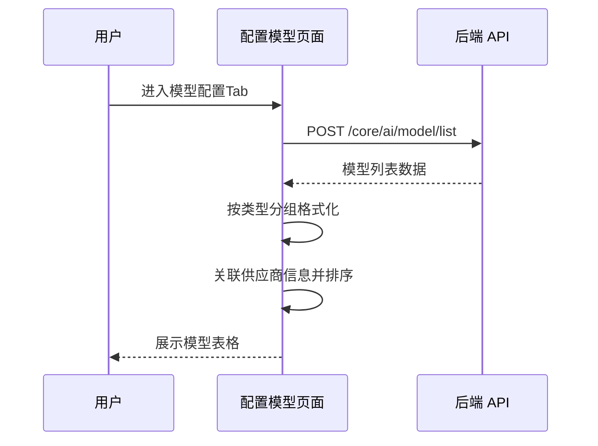
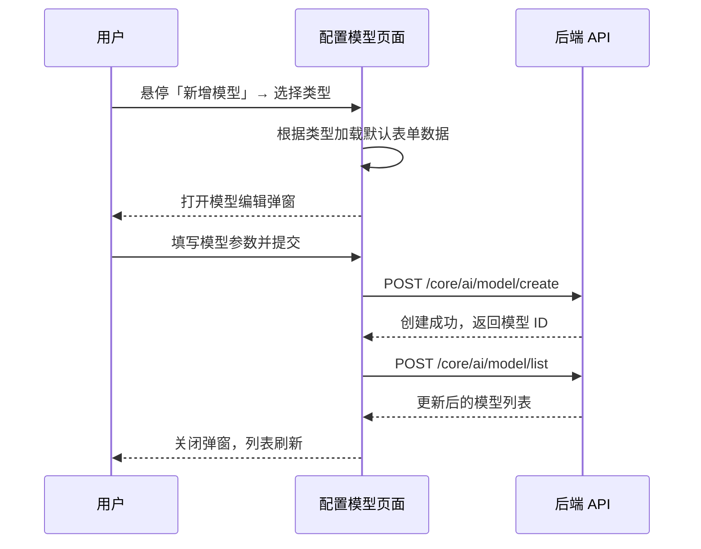
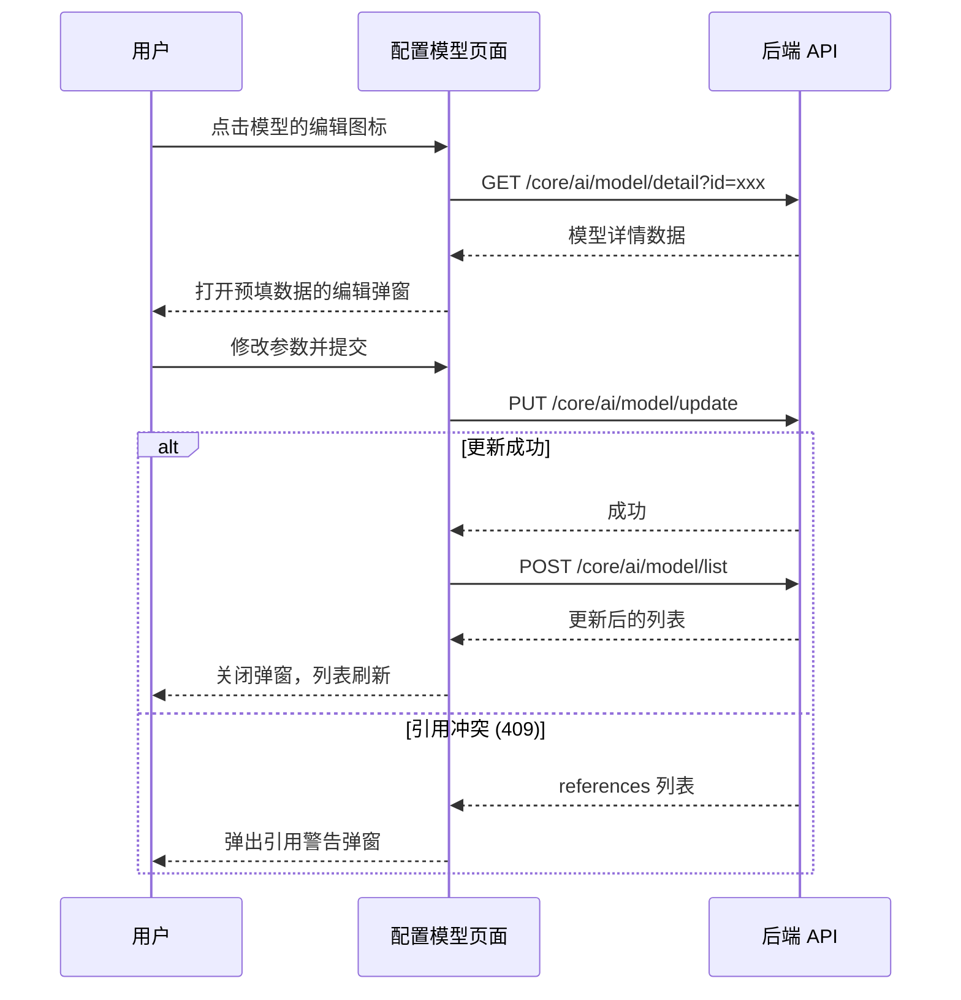
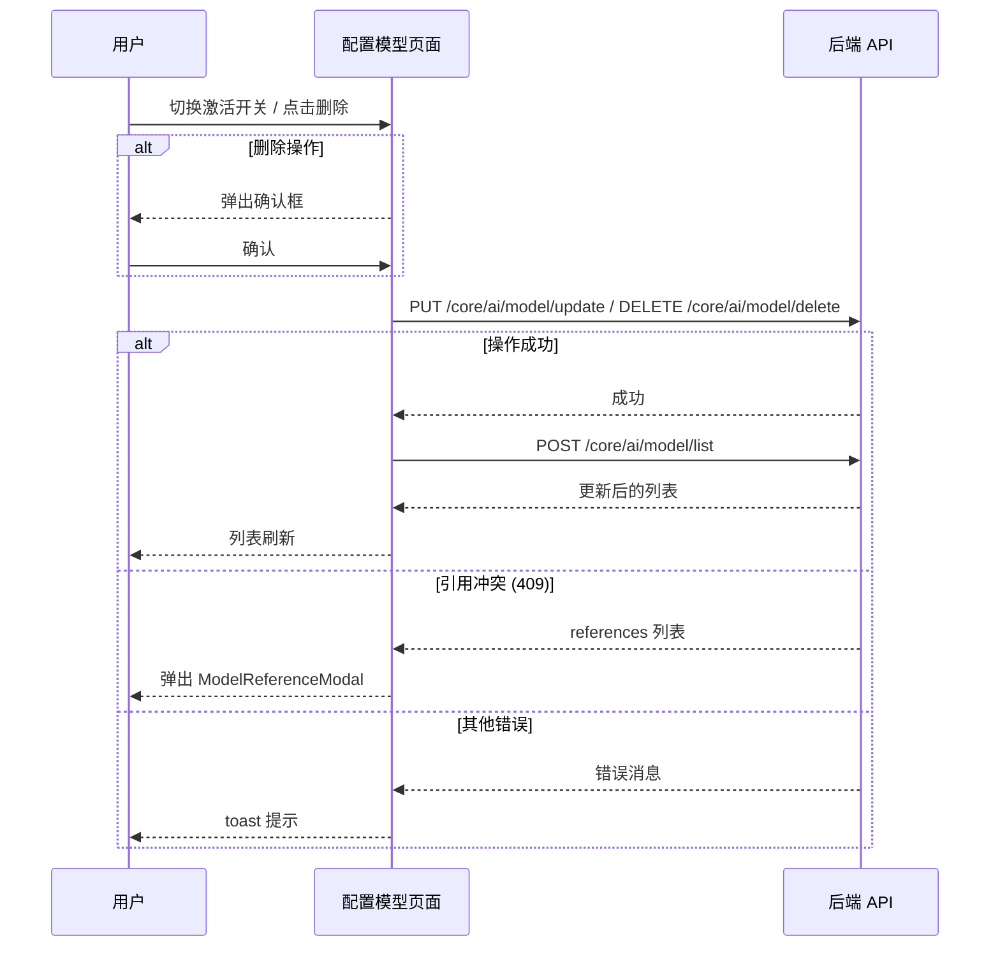
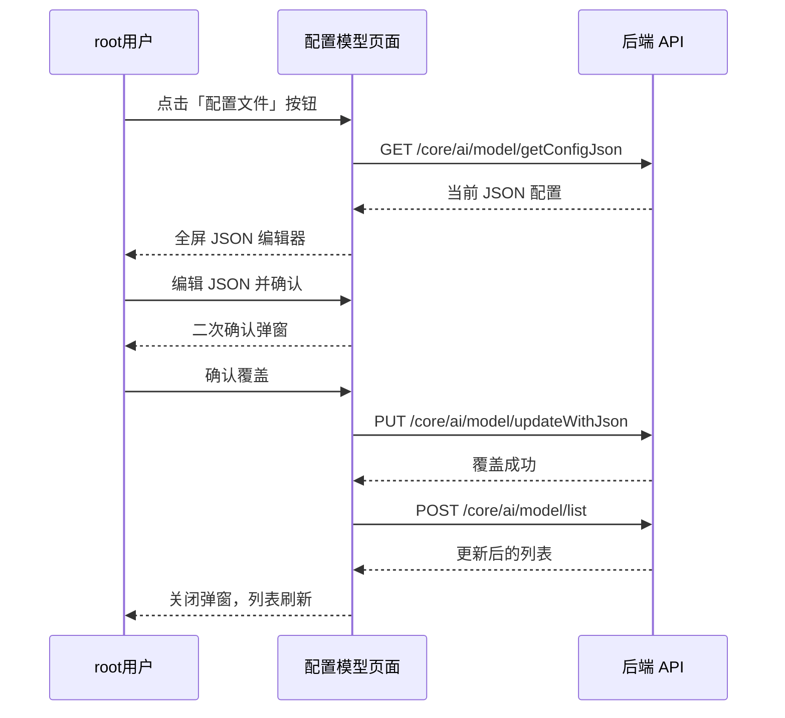

# 配置模型 — 业务流程详解

## 页面总览

配置模型 Tab 是系统模型管理的核心配置界面，用户在此完成模型的查看、筛选、创建、编辑、测试、权限分配和删除等全生命周期管理操作。页面顶部为筛选工具栏，下方为模型数据表格。

---

### S01：查看模型列表

> 进入「配置模型」Tab 后自动加载模型列表。

#### 步骤 1：进入配置模型 Tab

| 用户操作 | 触发 API | 分支条件 | 页面变化 |
|---------|---------|---------|---------|
| 在模型管理页面点击「模型配置」Tab | 无（Tab 切换为客户端路由） | — | Tab 切换为「模型配置」，加载配置模型组件 |

#### 步骤 2：加载模型列表数据

| 用户操作 | 触发 API | 分支条件 | 页面变化 |
|---------|---------|---------|---------|
| 组件挂载后自动加载 | `POST /api/core/ai/model/list`（无参数） | — | 显示 MyBox 加载遮罩；API 返回后将模型列表按类型（LLM、Embedding、TTS、STT、Rerank）分别格式化处理 |

**数据加载详情**：

| 加载阶段 | API | 关键参数 | 数据处理 | 渲染结果 |
|---------|-----|---------|---------|---------|
| 首次加载 | POST /core/ai/model/list | 无 | 按模型类型分组：LLM→蓝色标签"对话"、Embedding→黄色标签"索引"、TTS→绿色标签"语音合成"、STT→紫色标签"语音识别"、Rerank→adora色标签"重排序"；关联供应商头像和名称；按供应商 order 排序 | 表格展示所有模型 |

#### 步骤 3：批量刷新

| 用户操作 | 触发 API | 分支条件 | 页面变化 |
|---------|---------|---------|---------|
| 创建/编辑/删除/启用禁用操作成功后自动触发 | `POST /api/core/ai/model/list`；同时调用 `clientInitData()` 刷新全局初始化数据 | — | 静默刷新列表，不显示全屏遮罩；表格数据更新 |

**排序规则**：模型按供应商 `order` 字段升序排列。
**筛选条件**：支持供应商、模型类型、名称搜索、激活状态四维筛选，在前端 based on 已加载数据本地过滤。

---

### S02：筛选与搜索模型

> 用户通过四种筛选维度快速定位模型。

#### 步骤 1：按供应商筛选

| 用户操作 | 触发 API | 分支条件 | 页面变化 |
|---------|---------|---------|---------|
| 在供应商下拉框选择一个供应商 | 无（纯前端过滤） | 供应商列表仅显示当前模型列表中实际存在的供应商；选择"全部供应商"时不过滤 | 表格仅显示所选供应商的模型 |

#### 步骤 2：按名称搜索

| 用户操作 | 触发 API | 分支条件 | 页面变化 |
|---------|---------|---------|---------|
| 在搜索框中输入模型名称关键字 | 无（纯前端过滤） | 使用正则表达式 `new RegExp(search, 'i')` 进行不区分大小写的名称匹配 | 表格实时过滤为匹配的模型行 |

#### 步骤 3：按模型类型筛选

| 用户操作 | 触发 API | 分支条件 | 页面变化 |
|---------|---------|---------|---------|
| 点击表头「模型类型」列的筛选图标，选择类型 | 无（纯前端过滤） | 可选类型：全部、对话(LLM)、索引(Embedding)、语音合成(TTS)、语音识别(STT)、重排序(Rerank) | 表格仅显示所选类型的模型 |

#### 步骤 4：按激活状态筛选

| 用户操作 | 触发 API | 分支条件 | 页面变化 |
|---------|---------|---------|---------|
| 点击表头「激活(N)」列的筛选图标，选择状态 | 无（纯前端过滤） | 可选状态：全部、已启用、已禁用；N 为当前筛选结果中的激活数量 | 表格仅显示所选状态的模型 |

---

### S03：创建模型

> 管理员从「新增模型」按钮创建新的自定义模型。

#### 步骤 1：打开创建窗口

| 用户操作 | 触发 API | 分支条件 | 页面变化 |
|---------|---------|---------|---------|
| 鼠标悬停「新增模型」按钮 → 下拉菜单展开 → 选择模型类型 | 无 | 仅当用户为 root 或拥有 `hasModelCreatePer` 权限时按钮可用；可选类型：对话、索引、重排序、语音合成、语音识别 | 下拉菜单展示五种模型类型；点击后弹出模型编辑窗口 |

> **前置条件**：用户认证通过，拥有模型创建权限。

#### 步骤 2：填写模型信息并提交

| 用户操作 | 触发 API | 分支条件 | 页面变化 |
|---------|---------|---------|---------|
| 在编辑弹窗中填写模型参数（名称、ID、供应商、价格、上下文长度等），点击确认 | `POST /api/core/ai/model/create`（提交 `CreateModelBody`，类型为 discriminated union，按模型类型提交对应字段） | 表单校验通过后提交；创建失败时显示错误提示 | 提交时弹窗内按钮显示加载状态；成功后弹窗关闭，模型列表自动刷新 |

**表单字段清单**（基于源码 `AddModelBox.tsx` 和 API Schema）：

| 字段名 | 控件类型 | 必填 | 默认值 | 可选值/约束 | 编辑时只读 | 说明 |
|--------|---------|------|--------|------------|-----------|------|
| 模型名称 | 文本输入 | ✅ | — | 任意字符串 | ✗ | 用户可见的模型名称 |
| 模型 ID | 文本输入 | ✅ | — | 字符串，实际的模型标识值 | ✗ | 与供应商 API 的 model 值对应 |
| 供应商 | 下拉选择 | ✅ | — | 系统中已配置的模型供应商 | ✗ | 确定模型请求的路由 |
| 输入价格 | 数字输入 | ✗ | 0 | 非负数 | ✗ | 每 1K Token 的价格 |
| 输出价格 | 数字输入 | ✗ | 0 | 非负数 | ✗ | 每 1K Token 的价格 |
| 阶梯价格 | 动态表格 | ✗ | 默认空 | 多级阶梯价格配置 | ✗ | 支持按 token 范围设定不同的单价 |
| 最大上下文 | 数字输入 | ✗ | 默认值 | 正整数 | ✗ | 模型支持的最大上下文 Token 数 |
| 最大响应 | 数字输入 | ✗ | 默认值 | 正整数 | ✗ | 单次最大输出 Token 数 |
| 请求地址 | 文本输入 | ✗ | 供应商默认地址 | 有效的 URL | ✗ | 自定义 API 端点 |
| 请求密钥 | 密码输入 | ✗ | 供应商默认密钥 | 字符串 | ✗ | API 认证密钥 |

**校验规则**：

| 规则 | 触发时机 | 错误提示文案 |
|------|---------|-------------|
| 模型名称非空校验 | 提交时 | 前端表单校验，必填字段为空时阻止提交 |
| 模型 ID 非空校验 | 提交时 | 同上 |
| 数值字段范围校验 | 提交时 | 价格等字段不能为负数 |

**后置影响**：创建成功后，模型被加入系统模型列表，可在「可用模型」Tab 中看到，成员可向模型发送请求。

---

### S04：编辑模型

> 管理员修改已有模型的配置参数。

#### 步骤 1：打开编辑窗口

| 用户操作 | 触发 API | 分支条件 | 页面变化 |
|---------|---------|---------|---------|
| 点击模型行操作列的「设置」图标 | `GET /api/core/ai/model/detail?id={modelId}` | 仅当 `item.permission.hasManagePer` 为 true 时编辑按钮可见 | 发起 API 请求获取模型详情；MyBox 显示加载状态；API 返回后弹出预填数据的编辑窗口 |

#### 步骤 2：修改并保存

| 用户操作 | 触发 API | 分支条件 | 页面变化 |
|---------|---------|---------|---------|
| 修改模型参数，点击确认保存 | `PUT /api/core/ai/model/update`（提交 `UpdateModelBody`，含模型 ID和需更新的字段） | 仅对有管理权限的字段可编辑；root 用户可编辑更多字段 | 提交时显示加载状态；成功后弹窗关闭，列表自动刷新 |

**失败场景**：
- 模型被引用冲突（HTTP 409）：弹出 `ModelReferenceModal` 显示引用该模型的资源列表，阻止操作
- 其他错误（HTTP 409 + message）：toast 提示错误信息

---

### S05：启用/禁用模型

> 通过开关控制模型的可用状态。

#### 步骤 1：切换开关

| 用户操作 | 触发 API | 分支条件 | 页面变化 |
|---------|---------|---------|---------|
| 点击模型行的激活开关 | `PUT /api/core/ai/model/update`（`{id, isActive: true/false}`） | 仅当 `item.permission.hasManagePer` 为 true 时开关可操作，否则禁用；开关当前值与目标值相同时不触发 | Switch 组件切换动画；请求发送期间开关不响应（通过 loading 状态控制） |

**状态转换**：启用状态 → 切换开关 → 禁用状态（反之亦然）

**前置检查**：无前端前置校验，后端可能检查模型引用

**级联更新**：状态变更成功后自动刷新模型列表和 `clientInitData()`

**失败处理**：
- HTTP 409 + references：弹出 `ModelReferenceModal` 显示引用该模型的资源
- HTTP 409 + message：toast 显示错误信息

---

### S06：测试模型

> 验证模型的连通性和响应能力。

#### 步骤 1：发起测试

| 用户操作 | 触发 API | 分支条件 | 页面变化 |
|---------|---------|---------|---------|
| 点击模型行的「发送」测试图标 | `GET /api/core/ai/model/test?id={modelId}` | 所有用户均可操作（无权限限制） | 按钮显示加载状态；测试成功后 toast 显示「成功」提示 |

**失败场景**：测试失败时显示错误 toast。

---

### S07：管理模型权限

> 为模型分配协作者和设置权限角色。

#### 步骤 1：打开权限管理

| 用户操作 | 触发 API | 分支条件 | 页面变化 |
|---------|---------|---------|---------|
| 点击模型行操作列的「钥匙」权限图标 | 加载协作者列表：调用 `getModelCollaborators(modelId)` | 仅当 `item.permission.hasManagePer` 为 true 时权限按钮可见 | 打开协作者管理弹窗，显示当前模型的协作者列表 |

#### 步骤 2：修改协作者

| 用户操作 | 触发 API | 分支条件 | 页面变化 |
|---------|---------|---------|---------|
| 添加/删除协作者，调整角色，点击确认 | `updateModelCollaborators({collaborators, modelIds: [modelId]})` | 如果模型当前为公开状态（`isShared === true`），添加协作者时会提示"当前为公开状态，添加协作者后，将自动切换为私有状态" | 提交时弹窗显示加载状态；成功后权限更新，协作者列表刷新 |

**失败处理**：
- HTTP 409 + references：弹出 `ModelReferenceModal`
- HTTP 409 + message：toast 错误提示
- 其他错误：抛出异常，弹窗保持打开

---

### S08：删除模型

> 删除自定义模型，包含引用检查和确认机制。

#### 步骤 1：点击删除

| 用户操作 | 触发 API | 分支条件 | 页面变化 |
|---------|---------|---------|---------|
| 点击模型行操作列的「删除」图标 | 无（先弹出确认框） | 仅自定义模型（`isCustom === true`）且拥有 `hasManagePer` 权限时删除按钮可见；系统模型不可删除 | `PopoverConfirm` 弹出确认框，提示「确认删除该模型？」 |

#### 步骤 2：确认删除

| 用户操作 | 触发 API | 分支条件 | 页面变化 |
|---------|---------|---------|---------|
| 在确认弹窗中点击确认 | `DELETE /api/core/ai/model/delete`（`{id: modelId}`） | — | 确认按钮显示加载状态；删除成功后列表自动刷新 |

**引用检查**：删除 API 返回 HTTP 409 且含 `references` 时，弹出 `ModelReferenceModal` 显示引用该模型的资源列表（应用、知识库等），用户需先移除引用才能删除。

**确认弹窗**：
- 弹窗类型：删除确认
- 提示文案：「确认删除该模型？」
- 按钮：确认 / 取消

**级联影响**：删除后，使用该模型的应用和知识库将无法正常工作。

---

### S09：JSON 配置文件管理

> root 用户通过 JSON 全量管理模型配置。

#### 步骤 1：打开 JSON 编辑器

| 用户操作 | 触发 API | 分支条件 | 页面变化 |
|---------|---------|---------|---------|
| 点击「配置文件」按钮 | `GET /api/core/ai/model/getConfigJson` | **仅 root 用户可见此按钮** | 全屏弹窗打开，加载当前 JSON 配置到 JsonEditor 组件 |

#### 步骤 2：编辑与提交

| 用户操作 | 触发 API | 分支条件 | 页面变化 |
|---------|---------|---------|---------|
| 在 JsonEditor 中编辑配置 JSON，点击确认 | `PUT /api/core/ai/model/updateWithJson`（`{config: jsonString}`） | 确认前弹出二次确认框，提示"确认使用该配置进行覆盖？"；提示信息说明会全量覆盖当前配置，建议先备份 | JsonEditor 支持语法高亮和调整大小；提交成功后弹窗关闭，模型列表刷新 |

**提示文案**：「通过配置文件配置模型，点击确认后，会使用输入的配置进行全量覆盖，请确保配置文件输入正确。建议操作前，复制当前配置文件进行备份。」

---

### Mermaid 附录

#### S01：查看模型列表

#### S03：创建模型

#### S04：编辑模型

#### S05：启用/禁用模型 & S08：删除模型

#### S09：JSON 配置文件管理

