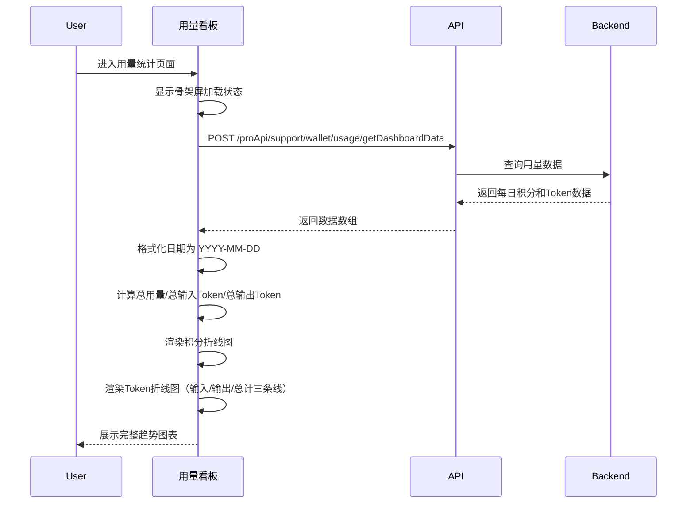
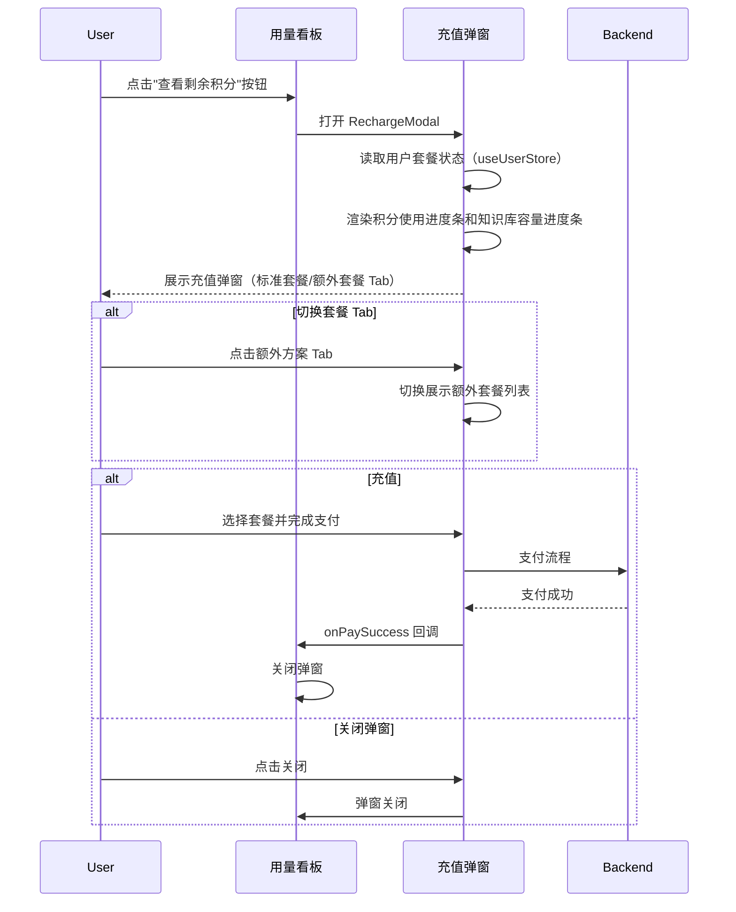
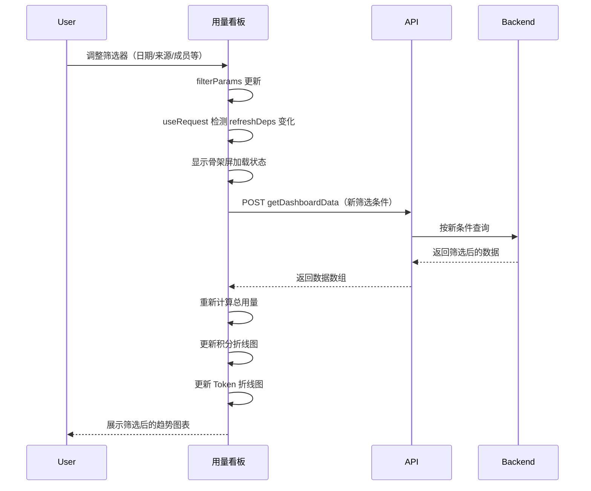

# 用量看板 — 业务流程详解

## 页面总览

用量看板是 AI 资源消耗的可视化分析页面。用户进入页面后，系统自动加载最近 7 天的用量数据，以两张折线图分别展示积分消耗趋势和 Token（输入/输出）消耗趋势。用户可通过顶部的日期选择器、来源筛选器和成员筛选器调整数据范围。页面右上角的"查看剩余积分"按钮可打开充值弹窗。

---

### 查看用量趋势

> 用户进入用量看板，系统自动加载并展示积分消耗和 Token 消耗的趋势图表。

#### 步骤 1：页面加载与数据请求

| 用户操作 | 触发 API | 分支条件 | 页面变化 |
|---------|---------|---------|---------|
| 进入账户→用量统计页面，默认激活"看板"Tab | `POST /proApi/support/wallet/usage/getDashboardData`（自动触发） | — | 图表区域显示骨架屏加载状态（Skeleton 组件），总用量文字显示占位内容 |

**API 请求参数**:
- `dateStart`: 默认最近 7 天的起始日期（如 `2026-06-11T00:00:00+08:00`）
- `dateEnd`: 当天 +1 天的起始时间（如 `2026-06-19T00:00:00+08:00`）
- `sources`: 默认全选时为 `undefined`（查全部来源）
- `memberFilter`: 默认全选成员时 `undefined`（团队成员看到自身数据，管理员看到全团队）
- `unit`: 默认 `'day'`

API 返回后，数据处理：将 API 返回的日期字段格式化为 `YYYY-MM-DD` 格式。

**数据加载详情**:

| 加载阶段 | API | 关键参数 | 数据处理 | 渲染结果 |
|---------|-----|---------|---------|---------|
| 首次加载 | POST /proApi/support/wallet/usage/getDashboardData | dateStart/dateEnd，sources 和 memberFilter 默认全选 | 日期格式化为 YYYY-MM-DD | 积分折线图 + Token 折线图 |
| 筛选器变化时刷新 | 同上 | 新的筛选条件 | 同首次加载 | 图表重新渲染 |

#### 步骤 2：积分趋势图渲染

| 用户操作 | 触发 API | 分支条件 | 页面变化 |
|---------|---------|---------|---------|
| 等待数据加载完成 | — | 数据加载成功 | 骨架屏消失，总用量数字显示（"总用量: X积分, XTokens"），积分折线图（LineChart）展示每日积分消耗趋势 |

**积分折线图详情**:
- 横轴：日期（YYYY-MM-DD）
- 纵轴：积分数值
- 折线：蓝色 `#5E8FFF`，仅 totalPoints 数据线
- 鼠标悬停：显示日期和当日积分值的 Tooltip
- Y 轴无轴线，X 轴无刻度线
- 图表高度 424px

#### 步骤 3：Token 趋势图渲染

| 用户操作 | 触发 API | 分支条件 | 页面变化 |
|---------|---------|---------|---------|
| 滚动页面至 Token 图区域 | — | 数据加载成功 | Token 折线图展示输入 Token（绿色 `#38A169`）、输出 Token（黄棕色 `#D69E2E`）、总 Token（蓝色 `#5E8FFF`）三条折线 |

**Token 折线图详情**:
- 横轴：日期
- 纵轴：Token 数值，大数值自动格式化为 K/M 单位
- 鼠标悬停 Tooltip：显示日期、总 Token、输入 Token、输出 Token 四个维度
- 图表高度 300px

#### 步骤 4：加载失败处理

| 用户操作 | 触发 API | 分支条件 | 页面变化 |
|---------|---------|---------|---------|
| 等待数据加载 | — | recharts 库动态加载失败 | 骨架屏消失，错误提示区域（红色背景）展示错误信息："图表库加载失败" |

| 用户操作 | 触发 API | 分支条件 | 页面变化 |
|---------|---------|---------|---------|
| 等待数据加载 | — | API 返回错误 | 图表区域显示错误信息："图表加载失败" |

### Mermaid 附录

---

### 查看剩余积分与充值

> 用户点击"查看剩余积分"按钮，打开充值弹窗。

#### 步骤 1：打开充值弹窗

| 用户操作 | 触发 API | 分支条件 | 页面变化 |
|---------|---------|---------|---------|
| 点击右上角"查看剩余积分"按钮 | —（弹窗组件内部通过 useUserStore 读取已缓存数据） | — | 弹出充值弹窗（MyModal），展示当前套餐名、积分使用进度条、知识库容量使用进度条 |

#### 步骤 2：查看套餐详情

| 用户操作 | 触发 API | 分支条件 | 页面变化 |
|---------|---------|---------|---------|
| 查看标准套餐 Tab（默认激活） | — | 弹窗默认显示"订阅方案"Tab | 展示标准套餐列表（StandardPlan 组件），可查看各等级套餐详情 |
| 点击"额外方案"Tab | — | 用户切换 Tab | 展示额外套餐列表（ExtraPlan 组件） |

**积分使用进度条详情**:
- 展示已用积分 / 总积分（或"无限制"）
- 使用率 < 50%：蓝色进度条
- 使用率 50%~80%：黄色进度条
- 使用率 > 80%：红色进度条

#### 步骤 3：关闭弹窗

| 用户操作 | 触发 API | 分支条件 | 页面变化 |
|---------|---------|---------|---------|
| 点击弹窗关闭按钮 / 点击遮罩 | — | — | 弹窗关闭，回到看板页面 |
| 点击"使用记录"按钮 | — | — | 弹窗关闭，跳转至 /account/usage 使用记录，触发父页面刷新 |
| 完成充值支付 | —（支付流程在充值组件内部处理） | 支付成功 | 弹窗关闭（onPaySuccess 回调触发 onClose） |

### Mermaid 附录

---

### 切换筛选条件查看趋势

> 用户调整筛选器，看板图表自动按新条件重新加载数据。

#### 步骤 1：切换筛选器

| 用户操作 | 触发 API | 分支条件 | 页面变化 |
|---------|---------|---------|---------|
| 调整日期范围（日期选择器） | `POST /proApi/support/wallet/usage/getDashboardData`（filterParams 变化自动触发刷新） | 日期变化 | 图表区域重新显示骨架屏，按新日期范围重新请求数据，加载完成后更新图表 |
| 切换用量来源（MultipleSelect） | 同上 | 来源变化 | 同上，按选中的来源过滤 |
| 切换成员筛选（管理员） | 同上 | 成员变化，且当前用户 `hasManagePer = true` | 同上，按选中成员过滤 |
| 切换部门筛选（管理员） | 同上 | 部门变化，且 `hasManagePer = true` | 同上，按选中部门过滤 |
| 切换群组筛选（管理员） | 同上 | 群组变化，且 `hasManagePer = true` | 同上，按选中群组过滤 |
| 切换统计单位（day/month） | 同上 | 单位变化 | 同上，按天/按月聚合 |

#### 步骤 2：数据自动刷新

| 用户操作 | 触发 API | 分支条件 | 页面变化 |
|---------|---------|---------|---------|
| 无需手动操作 | POST /proApi/support/wallet/usage/getDashboardData | filterParams 引用变化（通过 useRequest 的 refreshDeps 自动监听） | 图表数据自动更新，总用量数字同步更新 |

**筛选器角色差异**:
- 成员/部门/群组筛选器仅在 `hasManagePer = true`（团队管理员）时可见
- 日期范围筛选器对所有角色可见
- 用量来源筛选器对所有角色可见

### Mermaid 附录

