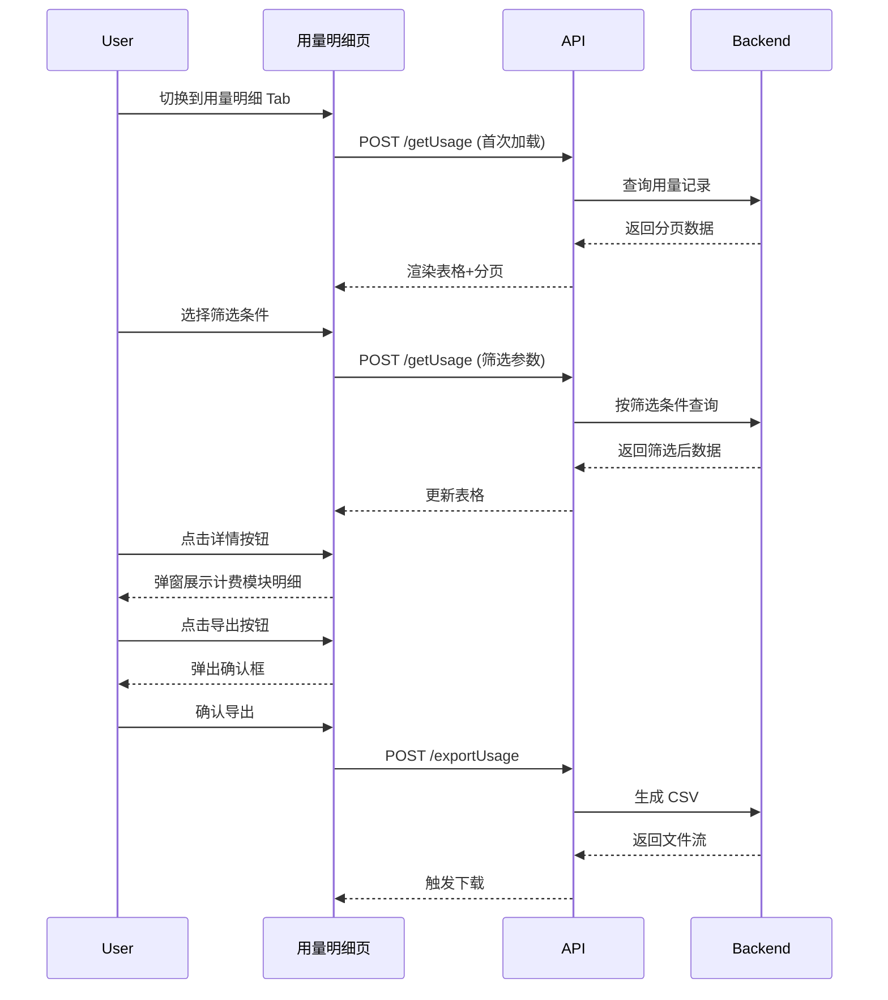

# detail — 业务流程详解

## 页面总览

用量明细页面提供一个可分页的用量记录数据表格，按时间倒序展示每条用量消耗。用户可通过筛选器缩小数据范围，查看每条记录的具体计费模块明细，或导出当前视图的数据为 CSV 文件。页面顶部包含 Tab 切换器和「查询剩余积分」入口，由父页面统一提供。

## 非 Tab 业务流程

### 用量记录列表加载

#### 步骤 1：进入用量明细 Tab

| 用户操作 | 触发 API | 分支条件 | 页面变化 |
|---------|---------|---------|---------|
| 在用量统计页面点击「用量明细」Tab 切换 | 无（Tab 切换后组件渲染触发数据请求） | 路由 query 中 usageTab 值为 "detail" 时渲染 UsageTableList 组件 | Tab 切换为「用量明细」高亮状态，页面切换为列表视图 |

#### 步骤 2：首次加载用量列表

| 用户操作 | 触发 API | 分支条件 | 页面变化 |
|---------|---------|---------|---------|
| 进入页面（组件挂载）后自动触发请求 | `POST /proApi/support/wallet/usage/getUsage`（串行，首次请求），参数：`dateStart`、`dateEnd`、`sources`（来源筛选数组，全选时为 undefined）、`memberFilter`（成员筛选对象，全选时为 undefined）、`projectName`、分页参数 `pageSize=20` | 无（首次加载必然执行）| 表格区域显示加载遮罩（`MyBox isLoading`），加载完成后渲染用量记录表格，底部显示分页控件 |

#### 步骤 3：表格数据展示

| 用户操作 | 触发 API | 分支条件 | 页面变化 |
|---------|---------|---------|---------|
| （加载完成后自动渲染） | 无 | 数据量 > 0 时渲染表格行；数据量为 0 时显示空状态提示「暂无用量记录」 | 表格显示以下列：时间（YYYY/MM/DD HH:mm:ss 格式）、成员（头像+名称）、来源（通过 UsageSourceMap 映射为中文）、项目名称、积分消耗、Token 总数（输入+输出）、输入 Token、输出 Token、操作（「详情」按钮）。每行数据根据 source 字段映射显示对应的中文来源名称。appName 字段通过 i18n 翻译后显示 |

#### 步骤 4：分页翻页

| 用户操作 | 触发 API | 分支条件 | 页面变化 |
|---------|---------|---------|---------|
| 点击分页控件切换页码或每页条数 | `POST /proApi/support/wallet/usage/getUsage`（串行），参数在首次请求基础上更新 pageNum 或 pageSize | 无 | 表格区域短暂显示加载状态，数据更新为新页数据，分页控件刷新当前页码 |

### 筛选用量记录

#### 步骤 1：选择时间范围

| 用户操作 | 触发 API | 分支条件 | 页面变化 |
|---------|---------|---------|---------|
| 点击日期范围选择器，选择起止日期后确认 | `POST /proApi/support/wallet/usage/getUsage`（串行，依赖 dateRange 变化），dateStart/dateEnd 参数更新 | 无（选择任意范围均触

发请求）| 日期选择器显示新的日期范围，表格数据按新时间范围刷新 |

#### 步骤 2：按成员/部门/群组筛选（仅管理员）

| 用户操作 | 触发 API | 分支条件 | 页面变化 |
|---------|---------|---------|---------|
| 管理员点击筛选模式下拉框，选择「成员」「部门」或「群组」模式 | 无（仅切换筛选模式，不立即发请求；但切换模式会重置选中状态为全选） | `hasManagePer === true` 时筛选模式区域可见，否则隐藏 | 筛选模式切换，对应的选择器控件切换（成员多选/部门树选择/群组多选）。切换模式时已有成员/部门/群组选中状态被重置为全选 |
| 在多选下拉中搜索并选择特定成员 | `GET /proApi/support/user/team/getMembers`（搜索成员列表时内部触发），后触发用量查询 | `filterMode === 'member'` 时可见 | 下拉列表按搜索关键词过滤，选中成员标签显示在输入框中，表格数据更新 |
| 在群组多选中选择特定群组 | 无（群组列表在页面加载时已获取），后触发用量查询 | `filterMode === 'group'` 且 `hasManagePer === true` | 选中群组标签显示在输入框中，表格数据更新 |
| 在部门树中选择特定部门 | 无（部门树内部自行加载），后触发用量查询 | `filterMode === 'org'` 且 `hasManagePer === true` | 选中部门显示在输入框中，表格数据更新 |

#### 步骤 3：按来源筛选

| 用户操作 | 触发 API | 分支条件 | 页面变化 |
|---------|---------|---------|---------|
| 点击来源筛选下拉框，勾选/取消特定来源 | `POST /proApi/support/wallet/usage/getUsage`（串行，依赖 usageSources 变化），全选时 sources 参数为 undefined，部分选择时传入选中项数组 | 所有角色均可见 | 选中来源标签显示在输入框中，表格数据按选中来源过滤刷新 |

#### 步骤 4：按项目名称搜索

| 用户操作 | 触发 API | 分支条件 | 页面变化 |
|---------|---------|---------|---------|
| 在项目名称输入框中输入关键词 | `POST /proApi/support/wallet/usage/getUsage`（串行，依赖 projectName 变化，300ms 防抖后触发）| 所有角色均可见 | 输入框显示输入内容，300ms 防抖延迟后表格数据按项目名称模糊匹配刷新 |

### 查看用量详情

#### 步骤 1：打开详情弹窗

| 用户操作 | 触发 API | 分支条件 | 页面变化 |
|---------|---------|---------|---------|
| 点击某条用量记录行的「详情」按钮 | 无（`UsageDetail` 组件内部仅使用传入的 usage 数据，不发请求）| 无 | 弹窗打开（`MyModal`），显示遮罩层 |

#### 步骤 2：查看计费模块明细

| 用户操作 | 触发 API | 分支条件 | 页面变化 |
|---------|---------|---------|---------|
| （弹窗渲染后自动展示） | 无 | 弹窗内展示以下信息：订单号（`usage.id`）、生成时间、项目名称、来源、总积分消耗（加粗）。计费模块表格根据数据动态显示列：有 `modelId` 时显示「AI模型」列，有 `tokens` 时显示「Token长度」列，有 `inputTokens`/`outputTokens`/`charsLength`/`duration`/`pages`/`count` 时各自显示对应列。模型ID通过 `systemModelList` 映射为模型名称显示 | 弹窗内容为静态展示，所有列按实际数据动态判定显示 |

### 导出用量记录

#### 步骤 1：触发导出确认

| 用户操作 | 触发 API | 分支条件 | 页面变化 |
|---------|---------|---------|---------|
| 点击表格上方右侧的「导出」按钮 | 无（仅显示确认弹窗）| 无 | 弹出确认框（`PopoverConfirm`），提示文本包含当前筛选条件下的总条数（如「确认导出 XX 条用量记录？」），显示「确认」和「取消」按钮 |

#### 步骤 2：确认导出并下载

| 用户操作 | 触发 API | 分支条件 | 页面变化 |
|---------|---------|---------|---------|
| 点击确认弹窗中的「确认」按钮 | `POST /api/proApi/support/wallet/usage/exportUsage`，body 包含当前筛选参数（`dateStart`、`dateEnd`、`sources`、`memberFilter`、`projectName`）以及 `appNameMap`（应用名称 i18n 映射）、`sourcesMap`（来源 i18n 映射）、`title`（导出标题） | 无 | 浏览器触发 CSV 文件下载，文件名 `usage.csv`，文件内容中的来源名称和应用名已翻译为当前语言 |

**失败场景**：导出接口报错时，由 `downloadFetch` 或 `useRequest` 中的统一错误处理机制显示错误提示，不阻塞页面。

### 查询剩余积分

#### 步骤 1：打开充值弹窗

| 用户操作 | 触发 API | 分支条件 | 页面变化 |
|---------|---------|---------|---------|
| 点击页面顶部「查询剩余积分」按钮 | 无（`RechargeModal` 组件内部自行管理数据加载）| 无 | 弹窗打开（`RechargeModal`），展示积分余额和充值选项 |

## Mermaid 附录

