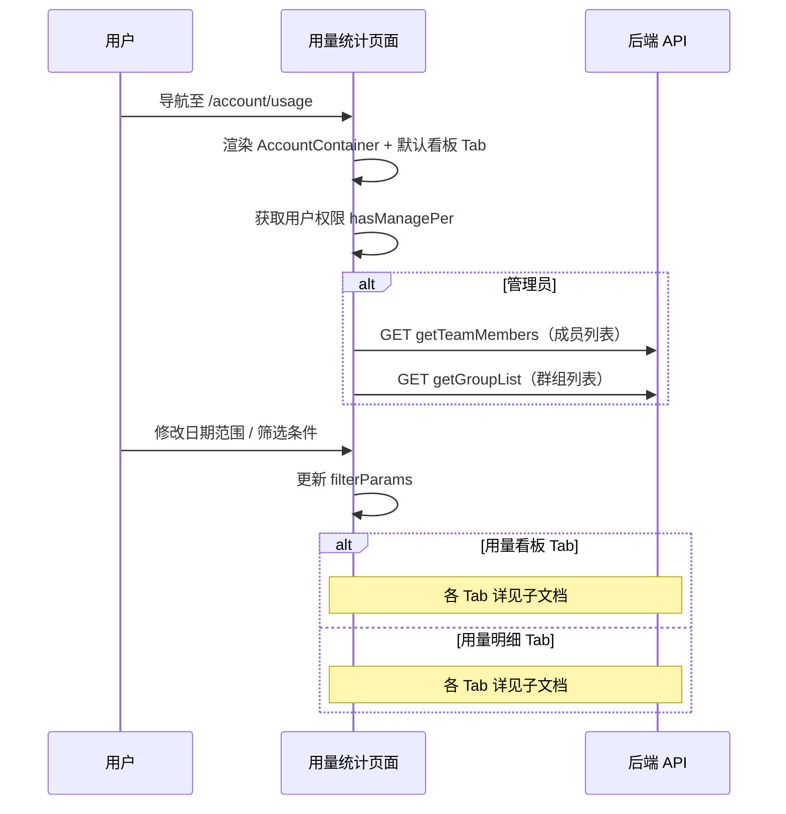

# 用量统计 — 业务流程详解

## 页面总览

用量统计页面通过 `AccountContainer` 容器包裹，顶部提供 Tab 切换（用量看板/用量明细）和筛选器区域，下方根据选中的 Tab 分别渲染看板图表或明细表格。筛选条件在两个 Tab 之间共享，切换 Tab 时保留筛选状态。管理员拥有成员/群组/部门维度的额外筛选能力。

## Tab 子能力索引

| Tab | 业务描述 | 步骤数 | API 数 | 来源 | 详细文档 |
|-----|---------|--------|--------|------|---------|
| 用量看板 | 折线图展示积分/Token消耗趋势 | 3 | 1 | 本模块 | [业务流程详解](../用量统计/dashboard/业务流程详解.md) |
| 用量明细 | 表格展示调用记录，支持详情查看和导出 | 5 | 2 | 本模块 | [业务流程详解](../用量统计/detail/业务流程详解.md) |

## 公共业务流程

### 页面初始化与权限校验

| 用户操作 | 触发 API | 分支条件 | 页面变化 |
|---------|---------|---------|---------|
| 从账户中心导航至用量统计 | 无（SSR 服务端获取 i18n 词条） | 无 | 页面加载，AccountContainer 容器渲染，显示左侧账户导航和右侧内容区域 |
| 页面完成渲染 | 无 | 无 | 默认展示用量看板 Tab（`usageTab=dashboard`）；如 URL query 指定为 detail 则展示明细 Tab |
| 获取当前用户信息 | 无（useUserStore 读取内存状态） | 无 | 用户头像、团队信息就绪；`hasManagePer` 决定是否显示成员筛选器 |
| 获取团队成员列表（管理员） | GET 内部 API → getTeamMembers | `hasManagePer === true` 时执行 | 成员下拉列表加载，显示滚动分页加载更多 |
| 获取群组列表（管理员） | GET 内部 API → getGroupList | `hasManagePer === true` 时执行 | 群组下拉列表加载 |
| 获取部门树（管理员） | GET 内部 API → getOrgList | `hasManagePer === true` 且切换到部门筛选模式时执行 | 部门树选择器数据就绪 |

### 筛选器操作

| 用户操作 | 触发 API | 分支条件 | 页面变化 |
|---------|---------|---------|---------|
| 修改日期范围 | 无（仅更新本地状态 `dateRange`） | 无 | 筛选参数更新，触发对应 Tab 的数据重新加载 |
| 切换筛选模式（成员/群组/部门） | 无（仅更新 `filterMode`） | 仅管理员可见此控件 | 筛选器切换为对应模式的选择器；已选值重置（全选状态） |
| 按成员筛选 | 无（本地状态更新 `selectTmbIds`） | 筛选模式为「成员」 | 筛选参数更新，触发数据重新加载 |
| 按群组筛选 | 无（本地状态更新 `selectGroupIds`） | 筛选模式为「群组」 | 筛选参数更新，触发数据重新加载 |
| 按部门筛选（OrgTreeSelector） | GET 内部 API → getOrgList（懒加载子节点） | 筛选模式为「部门」；展开部门节点时触发子节点加载 | 树形选择器加载子部门；选中部门后触发数据重新加载 |
| 按用量来源筛选 | 无（本地状态更新 `usageSources`） | 所有用户可见 | 筛选参数更新，触发数据重新加载 |
| 输入项目名称搜索 | 无（本地状态，300ms 防抖后更新 `projectName`） | 所有用户可见 | 输入 300ms 后筛选参数更新，触发数据重新加载 |

### 查看剩余积分快捷入口

| 用户操作 | 触发 API | 分支条件 | 页面变化 |
|---------|---------|---------|---------|
| 点击「查看剩余积分」按钮 | 无（打开 RechargeModal） | 所有用户可见 | 弹出充值弹窗，显示当前积分余额和充值选项 |
| 在充值弹窗中完成支付 | POST 充值 API（由 RechargeModal 内部处理） | 用户完成支付 | 弹窗关闭，积分余额更新 |

### Tab 切换

| 用户操作 | 触发 API | 分支条件 | 页面变化 |
|---------|---------|---------|---------|
| 点击「用量看板」Tab | 无（URL query 更新为 `usageTab=dashboard`） | 当前非看板 Tab 时 | 切换为 UsageDashboard 组件，加载看板数据（积分折线图 + Token 折线图） |
| 点击「用量明细」Tab | 无（URL query 更新为 `usageTab=detail`） | 当前非明细 Tab 时 | 切换为 UsageTableList 组件，加载用量列表数据（分页表格） |

## Mermaid 附录

