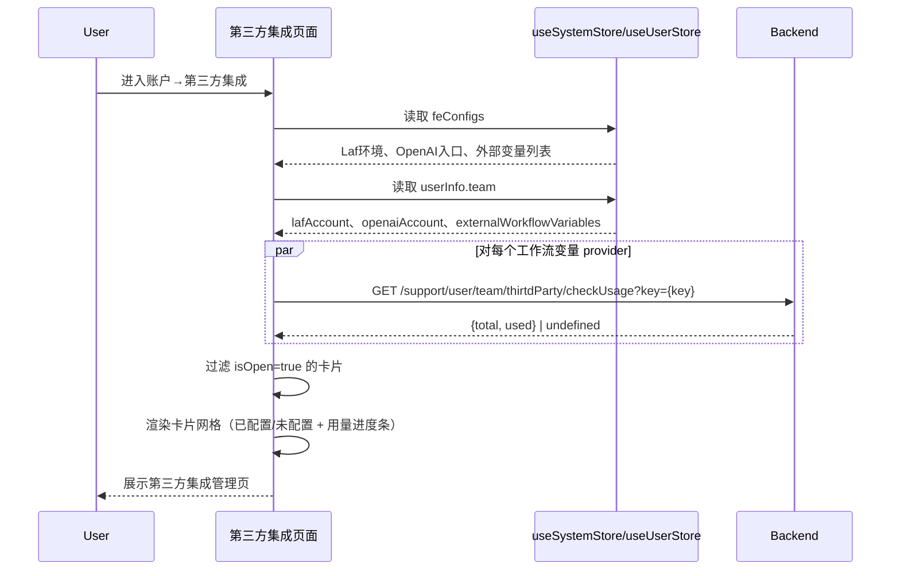
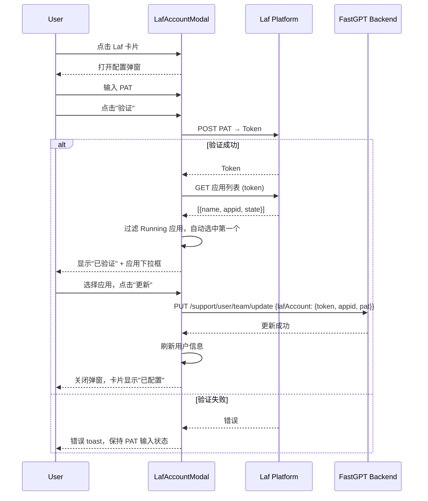
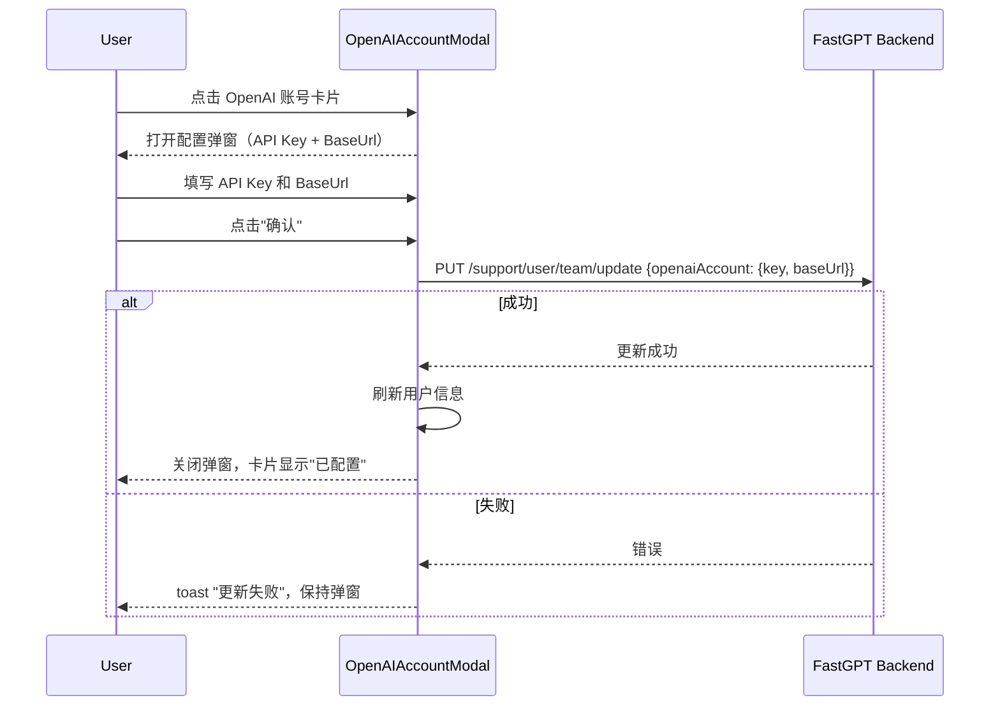
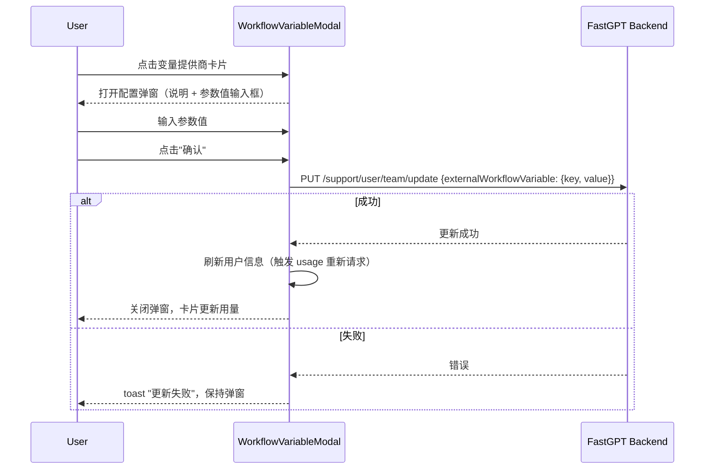

# 账户 — 第三方集成 业务流程详解

## 页面总览

第三方集成管理页面以卡片网格布局展示所有已启用的第三方服务集成。每个卡片显示服务名称、图标、说明描述、配置状态标签（已配置/未配置），以及已配置服务的使用量进度条。桌面端通过账户侧边栏导航进入，移动端通过顶部 Tab 栏切换进入。非管理员只能查看状态，无法进行配置操作。

---

### 查看第三方集成列表

> 进入页面后展示所有已启用的第三方集成卡片，卡片的可见性和状态受系统配置和团队已有配置影响。

#### 步骤 1：页面加载

| 用户操作 | 触发 API | 分支条件 | 页面变化 |
|---------|---------|---------|---------|
| 从账户侧边栏或 Tab 栏进入第三方集成页面 | GET `/support/user/team/thirtdParty/checkUsage?key={key}`（对每个工作流变量提供商并行请求） | 无 | 页面容器（AccountContainer）加载，显示"第三方账号"标题和描述文字；MyBox 组件显示加载状态（isLoading） |

#### 步骤 2：集成卡片渲染

| 用户操作 | 触发 API | 分支条件 | 页面变化 |
|---------|---------|---------|---------|
| 等待数据加载完成 | 无需额外 API（系统配置和用户信息已由 useSystemStore / useUserStore 在应用初始化时获取） | — | 加载完成，按 1-4 列响应式网格渲染卡片 |

卡片渲染规则：
- **Laf 账号卡片**：`feConfigs.lafEnv` 存在时显示；已配置时状态标签为绿色"已配置"
- **OpenAI 账号卡片**：`feConfigs.show_openai_account` 为 true 时显示；`userInfo.team.openaiAccount.key` 存在时为"已配置"
- **工作流变量卡片**：来自 `feConfigs.externalProviderWorkflowVariables` 数组，每个 provider 一张卡片；`userInfo.team.externalWorkflowVariables[key]` 存在时为"已配置"
- 已配置且有用量数据的卡片底部显示使用量进度条

#### 数据加载详情

| 加载阶段 | API | 关键参数 | 数据处理 | 渲染结果 |
|---------|-----|---------|---------|---------|
| 首次加载 | GET `/support/user/team/thirtdParty/checkUsage` | `key={providerKey}`（对每个工作流变量 provider 并行请求） | 返回 `{total, used}` 或 `undefined` | 已配置的工作流变量卡片显示使用量进度条 |
| 系统配置读取 | 无（从 Store 缓存读取） | — | 从 `feConfigs` 读取 Laf 环境地址、OpenAI 入口开关、外部变量列表 | 决定卡片的可见性和顺序 |
| 用户配置读取 | 无（从 Store 缓存读取） | — | 从 `userInfo.team` 读取 lafAccount、openaiAccount、externalWorkflowVariables | 决定每张卡片的"已配置/未配置"状态 |

#### 步骤 3：权限交互

| 用户操作 | 触发 API | 分支条件 | 页面变化 |
|---------|---------|---------|---------|
| 非管理员点击任意配置卡片 | 无 | `userInfo.team.role !== owner` | 弹出警告 toast："请联系管理员配置"；不打开模态弹窗 |
| 管理员悬停在卡片上 | 无 | 角色为 owner | 卡片边框变为主题色（primary.600），表明可点击 |

#### 数据加载详情（列表页）

- **首次加载**：页面渲染时通过 `useRequest` 并行请求所有工作流变量的 usage，同时从 Store 缓存读取 feConfigs 和 userInfo
- **刷新依赖**：`feConfigs.externalProviderWorkflowVariables` 或 `userInfo.team.externalWorkflowVariables` 变化时自动重新请求 usage
- **无分页/排序/筛选**：页面为纯展示，卡片数量由系统配置决定

---

### 配置 Laf 账号

> 管理员配置 Laf 云函数平台账号，使得团队工作流中的 Laf 调用节点可以使用团队共享的账号鉴权。

#### 步骤 1：打开配置弹窗

| 用户操作 | 触发 API | 分支条件 | 页面变化 |
|---------|---------|---------|---------|
| 管理员点击 Laf 账号卡片 | 无 | 角色必须为 owner；`feConfigs.lafEnv` 必须存在 | 打开 LafAccountModal 弹窗，标题为"Laf Account Setting"，显示 Laf 介绍文字和文档链接 |

#### 步骤 2：输入 PAT 并验证

| 用户操作 | 触发 API | 分支条件 | 页面变化 |
|---------|---------|---------|---------|
| 在 PAT 输入框中输入个人访问令牌 | 无 | — | 输入框显示已输入内容；"验证"按钮从禁用变为可用 |
| 点击"验证"按钮 | POST Laf PAT 转 Token（通过 `postLafPat2Token` 调用 Laf API） | PAT 未填时按钮禁用 | "验证"按钮变为 loading 状态 |
| 等待验证结果 | — | 验证成功：token 写入表单 | PAT 输入框和"验证"按钮消失，显示"已验证"按钮；出现"当前应用"下拉选择器 |
| | — | 验证失败：弹出错误 toast | 表单保持 PAT 输入状态，显示错误提示信息 |

#### 步骤 3：选择应用并保存

| 用户操作 | 触发 API | 分支条件 | 页面变化 |
|---------|---------|---------|---------|
| 验证成功后自动加载应用列表 | GET Laf 应用列表（通过 `getLafApplications` 调用 Laf API） | 需要 lafToken 存在后才触发 | 下拉选择器自动选中第一个运行中的应用 |
| 手动选择目标应用 | 无 | 应用列表过滤 `state === 'Running'` 的应用 | 下拉选择器更新选中值 |
| 点击"更新"按钮 | PUT `/support/user/team/update`，参数 `{lafAccount: {token, appid, pat}}` | appid 必须已选择（否则按钮不显示） | "更新"按钮变为 loading；成功：关闭弹窗，刷新用户信息，卡片状态更新为"已配置" |
| | — | 失败 | 显示错误 toast："更新失败"，弹窗保持打开 |

#### 步骤 4：取消或关闭

| 用户操作 | 触发 API | 分支条件 | 页面变化 |
|---------|---------|---------|---------|
| 点击"关闭"按钮 | PUT `/support/user/team/update`（清空 lafAccount） | lafToken 已验证时（已进入应用选择状态） | 先清空团队 Laf 配置，再刷新用户信息后关闭弹窗 |
| 点击"关闭"按钮 | 无 | lafToken 未验证（仍在 PAT 输入状态） | 直接刷新用户信息并关闭弹窗 |

#### 表单与交互详情

**表单字段清单**：

| 字段名 | 控件类型 | 必填 | 默认值 | 可选值/约束 | 编辑时只读 | 说明 |
|--------|---------|------|--------|------------|-----------|------|
| PAT | 文本输入 | 是（验证阶段） | 空 | 任意字符串 | 否 | Laf 平台的个人访问令牌，验证后隐藏 |
| Token | 隐藏字段 | 自动填充 | 空 | 由 PAT 验证后自动获取 | 是 | 验证 PAT 后自动填入，不可手动编辑 |
| 当前应用 | 下拉选择 | 是（保存阶段） | 自动选中第一个运行中的应用 | 仅列出 `state === 'Running'` 的应用 | 否 | PAT 验证后出现，手动选择目标 Laf 应用 |

**校验规则**：

| 规则 | 触发时机 | 错误提示文案 |
|------|---------|-------------|
| PAT 不可为空 | 点击验证按钮（按钮禁用） | 按钮在 PAT 为空时处于禁用状态 |
| PAT 无效或 Laf 服务不可用 | 验证 API 调用失败 | "Invalid Env" |

**前后置条件**：
- **前置条件**：用户为团队 owner；系统配置中 `feConfigs.lafEnv` 已设置
- **后置影响**：保存成功后，团队 `lafAccount` 信息更新（存储在 `userInfo.team.lafAccount`）；工作流中的 Laf 节点可使用此账号调用云函数；非管理员不受影响
- **失败场景**：Laf 服务不可达时 PAT 验证失败；应用列表加载失败时重置表单并提示"获取应用失败"

---

### 配置 OpenAI 账号

> 管理员配置 OpenAI 或 OneAPI 兼容的 API 密钥和 BaseUrl。配置后团队在应用中使用 AI 对话、问题分类和内容提取时优先使用此密钥，不从平台计费。

#### 步骤 1：打开配置弹窗

| 用户操作 | 触发 API | 分支条件 | 页面变化 |
|---------|---------|---------|---------|
| 管理员点击 OpenAI 账号卡片 | 无 | 角色必须为 owner；`feConfigs.show_openai_account` 必须为 true | 打开 OpenAIAccountModal 弹窗，标题为"OpenAI/OneAPI 账号"，显示 OpenAPI 使用说明 |

#### 步骤 2：填写并提交

| 用户操作 | 触发 API | 分支条件 | 页面变化 |
|---------|---------|---------|---------|
| 填写 API Key 和 BaseUrl | 无 | — | 表单字段实时更新；BaseUrl 有默认 placeholder 提示"请求地址，默认为 openai 官方。可填中转地址，未自动补全 v1" |
| 点击"确认"按钮 | PUT `/support/user/team/update`，参数 `{openaiAccount: {key, baseUrl}}` | — | "确认"按钮变为 loading；成功：关闭弹窗，刷新用户信息，卡片状态更新为"已配置" |
| | — | 失败 | 显示错误 toast："更新失败"，弹窗保持打开 |

#### 步骤 3：取消

| 用户操作 | 触发 API | 分支条件 | 页面变化 |
|---------|---------|---------|---------|
| 点击"取消"按钮 | 无 | — | 直接关闭弹窗，不保存修改 |

#### 表单与交互详情

**表单字段清单**：

| 字段名 | 控件类型 | 必填 | 默认值 | 可选值/约束 | 编辑时只读 | 说明 |
|--------|---------|------|--------|------------|-----------|------|
| API Key | 文本输入 | 否 | 已有配置值或空 | 任意字符串 | 否 | OpenAI/OneAPI 的 API 密钥 |
| BaseUrl | 文本输入 | 否 | 已有配置值或空 | 任意 URL | 否 | 请求地址，默认 OpenAI 官方；可填自定义中转地址 |

**前后置条件**：
- **前置条件**：用户为团队 owner；系统配置中 `feConfigs.show_openai_account` 为 true
- **后置影响**：保存成功后，团队 `openaiAccount` 更新；应用中 AI 功能优先使用此配置的密钥，不从平台计费；请确认密钥有访问对应模型的权限
- **失败场景**：网络异常或后端错误导致保存失败时提示"更新失败"

---

### 配置工作流变量

> 管理员为平台定义的第三方工作流变量提供商配置鉴权参数。配置后系统会请求提供商 API 校验使用量，团队工作流可使用对应变量。

#### 步骤 1：打开配置弹窗

| 用户操作 | 触发 API | 分支条件 | 页面变化 |
|---------|---------|---------|---------|
| 管理员点击某工作流变量提供商卡片 | 无 | 角色为 owner；该 provider 的 `isOpen` 为 true | 打开 WorkflowVariableModal 弹窗，标题为"{provider名称} 配置"，显示该提供商的说明描述 |

#### 步骤 2：填写参数值并提交

| 用户操作 | 触发 API | 分支条件 | 页面变化 |
|---------|---------|---------|---------|
| 在输入框中填写参数值 | 无 | — | 输入框实时更新；placeholder 提示"输入参数值。输入空值表示删除该配置。" |
| 点击"确认"按钮 | PUT `/support/user/team/update`，参数 `{externalWorkflowVariable: {key: providerKey, value}}` | — | "确认"按钮变为 loading；成功：关闭弹窗，刷新用户信息 |
| | — | 失败 | 显示错误 toast："更新失败"，弹窗保持打开 |

#### 步骤 3：取消

| 用户操作 | 触发 API | 分支条件 | 页面变化 |
|---------|---------|---------|---------|
| 点击"取消"按钮 | 无 | — | 直接关闭弹窗，不保存修改 |

#### 表单与交互详情

**表单字段清单**：

| 字段名 | 控件类型 | 必填 | 默认值 | 可选值/约束 | 编辑时只读 | 说明 |
|--------|---------|------|--------|------------|-----------|------|
| 参数值 | 文本输入 | 否 | 空 | 任意字符串；输入空值表示删除该配置 | 否 | 第三方服务的鉴权参数（如 API Token），保存后不会再次返回前端 |

**校验规则**：

无前端校验，值直接提交。

**前后置条件**：
- **前置条件**：用户为团队 owner；系统配置中 `feConfigs.externalProviderWorkflowVariables` 包含该 provider 且 `isOpen` 为 true
- **后置影响**：保存成功后，团队 `externalWorkflowVariables[key]` 更新；页面会自动重新请求该 provider 的使用量数据，卡片显示用量进度条
- **失败场景**：保存失败时提示"更新失败"；参数值保存后不会再次返回前端，以保障安全性

