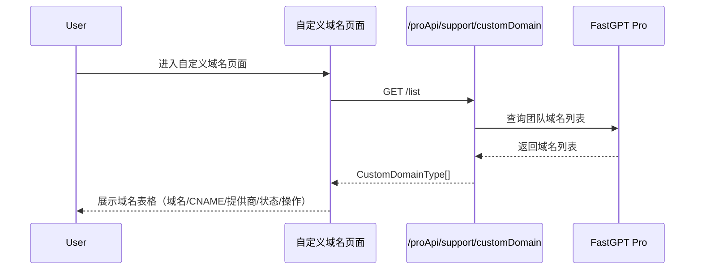
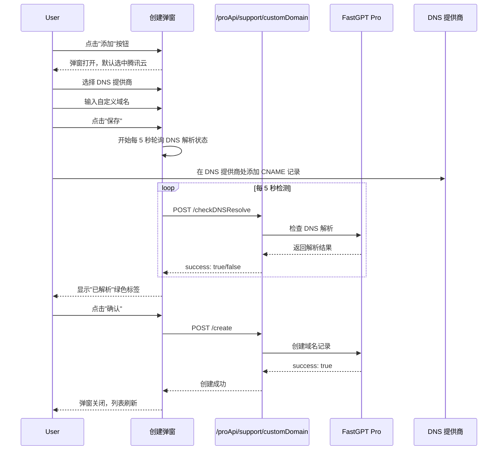
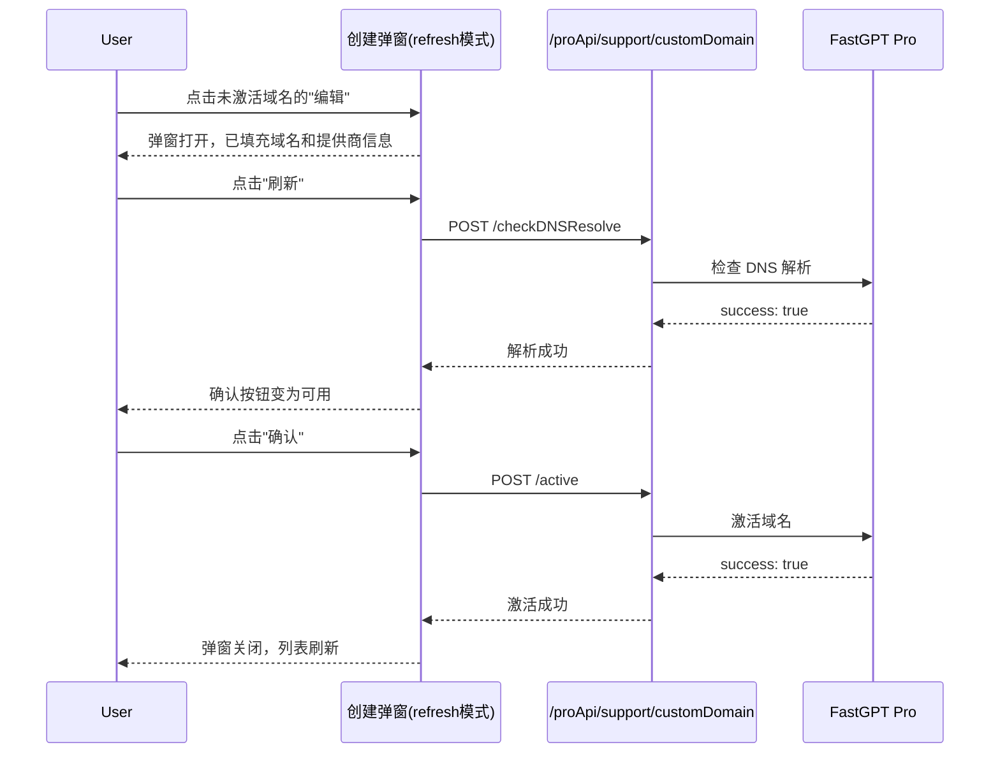
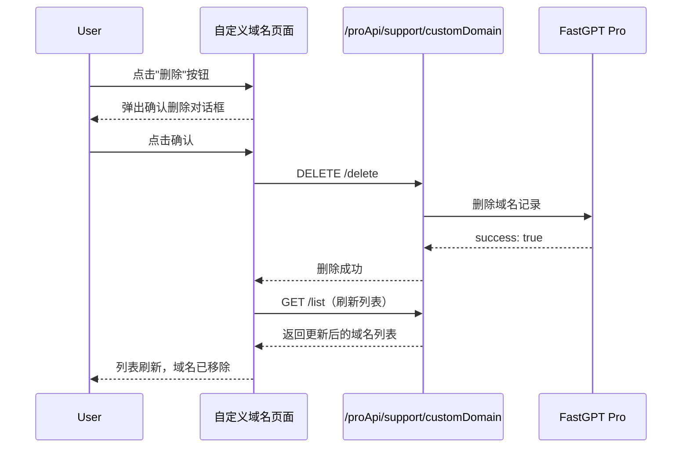

# 自定义域名 — 业务流程详解

## 页面总览

自定义域名管理页面以表格形式展示团队已绑定的所有自定义域名，提供添加、编辑、删除等全生命周期管理。页面采用弹窗模式处理创建和激活流程，无需页面跳转。针对未订阅用户，页面展示升级引导。

本页面无 Tab 结构，所有操作在单页内完成。

---

### S01 查看自定义域名列表

> 团队所有者进入自定义域名管理页面，查看已绑定的域名及其 CNAME 记录、提供商、激活状态等信息。

#### 步骤 1：页面加载与域名列表查询

| 用户操作 | 触发 API | 分支条件 | 页面变化 |
|---------|---------|---------|---------|
| 从账户侧边栏点击"自定义域名"标签进入页面 | GET /proApi/support/customDomain/list | 无分支，始终执行 | 页面显示 MyLoading 加载动画，表格区域为空；加载完成后表格渲染域名列表或空状态 |

#### 步骤 2：展示域名列表

| 用户操作 | 触发 API | 分支条件 | 页面变化 |
|---------|---------|---------|---------|
| 等待列表加载完成 | 无 | 列表有数据 | 表格展示每条域名的域名、CNAME 记录、提供商名称（中文翻译）、状态标签（绿色"已激活"/红色"未激活"）、操作按钮（删除 + 编辑（仅未激活状态可见））；标题显示已用/配额数量 |
| | | 列表为空 且 有自定义域名权限 | 表格区域显示空状态（无提示文案，仅空白表格） |
| | | 列表为空 且 无自定义域名权限（套餐不含或未订阅） | 表格区域显示空状态：提示文案"升级套餐以使用自定义域名"+"升级套餐"按钮 |

#### 步骤 3：查看域名详情信息

| 用户操作 | 触发 API | 分支条件 | 页面变化 |
|---------|---------|---------|---------|
| 浏览表格中的域名记录 | 无（数据已在列表中） | 无分支 | 用户可看到每条域名的完整信息：域名地址、CNAME 目标域名、DNS 提供商名称、激活状态标签 |

**数据加载详情**：

| 加载阶段 | API | 关键参数 | 数据处理 | 渲染结果 |
|---------|-----|---------|---------|---------|
| 首次加载 | GET /proApi/support/customDomain/list | 无参数 | 直接使用返回的数组 | 表格渲染域名列表 |

- 分页参数：当前接口返回全量列表，无分页
- 排序规则：按后端返回顺序展示，无客户端排序
- 筛选条件：无客户端筛选，全量展示
- 特殊列的渲染逻辑：
  - 提供商列：通过 `providerMap` 映射为 i18n 翻译 key（如 `account:custom_domain.provider.aliyun`），由 `t()` 函数翻译为中文
  - 状态列：active（已激活）显示绿色 Tag，inactive（未激活）显示红色 Tag

---

### S02 添加自定义域名

> 团队所有者点击"添加"按钮，在弹出的创建对话框中完成 DNS 提供商选择、域名输入、CNAME 配置和 DNS 解析验证。

#### 步骤 1：打开发布对话框

| 用户操作 | 触发 API | 分支条件 | 页面变化 |
|---------|---------|---------|---------|
| 点击"添加"按钮 | 无 | "添加"按钮在 `isSupportCustomDomain` 为 true 时可用，为 false 时灰色不可点击 | 动态加载 CreateCustomDomainModal 组件；弹窗打开，标题为"自定义域名"，提供商默认选中"腾讯云"，域名输入框为空，DNS 记录区域显示 CNAME 域名 |

> **按钮可用性条件**：`isSupportCustomDomain` = `teamPlanStatus.standard.customDomain > 0`，即团队套餐必须包含自定义域名配额且配额大于 0。

#### 步骤 2：选择 DNS 提供商

| 用户操作 | 触发 API | 分支条件 | 页面变化 |
|---------|---------|---------|---------|
| 点击阿里云/腾讯云/火山引擎的提供商卡片 | 无 | 域名输入框为空（编辑模式）时可切换；refresh 模式下不可切换（置灰） | 选中的提供商卡片显示蓝色边框和蓝色背景；CNAME 域名根据所选提供商自动更新；提示文案中的提供商名称相应变化 |

**提供商选择 UI**：三个并排卡片，每个显示 Radio 按钮 + 提供商 Logo 图标。选中状态：蓝色边框 + `blue.50` 背景色。

#### 步骤 3：输入自定义域名

| 用户操作 | 触发 API | 分支条件 | 页面变化 |
|---------|---------|---------|---------|
| 在输入框中输入域名（如 `chat.example.com`） | 无 | 无 | 输入框右侧无状态标签 |

#### 步骤 4：保存域名并开始 DNS 解析检测

| 用户操作 | 触发 API | 分支条件 | 页面变化 |
|---------|---------|---------|---------|
| 点击"保存"按钮（输入域名后右侧按钮从"编辑"变为"保存"） | 无（仅切换为不可编辑模式） | 域名输入框有内容 | 域名输入框变为只读；右侧按钮变为"编辑"；输入框右侧出现 DNS 解析状态标签；开始每 5 秒自动调用 DNS 检测 API |

#### 步骤 5：DNS 解析自动检测

| 用户操作 | 触发 API | 分支条件 | 页面变化 |
|---------|---------|---------|---------|
| 系统自动执行（每 5 秒一次，无需用户操作） | POST /proApi/support/customDomain/checkDNSResolve | 域名和 CNAME 均已填写且处于非编辑状态 | 解析中：输入框右侧显示红色标签"解析中"；解析成功：标签变为绿色"已解析"，确认按钮变为可用 |
| | | 用户在 DNS 提供商处未配置 CNAME 记录 | 持续显示红色"解析中"标签，确认按钮保持禁用 |
| | | 用户在 DNS 提供商处正确配置了 CNAME 记录 | 下一次检测（5 秒内）成功后，标签变为绿色"已解析" |

#### 步骤 6：查看 CNAME 记录信息

| 用户操作 | 触发 API | 分支条件 | 页面变化 |
|---------|---------|---------|---------|
| 浏览 DNS 记录区域 | 无 | 始终可见 | 显示一条 CNAME 记录表格：类型为 CNAME、TTL 为 Auto、值为生成的 CNAME 域名；提供复制按钮可一键复制 CNAME 值；底部有文档链接指向帮助文档 |

**CNAME 生成逻辑**：`generateCNAMEDomain(providerDomain)` — 在提供商提供的域名前添加随机前缀，生成格式为 `fastgpt-{随机字符串}.{提供商域名}` 的 CNAME 域名。

#### 步骤 7：确认创建

| 用户操作 | 触发 API | 分支条件 | 页面变化 |
|---------|---------|---------|---------|
| 点击"确认"按钮 | POST /proApi/support/customDomain/create | DNS 已解析成功（DnsResolved 为 true），确认按钮可用 | 弹窗关闭，域名列表自动刷新，显示成功提示"操作成功" |
| | | DNS 未解析成功，确认按钮灰色禁用 | 按钮不可点击，用户需等待 DNS 解析成功 |

**创建参数**：
- `domain`：用户输入的自定义域名
- `provider`：选择的 DNS 提供商（aliyun / tencent / volcengine）
- `cnameDomain`：系统生成的 CNAME 目标域名

#### 步骤 8：取消操作

| 用户操作 | 触发 API | 分支条件 | 页面变化 |
|---------|---------|---------|---------|
| 点击"取消"按钮或关闭弹窗 | 无 | 无 | 弹窗关闭，列表不刷新 |

---

### S03 编辑/激活自定义域名

> 对于状态为"未激活"的域名，团队所有者可重新编辑并激活。

#### 步骤 1：打开编辑弹窗

| 用户操作 | 触发 API | 分支条件 | 页面变化 |
|---------|---------|---------|---------|
| 点击未激活域名的"编辑"按钮 | 无 | 仅域名状态为 `inactive`（未激活）时才显示"编辑"按钮；`active`（已激活）域名不显示此按钮 | 弹窗以 `refresh` 模式打开；提供商和域名自动填充为当前域名的值且不可修改；DNS 记录区域显示已有的 CNAME 域名 |

> **按钮可见性**：域名状态为 `inactive` → 显示"编辑"；域名状态为 `active` → 不显示"编辑"（代码中域验证按钮已被注释，暂不提供）

#### 步骤 2：重新检测 DNS 解析

| 用户操作 | 触发 API | 分支条件 | 页面变化 |
|---------|---------|---------|---------|
| 点击"刷新"按钮 | POST /proApi/support/customDomain/checkDNSResolve | 域名和 CNAME 已有值 | 触发一次 DNS 检测（非定时轮询）；解析成功后确认按钮变为可用 |

#### 步骤 3：确认激活

| 用户操作 | 触发 API | 分支条件 | 页面变化 |
|---------|---------|---------|---------|
| 点击"确认"按钮 | POST /proApi/support/customDomain/active | DNS 已解析成功 | 弹窗关闭，域名列表刷新，域名状态变为 active（已激活） |
| | | DNS 未解析成功 | 按钮禁用，不可点击 |

---

### S04 删除自定义域名

> 团队所有者删除指定的自定义域名绑定。

#### 步骤 1：触发删除

| 用户操作 | 触发 API | 分支条件 | 页面变化 |
|---------|---------|---------|---------|
| 点击域名行中的"删除"按钮 | 无 | 始终可点击 | 弹出确认删除对话框 |

#### 步骤 2：确认删除

| 用户操作 | 触发 API | 分支条件 | 页面变化 |
|---------|---------|---------|---------|
| 在确认弹窗中点击"确认" | DELETE /proApi/support/customDomain/delete | 无分支 | 弹窗关闭，列表刷新，该域名从列表中消失，显示成功提示"操作成功" |
| 在确认弹窗中点击"取消" | 无 | 无 | 弹窗关闭，列表不变 |

**删除链路详情**：
- **确认弹窗**：弹窗类型为"删除"（红色确认按钮），提示内容为 i18n key `account:custom_domain.delete_confirm` 对应的文本
- **删除参数**：域名字符串作为请求体中的 `domain` 字段
- **后置影响**：删除后列表自动刷新；该域名对应的 CNAME 解析不再有效

---

### S05 升级套餐

> 未订阅 Plus 或套餐不含自定义域名的团队所有者，看到升级引导。

#### 步骤 1：查看升级提示

| 用户操作 | 触发 API | 分支条件 | 页面变化 |
|---------|---------|---------|---------|
| 进入自定义域名页面 | 无 | `isSupportCustomDomain` 为 false（套餐不含自定义域名或未订阅 Plus） | 表格区域不渲染数据行；显示空状态组件：文案"升级套餐以使用自定义域名"+"升级套餐"蓝色按钮 |

#### 步骤 2：跳转价格页面

| 用户操作 | 触发 API | 分支条件 | 页面变化 |
|---------|---------|---------|---------|
| 点击"升级套餐"按钮 | 无 | 无 | 页面路由跳转到 `/price` |

---

## Mermaid 附录

### S01 查看列表

### S02 添加自定义域名

### S03 编辑/激活域名

### S04 删除域名

