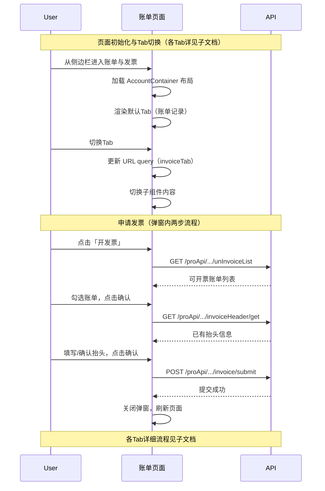

# 账单 — 业务流程详解

## 页面总览

账单与发票页面是 FastGPT 团队财务管理中心，承载账单查看/支付、发票申请/查看、发票抬头管理三大功能。页面以 3 个 Tab 组织内容，默认展示账单记录 Tab。各 Tab 的详细业务流程见各自的子文档。

## Tab 结构索引

| Tab | 业务描述 | 步骤数 | API 数 | 来源 | 详细文档 |
|-----|---------|--------|--------|------|---------|
| 账单记录 | 查看历史账单、支付/取消未支付订单 | — | 5 | 本模块 | 待子任务生成（账户/账单/账单记录） |
| 发票 | 查看已提交发票、下载完成发票 PDF | — | 1 | 本模块 | 待子任务生成（账户/账单/发票） |
| 发票抬头 | 维护企业发票抬头信息 | — | 2 | 本模块 | 待子任务生成（账户/账单/发票抬头） |

## 公共业务流程

### 页面初始化与 Tab 切换

> 用户进入页面时的初始化加载、Tab 切换和权限校验流程。各 Tab 的内容渲染由子组件负责。

#### 步骤 1：页面路由进入

| 用户操作 | 触发 API | 分支条件 | 页面变化 |
|---------|---------|---------|---------|
| 从账户侧边栏点击「账单与发票」菜单项 | 无（GET `/api/account/bill` 为 Next.js 页面路由，由服务端渲染处理 i18n） | 侧边栏菜单项仅在 `feConfigs.show_pay` 开启且用户 `hasManagePer` 权限时显示 | 页面整体加载：顶部导航栏 + 账户侧边栏 + 页面主体（默认显示账单记录 Tab） |

#### 步骤 2：Tab 切换

| 用户操作 | 触发 API | 分支条件 | 页面变化 |
|---------|---------|---------|---------|
| 点击 Tab「账单记录」/「发票」/「发票抬头」 | 无（仅 URL query 参数 `invoiceTab` 更新） | — 无分支条件，三个 Tab 对所有有权限用户均可点击 | URL 路径追加 `?invoiceTab=bill\|invoice\|invoiceHeader`；对应 Tab 高亮；页面主体切换为对应子组件（BillTable / InvoiceTable / InvoiceHeaderForm） |

> — 当切换到发票抬头 Tab（invoiceHeader）时，「开发票」按钮隐藏，仅保留 Tab 切换区域。

#### 步骤 3：申请发票弹窗

| 用户操作 | 触发 API | 分支条件 | 页面变化 |
|---------|---------|---------|---------|
| 在账单记录或发票 Tab 下点击「开发票」按钮 | 无（打开弹窗，弹窗内加载可开票账单列表） | 发票抬头 Tab 下「开发票」按钮不渲染 | 弹出申请发票弹窗（ApplyInvoiceModal），显示两步流程：①选择账单（全选/单选）②填写发票抬头 |

**弹窗两步流程**：

| 步骤 | 用户操作 | 触发 API | 分支条件 | 页面变化 |
|------|---------|---------|---------|---------|
| 选账单 | 弹窗打开，自动加载可开票账单列表 | GET `/proApi/support/wallet/bill/invoice/unInvoiceList` | 无 | 加载中显示遮罩；加载完成后展示可开票账单表格（含全选 Checkbox） |
| 选账单 | 勾选/取消勾选账单行 | 无（前端计算总金额） | 点击整行或 Checkbox 均可切换选中 | 底部「确认」按钮根据选中数量启用/禁用（无选中时禁用） |
| 选账单 | 点击「确认」按钮 | 无 | 无选中账单时按钮禁用，无法点击 | 进入第二步（填写抬头），顶部显示总金额 |
| 填抬头 | 自动加载已有发票抬头 | GET `/proApi/support/user/team/invoiceHeader/get` | 首次进入第二步触发 | 表单自动填入已有的抬头信息（如有） |
| 填抬头 | 填写/修改抬头信息并点击「确认」 | POST `/proApi/support/wallet/bill/invoice/submit` | 所有字段必填（`required`），手机号格式校验 /^1[0-9]{10}$/，邮箱格式校验 | 提交中按钮显示加载状态；成功后关闭弹窗并刷新页面 |

### 退出登录

| 用户操作 | 触发 API | 分支条件 | 页面变化 |
|---------|---------|---------|---------|
| 在账户侧边栏点击「退出登录」 | 无（前端清除用户状态） | 确认弹窗：`t('account:confirm_logout')` | 弹出确认弹窗；确认后清除用户信息（`setUserInfo(null)`），路由跳转到 `/login` |

## Mermaid 附录

