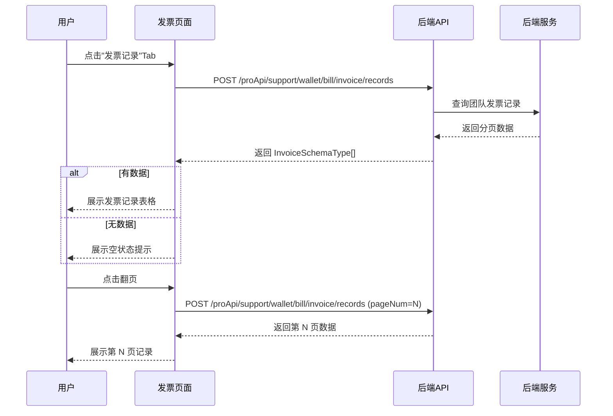
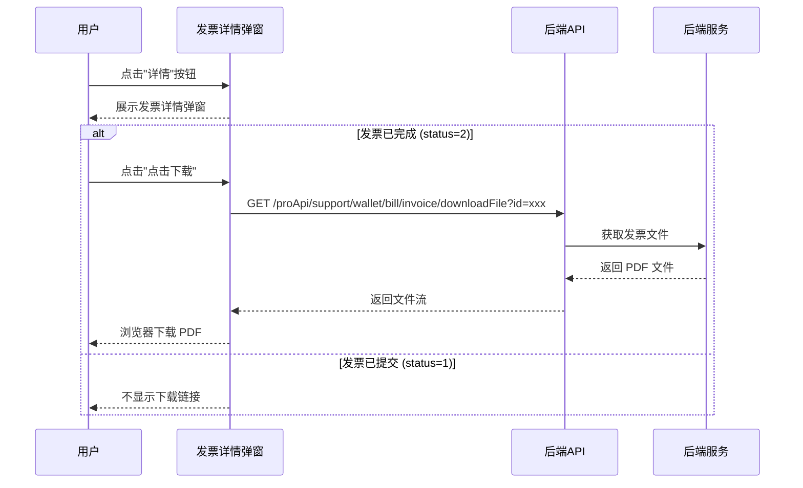

# 发票 — 业务流程详解

## 页面总览

发票管理页面为用户提供团队发票记录的查看和下载能力。页面以表格形式展示所有发票记录（含分页），点击详情可查看发票完整信息，已完成的发票支持下载 PDF 文件。

---

### 查看发票记录

> 用户进入发票记录 Tab，系统加载并展示团队的发票记录列表，支持分页浏览。

#### 步骤 1：进入发票记录页面

| 用户操作 | 触发 API | 分支条件 | 页面变化 |
|---------|---------|---------|---------|
| 在账户中心→账单页面点击"发票记录"Tab | — | 无 | URL 更新为 `/account/bill?invoiceTab=invoice`，InvoiceTable 组件渲染 |

#### 步骤 2：加载发票记录列表

| 用户操作 | 触发 API | 分支条件 | 页面变化 |
|---------|---------|---------|---------|
| 页面加载（自动触发首次请求） | POST `/proApi/support/wallet/bill/invoice/records`，参数 `{pageNum: 1, pageSize: 10}` | 无 | 显示加载遮罩（MyBox isLoading），表格区域展示加载状态 |

#### 步骤 3：展示发票记录

| 用户操作 | 触发 API | 分支条件 | 页面变化 |
|---------|---------|---------|---------|
| 等待数据加载完成 | — | **有数据**: invoices 数组非空 | 表格展示发票记录：序号、创建时间（YYYY/MM/DD HH:mm:ss 格式）、金额（元）、状态标签、详情按钮 |
| | | **无数据**: invoices 数组为空 | 显示空状态：空图标 + "暂无发票记录"提示文案 |

发票状态标签：
- 状态为 1（已提交）：蓝色背景标签，显示"已提交"
- 状态为 2（已完成）：绿色背景标签，显示"已完成"

#### 步骤 4：翻页浏览

| 用户操作 | 触发 API | 分支条件 | 页面变化 |
|---------|---------|---------|---------|
| 点击分页器翻页 | POST `/proApi/support/wallet/bill/invoice/records`，参数 `{pageNum: N, pageSize: 10}` | 总条数 ≥ pageSize（10）时显示分页器 | 表格更新为第 N 页数据，加载期间显示遮罩 |

#### 数据加载详情

| 加载阶段 | API | 关键参数 | 数据处理 | 渲染结果 |
|---------|-----|---------|---------|---------|
| 首次加载 | POST /proApi/support/wallet/bill/invoice/records | pageNum=1, pageSize=10 | 按创建时间倒序排列（默认） | 表格前 10 条 |
| 翻页 | POST /proApi/support/wallet/bill/invoice/records | pageNum=N, pageSize=10 | 无额外处理 | 表格第 N 页 |

- 分页参数：默认每页 10 条
- 排序规则：默认按创建时间倒序（后端返回顺序）

---

### 查看发票详情

> 用户在发票记录列表中点击某条记录的"详情"按钮，弹出详情弹窗展示该发票的完整信息。

#### 步骤 1：打开详情弹窗

| 用户操作 | 触发 API | 分支条件 | 页面变化 |
|---------|---------|---------|---------|
| 点击某条发票记录的"详情"按钮 | — | invoiceDetailData 设置为当前行数据 | 弹窗以 MyModal 展示，标题为"发票详情" |

#### 步骤 2：展示发票详情信息

弹窗中展示的发票字段：

| 字段 | 数据来源 | 说明 |
|------|---------|------|
| 发票金额 | invoice.amount | 通过 formatStorePrice2Read 格式化，单位元 |
| 机构名称 | invoice.teamName | 开票机构名称 |
| 统一信用代码 | invoice.unifiedCreditCode | — |
| 公司地址 | invoice.companyAddress | — |
| 公司电话 | invoice.companyPhone | — |
| 开户银行 | invoice.bankName | — |
| 银行账号 | invoice.bankAccount | — |
| 需要专票 | invoice.needSpecialInvoice | 显示"是"或"否" |
| 联系电话 | invoice.contactPhone | — |
| 邮箱地址 | invoice.emailAddress | — |
| 发票文件 | — | 仅在发票状态为"已完成"时显示下载链接 |

---

### 下载发票文件

> 发票状态为"已完成"时，详情弹窗中展示下载链接，用户可下载电子发票 PDF。

#### 步骤 1：点击下载

| 用户操作 | 触发 API | 分支条件 | 页面变化 |
|---------|---------|---------|---------|
| 在详情弹窗中点击"点击下载" | GET `/api/proApi/support/wallet/bill/invoice/downloadFile?id={发票ID}` | **前提**: 发票 status === 2（已完成） | 触发文件下载 |

#### 步骤 2：文件下载

| 用户操作 | 触发 API | 分支条件 | 页面变化 |
|---------|---------|---------|---------|
| 等待下载完成 | — | 下载成功 | 浏览器下载 PDF 文件，文件名格式 `{机构名称}.pdf` |
| | | 下载失败 | 显示错误提示 |

---

### Mermaid 附录

#### 查看发票记录

#### 查看发票详情与下载

