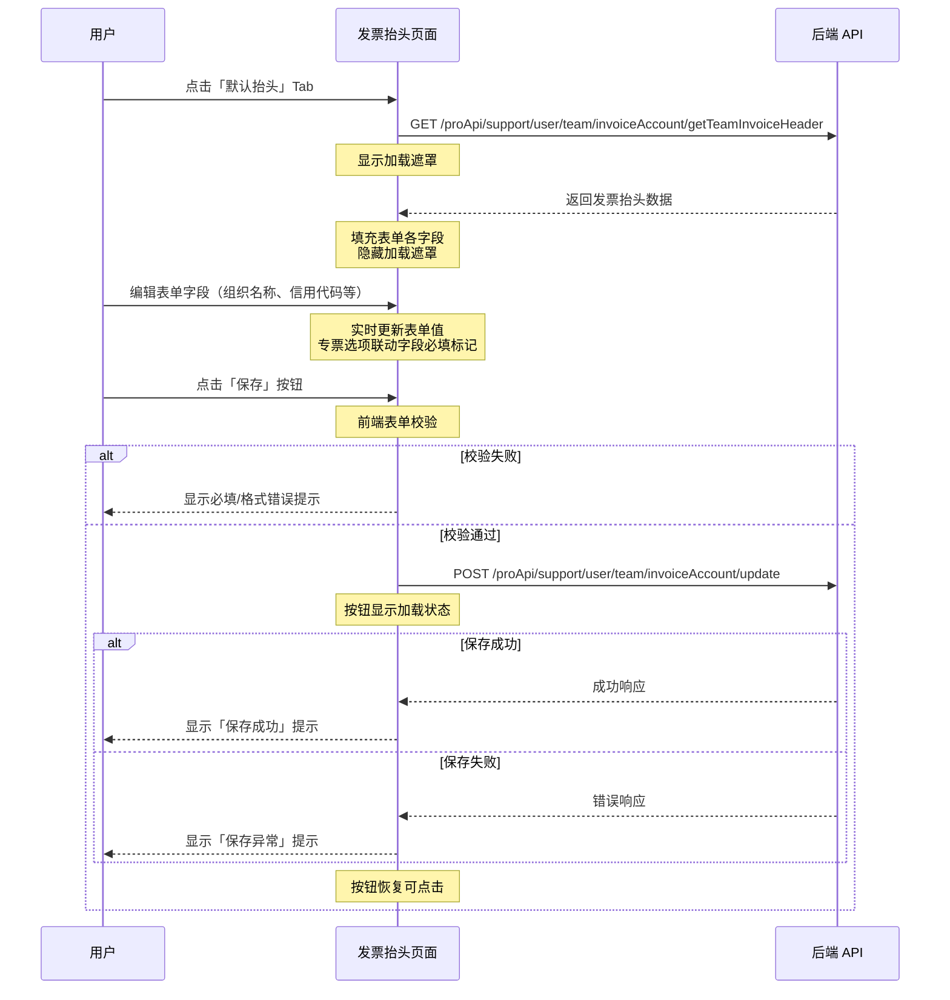

# 发票抬头 — 业务流程详解

## 页面总览

发票抬头是「账单」页面的第三个 Tab，提供团队默认发票抬头信息的管理功能。页面以表单形式展示发票抬头各项信息，支持查看和编辑。用户可设置是否需要增值税专票，选择专票后需要额外填写公司地址、电话及银行账户信息。保存成功后，该信息将在未来申请发票时自动预填入申请表单。

## 管理发票抬头

> **业务描述**: 团队管理员在此页面查看当前的发票抬头信息，编辑后保存，以便在后续申请发票时自动填入。核心场景为查看现有数据 → 修改 → 提交保存。

以下按完整交互序列描述该场景的每个步骤。

### 步骤 1：进入页面，加载发票抬头数据

| 用户操作 | 触发 API | 分支条件 | 页面变化 |
|---------|---------|---------|---------|
| 点击「默认抬头」Tab 切换到发票抬头页面 | `GET /proApi/support/user/team/invoiceAccount/getTeamInvoiceHeader`（页面加载时自动调用，与用户操作无直接触发关系，由 React 组件挂载时发起） | 无分支，固定调用 | 显示 MyBox 加载遮罩（`isLoading=true`），遮罩遮盖整个表单区域；API 返回数据后，表单各字段填充为接口返回值；加载遮罩消失 |

**数据加载详情**：

| 加载阶段 | API | 关键参数 | 数据处理 | 渲染结果 |
|---------|-----|---------|---------|---------|
| Tab 激活时首次加载 | `GET /proApi/support/user/team/invoiceAccount/getTeamInvoiceHeader` | 无参数（后端从当前团队上下文获取） | API 返回值直接通过 `inputForm.reset(data)` 填充到表单 | 表单各字段显示当前保存的发票抬头数据 |

> 此场景只有一次加载，无分页/排序/筛选/轮询。

**表单字段清单**：

| 字段名 | 控件类型 | 必填 | 默认值 | 可选值/约束 | 编辑时只读 | 说明 |
|--------|---------|------|--------|------------|-----------|------|
| 组织名称 | 文本输入 | ✅ | 空 | 无 | 否 | 发票抬头的主体名称 |
| 统一信用代码 | 文本输入 | ✅ | 空 | 无 | 否 | 统一社会信用代码 |
| 公司地址 | 文本输入 | 条件必填 | 空 | 无 | 否 | 仅当「是否需要专票」选择「是」时为必填 |
| 公司电话 | 文本输入 | 条件必填 | 空 | 无 | 否 | 仅当「是否需要专票」选择「是」时为必填 |
| 银行名称 | 文本输入 | 条件必填 | 空 | 无 | 否 | 仅当「是否需要专票」选择「是」时为必填 |
| 银行账号 | 文本输入 | 条件必填 | 空 | 无 | 否 | 仅当「是否需要专票」选择「是」时为必填 |
| 是否需要专票 | 单选按钮 | ✅ | false | 「是」/「否」 | 否 | 选择「是」后下方 4 个字段（公司地址/电话/银行名称/账号）变为必填 |
| 联系电话 | 文本输入 | ✅ | 空 | 11 位手机号格式（以 1 开头） | 否 | 用于电子发票接收 |
| 邮箱地址 | 文本输入 | ✅ | 空 | 标准邮箱格式 | 否 | 用于电子发票发送 |

**字段联动**：

- 当「是否需要专票」选择「是」时：公司地址、公司电话、银行名称、银行账号四个字段的标签显示必填标记（红色星号），且提交时的校验规则变为必填
- 当「是否需要专票」选择「否」时：上述四个字段的必填标记消失，提交时不校验

**校验规则**：

| 规则 | 触发时机 | 错误提示文案 |
|------|---------|-------------|
| 组织名称必填 | 提交时（表单校验） | （浏览器默认必填提示） |
| 统一信用代码必填 | 提交时 | （浏览器默认必填提示） |
| 公司地址条件必填 | 专票=是且提交时 | （浏览器默认必填提示） |
| 公司电话条件必填 | 专票=是且提交时 | （浏览器默认必填提示） |
| 银行名称条件必填 | 专票=是且提交时 | （浏览器默认必填提示） |
| 银行账号条件必填 | 专票=是且提交时 | （浏览器默认必填提示） |
| 联系电话格式校验 | 提交时 | "联系电话格式错误" |
| 邮箱格式校验 | 提交时 | "邮箱格式不正确" |
| 后端保存失败 | 提交后 API 返回错误 | "保存异常" |

### 步骤 2：编辑发票抬头信息

| 用户操作 | 触发 API | 分支条件 | 页面变化 |
|---------|---------|---------|---------|
| 在各文本输入框中修改发票抬头字段值（组织名称、统一信用代码等） | 无（纯前端表单操作） | 无 | 输入框内容实时更新；选择「是否需要专票」为「是」时，公司地址/电话/银行名称/账号的标签前出现红色必填星号标记 |

### 步骤 3：提交保存

| 用户操作 | 触发 API | 分支条件 | 页面变化 |
|---------|---------|---------|---------|
| 点击页面底部的「保存」按钮 | 先执行前端表单校验（react-hook-form），通过后调用 `POST /proApi/support/user/team/invoiceAccount/update`，请求体包含完整的 `TeamInvoiceHeaderType` 对象（teamName, unifiedCreditCode, companyAddress, companyPhone, bankName, bankAccount, needSpecialInvoice, contactPhone, emailAddress） | 前端校验不通过：页面滚动到第一个错误字段，浏览器显示默认校验提示；校验通过但需要专票为否：companyAddress/companyPhone/bankName/bankAccount 提交空值（后端允许） | 点击保存后，按钮变为加载状态（`isLoading=true`），按钮文字保持「保存」但显示加载动画；API 调用成功后，弹出绿色成功提示「保存成功」；API 调用失败后，弹出红色错误提示「保存异常」，表单数据保持用户编辑的内容不丢失；无论成功或失败，保存按钮恢复可点击状态 |

**前后置条件**：
- **前置条件**：用户已登录且有团队管理权限；表单中必填字段已填写且格式正确
- **后置影响**：成功保存后，团队默认发票抬头信息更新；后续在申请发票弹窗中将自动预填入新的抬头信息
- **失败场景**：网络异常或后端校验失败时，显示「保存异常」提示，用户可修正后重试

### Mermaid 附录

