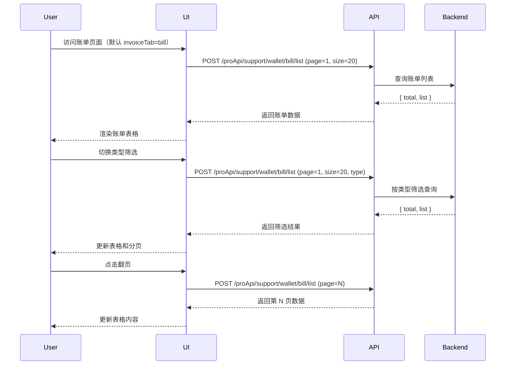
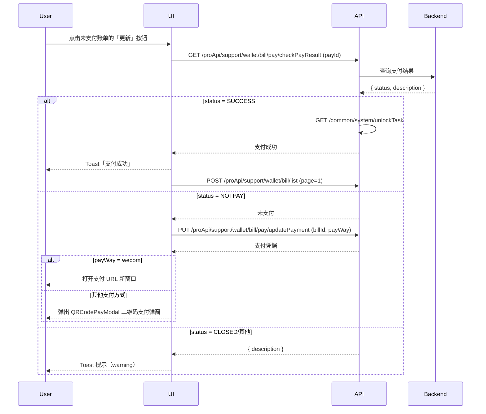
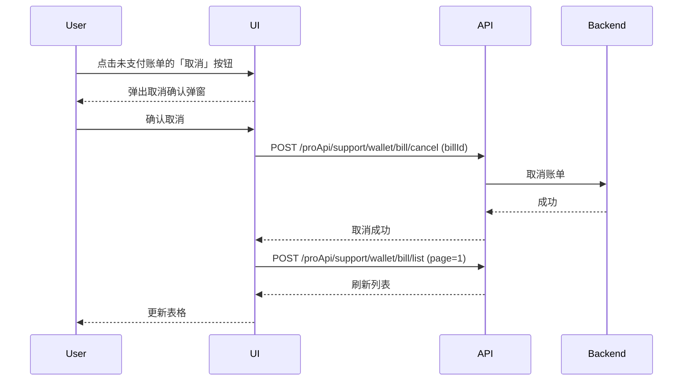

# 账单记录 — 业务流程详解

## 页面总览

账单记录模块以表格形式展示团队所有历史账单，支持按账单类型筛选、分页浏览。每笔账单显示序号、类型、时间、金额、状态和操作按钮。未支付账单额外提供「更新支付」和「取消」操作入口。用户可点击「详情」查看账单完整信息。

---

### 查看账单列表

> 用户进入账单与发票页面时，默认激活「账单记录」Tab，加载账单列表数据。

#### 步骤 1：页面加载与数据请求

| 用户操作 | 触发 API | 分支条件 | 页面变化 |
|---------|---------|---------|---------|
| 访问 /account/bill 页面，默认 invoiceTab=bill | POST /proApi/support/wallet/bill/list（pageNum=1, pageSize=20） | 无 | 显示加载遮罩（MyBox isLoading），加载完成后渲染账单表格 |

#### 步骤 2：账单类型筛选

| 用户操作 | 触发 API | 分支条件 | 页面变化 |
|---------|---------|---------|---------|
| 点击表格表头类型列的下拉筛选器，选择特定账单类型（如标准订阅/额外积分） | POST /proApi/support/wallet/bill/list（pageNum=1, pageSize=20, type=选中值） | 选择「全部」时不传 type 参数 | 表格数据按所选类型重新加载，分页回到第 1 页 |

#### 步骤 3：分页浏览

| 用户操作 | 触发 API | 分支条件 | 页面变化 |
|---------|---------|---------|---------|
| 点击分页器的页码或上/下页按钮 | POST /proApi/support/wallet/bill/list（pageNum=N, pageSize=20, type=当前筛选） | 仅在 total >= pageSize 时显示分页器 | 表格内容更新为第 N 页数据，不显示加载遮罩 |

#### 数据加载详情

| 加载阶段 | API | 关键参数 | 数据处理 | 渲染结果 |
|---------|-----|---------|---------|---------|
| 首次加载 | POST /proApi/support/wallet/bill/list | pageNum=1, pageSize=20 | 返回 list 数组直接映射渲染 | 表格前 20 条记录 |
| 类型筛选 | POST /proApi/support/wallet/bill/list | pageNum=1, pageSize=20, type | 重置到第 1 页 | 按类型过滤的表格数据 |
| 翻页 | POST /proApi/support/wallet/bill/list | pageNum=N, pageSize=20 | 无额外处理 | 表格第 N 页数据 |
| 操作后刷新 | POST /proApi/support/wallet/bill/list | pageNum=1, pageSize=20（回到首页）| 无额外处理 | 更新后的表格数据 |

- **分页参数**: 默认每页 20 条
- **筛选条件**: 账单类型下拉框（全部/充值/标准订阅/额外数据集/额外积分），变更时重置到首页
- **特殊列渲染**: 状态列显示对应中文标签（成功/退款/未支付/已关闭）；金额列格式化为元；时间列格式化为 YYYY/MM/DD HH:mm:ss；操作列仅「未支付」状态显示「更新」和「取消」按钮

---

### 查看账单详情

> 用户点击账单表格操作列的「详情」按钮，弹窗展示账单的完整信息。

#### 步骤 1：打开详情弹窗

| 用户操作 | 触发 API | 分支条件 | 页面变化 |
|---------|---------|---------|---------|
| 点击账单行的「详情」按钮 | GET /proApi/support/wallet/bill/detail（billId=账单ID） | 无 | 弹窗打开，显示加载状态，API 返回后展示账单详情信息 |

#### 步骤 2：查看账单详情

弹窗以键值对形式展示以下信息：

- 订单编号（orderId）
- 生成时间（createTime，格式 YYYY/MM/DD HH:mm:ss）
- 订单类型（billTypeMap 中文标签）
- 状态（billStatusMap 中文标签）
- 优惠券名称（有折扣券时展示）
- 支付方式（billPayWayMap 中文标签）
- 金额（元）
- 是否可开发票（余额支付为「无需开票」，否则显示是/否）
- 订阅周期（按月/按年）
- 订阅套餐等级
- 订阅月数
- 额外数据集大小（如有）
- 额外 AI 积分（如有）
- 自定义配置详情（custom 等级套餐时展示，含团队人数上限/应用数上限/数据集数上限/请求频率/数据集大小/历史存储时长/网站同步数/应用注册数/审计日志存储时长/工单响应时间/自定义域名）

| 用户操作 | 触发 API | 分支条件 | 页面变化 |
|---------|---------|---------|---------|
| 关闭弹窗 | 无 | 无 | 弹窗消失，回到账单列表 |

---

### 刷新支付状态

> 用户对「未支付」账单执行支付结果检查，根据后台返回状态采取不同处理。

#### 步骤 1：检查支付结果

| 用户操作 | 触发 API | 分支条件 | 页面变化 |
|---------|---------|---------|---------|
| 点击未支付账单的「更新」按钮 | GET /proApi/support/wallet/bill/pay/checkPayResult（payId=账单ID） | 无 | 「更新」按钮显示加载状态（isRefreshing=true），按钮文字不变但禁用 |

#### 步骤 2：按状态分支处理

| 用户操作 | 触发 API | 分支条件 | 页面变化 |
|---------|---------|---------|---------|
| （自动）支付结果返回 SUCCESS | GET /common/system/unlockTask（内部调用） | status === SUCCESS | Toast 提示「支付成功」；列表自动刷新回到第 1 页 |
| （自动）支付结果返回 NOTPAY | PUT /proApi/support/wallet/bill/pay/updatePayment（billId, payWay） | status === NOTPAY | 获取新支付凭据；企微支付→Toast 提示后 window.open 打开支付 URL；其他支付方式→弹出 QRCodePayModal 二维码支付弹窗 |
| （自动）支付结果返回 CLOSED 或其他 | 无额外请求 | status === CLOSED / 其他 | Toast 提示对应状态描述（warning 级别） |

#### 步骤 3：支付弹窗交互

| 用户操作 | 触发 API | 分支条件 | 页面变化 |
|---------|---------|---------|---------|
| 支付成功（QRCodePayModal onSuccess 回调） | 无 | 用户完成支付 | Toast 提示「支付成功」；弹窗关闭；列表自动刷新回到第 1 页 |
| 关闭支付弹窗（QRCodePayModal onClose） | 无 | 用户主动关闭 | 弹窗关闭；列表自动刷新回到第 1 页 |

- **失败场景**: 支付超时或取消后，账单状态仍为未支付，用户可重新点击「更新」按钮重试
- **企微支付特殊处理**: 支付方式为 wecom 且返回 payUrl 时，直接通过 window.open 打开支付 URL，不展示二维码弹窗

---

### 取消账单

> 用户取消一笔未支付的账单，操作前需在确认弹窗中再次确认。

#### 步骤 1：打开取消确认弹窗

| 用户操作 | 触发 API | 分支条件 | 页面变化 |
|---------|---------|---------|---------|
| 点击未支付账单的「取消」按钮 | 无 | 账单状态为 NOTPAY | 弹出 PopoverConfirm 确认弹窗，标题为「确认取消账单？」 |

#### 步骤 2：确认取消

| 用户操作 | 触发 API | 分支条件 | 页面变化 |
|---------|---------|---------|---------|
| 在确认弹窗中点击「确认」 | POST /proApi/support/wallet/bill/cancel（billId=账单ID） | 无 | 「取消」按钮显示加载状态；成功后列表自动刷新回到第 1 页 |
| 点击「取消」或弹窗外区域 | 无 | 用户取消操作 | 弹窗关闭，无任何变更 |

- **确认弹窗**: 使用 PopoverConfirm 组件，类型为 delete，显示取消账单确认文案
- **后置影响**: 账单被取消后，如需重新发起支付需通过价格页面创建新订单

---

### Mermaid 附录

#### 查看账单列表

#### 刷新支付状态

#### 取消账单

