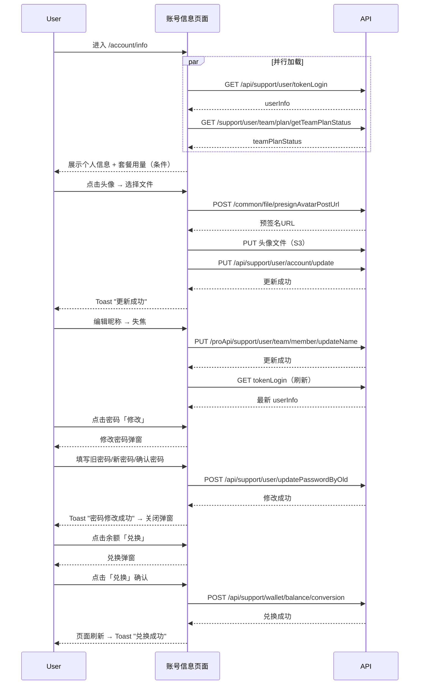

# 账号信息 — 业务流程详解

## 页面总览

账号信息页面是用户查看和管理个人账户的中心页面。PC端采用左右双栏布局——左侧为个人信息（MyInfo）和客服入口（Other），右侧为套餐用量（PlanUsage）；移动端纵向堆叠展示三个区域。页面加载时并行初始化用户信息和团队套餐状态，根据用户权限和系统配置动态显示不同的功能入口。

---

### S01：查看与管理个人信息

> 用户进入页面后自动加载个人信息，可修改头像、密码、联系方式、团队昵称，查看余额。

#### 步骤 1：页面初始化加载

| 用户操作 | 触发 API | 分支条件 | 页面变化 |
|---------|---------|---------|---------|
| 进入 `/account/info` 页面 | `GET /api/support/user/tokenLogin`（获取用户信息） `GET /support/user/team/plan/getTeamPlanStatus`（并行，获取套餐状态） | 无 | 页面加载 → 解析 userInfo → 显示用户名、头像、密码掩码（`*****`）、联系方式、团队昵称默认值、余额；解析 teamPlanStatus → 套餐区域条件渲染 |

- **数据加载详情**：

| 加载阶段 | API | 关键参数 | 数据处理 | 渲染结果 |
|---------|-----|---------|---------|---------|
| 首次加载 | GET /api/support/user/tokenLogin | 无（Cookie认证） | 设置 userInfo State，提取语言设置 → 写入 localStorage | 个人信息区域完整展示 |
| 首次加载 | GET /support/user/team/plan/getTeamPlanStatus | 无（maxQuantity:1 防抖） | 设置 teamPlanStatus State | 条件渲染套餐区域 |

- **初始化顺序**：两个 API 并行调用（`initUserInfo` 内部触发 `initTeamPlanStatus`）

#### 步骤 2：修改头像

| 用户操作 | 触发 API | 分支条件 | 页面变化 |
|---------|---------|---------|---------|
| 点击头像区域 | `POST /common/file/presignAvatarPostUrl` | 无 | 打开本地文件选择器 |
| 选择图片文件 | —（上传到预签名URL） | 无 | 头像上传中 → 上传成功 → 自动触发保存 |
| 上传成功 | `PUT /api/support/user/account/update`（自动） | 无 | 头像更新 → Toast提示"更新成功" |

- **表单字段清单**：头像选择无表单校验，支持图片格式限制由文件选择器控制。
- **失败场景**：API 调用失败时回滚旧头像值（乐观更新），无错误提示。

#### 步骤 3：修改密码

| 用户操作 | 触发 API | 分支条件 | 页面变化 |
|---------|---------|---------|---------|
| 点击密码行「修改」按钮 | 无 | `feConfigs.isPlus` 为 true 才显示修改按钮 | 弹出 UpdatePswModal 弹窗 |
| 输入旧密码 | 无 | 无 | 密码输入框（type=password，必填） |
| 输入新密码 | 前端校验（`checkPasswordRule`） | 无 | 失焦校验 → 不满足则显示提示 tooltip（"密码最短…、密码须包含…"） |
| 输入确认密码 | 前端校验（与新密码一致） | 无 | 不一致显示提示文案（"密码不匹配"） |
| 点击「确认」按钮 | `POST /api/support/user/updatePasswordByOld` | 所有字段必填且校验通过 | 按钮置为 loading 状态 → 成功后关闭弹窗 → Toast"密码修改成功" |

- **表单字段清单**：

| 字段名 | 控件类型 | 必填 | 默认值 | 约束 | 说明 |
|--------|---------|------|--------|------|------|
| 旧密码 | 密码输入框 | ✅ | — | 无 | 当前登录密码 |
| 新密码 | 密码输入框 | ✅ | — | 满足密码复杂度规则 | `checkPasswordRule` 校验 |
| 确认密码 | 密码输入框 | ✅ | — | 与新密码一致 | 前端比对 |

- **校验规则**：

| 规则 | 触发时机 | 错误提示文案 |
|------|---------|-------------|
| 新密码格式 | 失焦 | "密码最短…位，需包含…"（i18n key: `login:password_tip`） |
| 确认密码一致性 | 失焦 | "密码不匹配"（i18n key: `user:password.not_match`） |

- **失败场景**：API 调用失败 → Toast "密码修改失败"

#### 步骤 4：修改联系方式

| 用户操作 | 触发 API | 分支条件 | 页面变化 |
|---------|---------|---------|---------|
| 点击联系方式行「修改」按钮 | 无 | `feConfigs.isPlus` 为 true 才显示修改按钮 | 弹出 UpdateContactModal（mode="contact"） |

> 联系方式修改逻辑在 UpdateContactModal 组件内部（`@/components/support/user/inform/UpdateContactModal`），详见用户通知模块文档。

- **前置条件**：未绑定联系方式时显示红色提示文案"请绑定联系方式"（i18n key: `account_info:please_bind_contact`）

#### 步骤 5：修改团队昵称

| 用户操作 | 触发 API | 分支条件 | 页面变化 |
|---------|---------|---------|---------|
| 点击昵称输入框 | 无 | 同步成员（`isSyncMember`）不可编辑，输入框 disabled | 输入框获焦 |
| 编辑昵称 | 无 | 最大 100 字符 | 实时输入 |
| 失焦 | `PUT /proApi/support/user/team/member/updateName` | 新值与当前值相同时不请求 | 成功后调用 `initUserInfo()` 刷新页面数据 |

- **失败场景**：API 调用失败静默捕获，不做错误提示。

#### 步骤 6：上传头像（移动端）

| 用户操作 | 触发 API | 分支条件 | 页面变化 |
|---------|---------|---------|---------|
| 点击头像区域（移动端） | 同PC端 `POST /common/file/presignAvatarPostUrl` | `isPc` 为 false | 显示"修改"文字 + 编辑图标引导 |

- **PC/移动端差异**：PC端头像小圆图，hover tooltip"选择头像"；移动端大圆图 + "修改"文字引导，更显眼。

---

### S02：查看套餐与资源用量

> 仅团队有标准套餐时展示该区域，显示套餐名称、到期时间、AI积分/知识库索引用量进度条、成员/应用/知识库限额。

#### 步骤 1：套餐信息展示

| 用户操作 | 触发 API | 分支条件 | 页面变化 |
|---------|---------|---------|---------|
| 页面加载 | —（数据来自 S01 的 teamPlanStatus） | `!!standardPlan` 为 true 时才渲染整个 PlanUsage 区域 | 展示套餐名称、到期时间、套餐内容清单 |

- **套餐名称计算**：
  - 企业微信团队 + 免费套餐 → 显示"试用"标签
  - 其他 → 优先使用 `subPlans` 中的自定义名称，否则用 `standardSubLevelMap` 映射

- **免费团队提示**：当前套餐为 Free 且无额外资源包时，显示黄色警告"您的知识库可能会被清理"（i18n key: `account_info:account_knowledge_base_cleanup_warning`）

#### 步骤 2：查看AI积分用量

| 用户操作 | 触发 API | 分支条件 | 页面变化 |
|---------|---------|---------|---------|
| 查看AI积分进度条 | —（计算自 teamPlanStatus） | 无 | 进度条按使用比例变色（<50% 绿色 → <80% 黄色 → ≥80% 红色）；数值显示"已用/总量" |

- **积分总量**：`teamPlanStatus.totalPoints` 为 undefined 时显示"不限量"
- **提示**：进度条旁 QuestionTip 提示"AI积分用量说明"（i18n key: `account_info:ai_points_usage_tip`）

#### 步骤 3：查看知识库索引用量

| 用户操作 | 触发 API | 分支条件 | 页面变化 |
|---------|---------|---------|---------|
| 查看知识库索引用量进度条 | —（计算自 teamPlanStatus） | 无 | 同AI积分，变色逻辑一致 |

#### 步骤 4：查看限额列表

| 用户操作 | 触发 API | 分支条件 | 页面变化 |
|---------|---------|---------|---------|
| 查看成员/应用/知识库限额 | —（计算自 teamPlanStatus） | 应用注册数限额仅在配置存在时展示 | 各限额项显示"已用/最大" |

- **限额项**：
  1. 成员数量 — `usedMember / maxTeamMember`
  2. 应用数量 — `usedAppAmount / maxAppAmount`
  3. 知识库数量 — `usedDatasetSize / maxDatasetAmount`
  4. 应用注册数 — `usedRegistrationCount / appRegistrationCount`（条件展示）

- **应用注册数特殊处理**：若 `subPlans.appRegistrationUrl` 存在，显示「申请应用注册」链接跳转外部。

#### 步骤 5：查看计费标准

| 用户操作 | 触发 API | 分支条件 | 页面变化 |
|---------|---------|---------|---------|
| 点击「计费标准」按钮 | 无 | 无 | 弹出 ModelPriceModal 弹窗（`@/components/core/ai/ModelTable`） |

> 计费标准弹窗展示各模型的定价信息，详见 AI 模型模块文档。

---

### S03～S07：弹窗类操作（修改密码、联系方式、余额兑换、优惠券兑换、折扣券查看）

> 密码、联系方式已在 S01 中详述，此处补充余额兑换和优惠券流程。

#### S05：余额兑换AI积分

| 用户操作 | 触发 API | 分支条件 | 页面变化 |
|---------|---------|---------|---------|
| 点击余额行「兑换」按钮 | 无 | `userInfo.permission.hasManagePer` 且有标准套餐 | 弹出 ConversionModal 弹窗 |
| 查看弹窗信息 | —（前端计算） | 无 | 展示：当前Token价格（￥15/1000 Tokens/月）、当前余额、可兑换Token数、有效期提示 |
| 点击「兑换」按钮 | `POST /api/support/wallet/balance/conversion` | 无 | 按钮置为 loading → 成功 → 页面刷新 → Toast"兑换成功" |
| 点击「联系客服」链接 | 无 | 无 | 触发 onOpenContact → 弹出 CommunityModal |

- **兑换计算**：`可兑换Token数 = ceil(余额 / 15 × SUB_EXTRA_POINT_RATE)`
- **失败场景**：API 调用失败 → Toast "兑换失败"

#### S06：兑换优惠券

| 用户操作 | 触发 API | 分支条件 | 页面变化 |
|---------|---------|---------|---------|
| 点击「兑换优惠券」按钮 | 无 | `userInfo.permission.isOwner` 且 `feConfigs.show_coupon` | 弹出 RedeemCouponModal 弹窗 |
| 输入券码 | 无 | 无 | placeholder 为「兑换优惠券」 |
| 点击「确认」 | `GET /proApi/support/wallet/coupon/redeem` | 券码非空 | 按钮 loading → 成功 → 刷新套餐状态 → 关闭弹窗 → Toast"操作成功" |

#### S07：查看折扣券

| 用户操作 | 触发 API | 分支条件 | 页面变化 |
|---------|---------|---------|---------|
| 点击「折扣券」按钮 | 无 | `userInfo.permission.isOwner` 且 `feConfigs.show_discount_coupon` | 弹出 DiscountCouponsModal 弹窗 |

---

### S08：查看帮助文档

| 用户操作 | 触发 API | 分支条件 | 页面变化 |
|---------|---------|---------|---------|
| 点击「帮助文档」按钮 | 无 | `feConfigs.docUrl` 存在 | `window.open` 跳转 `/docs/introduction` |

---

### S09：联系客服

| 用户操作 | 触发 API | 分支条件 | 页面变化 |
|---------|---------|---------|---------|
| 点击「联系我们」按钮 | 无 | `feConfigs.concatMd` 为 true | 弹出 CommunityModal 弹窗 |

---

### S10：问题反馈

| 用户操作 | 触发 API | 分支条件 | 页面变化 |
|---------|---------|---------|---------|
| 点击「问题反馈」按钮 | `GET /proApi/common/workorder/create` | `feConfigs.show_workorder` 为 true | 先检查工单权限 → 无权限 → 弹窗提示（TeamErrEnum.ticketNotAvailable）；有权限 → 获取跳转URL → window.open |

- **权限检查**：`teamPlanStatus.standard.ticketResponseTime` 是否存在
- **失败场景**：无工单访问权限 → 弹窗提示"工单不可用"（通过 `setNotSufficientModalType`）

---

## Mermaid 附录

