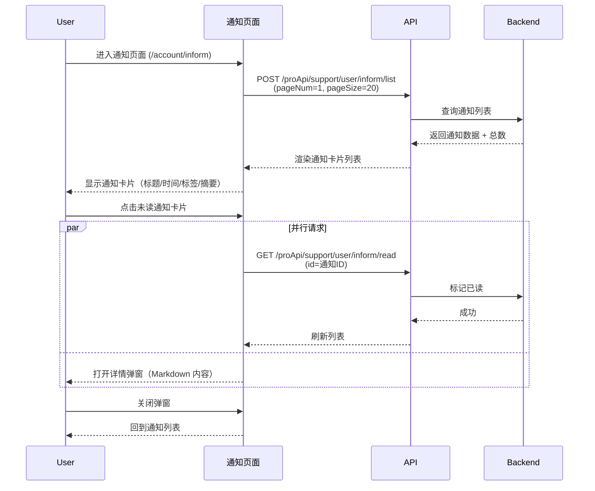
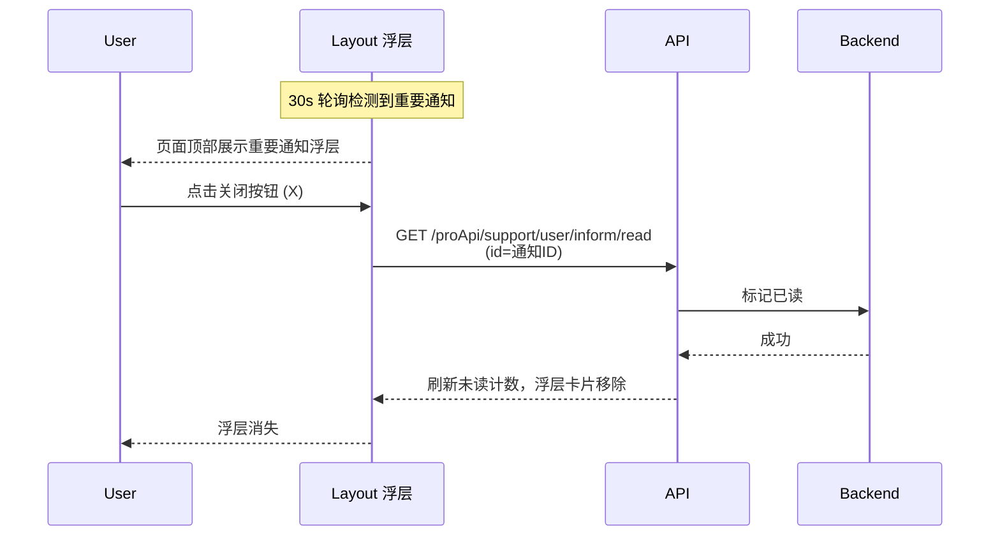

# 通知 — 业务流程详解

## 页面总览

通知页面位于账户中心内，以卡片列表形式展示用户收到的系统通知。每位用户的未读通知数通过 Layout 层的定时轮询获取，并在导航栏入口以角标显示。页面打开时通过分页接口加载通知列表，支持翻页和每页条数切换（默认每页 20 条）。通知列表为空时显示空状态提示。未读通知以红点标记，点击即标记为已读并打开详情弹窗。

---

### 查看通知列表

> 用户进入通知中心，浏览收到的所有通知消息。页面以卡片列表展示，每条通知显示标题、时间、类型标签（官方/团队）和内容摘要（最多 6 行），按时间倒序排列。

#### 步骤 1：进入通知页面

| 用户操作 | 触发 API | 分支条件 | 页面变化 |
|---------|---------|---------|---------|
| PC 端：点击左侧导航栏"通知"图标 → 移动端：切换到"通知"Tab | —（路由跳转 `/account/inform`） | AccountContainer 中 `feConfigs.isPlus` 为 `true` 时"通知"导航项才可见 | 路由跳转至 `/account/inform`，AccountContainer 渲染通知页面组件，页面进入加载状态 |

#### 步骤 2：加载通知列表

| 用户操作 | 触发 API | 分支条件 | 页面变化 |
|---------|---------|---------|---------|
| 页面组件挂载，usePagination 自动触发首次数据请求 | POST `/proApi/support/user/inform/list`（参数: `pageNum=1, pageSize=20`） — 串行，无依赖其他 API | 无，首次加载必调用 | 显示 Loading 遮罩（`fixed=false`，不阻塞页面交互）；API 返回后列表卡片渲染；若无数据则显示空状态"暂无通知"提示 |

#### 步骤 3：浏览通知列表

| 用户操作 | 触发 API | 分支条件 | 页面变化 |
|---------|---------|---------|---------|
| 滚动浏览通知卡片列表 | — | 无 | 每条通知渲染：标题（团队通知前缀【团队名】）、时间（格式化为相对时间如"2 小时前"）、类型标签（官方=蓝色/团队=绿色）、内容 Markdown 摘要（最多 6 行，超出省略）；未读通知显示红点标记 |

#### 步骤 4：翻页或切换每页条数

| 用户操作 | 触发 API | 分支条件 | 页面变化 |
|---------|---------|---------|---------|
| 点击分页器"上一页"/"下一页"或输入页码，或从下拉菜单切换每页条数（10/20/50/100）| POST `/proApi/support/user/inform/list`（参数: `pageNum=N, pageSize=M`） — 独立请求 | 仅在 `total > pageSize` 时分页器可见；切换每页条数时自动重置到第 1 页 | 分页器显示总条数、当前页/总页数；列表重新加载，翻页后使用滚动容器自动回到顶部（`scrollContainerRef.current.scrollTop = 0`）|

##### 数据加载详情

| 加载阶段 | API | 关键参数 | 数据处理 | 渲染结果 |
|---------|-----|---------|---------|---------|
| 首次加载 | POST /proApi/support/user/inform/list | pageNum=1, pageSize=20 | 无额外处理，直接渲染 | 通知卡片列表，最多 20 条 |
| 翻页 | POST /proApi/support/user/inform/list | pageNum=N, pageSize=20 | 用新页数据替换当前列表 | 第 N 页通知卡片 |
| 切换每页条数 | POST /proApi/support/user/inform/list | pageNum=1, pageSize=M | 重置到第 1 页，按新条数加载 | M 条通知卡片 |

- **分页参数**：默认每页 20 条，可选 10/20/50/100
- **排序规则**：按通知时间倒序（服务端排序）
- **轮询刷新**：通知列表本身不轮询；未读数量通过 Layout 层的 `getUnreadCount` 每 30 秒轮询更新

---

### 查看通知详情

> 用户点击通知卡片，弹出详情弹窗查看通知完整内容。若该通知未读，同时触发标记已读操作。

#### 步骤 1：点击通知卡片

| 用户操作 | 触发 API | 分支条件 | 页面变化 |
|---------|---------|---------|---------|
| 点击通知列表中的任意通知卡片 | 若通知未读：GET `/proApi/support/user/inform/read`（参数: `id=通知ID`） — 独立请求，与弹窗打开并行；若已读：不触发 API | 仅 `item.read === false` 时触发 readInform | 卡片 hover 时边框变为蓝色（`#94B5FF`），点击后：未读红点消失，`NotificationDetailsModal` 弹窗打开 |

#### 步骤 2：浏览通知详情

| 用户操作 | 触发 API | 分支条件 | 页面变化 |
|---------|---------|---------|---------|
| 查看弹窗中的通知内容 | — | 无 | 弹窗展示：图标（通知图标+蓝色背景）、标题（"通知详情"）、通知标题、时间、类型标签、分隔线、Markdown 渲染的完整通知内容；弹窗最大宽度 680px，最大高度 80vh，超出滚动 |

#### 步骤 3：关闭详情弹窗

| 用户操作 | 触发 API | 分支条件 | 页面变化 |
|---------|---------|---------|---------|
| 点击弹窗关闭按钮或遮罩层 | — | 无 | 弹窗关闭，`selectedInform` 状态置为 `null`，回到通知列表页面 |

##### 标记已读链路详情

- **标记时机**：点击通知卡片即触发（不等待弹窗用户操作），与打开弹窗并行
- **标记后刷新**：标记成功后调用 `getData(pageNum)` 重新加载当前页数据，更新列表项的红点状态
- **批量行为**：不支持批量已读，每条通知需单独点击

---

### 关闭重要通知弹窗

> 当存在级别为 `important` 或 `emergency` 的未读通知时，这些通知会以全局浮层形式在页面顶部居中展示，用户可主动关闭。

#### 步骤 1：重要通知浮层展示

| 用户操作 | 触发 API | 分支条件 | 页面变化 |
|---------|---------|---------|---------|
| 无需用户操作，由 Layout 组件自动检测并展示 | GET `/proApi/support/user/inform/countUnread` — 每 30 秒轮询，返回 `importantInforms` 数组 | `feConfigs.isPlus` 为 `true`、用户已登录、`importantInforms.length > 0` 时展示 | 页面顶部居中浮层（`position: fixed, top: 3%, left: 50%`），每条重要通知为一个独立卡片，显示图标、标题和 Markdown 内容 |

#### 步骤 2：点击关闭按钮

| 用户操作 | 触发 API | 分支条件 | 页面变化 |
|---------|---------|---------|---------|
| 点击通知卡片右上角的关闭图标（X） | GET `/proApi/support/user/inform/read`（参数: `id=通知ID`）— 独立请求 | 无 | 关闭按钮 hover 时背景变灰；API 成功后调用 `refetchUnRead()` 刷新未读数，该通知从浮层列表中移除 |

---

## Mermaid 附录

### 查看通知列表 + 详情

### 关闭重要通知弹窗

