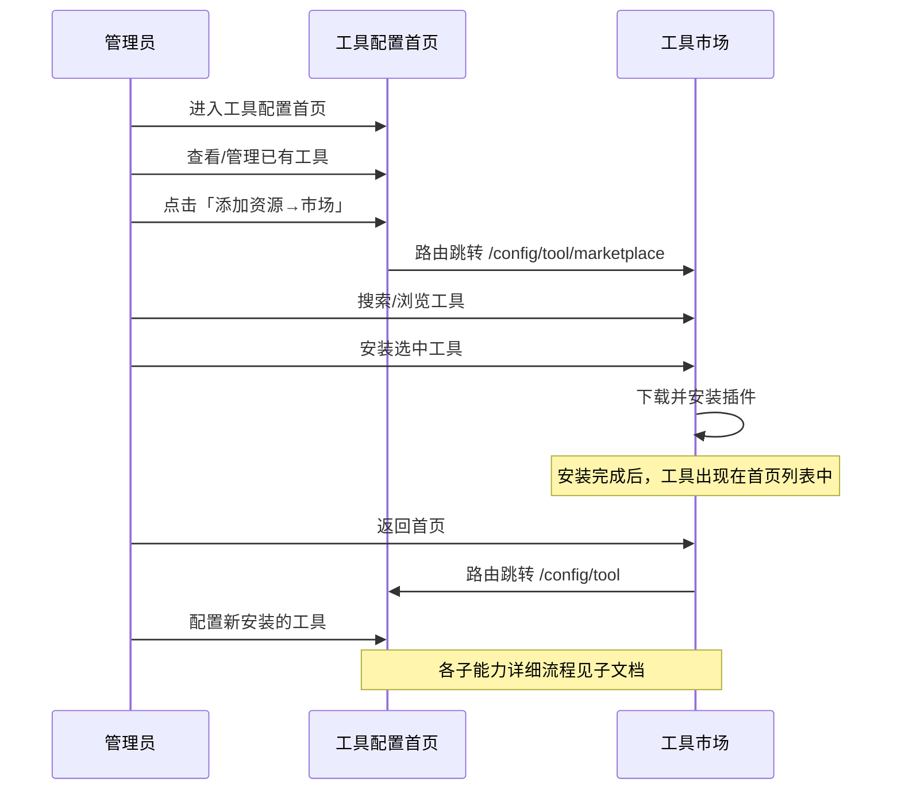

# 工具配置 — 业务流程详解

本模块为工具配置的分组索引节点，各子能力的详细业务流程请参见对应文档。

## 子能力业务流程索引

| 子能力 | 业务描述 | 业务流程索引 | 业务流程详解 |
|--------|---------|------------|------------|
| 工具配置首页 | 系统工具的集中管理台，支持查看、配置、拖拽排序、导入工具 | [09-业务流程索引](../工具配置首页/业务流程索引.md) | [10-业务流程详解](../工具配置首页/业务流程详解.md) |
| 工具市场 | 连接外部 Marketplace，浏览、搜索、安装、更新和卸载工具 | [09-业务流程索引](../工具市场/业务流程索引.md) | [10-业务流程详解](../工具市场/业务流程详解.md) |

## 模块级关系

工具配置首页和工具市场之间存在业务流转关系：

- **工具市场 → 工具配置首页**：在市场安装工具后，工具自动出现在首页列表中
- **工具配置首页 → 工具市场**：通过「添加资源→市场」按钮可直接跳转到市场页面

两者共同构成「发现（市场）→ 安装（市场）→ 配置（首页）→ 管控（首页）」的完整工具生命周期管理。

## Mermaid 附录

