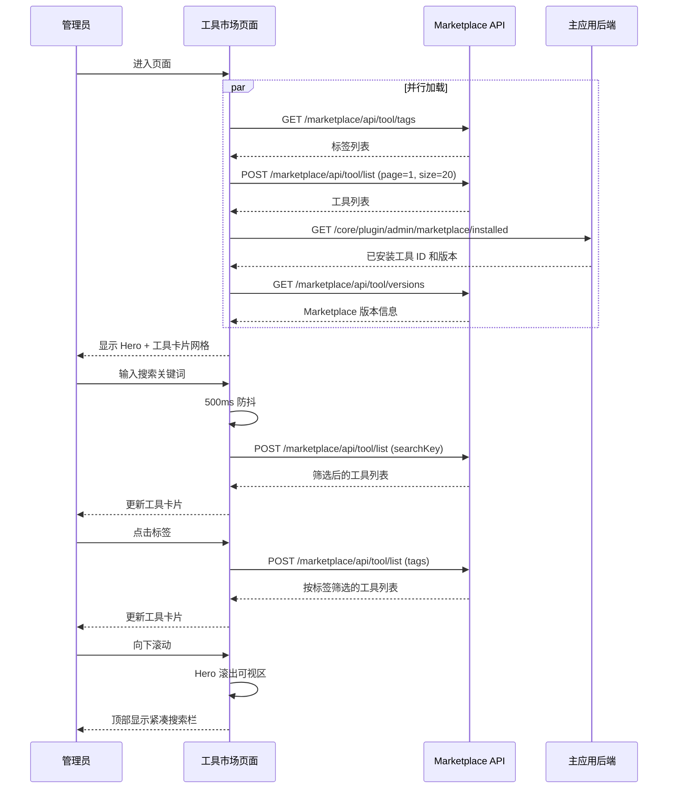
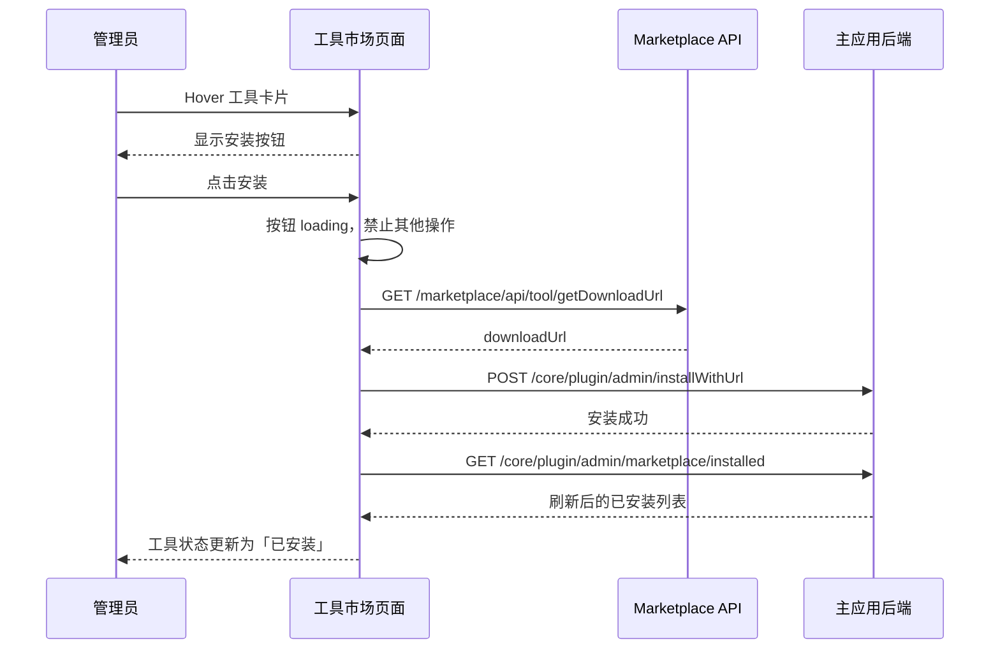
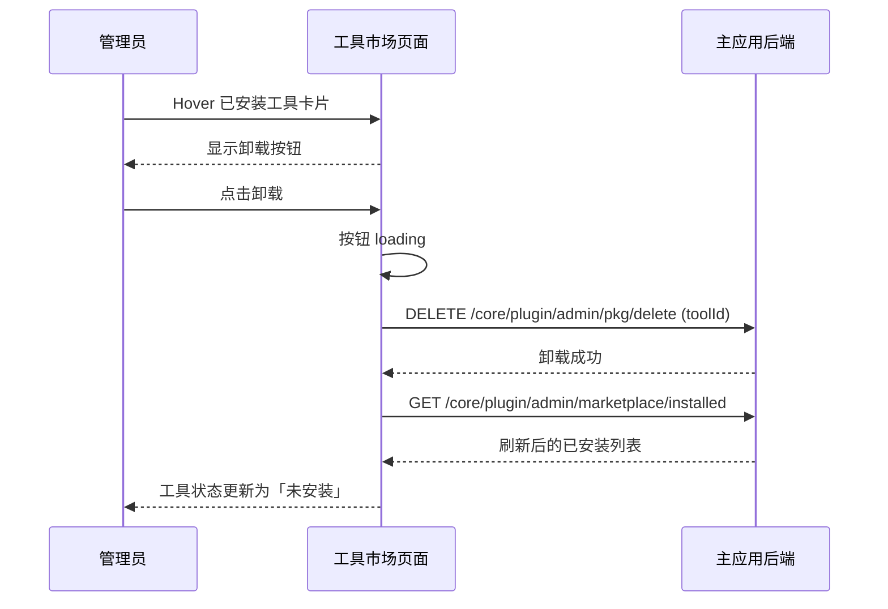
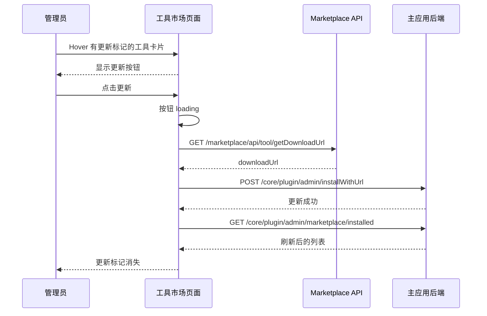
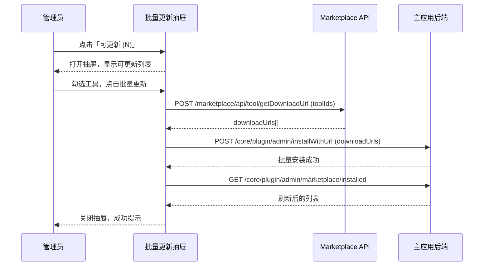
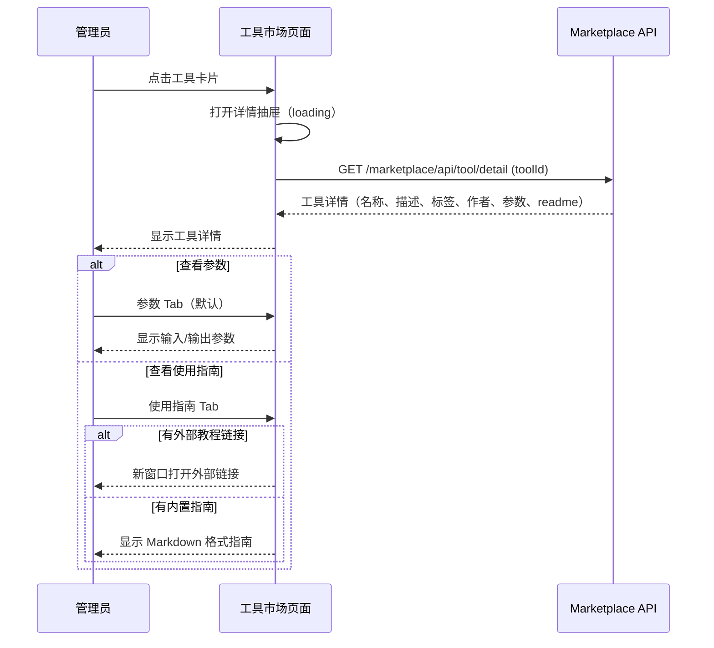

# 工具市场 — 业务流程详解

## 页面总览

工具市场是系统工具的在线商店页面，管理员在此浏览、搜索、安装和管理来自 Marketplace 服务的第三方工具。页面采用响应式网格布局展示工具卡片，支持关键词搜索、标签筛选、安装状态过滤和批量更新。

## 非 Tab 业务流程

### 页面初始化

#### 步骤 1：进入页面并加载数据

| 用户操作 | 触发 API | 分支条件 | 页面变化 |
|---------|---------|---------|---------|
| 从工具管理页点击「打开市场」进入 `/config/tool/marketplace` | GET `/marketplace/api/tool/tags`（获取标签列表） | 始终调用 | 页面加载，显示左侧 Dashboard 侧边栏（PC 端） |
| 页面自动加载初始数据 | POST `/marketplace/api/tool/list`（获取工具列表，pageNum=1, pageSize=20） | 始终调用 | 显示 Hero 区域（品牌标语 + 搜索框）和工具卡片网格 |
| 页面自动加载初始数据 | GET `/core/plugin/admin/marketplace/installed`（获取已安装工具列表） | 始终调用 | 工具卡片上标记「已安装」状态或显示「更新」标记 |
| 页面自动加载初始数据 | GET `/marketplace/api/tool/versions`（获取 Marketplace 版本信息） | 始终调用 | 计算可更新工具列表，右上角显示「可更新 (N)」按钮 |

**数据加载详情**:

| 加载阶段 | API | 关键参数 | 数据处理 | 渲染结果 |
|---------|-----|---------|---------|---------|
| 首次加载 | POST /marketplace/api/tool/list | pageNum=1, pageSize=20 | 合并已安装状态、i18n 名称解析、标签名称匹配 | 工具卡片网格（最多 4 列） |
| 翻页（滚动） | POST /marketplace/api/tool/list | pageNum=N, pageSize=20 | 同首次加载，追加到已有列表 | 追加新卡片到列表末尾 |
| 筛选刷新 | POST /marketplace/api/tool/list | pageNum=1, pageSize=20, searchKey/tags | 重置列表，按新条件请求 | 网格替换为新列表 |

- **分页参数**: 滚动加载，每页 20 条
- **筛选条件**: 搜索关键词（searchKey）、标签ID 列表（tags）、安装状态过滤（前端过滤，非 API 参数）

#### 步骤 2：Marketplace 服务不可用时的处理

| 用户操作 | 触发 API | 分支条件 | 页面变化 |
|---------|---------|---------|---------|
| 进入页面 | POST /marketplace/api/tool/list | API 请求失败（toolsError && !loadingTools） | 隐藏工具网格和 Hero 区域 |
| — | — | — | 显示错误页面：空白图标 + 「插件市场连接失败」提示 + Marketplace URL + 复制按钮 + 关闭按钮（返回工具管理） |

---

### S01：浏览与搜索工具

#### 步骤 1：关键词搜索

| 用户操作 | 触发 API | 分支条件 | 页面变化 |
|---------|---------|---------|---------|
| 在搜索框中输入文字 | — | — | 输入值实时更新，显示清除按钮 |
| 停止输入 500ms 后 | POST `/marketplace/api/tool/list`（携带 searchKey） | 搜索词通过 URL query 参数 `search` 同步 | URL 更新为 `?search=xxx`，工具列表刷新 |

#### 步骤 2：标签筛选

| 用户操作 | 触发 API | 分支条件 | 页面变化 |
|---------|---------|---------|---------|
| 点击某个标签 | POST `/marketplace/api/tool/list`（携带 tags 参数） | 标签 ID 通过 URL query 参数 `tags` 以逗号分隔同步 | 标签高亮选中态，工具列表按标签筛选刷新 |
| 再次点击已选中标签 | POST `/marketplace/api/tool/list`（移除该 tag） | — | 标签取消选中，列表更新 |
| 点击「全部」标签 | POST `/marketplace/api/tool/list`（不带 tags） | — | 清除所有标签筛选，显示全部工具 |

#### 步骤 3：筛选未安装工具

| 用户操作 | 触发 API | 分支条件 | 页面变化 |
|---------|---------|---------|---------|
| 点击筛选下拉菜单，选择「未安装」 | —（前端过滤，不触发 API） | `installedFilter === true` | 工具列表仅显示 `installed === false` 的工具 |
| 选择「全部」 | — | `installedFilter === false` | 显示所有工具 |

#### 步骤 4：Hero 区域滚动收起

| 用户操作 | 触发 API | 分支条件 | 页面变化 |
|---------|---------|---------|---------|
| 向下滚动页面，Hero 区域滚出可视区 | — | IntersectionObserver 检测 Hero 不可见 | 顶部出现紧凑搜索栏（含搜索框 + 标签筛选），Hero 区域渐隐 |
| 向上滚动使 Hero 重新可见 | — | IntersectionObserver 检测 Hero 可见 | 紧凑搜索栏收起，Hero 区域渐显 |

**Mermaid 附录**:

---

### S02：安装工具

#### 步骤 1：安装操作

| 用户操作 | 触发 API | 分支条件 | 页面变化 |
|---------|---------|---------|---------|
| Hover 工具卡片 | — | 工具未安装 | 卡片底部显示「安装」按钮 |
| 点击「安装」按钮 | GET `/marketplace/api/tool/getDownloadUrl`（获取下载链接） | — | 按钮显示 loading 状态，卡片不可点击 |
| — | POST `/core/plugin/admin/installWithUrl`（传入 downloadUrl） | downloadUrl 存在 | — |
| — | GET `/core/plugin/admin/marketplace/installed`（刷新已安装列表） | 安装成功 | 工具卡片状态更新为「已安装」；若详情抽屉打开则同步更新状态 |
| — | — | downloadUrl 不存在 | 按钮恢复，操作中断 |

**操作防重**: 同一工具的安装/卸载/更新操作通过 `operatingPromisesRef` 互斥，重复点击同一按钮会等待前一个操作完成。

**Mermaid 附录**:

---

### S03：卸载工具

#### 步骤 1：卸载操作

| 用户操作 | 触发 API | 分支条件 | 页面变化 |
|---------|---------|---------|---------|
| Hover 已安装工具卡片 | — | 工具已安装 | 卡片底部显示「卸载」按钮 |
| 点击「卸载」按钮 | DELETE `/core/plugin/admin/pkg/delete`（传入 toolId） | — | 按钮显示 loading 状态 |
| — | GET `/core/plugin/admin/marketplace/installed`（刷新） | 卸载成功 | 工具状态更新为「未安装」；若详情抽屉打开则同步更新 |

**Mermaid 附录**:

---

### S04：更新工具

#### 步骤 1：单工具更新

| 用户操作 | 触发 API | 分支条件 | 页面变化 |
|---------|---------|---------|---------|
| Hover 有更新的工具卡片 | — | 工具已安装且版本落后 | 卡片右上角显示「有新版本」标记 + 底部「更新」按钮 |
| 点击「更新」按钮 | GET `/marketplace/api/tool/getDownloadUrl` | — | 按钮 loading |
| — | POST `/core/plugin/admin/installWithUrl` | downloadUrl 存在 | — |
| — | GET `/core/plugin/admin/marketplace/installed` | 更新成功 | 工具更新标记消失 |

**Mermaid 附录**:

---

### S05：批量更新工具

#### 步骤 1：打开批量更新抽屉

| 用户操作 | 触发 API | 分支条件 | 页面变化 |
|---------|---------|---------|---------|
| 点击右上角「可更新 (N)」按钮 | — | `updatableTools.length > 0` | 打开批量更新抽屉，显示可更新工具列表（含复选框） |

#### 步骤 2：选择工具并批量更新

| 用户操作 | 触发 API | 分支条件 | 页面变化 |
|---------|---------|---------|---------|
| 勾选/取消勾选工具 | — | — | 底部操作栏显示已选数量 |
| 点击全选复选框 | — | — | 全选/取消全选所有可更新工具 |
| 点击「批量更新」按钮 | POST `/marketplace/api/tool/getDownloadUrl`（批量获取下载链接） | 有选中工具 | 按钮 loading |
| — | POST `/core/plugin/admin/installWithUrl`（传入 downloadUrls 数组） | — | — |
| — | GET `/core/plugin/admin/marketplace/installed`（刷新） | 批量安装成功 | 关闭抽屉，成功提示 |

#### 步骤 3：从列表查看单个工具详情

| 用户操作 | 触发 API | 分支条件 | 页面变化 |
|---------|---------|---------|---------|
| 点击工具行的「查看详情」 | GET `/marketplace/api/tool/detail`（获取工具详情） | — | 抽屉切换到详情视图，显示工具信息、参数/使用指南 Tab |

**Mermaid 附录**:

---

### S06：查看工具详情

#### 步骤 1：打开详情抽屉

| 用户操作 | 触发 API | 分支条件 | 页面变化 |
|---------|---------|---------|---------|
| 点击工具卡片 | GET `/marketplace/api/tool/detail`（传入 toolId） | 始终调用 | 右侧滑出详情抽屉，显示 loading 状态 |
| — | — | 详情加载完成 | 显示工具图标、名称、标签、描述、作者信息 |

#### 步骤 2：查看工具参数

| 用户操作 | 触发 API | 分支条件 | 页面变化 |
|---------|---------|---------|---------|
| 详情抽屉默认显示「参数」Tab | — | `isToolSet === false`（普通工具） | 显示工具的输入参数和输出参数列表 |
| — | — | `isToolSet === true`（工具集） | 显示子工具手风琴列表，可展开查看各子工具详情 |

#### 步骤 3：查看使用指南

| 用户操作 | 触发 API | 分支条件 | 页面变化 |
|---------|---------|---------|---------|
| 点击「使用指南」Tab | — | 工具有 `courseUrl`（外部教程链接） | 新窗口打开外部教程链接 |
| 点击「使用指南」Tab | — | 工具有 `readme` 或 `userGuide` 内容（无外部链接） | 切换 Tab 显示 Markdown 格式的使用指南 |

**Mermaid 附录**:

