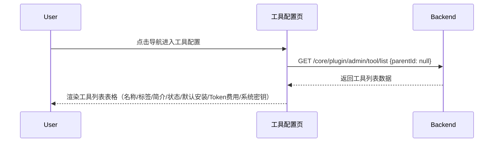
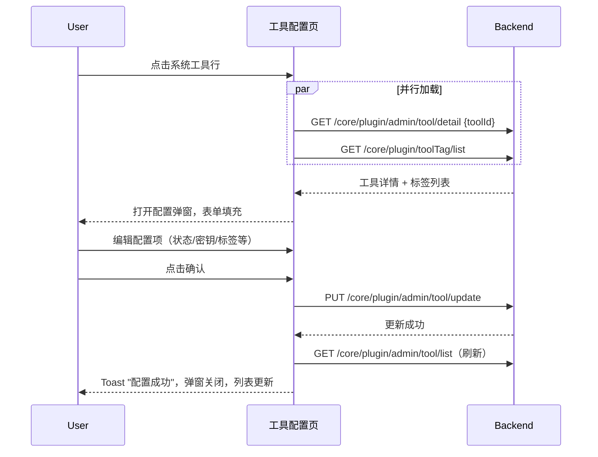
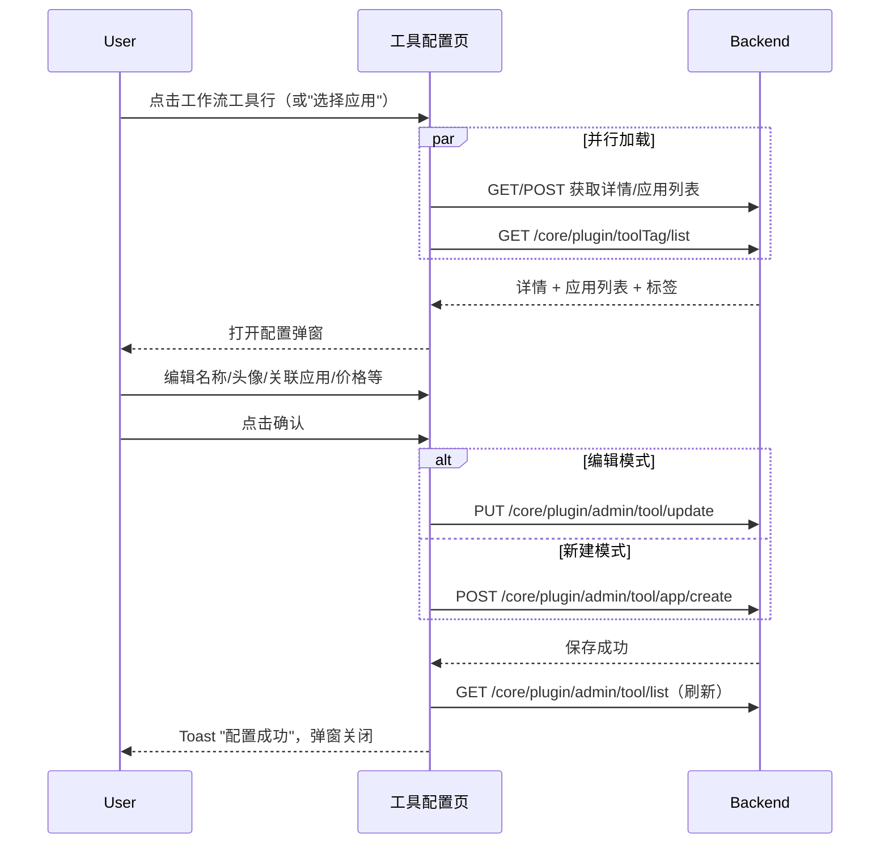
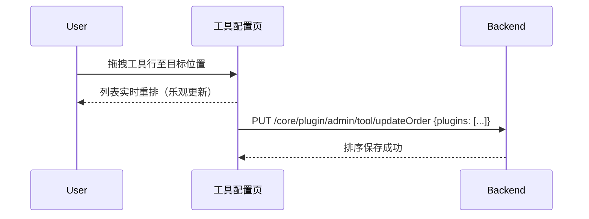
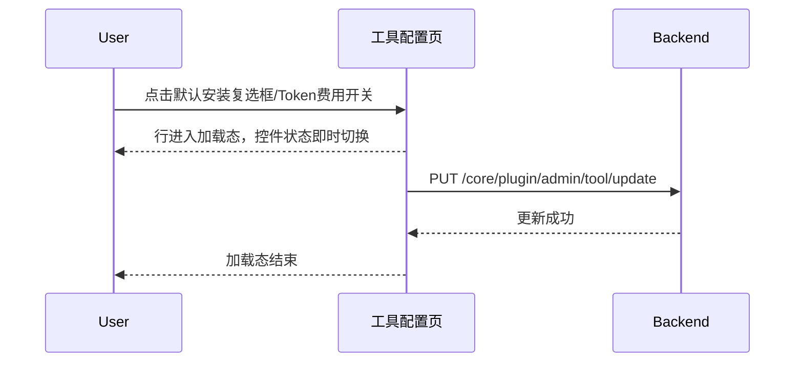

# 工具配置首页 — 业务流程详解

## 页面总览

工具配置首页是管理员对系统工具进行集中管理的页面。页面由顶部操作栏（标题、标签管理按钮、添加资源菜单）、列标题行、可拖拽排序的工具列表、以及按需弹出的配置弹窗组成。页面加载时自动获取工具列表，工具以行形式展示，每行包含名称、标签、简介、状态、默认安装、Token 费用、系统密钥等字段。管理员可在行上直接切换部分属性，或点击行打开对应类型的配置弹窗进行详细编辑。

本页面无 Tab 拆分，所有业务场景在一个页面内完成。

---

### S01 — 查看工具列表

> 管理员进入工具配置首页，系统自动加载并展示所有已安装的系统工具列表。

#### 步骤 1：页面加载与数据获取

| 用户操作 | 触发 API | 分支条件 | 页面变化 |
|---------|---------|---------|---------|
| 点击导航菜单进入工具配置页 | `GET /core/plugin/admin/tool/list`（参数 `{ parentId: null }`） 服务端渲染阶段执行 `getServerSideProps` 注入 i18n 词条 | 用户未登录 → 服务端重定向到登录页 | 页面加载中，AccountContainer 渲染左侧导航栏，页面主体区域显示空白加载态 |
| 等待 API 响应 | — | API 返回成功 → 数据存入 `localTools` | 工具列表渲染，每行显示工具名称、头像、标签、简介、状态、默认安装复选框、Token 费用开关、系统密钥状态 |
| — | — | API 返回空数组 | 页面中央显示空状态提示：无插件 |
| — | — | API 返回失败 | Toast 错误提示（由 `useRequest` 内置错误处理触发） |

#### 数据加载详情

| 加载阶段 | API | 关键参数 | 数据处理 | 渲染结果 |
|---------|-----|---------|---------|---------|
| 首次加载 | GET /core/plugin/admin/tool/list | `parentId: null` | 直接赋值 `setLocalTools(data)` | 工具列表全量展示 |
| 操作后刷新 | GET /core/plugin/admin/tool/list | `parentId: null` | 通过 `refreshTools()` 重新获取 | 列表更新为新数据 |

- 排序规则：按后端返回顺序展示（可通过拖拽调整并在下次加载时生效）
- 筛选条件：本页无前端筛选，列表展示所有工具

---

### S02 — 管理工具标签

> 管理员打开标签管理弹窗，对工具标签进行增删改查和排序。

#### 步骤 1：打开标签管理弹窗

| 用户操作 | 触发 API | 分支条件 | 页面变化 |
|---------|---------|---------|---------|
| 点击"标签管理"按钮 | 无（弹窗组件 `TagManageModal` 内部独立管理 API 调用） | — | 弹窗打开，背景遮罩显示，弹窗内加载标签列表 |

#### 步骤 2：在弹窗内操作标签

| 用户操作 | 触发 API | 分支条件 | 页面变化 |
|---------|---------|---------|---------|
| 执行标签的增删改查或排序 | 由 `TagManageModal` 组件内部调用 tag 相关 API（`createPluginToolTag` / `updatePluginToolTag` / `deletePluginToolTag` / `updatePluginToolTagOrder`） | 各操作有成功/失败分支 | 弹窗内列表即时更新 |
| 点击弹窗关闭按钮或遮罩 | 无 | — | 弹窗关闭 |

---

### S03 — 添加工具资源

> 管理员通过"添加资源"下拉菜单选择添加新工具的方式。

#### 步骤 1：展开添加菜单

| 用户操作 | 触发 API | 分支条件 | 页面变化 |
|---------|---------|---------|---------|
| 鼠标悬停在"添加资源"按钮上 | 无 | — | 下拉菜单展开，显示三个选项：「从市场添加」「导入资源」「选择应用」 |

#### 步骤 2：选择添加方式

| 用户操作 | 触发 API | 分支条件 | 页面变化 |
|---------|---------|---------|---------|
| 点击「从市场添加」 | 无 | — | 路由跳转到 `/config/tool/marketplace`（工具市场页面） |
| 点击「导入资源」 | 无 | — | `ImportPluginModal` 弹窗打开（详见 S08） |
| 点击「选择应用」 | 无 | `editingToolId` 置为空字符串 | `WorkflowToolConfigModal` 弹窗打开，进入新建模式（详见 S05） |

---

### S04 — 配置系统工具

> 管理员点击系统内置类型的工具行，打开配置弹窗修改工具的各项配置。

#### 步骤 1：打开配置弹窗

| 用户操作 | 触发 API | 分支条件 | 页面变化 |
|---------|---------|---------|---------|
| 点击系统工具行（`tool` 来源为 `AppToolSourceEnum.systemTool`） | `GET /core/plugin/admin/tool/detail`（参数 `{ toolId }`） `GET /core/plugin/toolTag/list` | `loading=true` | 弹窗以加载态打开，标题显示工具名称 |
| 等待详情和标签 API 返回 | — | 两个 API 均成功 → 详情数据填充表单，标签过滤掉无效 ID | 弹窗加载完成，表单可编辑 |

#### 步骤 2：编辑配置（非文件夹工具）

| 用户操作 | 触发 API | 分支条件 | 页面变化 |
|---------|---------|---------|---------|
| 修改状态（正常/即将下线/已下线） | 无（本地表单状态） | 选择"即将下线"或"已下线" → 默认安装自动设为 false | 下拉切换，默认安装开关联动禁用 |
| 切换默认安装开关 | 无 | 开关打开且状态非正常 → 状态自动切换为正常；`feConfigs?.isPlus` 控制开关可见性 | 开关状态切换 |
| 开关系统密钥配置 | 无 | 工具无 `inputList` → 不显示此开关；开关打开 → 渲染输入字段列表（根据 `inputList` 的 `inputType` 渲染文本框或开关） | 表单区域展开，显示密钥输入字段 |
| 修改标签 | 无 | 标签数量超过 3 个 → Toast 提示"标签最大限制为 3 个" | 多选下拉更新已选标签 |
| 修改推广/隐藏用户标签 | 无 | `feConfigs?.showWecomConfig` 为 true 时才显示 | 多选下拉更新 |

#### 步骤 3：编辑配置（文件夹工具）

| 用户操作 | 触发 API | 分支条件 | 页面变化 |
|---------|---------|---------|---------|
| 打开文件夹类型工具弹窗 | 同步骤 1 | `tool.isFolder === true` | 弹窗宽度扩展为 900px，左侧为基本配置区，右侧为子工具列表表格 |
| 查看子工具列表 | 无（数据来自详情 API 的 `childTools`） | — | 表格显示每个子工具的名称和系统密钥价格 |
| 修改子工具的系统密钥价格 | 无（表单注册到 `childTools.{index}.systemKeyCost`） | — | MyNumberInput 更新对应子工具价格 |

#### 步骤 4：保存或删除

| 用户操作 | 触发 API | 分支条件 | 页面变化 |
|---------|---------|---------|---------|
| 点击确认按钮 | `PUT /core/plugin/admin/tool/update`（参数含 `pluginId`、`status`、`defaultInstalled`、`inputListVal`、`systemKeyCost`、`tagIds`、`promoteTags`、`hideTags`、`childTools`） | API 成功 → `onSuccess()` + `onClose()` | Toast "配置成功"，弹窗关闭，列表刷新 |
| — | — | API 失败 → 弹窗不关闭 | Toast 错误提示 |
| 点击删除按钮 → 确认 | `DELETE /core/plugin/admin/pkg/delete`（参数 `{ toolId: toolId.split('-')[1] }`） | 确认后执行删除 | 加载态 → 成功后弹窗关闭，列表刷新 |

---

### S05 — 配置工作流工具

> 管理员新建或编辑工作流/应用类型工具，配置名称、头像、关联应用、价格等信息。

#### 步骤 1：打开配置弹窗（编辑模式）

| 用户操作 | 触发 API | 分支条件 | 页面变化 |
|---------|---------|---------|---------|
| 点击工作流/应用类型工具行 | `GET /core/plugin/admin/tool/detail`（参数 `{ toolId }`） `POST /core/plugin/admin/tool/app/systemApps`（参数 `{ searchKey: '' }`） `GET /core/plugin/toolTag/list` | `toolId` 存在 → 进入编辑模式 | 弹窗加载态打开，标题显示工具名称 |
| 等待 API 返回 | — | 全部成功 | 表单填充：名称、头像、简介、关联应用、标签、作者、状态、价格、Token 费用、用户指南 |

#### 步骤 2：打开配置弹窗（新建模式）

| 用户操作 | 触发 API | 分支条件 | 页面变化 |
|---------|---------|---------|---------|
| "添加资源"→"选择应用" | `POST /core/plugin/admin/tool/app/systemApps`（参数 `{ searchKey: '' }`） `GET /core/plugin/toolTag/list` | `toolId` 为空 → 进入新建模式 | 弹窗打开，表单为空，无删除按钮 |

#### 步骤 3：编辑工具信息

| 用户操作 | 触发 API | 分支条件 | 页面变化 |
|---------|---------|---------|---------|
| 点击头像上传 | 上传头像 API（通过 `useUploadAvatar` 调用 `getUploadAvatarPresignedUrl`） | 上传中 → 头像区域半透明，点击禁用 | 上传完成后头像更新 |
| 输入名称 | 无 | 名称为空 → 提交时校验失败提示"名称不能为空" | 输入框更新 |
| 输入简介 | 无 | — | 文本域更新 |
| 搜索并选择关联应用 | `POST /core/plugin/admin/tool/app/systemApps`（参数 `{ searchKey }`，搜索词变化时重新请求） | 输入框获得焦点 → 下拉菜单打开，显示搜索结果列表；失焦且未选择 → 恢复上次关联应用 ID | 输入框下方显示应用列表，点击应用行选中并关闭菜单 |
| 选择标签 | 无 | 标签超过 3 个 → Toast "标签最大限制为 3 个" | 多选下拉更新 |
| 输入作者 | 无 | — | 输入框更新 |
| 选择状态 | 无 | 选择非正常状态 → 默认安装自动设为 false | 下拉切换 + 默认安装联动 |
| 切换默认安装 | 无 | 开关打开且状态非正常 → 状态自动恢复为正常 | 开关切换 |
| 设置调用价格 | 无 | 范围 0-1000，步长 0.1 | MyNumberInput 更新 |
| 切换 Token 费用 | 无 | — | 开关切换 |
| 编辑用户指南 | 无 | — | 文本域更新 |

#### 步骤 4：保存或删除

| 用户操作 | 触发 API | 分支条件 | 页面变化 |
|---------|---------|---------|---------|
| 点击确认（编辑模式） | `PUT /core/plugin/admin/tool/update` | `associatedPluginId` 为空 → 拒绝提交，提示"关联应用不能为空" | 按钮加载态 → Toast "配置成功" → 弹窗关闭 |
| 点击确认（新建模式） | `POST /core/plugin/admin/tool/app/create` | 同上的关联应用校验 | 按钮加载态 → Toast "配置成功" → 弹窗关闭 |
| 点击删除（仅编辑模式） | `DELETE /core/plugin/admin/tool/delete`（参数 `{ toolId }`） | 弹出 PopoverConfirm 确认弹窗："确认删除该工具？" | 删除加载态 → Toast "删除成功" → 弹窗关闭 |

---

### S06 — 调整工具排序

> 管理员拖拽工具行改变展示顺序。

#### 步骤 1：拖拽排序

| 用户操作 | 触发 API | 分支条件 | 页面变化 |
|---------|---------|---------|---------|
| 按住工具行左侧拖拽手柄开始拖拽 | 无 | — | 被拖拽行半透明（`opacity: 0.8`），其他行根据拖拽位置动态重排 |
| 松开放置工具行 | `PUT /core/plugin/admin/tool/updateOrder`（参数 `{ plugins: [{ pluginId, pluginOrder }, ...] }`） | API 成功 | 列表按新顺序展示（已乐观更新，API 仅持久化） |
| — | — | API 失败 | 无显式错误提示，但列表保持在乐观更新后的顺序（可能下次加载恢复） |

---

### S07 — 快捷切换工具属性

> 管理员在工具行上直接切换默认安装或 Token 费用，无需打开配置弹窗。

#### 步骤 1：切换默认安装

| 用户操作 | 触发 API | 分支条件 | 页面变化 |
|---------|---------|---------|---------|
| 点击工具行中的默认安装复选框 | `PUT /core/plugin/admin/tool/update`（参数 `{ pluginId: tool.id, defaultInstalled: newValue, status?: PluginStatusEnum.Normal }`） | 切换到已勾选且工具状态非正常 → 同时将状态设为正常 | 行进入加载态（`MyBox isLoading`），复选框状态立即切换 |
| — | — | API 成功 | 行加载态结束，复选框保持新状态 |
| — | — | API 失败 → Toast "更新失败" | 行加载态结束，通过 `setLocalTools` 乐观更新（可能不一致） |

#### 步骤 2：切换 Token 费用

| 用户操作 | 触发 API | 分支条件 | 页面变化 |
|---------|---------|---------|---------|
| 点击工具行中的 Token 费用开关 | `PUT /core/plugin/admin/tool/update`（参数 `{ pluginId: tool.id, hasTokenFee: newValue }`） | 工具无 `associatedPluginId` → 开关不可用（显示 "-"） | 行加载态，开关状态切换 |
| — | — | API 成功 | 行加载态结束 |
| — | — | API 失败 → Toast "更新失败" | 行加载态结束 |

---

### S08 — 导入插件包

> 管理员打开导入插件弹窗，上传或通过 URL 安装外部插件包。

#### 步骤 1：打开导入弹窗

| 用户操作 | 触发 API | 分支条件 | 页面变化 |
|---------|---------|---------|---------|
| "添加资源"→"导入资源" | 无 | `tools`（当前列表）传入 `ImportPluginModal` 用于重复检测 | `ImportPluginModal` 弹窗打开 |

#### 步骤 2：导入插件

| 用户操作 | 触发 API | 分支条件 | 页面变化 |
|---------|---------|---------|---------|
| 上传插件包文件或输入 URL 安装 | 由 `ImportPluginModal` 内部调用 `getPkgPluginUploadURL` / `parseUploadedPkgPlugin` / `confirmPkgPluginUpload` / `installPluginWithUrl` | 导入成功 → `onSuccess` 回调触发 `refreshTools()` | 弹窗关闭，工具列表刷新 |
| — | — | 导入失败 → 弹窗不关闭 | 弹窗内提示错误信息 |
| 点击取消 | 无 | — | 弹窗关闭 |

---

## Mermaid 附录

### S01 — 查看工具列表

### S04 — 配置系统工具

### S05 — 配置工作流工具

### S06 — 调整工具排序

### S07 — 快捷切换工具属性

