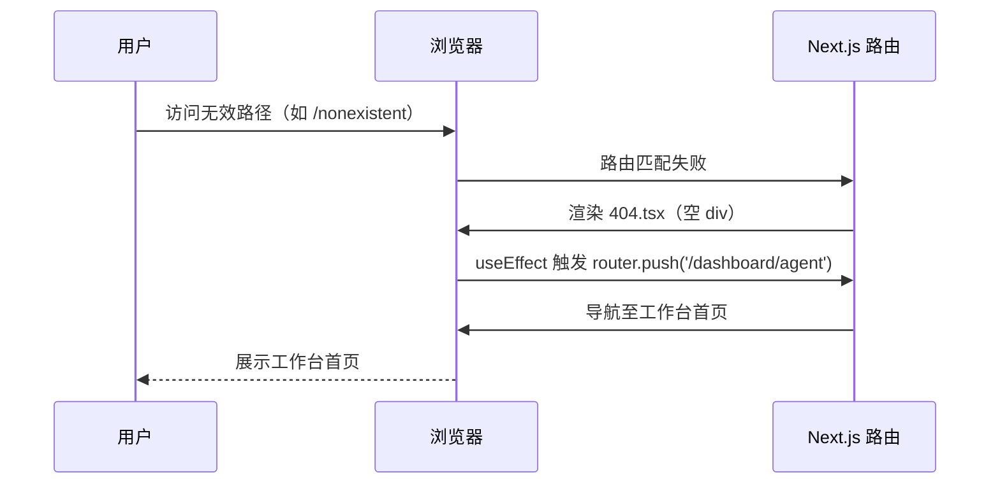

# 页面未找到 — 业务流程详解

## 页面总览

"页面未找到"是 FastGPT 的 404 兜底页面。当用户访问任何未注册的路由时，Next.js 自动渲染此页面，组件挂载后立即执行客户端路由跳转，将用户引导至应用工作台首页 `/dashboard/agent`。整个过程无声无息，用户不会看到任何错误提示 UI。

本页面无 Tab 结构，仅包含一个自动重定向流程。

### 访问无效路径

> 用户访问不存在的页面路径时，系统自动重定向至工作台首页，不展示错误信息。

#### 步骤 1：页面组件挂载

| 用户操作 | 触发 API | 分支条件 | 页面变化 |
|---------|---------|---------|---------|
| 用户在浏览器中输入无效 URL（如 `/nonexistent`），Next.js 路由匹配失败后渲染 `404.tsx` 页面组件 | 无 API 调用 | 无分支条件，所有无效路径均进入此页面 | 页面渲染空 `
`，用户看不到任何内容 |

#### 步骤 2：自动重定向

| 用户操作 | 触发 API | 分支条件 | 页面变化 |
|---------|---------|---------|---------|
| 无需用户操作，组件挂载后 `useEffect` 自动执行 | 无 HTTP API 调用。执行客户端路由 `router.push('/dashboard/agent')` | 无分支条件，始终重定向至同一目标 | 浏览器地址栏更新为 `/dashboard/agent`，页面切换至工作台首页 |

#### 数据加载详情

本场景不涉及数据加载。页面不发起任何 HTTP 请求，仅执行客户端路由跳转。

### Mermaid 附录

