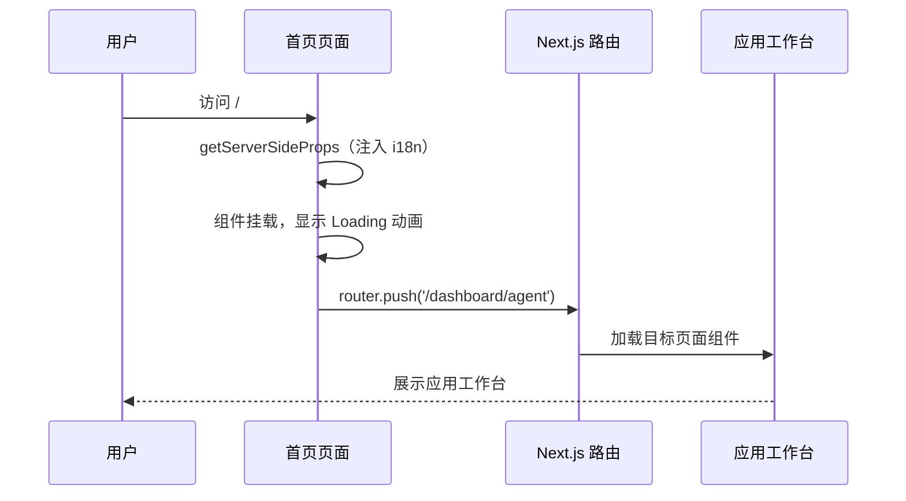

# 首页 — 业务流程详解

## 页面总览

首页是 FastGPT 平台的路由分发入口。用户访问根路径 `/` 时，页面不会停留，而是立即执行客户端路由跳转至应用工作台 `/dashboard/agent`。在跳转过程中，页面展示一个全屏加载动画（Spinner），确保用户体验平滑过渡。

由于首页本身不包含任何 Tab 结构或业务表单，本文档仅描述唯一的"页面访问重定向"流程。

---

### 页面访问重定向

> 用户访问平台根路径时，由 Next.js 页面组件自动完成路由跳转。

#### 步骤 1：服务端渲染准备

| 用户操作 | 触发 API | 分支条件 | 页面变化 |
|---------|---------|---------|---------|
| 用户在浏览器输入平台根地址并回车 | 无（服务端执行 `getServerSideProps`，注入国际化词条） | 无分支 | 服务端返回包含 i18n 词条的 HTML 页面 |

#### 步骤 2：客户端路由重定向

| 用户操作 | 触发 API | 分支条件 | 页面变化 |
|---------|---------|---------|---------|
| 页面在浏览器端加载完成 | 无 API 调用 | `useEffect` 在组件挂载后执行，无条件触发 | 显示全屏居中 Spinner 加载动画（半透明白色遮罩 + 主题色旋转图标）；随即执行 `router.push('/dashboard/agent')`，浏览器 URL 更新为目标路由 |

#### 步骤 3：落地目标页面

| 用户操作 | 触发 API | 分支条件 | 页面变化 |
|---------|---------|---------|---------|
| 无需用户操作（自动完成） | 由目标页面 `/dashboard/agent` 自行发起其所需 API 请求 | 目标页面的权限校验逻辑接管 | 加载动画消失，用户看到应用工作台页面内容 |

---

### Mermaid 附录

