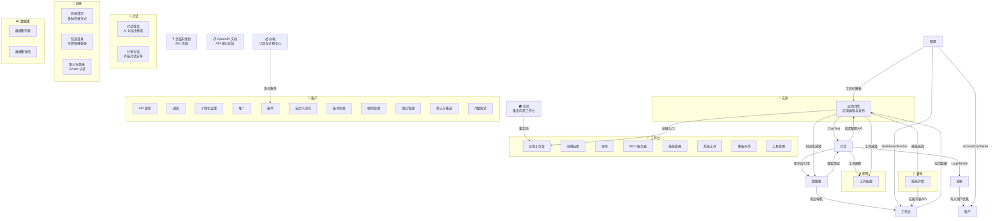

# 业务能力地图

## 一、能力依赖图

## 二、文档链接索引

### 共享文档

| 文档 | 路径 | 说明 |
|------|------|------|
| 仓库概览 | [仓库概览.md](./仓库概览.md) | 项目基本信息、技术栈、仓库结构 |
| 仓库架构 | [仓库架构.md](./仓库架构.md) | 整体架构、模块划分和分层设计 |
| 仓库依赖 | [仓库依赖.md](./仓库依赖.md) | 项目依赖关系、版本约束和包管理 |
| 外部接入指南 | [外部接入指南.md](./外部接入指南.md) | 集成 FastGPT API、获取密钥、调用接口 |
| 核心业务领域 | [业务知识库/核心业务领域.md](./业务知识库/核心业务领域.md) | 产品定位、业务功能和核心概念 |
| 业务流程索引 | [业务知识库/业务流程索引.md](./业务知识库/业务流程索引.md) | 核心业务流程和工作流节点 |
| 业务流程详解 | [业务知识库/业务流程详解.md](./业务知识库/业务流程详解.md) | 知识库、对话、工作流核心流程详解 |
| API 索引 | [技术知识库/API索引.md](./技术知识库/API索引.md) | API 接口、请求参数和响应格式 |
| 数据结构 | [技术知识库/数据结构.md](./技术知识库/数据结构.md) | 数据模型、Schema 定义和关键字段 |
| 代码编写指南 | [技术知识库/代码编写指南.md](./技术知识库/代码编写指南.md) | 开发规范、文件组织、命名约定 |
| 排障指南 | [技术知识库/排障指南.md](./技术知识库/排障指南.md) | 常见问题排查、错误解决和调试方法 |

---

### 首页

| 文档 | 路径 |
|------|------|
| 模块概览 | [业务知识库/首页/模块概览.md](./业务知识库/首页/模块概览.md) |
| 业务流程索引 | [业务知识库/首页/业务流程索引.md](./业务知识库/首页/业务流程索引.md) |
| 业务流程详解 | [业务知识库/首页/业务流程详解.md](./业务知识库/首页/业务流程详解.md) |
| API 索引 | [技术知识库/首页/API索引.md](./技术知识库/首页/API索引.md) |
| 组件列表 | [技术知识库/首页/组件列表.md](./技术知识库/首页/组件列表.md) |

---

### 页面未找到

| 文档 | 路径 |
|------|------|
| 模块概览 | [业务知识库/页面未找到/模块概览.md](./业务知识库/页面未找到/模块概览.md) |
| 业务流程索引 | [业务知识库/页面未找到/业务流程索引.md](./业务知识库/页面未找到/业务流程索引.md) |
| 业务流程详解 | [业务知识库/页面未找到/业务流程详解.md](./业务知识库/页面未找到/业务流程详解.md) |
| API 索引 | [技术知识库/页面未找到/API索引.md](./技术知识库/页面未找到/API索引.md) |
| 组件列表 | [技术知识库/页面未找到/组件列表.md](./技术知识库/页面未找到/组件列表.md) |

---

### OpenAPI 文档

| 文档 | 路径 |
|------|------|
| 模块概览 | [业务知识库/OpenAPI 文档/模块概览.md](./业务知识库/OpenAPI 文档/模块概览.md) |
| 业务流程索引 | [业务知识库/OpenAPI 文档/业务流程索引.md](./业务知识库/OpenAPI 文档/业务流程索引.md) |
| 业务流程详解 | [业务知识库/OpenAPI 文档/业务流程详解.md](./业务知识库/OpenAPI 文档/业务流程详解.md) |
| API 索引 | [技术知识库/OpenAPI 文档/API索引.md](./技术知识库/OpenAPI 文档/API索引.md) |
| 组件列表 | [技术知识库/OpenAPI 文档/组件列表.md](./技术知识库/OpenAPI 文档/组件列表.md) |

---

### 对话

| 文档 | 路径 |
|------|------|
| 模块概览 | [业务知识库/对话/模块概览.md](./业务知识库/对话/模块概览.md) |
| 业务流程索引 | [业务知识库/对话/业务流程索引.md](./业务知识库/对话/业务流程索引.md) |
| 业务流程详解 | [业务知识库/对话/业务流程详解.md](./业务知识库/对话/业务流程详解.md) |
| API 索引 | [技术知识库/对话/API索引.md](./技术知识库/对话/API索引.md) |
| 组件列表 | [技术知识库/对话/组件列表.md](./技术知识库/对话/组件列表.md) |

#### 对话首页

| 文档 | 路径 |
|------|------|
| 模块概览 | [业务知识库/对话/对话首页/模块概览.md](./业务知识库/对话/对话首页/模块概览.md) |
| 业务流程索引 | [业务知识库/对话/对话首页/业务流程索引.md](./业务知识库/对话/对话首页/业务流程索引.md) |
| 业务流程详解 | [业务知识库/对话/对话首页/业务流程详解.md](./业务知识库/对话/对话首页/业务流程详解.md) |
| 共享能力清单 | [业务知识库/对话/对话首页/共享能力清单.md](./业务知识库/对话/对话首页/共享能力清单.md) |
| API 索引 | [技术知识库/对话/对话首页/API索引.md](./技术知识库/对话/对话首页/API索引.md) |
| 组件列表 | [技术知识库/对话/对话首页/组件列表.md](./技术知识库/对话/对话首页/组件列表.md) |
| Store 数据流 | [技术知识库/对话/对话首页/Store数据流.md](./技术知识库/对话/对话首页/Store数据流.md) |
| Hooks 工具函数 | [技术知识库/对话/对话首页/Hooks工具函数.md](./技术知识库/对话/对话首页/Hooks工具函数.md) |
| 共享组件清单 | [技术知识库/对话/对话首页/共享组件清单.md](./技术知识库/对话/对话首页/共享组件清单.md) |

##### 对话首页 Tab

| Tab | 模块概览 | 业务流程索引 | 业务流程详解 | API 索引 | 组件列表 |
|-----|---------|-------------|-------------|---------|---------|
| 首页 | [链接](./业务知识库/对话/对话首页/首页/模块概览.md) | [链接](./业务知识库/对话/对话首页/首页/业务流程索引.md) | [链接](./业务知识库/对话/对话首页/首页/业务流程详解.md) | [链接](./技术知识库/对话/对话首页/首页/API索引.md) | [链接](./技术知识库/对话/对话首页/首页/组件列表.md) |
| 团队应用 | [链接](./业务知识库/对话/对话首页/团队应用/模块概览.md) | [链接](./业务知识库/对话/对话首页/团队应用/业务流程索引.md) | [链接](./业务知识库/对话/对话首页/团队应用/业务流程详解.md) | [链接](./技术知识库/对话/对话首页/团队应用/API索引.md) | [链接](./技术知识库/对话/对话首页/团队应用/组件列表.md) |
| 精选应用 | [链接](./业务知识库/对话/对话首页/精选应用/模块概览.md) | [链接](./业务知识库/对话/对话首页/精选应用/业务流程索引.md) | [链接](./业务知识库/对话/对话首页/精选应用/业务流程详解.md) | [链接](./技术知识库/对话/对话首页/精选应用/API索引.md) | [链接](./技术知识库/对话/对话首页/精选应用/组件列表.md) |
| 最近使用 | [链接](./业务知识库/对话/对话首页/最近使用/模块概览.md) | [链接](./业务知识库/对话/对话首页/最近使用/业务流程索引.md) | [链接](./业务知识库/对话/对话首页/最近使用/业务流程详解.md) | [链接](./技术知识库/对话/对话首页/最近使用/API索引.md) | [链接](./技术知识库/对话/对话首页/最近使用/组件列表.md) |
| 设置 | [链接](./业务知识库/对话/对话首页/设置/业务流程索引.md) | [链接](./业务知识库/对话/对话首页/设置/业务流程详解.md) | — | [链接](./技术知识库/对话/对话首页/设置/API索引.md) | [链接](./技术知识库/对话/对话首页/设置/组件列表.md) |

##### 设置 Tab 子页

| Tab | 模块概览 | 业务流程索引 | 业务流程详解 | API 索引 | 组件列表 |
|-----|---------|-------------|-------------|---------|---------|
| 首页设置 | [链接](./业务知识库/对话/对话首页/设置/首页设置/模块概览.md) | [链接](./业务知识库/对话/对话首页/设置/首页设置/业务流程索引.md) | [链接](./业务知识库/对话/对话首页/设置/首页设置/业务流程详解.md) | [链接](./技术知识库/对话/对话首页/设置/首页设置/API索引.md) | [链接](./技术知识库/对话/对话首页/设置/首页设置/组件列表.md) |
| 收藏应用 | [链接](./业务知识库/对话/对话首页/设置/收藏应用/模块概览.md) | [链接](./业务知识库/对话/对话首页/设置/收藏应用/业务流程索引.md) | [链接](./业务知识库/对话/对话首页/设置/收藏应用/业务流程详解.md) | [链接](./技术知识库/对话/对话首页/设置/收藏应用/API索引.md) | [链接](./技术知识库/对话/对话首页/设置/收藏应用/组件列表.md) |
| 数据看板 | [链接](./业务知识库/对话/对话首页/设置/数据看板/模块概览.md) | [链接](./业务知识库/对话/对话首页/设置/数据看板/业务流程索引.md) | [链接](./业务知识库/对话/对话首页/设置/数据看板/业务流程详解.md) | [链接](./技术知识库/对话/对话首页/设置/数据看板/API索引.md) | [链接](./技术知识库/对话/对话首页/设置/数据看板/组件列表.md) |
| 日志详情 | [链接](./业务知识库/对话/对话首页/设置/日志详情/模块概览.md) | [链接](./业务知识库/对话/对话首页/设置/日志详情/业务流程索引.md) | [链接](./业务知识库/对话/对话首页/设置/日志详情/业务流程详解.md) | [链接](./技术知识库/对话/对话首页/设置/日志详情/API索引.md) | [链接](./技术知识库/对话/对话首页/设置/日志详情/组件列表.md) |

#### 分享对话

| 文档 | 路径 |
|------|------|
| 模块概览 | [业务知识库/对话/分享对话/模块概览.md](./业务知识库/对话/分享对话/模块概览.md) |
| 业务流程索引 | [业务知识库/对话/分享对话/业务流程索引.md](./业务知识库/对话/分享对话/业务流程索引.md) |
| 业务流程详解 | [业务知识库/对话/分享对话/业务流程详解.md](./业务知识库/对话/分享对话/业务流程详解.md) |
| API 索引 | [技术知识库/对话/分享对话/API索引.md](./技术知识库/对话/分享对话/API索引.md) |
| 组件列表 | [技术知识库/对话/分享对话/组件列表.md](./技术知识库/对话/分享对话/组件列表.md) |
| Store 数据流 | [技术知识库/对话/分享对话/Store数据流.md](./技术知识库/对话/分享对话/Store数据流.md) |

---

### 应用

| 文档 | 路径 |
|------|------|
| 模块概览 | [业务知识库/应用/模块概览.md](./业务知识库/应用/模块概览.md) |
| 业务流程索引 | [业务知识库/应用/业务流程索引.md](./业务知识库/应用/业务流程索引.md) |
| 业务流程详解 | [业务知识库/应用/业务流程详解.md](./业务知识库/应用/业务流程详解.md) |
| API 索引 | [技术知识库/应用/API索引.md](./技术知识库/应用/API索引.md) |
| 组件列表 | [技术知识库/应用/组件列表.md](./技术知识库/应用/组件列表.md) |

#### 应用详情

| 文档 | 路径 |
|------|------|
| 模块概览 | [业务知识库/应用/应用详情/模块概览.md](./业务知识库/应用/应用详情/模块概览.md) |
| 业务流程索引 | [业务知识库/应用/应用详情/业务流程索引.md](./业务知识库/应用/应用详情/业务流程索引.md) |
| 业务流程详解 | [业务知识库/应用/应用详情/业务流程详解.md](./业务知识库/应用/应用详情/业务流程详解.md) |
| 共享能力清单 | [业务知识库/应用/应用详情/共享能力清单.md](./业务知识库/应用/应用详情/共享能力清单.md) |
| API 索引 | [技术知识库/应用/应用详情/API索引.md](./技术知识库/应用/应用详情/API索引.md) |
| 组件列表 | [技术知识库/应用/应用详情/组件列表.md](./技术知识库/应用/应用详情/组件列表.md) |
| Hooks 工具函数 | [技术知识库/应用/应用详情/Hooks工具函数.md](./技术知识库/应用/应用详情/Hooks工具函数.md) |

---

### 登录

| 文档 | 路径 |
|------|------|
| 模块概览 | [业务知识库/登录/模块概览.md](./业务知识库/登录/模块概览.md) |
| 业务流程索引 | [业务知识库/登录/业务流程索引.md](./业务知识库/登录/业务流程索引.md) |
| 业务流程详解 | [业务知识库/登录/业务流程详解.md](./业务知识库/登录/业务流程详解.md) |
| API 索引 | [技术知识库/登录/API索引.md](./技术知识库/登录/API索引.md) |
| 组件列表 | [技术知识库/登录/组件列表.md](./技术知识库/登录/组件列表.md) |
| Store 数据流 | [技术知识库/登录/Store数据流.md](./技术知识库/登录/Store数据流.md) |

#### 登录首页

| 文档 | 路径 |
|------|------|
| 模块概览 | [业务知识库/登录/登录首页/模块概览.md](./业务知识库/登录/登录首页/模块概览.md) |
| 业务流程索引 | [业务知识库/登录/登录首页/业务流程索引.md](./业务知识库/登录/登录首页/业务流程索引.md) |
| 业务流程详解 | [业务知识库/登录/登录首页/业务流程详解.md](./业务知识库/登录/登录首页/业务流程详解.md) |
| API 索引 | [技术知识库/登录/登录首页/API索引.md](./技术知识库/登录/登录首页/API索引.md) |
| 组件列表 | [技术知识库/登录/登录首页/组件列表.md](./技术知识库/登录/登录首页/组件列表.md) |

##### 登录首页 Tab

| Tab | 模块概览 | 业务流程索引 | 业务流程详解 | API 索引 | 组件列表 |
|-----|---------|-------------|-------------|---------|---------|
| 密码登录 | [链接](./业务知识库/登录/登录首页/密码登录/模块概览.md) | [链接](./业务知识库/登录/登录首页/密码登录/业务流程索引.md) | [链接](./业务知识库/登录/登录首页/密码登录/业务流程详解.md) | [链接](./技术知识库/登录/登录首页/密码登录/API索引.md) | [链接](./技术知识库/登录/登录首页/密码登录/组件列表.md) |
| 注册 | [链接](./业务知识库/登录/登录首页/注册/模块概览.md) | [链接](./业务知识库/登录/登录首页/注册/业务流程索引.md) | [链接](./业务知识库/登录/登录首页/注册/业务流程详解.md) | [链接](./技术知识库/登录/登录首页/注册/API索引.md) | [链接](./技术知识库/登录/登录首页/注册/组件列表.md) |
| 忘记密码 | [链接](./业务知识库/登录/登录首页/忘记密码/模块概览.md) | [链接](./业务知识库/登录/登录首页/忘记密码/业务流程索引.md) | [链接](./业务知识库/登录/登录首页/忘记密码/业务流程详解.md) | [链接](./技术知识库/登录/登录首页/忘记密码/API索引.md) | [链接](./技术知识库/登录/登录首页/忘记密码/组件列表.md) |
| 微信登录 | [链接](./业务知识库/登录/登录首页/微信登录/模块概览.md) | [链接](./业务知识库/登录/登录首页/微信登录/业务流程索引.md) | [链接](./业务知识库/登录/登录首页/微信登录/业务流程详解.md) | [链接](./技术知识库/登录/登录首页/微信登录/API索引.md) | [链接](./技术知识库/登录/登录首页/微信登录/组件列表.md) |

#### 快速登录

| 文档 | 路径 |
|------|------|
| 模块概览 | [业务知识库/登录/快速登录/模块概览.md](./业务知识库/登录/快速登录/模块概览.md) |
| 业务流程索引 | [业务知识库/登录/快速登录/业务流程索引.md](./业务知识库/登录/快速登录/业务流程索引.md) |
| 业务流程详解 | [业务知识库/登录/快速登录/业务流程详解.md](./业务知识库/登录/快速登录/业务流程详解.md) |
| API 索引 | [技术知识库/登录/快速登录/API索引.md](./技术知识库/登录/快速登录/API索引.md) |
| 组件列表 | [技术知识库/登录/快速登录/组件列表.md](./技术知识库/登录/快速登录/组件列表.md) |

#### 第三方登录

| 文档 | 路径 |
|------|------|
| 模块概览 | [业务知识库/登录/第三方登录/模块概览.md](./业务知识库/登录/第三方登录/模块概览.md) |
| 业务流程索引 | [业务知识库/登录/第三方登录/业务流程索引.md](./业务知识库/登录/第三方登录/业务流程索引.md) |
| 业务流程详解 | [业务知识库/登录/第三方登录/业务流程详解.md](./业务知识库/登录/第三方登录/业务流程详解.md) |
| API 索引 | [技术知识库/登录/第三方登录/API索引.md](./技术知识库/登录/第三方登录/API索引.md) |
| 组件列表 | [技术知识库/登录/第三方登录/组件列表.md](./技术知识库/登录/第三方登录/组件列表.md) |

---

### 账户

| 文档 | 路径 |
|------|------|
| 模块概览 | [业务知识库/账户/模块概览.md](./业务知识库/账户/模块概览.md) |
| 业务流程索引 | [业务知识库/账户/业务流程索引.md](./业务知识库/账户/业务流程索引.md) |
| 业务流程详解 | [业务知识库/账户/业务流程详解.md](./业务知识库/账户/业务流程详解.md) |
| API 索引 | [技术知识库/账户/API索引.md](./技术知识库/账户/API索引.md) |
| 组件列表 | [技术知识库/账户/组件列表.md](./技术知识库/账户/组件列表.md) |

#### 账户子能力（11 个）

| 子能力 | 模块概览 | 业务流程索引 | 业务流程详解 | API 索引 | 组件列表 | 附加文档 |
|--------|---------|-------------|-------------|---------|---------|---------|
| API 密钥 | [链接](./业务知识库/账户/API 密钥/模块概览.md) | [链接](./业务知识库/账户/API 密钥/业务流程索引.md) | [链接](./业务知识库/账户/API 密钥/业务流程详解.md) | [链接](./技术知识库/账户/API 密钥/API索引.md) | [链接](./技术知识库/账户/API 密钥/组件列表.md) | [共享能力清单](./业务知识库/账户/API 密钥/共享能力清单.md), [共享组件清单](./技术知识库/账户/API 密钥/共享组件清单.md) |
| 通知 | [链接](./业务知识库/账户/通知/模块概览.md) | [链接](./业务知识库/账户/通知/业务流程索引.md) | [链接](./业务知识库/账户/通知/业务流程详解.md) | [链接](./技术知识库/账户/通知/API索引.md) | [链接](./技术知识库/账户/通知/组件列表.md) | — |
| 个性化设置 | [链接](./业务知识库/账户/个性化设置/模块概览.md) | [链接](./业务知识库/账户/个性化设置/业务流程索引.md) | [链接](./业务知识库/账户/个性化设置/业务流程详解.md) | [链接](./技术知识库/账户/个性化设置/API索引.md) | [链接](./技术知识库/账户/个性化设置/组件列表.md) | — |
| 推广 | [链接](./业务知识库/账户/推广/模块概览.md) | [链接](./业务知识库/账户/推广/业务流程索引.md) | [链接](./业务知识库/账户/推广/业务流程详解.md) | [链接](./技术知识库/账户/推广/API索引.md) | [链接](./技术知识库/账户/推广/组件列表.md) | — |
| 账单 | [链接](./业务知识库/账户/账单/模块概览.md) | [链接](./业务知识库/账户/账单/业务流程索引.md) | [链接](./业务知识库/账户/账单/业务流程详解.md) | [链接](./技术知识库/账户/账单/API索引.md) | [链接](./技术知识库/账户/账单/组件列表.md) | [Hooks](./技术知识库/账户/账单/Hooks工具函数.md), [Store](./技术知识库/账户/账单/Store数据流.md), [共享组件清单](./技术知识库/账户/账单/共享组件清单.md) |
| 自定义域名 | [链接](./业务知识库/账户/自定义域名/模块概览.md) | [链接](./业务知识库/账户/自定义域名/业务流程索引.md) | [链接](./业务知识库/账户/自定义域名/业务流程详解.md) | [链接](./技术知识库/账户/自定义域名/API索引.md) | [链接](./技术知识库/账户/自定义域名/组件列表.md) | — |
| 账号信息 | [链接](./业务知识库/账户/账号信息/模块概览.md) | [链接](./业务知识库/账户/账号信息/业务流程索引.md) | [链接](./业务知识库/账户/账号信息/业务流程详解.md) | [链接](./技术知识库/账户/账号信息/API索引.md) | [链接](./技术知识库/账户/账号信息/组件列表.md) | [共享能力清单](./业务知识库/账户/账号信息/共享能力清单.md), [Hooks](./技术知识库/账户/账号信息/Hooks工具函数.md), [Store](./技术知识库/账户/账号信息/Store数据流.md), [共享组件清单](./技术知识库/账户/账号信息/共享组件清单.md) |
| 模型管理 | [链接](./业务知识库/账户/模型管理/模块概览.md) | [链接](./业务知识库/账户/模型管理/业务流程索引.md) | [链接](./业务知识库/账户/模型管理/业务流程详解.md) | [链接](./技术知识库/账户/模型管理/API索引.md) | [链接](./技术知识库/账户/模型管理/组件列表.md) | — |
| 团队管理 | [链接](./业务知识库/账户/团队管理/模块概览.md) | [链接](./业务知识库/账户/团队管理/业务流程索引.md) | [链接](./业务知识库/账户/团队管理/业务流程详解.md) | [链接](./技术知识库/账户/团队管理/API索引.md) | [链接](./技术知识库/账户/团队管理/组件列表.md) | — |
| 第三方集成 | [链接](./业务知识库/账户/第三方集成/模块概览.md) | [链接](./业务知识库/账户/第三方集成/业务流程索引.md) | [链接](./业务知识库/账户/第三方集成/业务流程详解.md) | [链接](./技术知识库/账户/第三方集成/API索引.md) | [链接](./技术知识库/账户/第三方集成/组件列表.md) | [Hooks](./技术知识库/账户/第三方集成/Hooks工具函数.md), [Store](./技术知识库/账户/第三方集成/Store数据流.md), [共享组件清单](./技术知识库/账户/第三方集成/共享组件清单.md) |
| 用量统计 | [链接](./业务知识库/账户/用量统计/模块概览.md) | [链接](./业务知识库/账户/用量统计/业务流程索引.md) | [链接](./业务知识库/账户/用量统计/业务流程详解.md) | [链接](./技术知识库/账户/用量统计/API索引.md) | [链接](./技术知识库/账户/用量统计/组件列表.md) | [共享能力清单](./业务知识库/账户/用量统计/共享能力清单.md) |

##### 账户子能力的 Tab（示例）

| 子能力 | Tab | 模块概览 | 业务流程索引 | 业务流程详解 | API 索引 | 组件列表 |
|--------|-----|---------|-------------|-------------|---------|---------|
| 账单 | 账单记录 | [链接](./业务知识库/账户/账单/账单记录/模块概览.md) | [链接](./业务知识库/账户/账单/账单记录/业务流程索引.md) | [链接](./业务知识库/账户/账单/账单记录/业务流程详解.md) | [链接](./技术知识库/账户/账单/账单记录/API索引.md) | [链接](./技术知识库/账户/账单/账单记录/组件列表.md) |
| 账单 | 发票 | [链接](./业务知识库/账户/账单/发票/模块概览.md) | [链接](./业务知识库/账户/账单/发票/业务流程索引.md) | [链接](./业务知识库/账户/账单/发票/业务流程详解.md) | [链接](./技术知识库/账户/账单/发票/API索引.md) | [链接](./技术知识库/账户/账单/发票/组件列表.md) |
| 账单 | 发票抬头 | [链接](./业务知识库/账户/账单/发票抬头/模块概览.md) | [链接](./业务知识库/账户/账单/发票抬头/业务流程索引.md) | [链接](./业务知识库/账户/账单/发票抬头/业务流程详解.md) | [链接](./技术知识库/账户/账单/发票抬头/API索引.md) | [链接](./技术知识库/账户/账单/发票抬头/组件列表.md) |
| 团队管理 | 成员 | [链接](./业务知识库/账户/团队管理/成员/模块概览.md) | [链接](./业务知识库/账户/团队管理/成员/业务流程索引.md) | [链接](./业务知识库/账户/团队管理/成员/业务流程详解.md) | [链接](./技术知识库/账户/团队管理/成员/API索引.md) | [链接](./技术知识库/账户/团队管理/成员/组件列表.md) |
| 团队管理 | 分组 | [链接](./业务知识库/账户/团队管理/分组/模块概览.md) | [链接](./业务知识库/账户/团队管理/分组/业务流程索引.md) | [链接](./业务知识库/账户/团队管理/分组/业务流程详解.md) | [链接](./技术知识库/账户/团队管理/分组/API索引.md) | [链接](./技术知识库/账户/团队管理/分组/组件列表.md) |
| 团队管理 | 权限管理 | [链接](./业务知识库/账户/团队管理/权限管理/模块概览.md) | [链接](./业务知识库/账户/团队管理/权限管理/业务流程索引.md) | [链接](./业务知识库/账户/团队管理/权限管理/业务流程详解.md) | [链接](./技术知识库/账户/团队管理/权限管理/API索引.md) | [链接](./技术知识库/账户/团队管理/权限管理/组件列表.md) |
| 团队管理 | 组织 | [链接](./业务知识库/账户/团队管理/组织/模块概览.md) | [链接](./业务知识库/账户/团队管理/组织/业务流程索引.md) | [链接](./业务知识库/账户/团队管理/组织/业务流程详解.md) | [链接](./技术知识库/账户/团队管理/组织/API索引.md) | [链接](./技术知识库/账户/团队管理/组织/组件列表.md) |
| 团队管理 | 审计日志 | [链接](./业务知识库/账户/团队管理/审计日志/模块概览.md) | [链接](./业务知识库/账户/团队管理/审计日志/业务流程索引.md) | [链接](./业务知识库/账户/团队管理/审计日志/业务流程详解.md) | [链接](./技术知识库/账户/团队管理/审计日志/API索引.md) | [链接](./技术知识库/账户/团队管理/审计日志/组件列表.md) |
| 模型管理 | 活跃模型 | [链接](./业务知识库/账户/模型管理/活跃模型/模块概览.md) | [链接](./业务知识库/账户/模型管理/活跃模型/业务流程索引.md) | [链接](./业务知识库/账户/模型管理/活跃模型/业务流程详解.md) | [链接](./技术知识库/账户/模型管理/活跃模型/API索引.md) | [链接](./技术知识库/账户/模型管理/活跃模型/组件列表.md) |
| 模型管理 | 配置模型 | [链接](./业务知识库/账户/模型管理/配置模型/模块概览.md) | [链接](./业务知识库/账户/模型管理/配置模型/业务流程索引.md) | [链接](./业务知识库/账户/模型管理/配置模型/业务流程详解.md) | [链接](./技术知识库/账户/模型管理/配置模型/API索引.md) | [链接](./技术知识库/账户/模型管理/配置模型/组件列表.md) |
| 模型管理 | 模型监控 | [链接](./业务知识库/账户/模型管理/模型监控/模块概览.md) | [链接](./业务知识库/账户/模型管理/模型监控/业务流程索引.md) | [链接](./业务知识库/账户/模型管理/模型监控/业务流程详解.md) | [链接](./技术知识库/账户/模型管理/模型监控/API索引.md) | [链接](./技术知识库/账户/模型管理/模型监控/组件列表.md) |
| 模型管理 | 渠道管理 | [链接](./业务知识库/账户/模型管理/渠道管理/模块概览.md) | [链接](./业务知识库/账户/模型管理/渠道管理/业务流程索引.md) | [链接](./业务知识库/账户/模型管理/渠道管理/业务流程详解.md) | [链接](./技术知识库/账户/模型管理/渠道管理/API索引.md) | [链接](./技术知识库/账户/模型管理/渠道管理/组件列表.md) |
| 模型管理 | 渠道日志 | [链接](./业务知识库/账户/模型管理/渠道日志/模块概览.md) | [链接](./业务知识库/账户/模型管理/渠道日志/业务流程索引.md) | [链接](./业务知识库/账户/模型管理/渠道日志/业务流程详解.md) | [链接](./技术知识库/账户/模型管理/渠道日志/API索引.md) | [链接](./技术知识库/账户/模型管理/渠道日志/组件列表.md) |
| 用量统计 | dashboard | [链接](./业务知识库/账户/用量统计/dashboard/模块概览.md) | [链接](./业务知识库/账户/用量统计/dashboard/业务流程索引.md) | [链接](./业务知识库/账户/用量统计/dashboard/业务流程详解.md) | [链接](./技术知识库/账户/用量统计/dashboard/API索引.md) | [链接](./技术知识库/账户/用量统计/dashboard/组件列表.md) |
| 用量统计 | detail | [链接](./业务知识库/账户/用量统计/detail/模块概览.md) | [链接](./业务知识库/账户/用量统计/detail/业务流程索引.md) | [链接](./业务知识库/账户/用量统计/detail/业务流程详解.md) | [链接](./技术知识库/账户/用量统计/detail/API索引.md) | [链接](./技术知识库/账户/用量统计/detail/组件列表.md) |

---

### 工作台

| 文档 | 路径 |
|------|------|
| 模块概览 | [业务知识库/工作台/模块概览.md](./业务知识库/工作台/模块概览.md) |
| 业务流程索引 | [业务知识库/工作台/业务流程索引.md](./业务知识库/工作台/业务流程索引.md) |
| 业务流程详解 | [业务知识库/工作台/业务流程详解.md](./业务知识库/工作台/业务流程详解.md) |
| API 索引 | [技术知识库/工作台/API索引.md](./技术知识库/工作台/API索引.md) |
| 组件列表 | [技术知识库/工作台/组件列表.md](./技术知识库/工作台/组件列表.md) |

#### 工作台子能力

| 子能力 | 模块概览 | 业务流程索引 | 业务流程详解 | API 索引 | 组件列表 | 附加文档 |
|--------|---------|-------------|-------------|---------|---------|---------|
| 应用工作台 | [链接](./业务知识库/工作台/应用工作台/模块概览.md) | [链接](./业务知识库/工作台/应用工作台/业务流程索引.md) | [链接](./业务知识库/工作台/应用工作台/业务流程详解.md) | [链接](./技术知识库/工作台/应用工作台/API索引.md) | [链接](./技术知识库/工作台/应用工作台/组件列表.md) | — |
| 创建应用 | [链接](./业务知识库/工作台/创建应用/模块概览.md) | [链接](./业务知识库/工作台/创建应用/业务流程索引.md) | [链接](./业务知识库/工作台/创建应用/业务流程详解.md) | [链接](./技术知识库/工作台/创建应用/API索引.md) | [链接](./技术知识库/工作台/创建应用/组件列表.md) | — |
| 评测 | [链接](./业务知识库/工作台/评测/模块概览.md) | [链接](./业务知识库/工作台/评测/业务流程索引.md) | [链接](./业务知识库/工作台/评测/业务流程详解.md) | — | — | — |
| MCP 服务器 | [链接](./业务知识库/工作台/MCP 服务器/模块概览.md) | [链接](./业务知识库/工作台/MCP 服务器/业务流程索引.md) | [链接](./业务知识库/工作台/MCP 服务器/业务流程详解.md) | [链接](./技术知识库/工作台/MCP 服务器/API索引.md) | [链接](./技术知识库/工作台/MCP 服务器/组件列表.md) | — |
| 技能管理 | [链接](./业务知识库/工作台/技能管理/模块概览.md) | [链接](./业务知识库/工作台/技能管理/业务流程索引.md) | [链接](./业务知识库/工作台/技能管理/业务流程详解.md) | [链接](./技术知识库/工作台/技能管理/API索引.md) | [链接](./技术知识库/工作台/技能管理/组件列表.md) | — |
| 系统工具 | [链接](./业务知识库/工作台/系统工具/模块概览.md) | [链接](./业务知识库/工作台/系统工具/业务流程索引.md) | [链接](./业务知识库/工作台/系统工具/业务流程详解.md) | [链接](./技术知识库/工作台/系统工具/API索引.md) | [链接](./技术知识库/工作台/系统工具/组件列表.md) | — |
| 模板市场 | [链接](./业务知识库/工作台/模板市场/模块概览.md) | [链接](./业务知识库/工作台/模板市场/业务流程索引.md) | [链接](./业务知识库/工作台/模板市场/业务流程详解.md) | [链接](./技术知识库/工作台/模板市场/API索引.md) | [链接](./技术知识库/工作台/模板市场/组件列表.md) | — |
| 工具管理 | [链接](./业务知识库/工作台/工具管理/模块概览.md) | [链接](./业务知识库/工作台/工具管理/业务流程索引.md) | [链接](./业务知识库/工作台/工具管理/业务流程详解.md) | [链接](./技术知识库/工作台/工具管理/API索引.md) | [链接](./技术知识库/工作台/工具管理/组件列表.md) | — |

##### 评测子能力展开

| 评测子能力 | 模块概览 | 业务流程索引 | 业务流程详解 | API 索引 | 组件列表 | 附加文档 |
|-----------|---------|-------------|-------------|---------|---------|---------|
| 评测首页 | [链接](./业务知识库/工作台/评测/评测首页/模块概览.md) | [链接](./业务知识库/工作台/评测/评测首页/业务流程索引.md) | [链接](./业务知识库/工作台/评测/评测首页/业务流程详解.md) | [链接](./技术知识库/工作台/评测/评测首页/API索引.md) | [链接](./技术知识库/工作台/评测/评测首页/组件列表.md) | — |
| 创建评测 | [链接](./业务知识库/工作台/评测/创建评测/模块概览.md) | [链接](./业务知识库/工作台/评测/创建评测/业务流程索引.md) | [链接](./业务知识库/工作台/评测/创建评测/业务流程详解.md) | [链接](./技术知识库/工作台/评测/创建评测/API索引.md) | [链接](./技术知识库/工作台/评测/创建评测/组件列表.md) | [共享能力清单](./业务知识库/工作台/评测/创建评测/共享能力清单.md), [Hooks](./技术知识库/工作台/评测/创建评测/Hooks工具函数.md), [Store](./技术知识库/工作台/评测/创建评测/Store数据流.md), [共享组件清单](./技术知识库/工作台/评测/创建评测/共享组件清单.md) |
| 评测数据集 | [链接](./业务知识库/工作台/评测/评测数据集/模块概览.md) | [链接](./业务知识库/工作台/评测/评测数据集/业务流程索引.md) | [链接](./业务知识库/工作台/评测/评测数据集/业务流程详解.md) | [链接](./技术知识库/工作台/评测/评测数据集/API索引.md) | [链接](./技术知识库/工作台/评测/评测数据集/组件列表.md) | — |
| 评测维度 | [链接](./业务知识库/工作台/评测/评测维度/模块概览.md) | [链接](./业务知识库/工作台/评测/评测维度/业务流程索引.md) | [链接](./业务知识库/工作台/评测/评测维度/业务流程详解.md) | [链接](./技术知识库/工作台/评测/评测维度/API索引.md) | [链接](./技术知识库/工作台/评测/评测维度/组件列表.md) | — |
| 评测任务 | [链接](./业务知识库/工作台/评测/评测任务/模块概览.md) | [链接](./业务知识库/工作台/评测/评测任务/业务流程索引.md) | [链接](./业务知识库/工作台/评测/评测任务/业务流程详解.md) | [链接](./技术知识库/工作台/评测/评测任务/API索引.md) | [链接](./技术知识库/工作台/评测/评测任务/组件列表.md) | — |

###### 评测深层展开

| 路径 | Tab | 模块概览 | 业务流程索引 | 业务流程详解 | API 索引 | 组件列表 | 附加 |
|------|-----|---------|-------------|-------------|---------|---------|------|
| 评测首页 | 评测任务 | [链接](./业务知识库/工作台/评测/评测首页/评测任务/模块概览.md) | [链接](./业务知识库/工作台/评测/评测首页/评测任务/业务流程索引.md) | [链接](./业务知识库/工作台/评测/评测首页/评测任务/业务流程详解.md) | [链接](./技术知识库/工作台/评测/评测首页/评测任务/API索引.md) | [链接](./技术知识库/工作台/评测/评测首页/评测任务/组件列表.md) | [Store](./技术知识库/工作台/评测/评测首页/评测任务/Store数据流.md) |
| 评测首页 | 评测数据集 | [链接](./业务知识库/工作台/评测/评测首页/评测数据集/模块概览.md) | [链接](./业务知识库/工作台/评测/评测首页/评测数据集/业务流程索引.md) | [链接](./业务知识库/工作台/评测/评测首页/评测数据集/业务流程详解.md) | [链接](./技术知识库/工作台/评测/评测首页/评测数据集/API索引.md) | [链接](./技术知识库/工作台/评测/评测首页/评测数据集/组件列表.md) | — |
| 评测首页 | 评测维度 | [链接](./业务知识库/工作台/评测/评测首页/评测维度/模块概览.md) | [链接](./业务知识库/工作台/评测/评测首页/评测维度/业务流程索引.md) | [链接](./业务知识库/工作台/评测/评测首页/评测维度/业务流程详解.md) | [链接](./技术知识库/工作台/评测/评测首页/评测维度/API索引.md) | [链接](./技术知识库/工作台/评测/评测首页/评测维度/组件列表.md) | [共享能力清单](./业务知识库/工作台/评测/评测首页/评测维度/共享能力清单.md), [Hooks](./技术知识库/工作台/评测/评测首页/评测维度/Hooks工具函数.md), [Store](./技术知识库/工作台/评测/评测首页/评测维度/Store数据流.md), [共享组件清单](./技术知识库/工作台/评测/评测首页/评测维度/共享组件清单.md) |
| 评测数据集 | 评测数据集首页 | [链接](./业务知识库/工作台/评测/评测数据集/评测数据集首页/模块概览.md) | [链接](./业务知识库/工作台/评测/评测数据集/评测数据集首页/业务流程索引.md) | [链接](./业务知识库/工作台/评测/评测数据集/评测数据集首页/业务流程详解.md) | [链接](./技术知识库/工作台/评测/评测数据集/评测数据集首页/API索引.md) | [链接](./技术知识库/工作台/评测/评测数据集/评测数据集首页/组件列表.md) | [共享能力清单](./业务知识库/工作台/评测/评测数据集/评测数据集首页/共享能力清单.md), [Hooks](./技术知识库/工作台/评测/评测数据集/评测数据集首页/Hooks工具函数.md), [Store](./技术知识库/工作台/评测/评测数据集/评测数据集首页/Store数据流.md), [共享组件清单](./技术知识库/工作台/评测/评测数据集/评测数据集首页/共享组件清单.md) |
| 评测数据集 | 文件导入 | [链接](./业务知识库/工作台/评测/评测数据集/文件导入/模块概览.md) | [链接](./业务知识库/工作台/评测/评测数据集/文件导入/业务流程索引.md) | [链接](./业务知识库/工作台/评测/评测数据集/文件导入/业务流程详解.md) | [链接](./技术知识库/工作台/评测/评测数据集/文件导入/API索引.md) | [链接](./技术知识库/工作台/评测/评测数据集/文件导入/组件列表.md) | — |
| 评测数据集 | 评测数据集详情 | [链接](./业务知识库/工作台/评测/评测数据集/评测数据集详情/模块概览.md) | [链接](./业务知识库/工作台/评测/评测数据集/评测数据集详情/业务流程索引.md) | [链接](./业务知识库/工作台/评测/评测数据集/评测数据集详情/业务流程详解.md) | [链接](./技术知识库/工作台/评测/评测数据集/评测数据集详情/API索引.md) | [链接](./技术知识库/工作台/评测/评测数据集/评测数据集详情/组件列表.md) | [共享能力清单](./业务知识库/工作台/评测/评测数据集/评测数据集详情/共享能力清单.md), [Hooks](./技术知识库/工作台/评测/评测数据集/评测数据集详情/Hooks工具函数.md), [Store](./技术知识库/工作台/评测/评测数据集/评测数据集详情/Store数据流.md) |
| 评测维度 | 评测维度首页 | [链接](./业务知识库/工作台/评测/评测维度/评测维度首页/模块概览.md) | [链接](./业务知识库/工作台/评测/评测维度/评测维度首页/业务流程索引.md) | [链接](./业务知识库/工作台/评测/评测维度/评测维度首页/业务流程详解.md) | [链接](./技术知识库/工作台/评测/评测维度/评测维度首页/API索引.md) | [链接](./技术知识库/工作台/评测/评测维度/评测维度首页/组件列表.md) | — |
| 评测维度 | 创建维度 | [链接](./业务知识库/工作台/评测/评测维度/创建维度/模块概览.md) | [链接](./业务知识库/工作台/评测/评测维度/创建维度/业务流程索引.md) | [链接](./业务知识库/工作台/评测/评测维度/创建维度/业务流程详解.md) | [链接](./技术知识库/工作台/评测/评测维度/创建维度/API索引.md) | [链接](./技术知识库/工作台/评测/评测维度/创建维度/组件列表.md) | — |
| 评测维度 | 编辑维度 | [链接](./业务知识库/工作台/评测/评测维度/编辑维度/模块概览.md) | [链接](./业务知识库/工作台/评测/评测维度/编辑维度/业务流程索引.md) | [链接](./业务知识库/工作台/评测/评测维度/编辑维度/业务流程详解.md) | [链接](./技术知识库/工作台/评测/评测维度/编辑维度/API索引.md) | [链接](./技术知识库/工作台/评测/评测维度/编辑维度/组件列表.md) | [共享能力清单](./业务知识库/工作台/评测/评测维度/编辑维度/共享能力清单.md), [Hooks](./技术知识库/工作台/评测/评测维度/编辑维度/Hooks工具函数.md), [Store](./技术知识库/工作台/评测/评测维度/编辑维度/Store数据流.md), [共享组件清单](./技术知识库/工作台/评测/评测维度/编辑维度/共享组件清单.md) |
| 评测任务 | 评测任务首页 | [链接](./业务知识库/工作台/评测/评测任务/评测任务首页/模块概览.md) | [链接](./业务知识库/工作台/评测/评测任务/评测任务首页/业务流程索引.md) | [链接](./业务知识库/工作台/评测/评测任务/评测任务首页/业务流程详解.md) | [链接](./技术知识库/工作台/评测/评测任务/评测任务首页/API索引.md) | [链接](./技术知识库/工作台/评测/评测任务/评测任务首页/组件列表.md) | — |
| 评测任务 | 任务详情 | [链接](./业务知识库/工作台/评测/评测任务/任务详情/模块概览.md) | [链接](./业务知识库/工作台/评测/评测任务/任务详情/业务流程索引.md) | [链接](./业务知识库/工作台/评测/评测任务/任务详情/业务流程详解.md) | [链接](./技术知识库/工作台/评测/评测任务/任务详情/API索引.md) | [链接](./技术知识库/工作台/评测/评测任务/任务详情/组件列表.md) | [Store](./技术知识库/工作台/评测/评测任务/任务详情/Store数据流.md) |

---

### 数据集

| 文档 | 路径 |
|------|------|
| 模块概览 | [业务知识库/数据集/模块概览.md](./业务知识库/数据集/模块概览.md) |
| 业务流程索引 | [业务知识库/数据集/业务流程索引.md](./业务知识库/数据集/业务流程索引.md) |
| 业务流程详解 | [业务知识库/数据集/业务流程详解.md](./业务知识库/数据集/业务流程详解.md) |
| 共享能力清单 | [业务知识库/数据集/共享能力清单.md](./业务知识库/数据集/共享能力清单.md) |
| API 索引 | [技术知识库/数据集/API索引.md](./技术知识库/数据集/API索引.md) |
| 组件列表 | [技术知识库/数据集/组件列表.md](./技术知识库/数据集/组件列表.md) |

#### 数据集子能力

| 子能力 | 模块概览 | 业务流程索引 | 业务流程详解 | API 索引 | 组件列表 | 附加文档 |
|--------|---------|-------------|-------------|---------|---------|---------|
| 数据集列表 | [链接](./业务知识库/数据集/数据集列表/模块概览.md) | [链接](./业务知识库/数据集/数据集列表/业务流程索引.md) | [链接](./业务知识库/数据集/数据集列表/业务流程详解.md) | [链接](./技术知识库/数据集/数据集列表/API索引.md) | [链接](./技术知识库/数据集/数据集列表/组件列表.md) | [共享能力清单](./业务知识库/数据集/数据集列表/共享能力清单.md), [Store](./技术知识库/数据集/数据集列表/Store数据流.md) |
| 数据集详情 | [链接](./业务知识库/数据集/数据集详情/模块概览.md) | [链接](./业务知识库/数据集/数据集详情/业务流程索引.md) | [链接](./业务知识库/数据集/数据集详情/业务流程详解.md) | [链接](./技术知识库/数据集/数据集详情/API索引.md) | [链接](./技术知识库/数据集/数据集详情/组件列表.md) | — |

##### 数据集详情 Tab

| Tab | 模块概览 | 业务流程索引 | 业务流程详解 | API 索引 | 组件列表 | 附加 |
|-----|---------|-------------|-------------|---------|---------|------|
| 集合管理 | [链接](./业务知识库/数据集/数据集详情/集合管理/模块概览.md) | [链接](./业务知识库/数据集/数据集详情/集合管理/业务流程索引.md) | [链接](./业务知识库/数据集/数据集详情/集合管理/业务流程详解.md) | [链接](./技术知识库/数据集/数据集详情/集合管理/API索引.md) | [链接](./技术知识库/数据集/数据集详情/集合管理/组件列表.md) | [Store](./技术知识库/数据集/数据集详情/集合管理/Store数据流.md) |
| 检索测试 | [链接](./业务知识库/数据集/数据集详情/检索测试/模块概览.md) | [链接](./业务知识库/数据集/数据集详情/检索测试/业务流程索引.md) | [链接](./业务知识库/数据集/数据集详情/检索测试/业务流程详解.md) | [链接](./技术知识库/数据集/数据集详情/检索测试/API索引.md) | [链接](./技术知识库/数据集/数据集详情/检索测试/组件列表.md) | [共享能力清单](./业务知识库/数据集/数据集详情/检索测试/共享能力清单.md), [Hooks](./技术知识库/数据集/数据集详情/检索测试/Hooks工具函数.md), [Store](./技术知识库/数据集/数据集详情/检索测试/Store数据流.md), [共享组件清单](./技术知识库/数据集/数据集详情/检索测试/共享组件清单.md) |
| 数据卡片 | [链接](./业务知识库/数据集/数据集详情/数据卡片/模块概览.md) | [链接](./业务知识库/数据集/数据集详情/数据卡片/业务流程索引.md) | [链接](./业务知识库/数据集/数据集详情/数据卡片/业务流程详解.md) | [链接](./技术知识库/数据集/数据集详情/数据卡片/API索引.md) | [链接](./技术知识库/数据集/数据集详情/数据卡片/组件列表.md) | — |
| 结构化数据卡片 | [链接](./业务知识库/数据集/数据集详情/结构化数据卡片/模块概览.md) | [链接](./业务知识库/数据集/数据集详情/结构化数据卡片/业务流程索引.md) | [链接](./业务知识库/数据集/数据集详情/结构化数据卡片/业务流程详解.md) | [链接](./技术知识库/数据集/数据集详情/结构化数据卡片/API索引.md) | [链接](./技术知识库/数据集/数据集详情/结构化数据卡片/组件列表.md) | [Hooks](./技术知识库/数据集/数据集详情/结构化数据卡片/Hooks工具函数.md), [共享组件清单](./技术知识库/数据集/数据集详情/结构化数据卡片/共享组件清单.md) |
| 数据集配置 | [链接](./业务知识库/数据集/数据集详情/数据集配置/模块概览.md) | [链接](./业务知识库/数据集/数据集详情/数据集配置/业务流程索引.md) | [链接](./业务知识库/数据集/数据集详情/数据集配置/业务流程详解.md) | [链接](./技术知识库/数据集/数据集详情/数据集配置/API索引.md) | [链接](./技术知识库/数据集/数据集详情/数据集配置/组件列表.md) | — |
| 导入数据 | [链接](./业务知识库/数据集/数据集详情/导入数据/模块概览.md) | [链接](./业务知识库/数据集/数据集详情/导入数据/业务流程索引.md) | [链接](./业务知识库/数据集/数据集详情/导入数据/业务流程详解.md) | [链接](./技术知识库/数据集/数据集详情/导入数据/API索引.md) | [链接](./技术知识库/数据集/数据集详情/导入数据/组件列表.md) | — |
| 同义词管理 | [链接](./业务知识库/数据集/数据集详情/同义词管理/模块概览.md) | [链接](./业务知识库/数据集/数据集详情/同义词管理/业务流程索引.md) | [链接](./业务知识库/数据集/数据集详情/同义词管理/业务流程详解.md) | [链接](./技术知识库/数据集/数据集详情/同义词管理/API索引.md) | [链接](./技术知识库/数据集/数据集详情/同义词管理/组件列表.md) | — |

---

### 配置

| 文档 | 路径 |
|------|------|
| 模块概览 | [业务知识库/配置/模块概览.md](./业务知识库/配置/模块概览.md) |
| 业务流程索引 | [业务知识库/配置/业务流程索引.md](./业务知识库/配置/业务流程索引.md) |
| API 索引 | [技术知识库/配置/API索引.md](./技术知识库/配置/API索引.md) |
| 组件列表 | [技术知识库/配置/组件列表.md](./技术知识库/配置/组件列表.md) |

#### 配置子能力

| 子能力 | 模块概览 | 业务流程索引 | 业务流程详解 | API 索引 | 组件列表 |
|--------|---------|-------------|-------------|---------|---------|
| 工具配置 | [链接](./业务知识库/配置/工具配置/模块概览.md) | [链接](./业务知识库/配置/工具配置/业务流程索引.md) | [链接](./业务知识库/配置/工具配置/业务流程详解.md) | [链接](./技术知识库/配置/工具配置/API索引.md) | [链接](./技术知识库/配置/工具配置/组件列表.md) |

##### 工具配置 Tab

| Tab | 模块概览 | 业务流程索引 | 业务流程详解 | API 索引 | 组件列表 |
|-----|---------|-------------|-------------|---------|---------|
| 工具配置首页 | [链接](./业务知识库/配置/工具配置/工具配置首页/模块概览.md) | [链接](./业务知识库/配置/工具配置/工具配置首页/业务流程索引.md) | [链接](./业务知识库/配置/工具配置/工具配置首页/业务流程详解.md) | [链接](./技术知识库/配置/工具配置/工具配置首页/API索引.md) | [链接](./技术知识库/配置/工具配置/工具配置首页/组件列表.md) |
| 工具市场 | [链接](./业务知识库/配置/工具配置/工具市场/模块概览.md) | [链接](./业务知识库/配置/工具配置/工具市场/业务流程索引.md) | [链接](./业务知识库/配置/工具配置/工具市场/业务流程详解.md) | [链接](./技术知识库/配置/工具配置/工具市场/API索引.md) | [链接](./技术知识库/配置/工具配置/工具市场/组件列表.md) |

---

### 价格

| 文档 | 路径 |
|------|------|
| 模块概览 | [业务知识库/价格/模块概览.md](./业务知识库/价格/模块概览.md) |
| 业务流程索引 | [业务知识库/价格/业务流程索引.md](./业务知识库/价格/业务流程索引.md) |
| 业务流程详解 | [业务知识库/价格/业务流程详解.md](./业务知识库/价格/业务流程详解.md) |
| API 索引 | [技术知识库/价格/API索引.md](./技术知识库/价格/API索引.md) |
| 组件列表 | [技术知识库/价格/组件列表.md](./技术知识库/价格/组件列表.md) |

---

### 技能

| 文档 | 路径 |
|------|------|
| 模块概览 | 见技能详情 |
| 业务流程索引 | 见技能详情 |
| 业务流程详解 | 见技能详情 |

#### 技能详情

| 文档 | 路径 |
|------|------|
| 模块概览 | [业务知识库/技能/技能详情/模块概览.md](./业务知识库/技能/技能详情/模块概览.md) |
| 业务流程索引 | [业务知识库/技能/技能详情/业务流程索引.md](./业务知识库/技能/技能详情/业务流程索引.md) |
| 业务流程详解 | [业务知识库/技能/技能详情/业务流程详解.md](./业务知识库/技能/技能详情/业务流程详解.md) |
| API 索引 | [技术知识库/技能/技能详情/API索引.md](./技术知识库/技能/技能详情/API索引.md) |
| 组件列表 | [技术知识库/技能/技能详情/组件列表.md](./技术知识库/技能/技能详情/组件列表.md) |

##### 技能详情 Tab

| Tab | 模块概览 | 业务流程索引 | 业务流程详解 | API 索引 | 组件列表 | 附加 |
|-----|---------|-------------|-------------|---------|---------|------|
| config | [链接](./业务知识库/技能/技能详情/config/模块概览.md) | [链接](./业务知识库/技能/技能详情/config/业务流程索引.md) | [链接](./业务知识库/技能/技能详情/config/业务流程详解.md) | [链接](./技术知识库/技能/技能详情/config/API索引.md) | [链接](./技术知识库/技能/技能详情/config/组件列表.md) | [Hooks](./技术知识库/技能/技能详情/config/Hooks工具函数.md) |
| preview | [链接](./业务知识库/技能/技能详情/preview/模块概览.md) | [链接](./业务知识库/技能/技能详情/preview/业务流程索引.md) | [链接](./业务知识库/技能/技能详情/preview/业务流程详解.md) | [链接](./技术知识库/技能/技能详情/preview/API索引.md) | [链接](./技术知识库/技能/技能详情/preview/组件列表.md) | [Hooks](./技术知识库/技能/技能详情/preview/Hooks工具函数.md) |

---

## 三、统计信息

| 指标 | 数值 |
|------|------|
| 一级能力 | 12 |
| 总能力节点（含 Tab） | 70+ |
| 业务知识库文档 | 180+ |
| 技术知识库文档 | 200+ |
| 跨模块依赖边 | 15+ |
| 废弃节点 | 0 |
