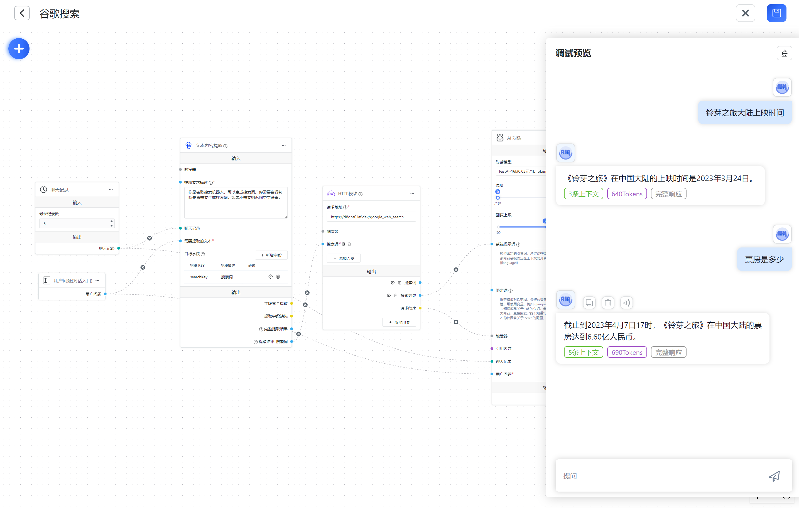
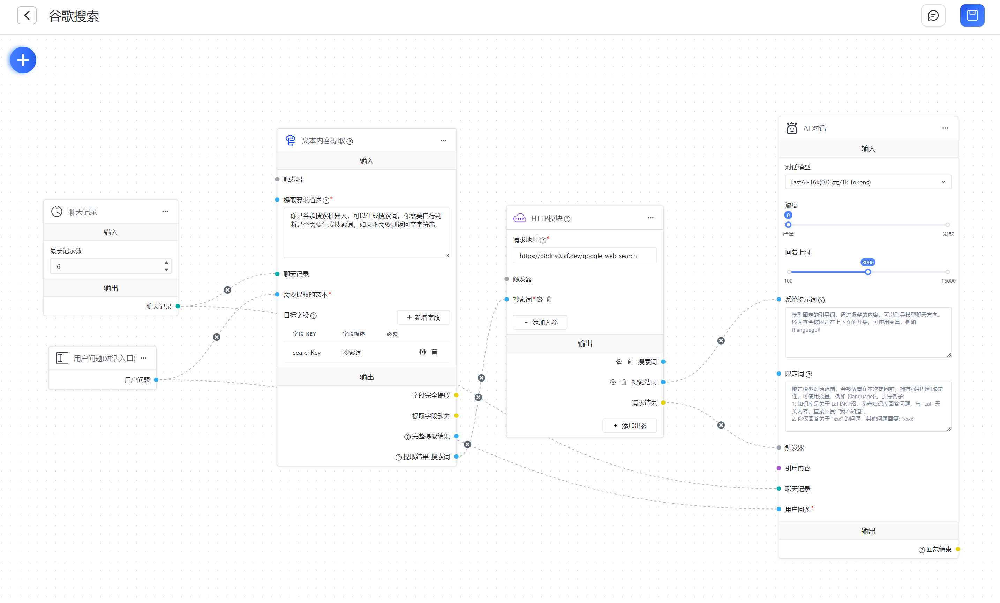

# Google Search




As shown in the above images, with the help of the HTTP module, you can easily integrate a search engine. Here, we take calling the Google Search API as an example.

## Register Google Search API

[Refer to this article to register the Google Search API](https://zhuanlan.zhihu.com/p/174666017)

## Create a Google Search interface

[Here, we use laf to quickly implement an interface, which can be written and published without deployment. Click to open laf cloud](https://laf.dev/), make sure to open the POST request method.

```ts
import cloud from '@lafjs/cloud';

const googleSearchKey = '';
const googleCxId = '';
const baseurl = 'https://www.googleapis.com/customsearch/v1';

export default async function (ctx: FunctionContext) {
  const { searchKey } = ctx.body;

  if (!searchKey) {
    return {
      prompt: ''
    };
  }

  try {
    const { data } = await cloud.fetch.get(baseurl, {
      params: {
        q: searchKey,
        cx: googleCxId,
        key: googleSearchKey,
        c2coff: 1,
        start: 1,
        end: 5,
        dateRestrict: 'm[1]'
      }
    });
    const result = data.items.map((item) => item.snippet).join('\n');
    return { prompt: `搜索词: ${searchKey};google 搜索结果: ${result}` };
  } catch (err) {
    console.log(err);
    return {
      prompt: ''
    };
  }
}
```

## Workflow

Copy the following configuration, click the Import button in the upper right corner of Advanced orchestration, import the configuration, and copy the interface address to [HTTP module] after import.

```json
[
  {
    "moduleId": "userChatInput",
    "name": "用户问题(对话入口)",
    "flowType": "questionInput",
    "position": {
      "x": 464.32198615344566,
      "y": 1602.2698463081606
    },
    "inputs": [
      {
        "key": "userChatInput",
        "type": "systemInput",
        "label": "用户问题",
        "connected": true
      }
    ],
    "outputs": [
      {
        "key": "userChatInput",
        "label": "用户问题",
        "type": "source",
        "valueType": "string",
        "targets": [
          {
            "moduleId": "6g2075",
            "key": "content"
          },
          {
            "moduleId": "aijmbb",
            "key": "userChatInput"
          }
        ]
      }
    ]
  },
  {
    "moduleId": "history",
    "name": "聊天记录",
    "flowType": "historyNode",
    "position": {
      "x": 452.5466249541586,
      "y": 1276.3930310334215
    },
    "inputs": [
      {
        "key": "maxContext",
        "type": "numberInput",
        "label": "最长记录数",
        "value": 6,
        "min": 0,
        "max": 50,
        "connected": true
      },
      {
        "key": "history",
        "type": "hidden",
        "label": "聊天记录",
        "connected": true
      }
    ],
    "outputs": [
      {
        "key": "history",
        "label": "聊天记录",
        "valueType": "chat_history",
        "type": "source",
        "targets": [
          {
            "moduleId": "6g2075",
            "key": "history"
          },
          {
            "moduleId": "aijmbb",
            "key": "history"
          }
        ]
      }
    ]
  },
  {
    "moduleId": "6g2075",
    "name": "文本内容提取",
    "flowType": "contentExtract",
    "showStatus": true,
    "position": {
      "x": 971.5119545668634,
      "y": 1118.186021718385
    },
    "inputs": [
      {
        "key": "switch",
        "type": "target",
        "label": "触发器",
        "valueType": "any",
        "connected": false
      },
      {
        "key": "description",
        "type": "textarea",
        "valueType": "string",
        "label": "提取要求描述",
        "description": "写一段提取要求，告诉 AI 需要提取哪些内容",
        "required": true,
        "placeholder": "例如: \n1. 你是一个实验室预约助手。根据用户问题，提取出姓名、实验室号和预约时间",
        "value": "你是谷歌搜索机器人，可以生成搜索词。你需要自行判断是否需要生成搜索词，如果不需要则返回空字符串。",
        "connected": true
      },
      {
        "key": "history",
        "type": "target",
        "label": "聊天记录",
        "valueType": "chat_history",
        "connected": true
      },
      {
        "key": "content",
        "type": "target",
        "label": "需要提取的文本",
        "required": true,
        "valueType": "string",
        "connected": true
      },
      {
        "key": "extractKeys",
        "type": "custom",
        "label": "目标字段",
        "description": "由 '描述' 和 'key' 组成一个目标字段，可提取多个目标字段",
        "value": [
          {
            "desc": "搜索词",
            "key": "searchKey",
            "required": false
          }
        ],
        "connected": true
      }
    ],
    "outputs": [
      {
        "key": "success",
        "label": "字段完全提取",
        "valueType": "boolean",
        "type": "source",
        "targets": []
      },
      {
        "key": "failed",
        "label": "提取字段缺失",
        "valueType": "boolean",
        "type": "source",
        "targets": [
          {
            "moduleId": "aijmbb",
            "key": "switch"
          }
        ]
      },
      {
        "key": "fields",
        "label": "完整提取结果",
        "description": "一个 JSON 字符串，例如：{\"name:\":\"YY\",\"Time\":\"2023/7/2 18:00\"}",
        "valueType": "string",
        "type": "source",
        "targets": []
      },
      {
        "key": "searchKey",
        "label": "提取结果-搜索词",
        "description": "无法提取时不会返回",
        "valueType": "string",
        "type": "source",
        "targets": [
          {
            "moduleId": "5fk9ru",
            "key": "searchKey"
          }
        ]
      }
    ]
  },
  {
    "moduleId": "5fk9ru",
    "name": "HTTP模块",
    "flowType": "httpRequest",
    "showStatus": true,
    "position": {
      "x": 1481.5339897373183,
      "y": 1290.2958964143072
    },
    "inputs": [
      {
        "key": "url",
        "value": "https://d8dns0.laf.dev/google_web_search",
        "type": "input",
        "label": "请求地址",
        "description": "请求目标地址",
        "placeholder": "https://api.fastgpt.run/getInventory",
        "required": true,
        "connected": true
      },
      {
        "key": "switch",
        "type": "target",
        "label": "触发器",
        "valueType": "any",
        "connected": false
      },
      {
        "valueType": "string",
        "type": "target",
        "label": "搜索词",
        "edit": true,
        "key": "searchKey",
        "required": true,
        "connected": true
      }
    ],
    "outputs": [
      {
        "label": "搜索词",
        "valueType": "string",
        "type": "source",
        "edit": true,
        "targets": [],
        "key": "searchKey"
      },
      {
        "label": "搜索结果",
        "valueType": "string",
        "type": "source",
        "edit": true,
        "targets": [
          {
            "moduleId": "aijmbb",
            "key": "systemPrompt"
          }
        ],
        "key": "prompt"
      },
      {
        "key": "finish",
        "label": "请求结束",
        "valueType": "boolean",
        "type": "source",
        "targets": [
          {
            "moduleId": "aijmbb",
            "key": "switch"
          }
        ]
      }
    ]
  },
  {
    "moduleId": "aijmbb",
    "name": "AI 对话",
    "flowType": "chatNode",
    "showStatus": true,
    "position": {
      "x": 2086.6387991825745,
      "y": 1090.812798225035
    },
    "inputs": [
      {
        "key": "model",
        "type": "custom",
        "label": "对话模型",
        "value": "gpt-3.5-turbo-16k",
        "list": [],
        "connected": true
      },
      {
        "key": "temperature",
        "type": "slider",
        "label": "温度",
        "value": 0,
        "min": 0,
        "max": 10,
        "step": 1,
        "markList": [
          {
            "label": "严谨",
            "value": 0
          },
          {
            "label": "发散",
            "value": 10
          }
        ],
        "connected": true
      },
      {
        "key": "maxToken",
        "type": "custom",
        "label": "回复上限",
        "value": 8000,
        "min": 100,
        "max": 4000,
        "step": 50,
        "markList": [
          {
            "label": "100",
            "value": 100
          },
          {
            "label": "4000",
            "value": 4000
          }
        ],
        "connected": true
      },
      {
        "key": "systemPrompt",
        "type": "textarea",
        "label": "系统提示词",
        "valueType": "string",
        "description": "模型固定的引导词，通过调整该内容，可以引导模型聊天方向。该内容会被固定在上下文的开头。可使用变量，例如 {{language}}",
        "placeholder": "模型固定的引导词，通过调整该内容，可以引导模型聊天方向。该内容会被固定在上下文的开头。可使用变量，例如 {{language}}",
        "value": "",
        "connected": true
      },
      {
        "key": "limitPrompt",
        "type": "textarea",
        "valueType": "string",
        "label": "限定词",
        "description": "限定模型对话范围，会被放置在本次提问前，拥有强引导和限定性。可使用变量，例如 {{language}}。引导例子:\n1. 知识库是关于 Laf 的介绍，参考知识库回答问题，与 \"Laf\" 无关内容，直接回复: \"我不知道\"。\n2. 你仅回答关于 \"xxx\" 的问题，其他问题回复: \"xxxx\"",
        "placeholder": "限定模型对话范围，会被放置在本次提问前，拥有强引导和限定性。可使用变量，例如 {{language}}。引导例子:\n1. 知识库是关于 Laf 的介绍，参考知识库回答问题，与 \"Laf\" 无关内容，直接回复: \"我不知道\"。\n2. 你仅回答关于 \"xxx\" 的问题，其他问题回复: \"xxxx\"",
        "value": "上文是谷歌搜索的结果，你可以提供实时信息，根据搜索结果回答问题。当前时间是{{cTime}}。",
        "connected": true
      },
      {
        "key": "switch",
        "type": "target",
        "label": "触发器",
        "valueType": "any",
        "connected": true
      },
      {
        "key": "quoteQA",
        "type": "target",
        "label": "引用内容",
        "valueType": "kb_quote",
        "connected": false
      },
      {
        "key": "history",
        "type": "target",
        "label": "聊天记录",
        "valueType": "chat_history",
        "connected": true
      },
      {
        "key": "userChatInput",
        "type": "target",
        "label": "用户问题",
        "required": true,
        "valueType": "string",
        "connected": true
      }
    ],
    "outputs": [
      {
        "key": "answerText",
        "label": "模型回复",
        "description": "直接响应，无需配置",
        "type": "hidden",
        "targets": []
      },
      {
        "key": "finish",
        "label": "回复结束",
        "description": "AI 回复完成后触发",
        "valueType": "boolean",
        "type": "source",
        "targets": []
      }
    ]
  }
]
```

**Process Description**

1. The extraction module extracts the user's question into search keywords.
2. The search keywords are passed to the HTTP module.
3. The HTTP module calls the Google search API and returns the search results.
4. The search results are passed to the prompt of the "AI Dialogue" to guide the model in generating an answer.
