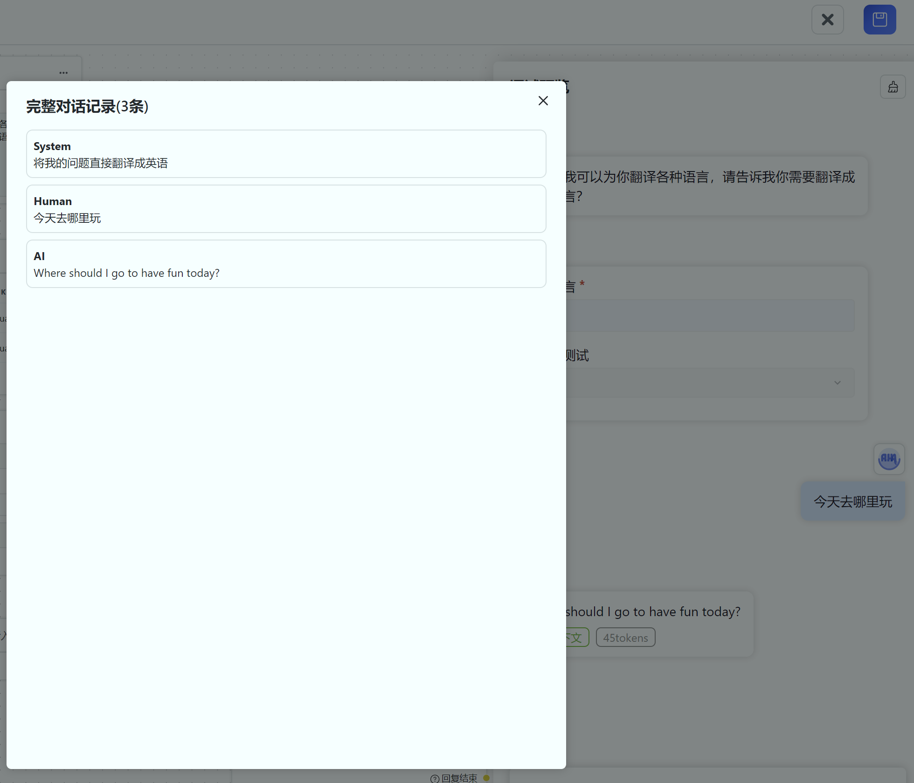

# Global Variables

- Only one can be added
- Manually configured
- Affects other modules
- Can be used for user guidance

You can set some questions before the conversation starts, allowing users to input or select their answers, and inject the results into other modules. Currently, it can only be injected into string type data (represented by a blue circle).
In the example below, two variables are defined: "Target Language" and "Dropdown Test (Ignore)". Users will be asked to fill in the target language before the conversation starts. With user guidance, we can build a simple translation bot. The key of "Target Language" (language) is written into the qualifiers of the "AI Dialogue" module.

By examining the complete conversation log, we can see that the actual qualifier changes from "Translate my question directly into {{language}}" to "Translate my question directly into English" because {{language}} is replaced by the variable.

