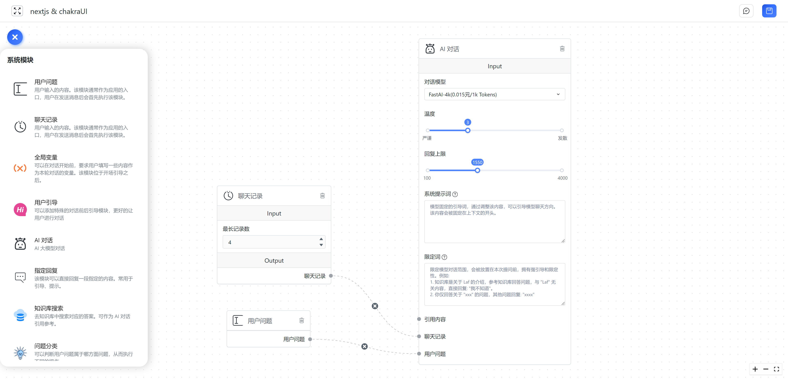

# 模块编排介绍

FastGpt V4 后将采用新的交互方式来构建 AI 应用。使用了“节点”编排的方式去掉原先的表单方式。提高可玩性和扩展性的同时也提高了上手的门槛，这篇文章就来简单介绍一下 “预览版” 的模块编排基本使用方法。

预览版仅包含了 8 个模块，你可以利用它们来完全实现 V3 的知识库功能。此外，预览版还加入了问题分类模块，可以实现多路线任务。

## 基础知识

### 什么是模块

在程序中，模块可以理解为一个个 function 或者接口。对于非技术背景同学，可以理解为它就是一个**步骤**。将多个模块一个个拼接起来，即可一步步的去实现最终的 AI 输出。

### 如何阅读和理解

1. 建议从左往右阅读。
2. 从 **用户问题** 模块开始。用户问题模块，代表的是用户发送了一段文本，触发任务开始。
3.
