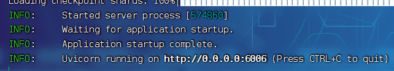

# 3分钟在Fastgpt上用上GLM
## 前言
Fast GPT 允许你使用自己的 openai API KEY 来快速的调用 openai 接口，目前集成了 Gpt35, Gpt4 和 embedding. 可构建自己的知识库。但考虑到数据安全的问题，我们并不能将所有的数据都交付给云端大模型。那如何在fastgpt上接入私有化模型呢，本文就以清华的ChatGLM2为例，为各位讲解如何在fastgpt中接入私有化模型。
## ChatGLM2简介
ChatGLM2-6B 是开源中英双语对话模型 ChatGLM-6B 的第二代版本，具体介绍请看项目：https://github.com/THUDM/ChatGLM2-6B
注意，ChatGLM2-6B 权重对学术研究完全开放，在获得官方的书面许可后，亦允许商业使用。本教程只是介绍了一种用法，并不会给予任何授权。
## 推荐配置
依据官方数据，同样是生成 8192 长度，量化等级为FP16要占用12.8GB  显存、INT8为8.1GB显存、INT4为5.1GB显存，量化后会稍微影响性能，但不多。
因此推荐配置如下：
fp16:内存>=16GB,显存>=16GB,硬盘空间>=25GB,启动时使用命令python openai_api.py 16
int8:内存>=16GB,显存>=9GB,硬盘空间>=25GB,启动时选择python openai_api.py 8
int4:内存>=16GB,显存>=6GB,硬盘空间>=25GB,启动时选择python openai_api.py 4
## 环境配置
Python 3.8.10
CUDA 11.8
科学上网环境
## 简单的步骤
1. 根据上面的环境配置配置好环境，具体教程自行GPT；
1. 在命令行输入pip install -r requirments.txt
2. 打开你需要启动的py文件，在代码的第76行配置token，这里的token只是加一层验证，防止接口被人盗用
2. python openai_api.py 16//这里的数字根据上面的配置进行选择

然后等待模型下载，直到模型加载完毕，出现报错先问GPT  
上面两个文件在本文档的同目录

启动成功后应该会显示如下地址：

这里的http://0.0.0.0:6006就是连接地址

然后现在回到.env.local文件，依照以下方式配置地址：

OPENAI_BASE_URL=http://127.0.0.1:6006/v1
OPENAIKEY=sk-aaabbbcccdddeeefffggghhhiiijjjkkk //这里是你在代码中配置的token
这里的OPENAIKEY可以任意填写

这样就成功接入ChatGLM2了
