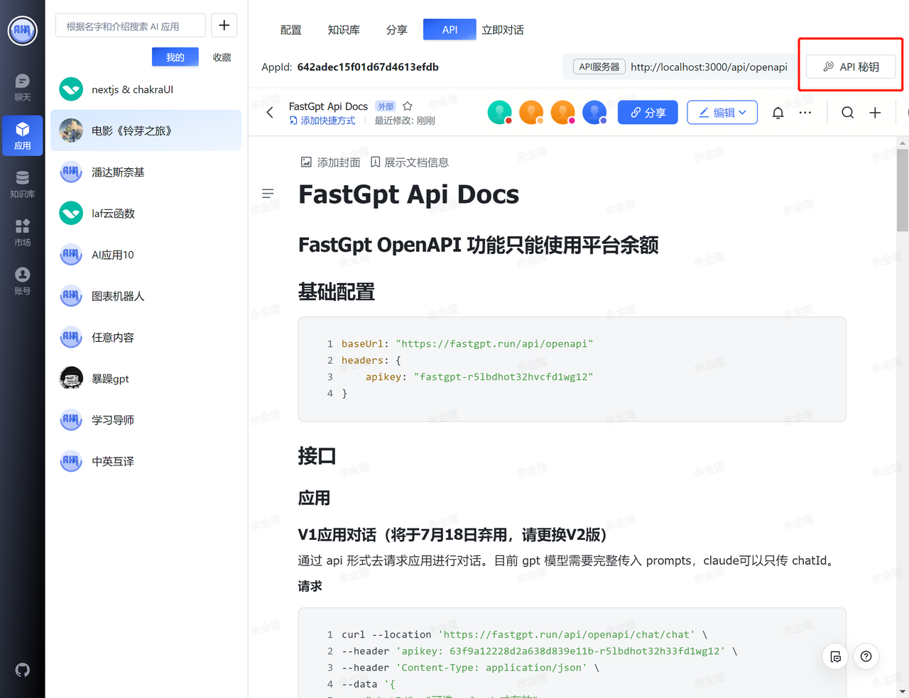

# 通过 OpenAPI 接入第三方应用

## 1. 获取 API 秘钥

注意复制，关掉了需要新建~

## 2. 组合秘钥

利用刚复制的 API 秘钥加上 AppId 组合成一个新的秘钥，格式为: API 秘钥-AppId，例如：`fastgpt-z51pkjqm9nrk03a1rx2funoy-642adec15f04d67d4613efdb`

## 3. 替换三方应用的变量

OPENAI_API_BASE_URL: https://fastgpt.run/api/openapi (改成自己部署的域名)
OPENAI_API_KEY = 组合秘钥

**[chatgpt next](https://github.com/Yidadaa/ChatGPT-Next-Web) 示例**

**[chatgpt web](https://github.com/Chanzhaoyu/chatgpt-web) 示例**

