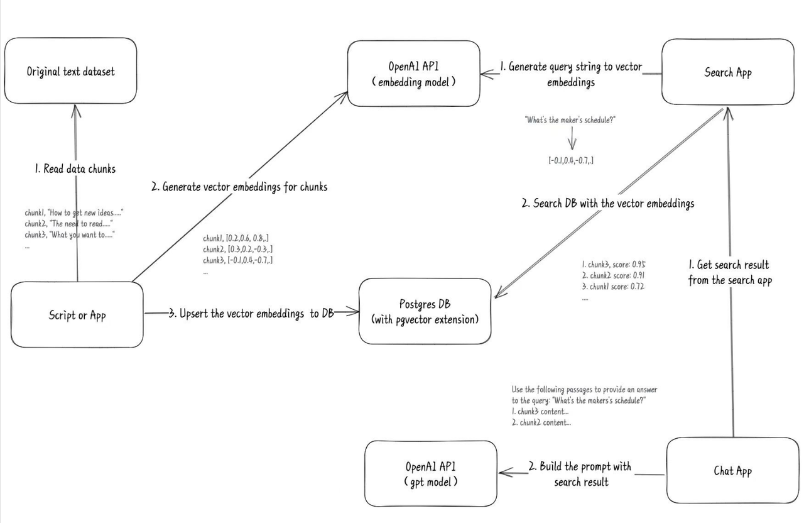

# Building a High-Quality AI Knowledge Base Using FastGpt

## Introduction

Since the release of ChatGPT in December last year, it has sparked a new wave of application interaction revolution. Especially after the opening of the GPT-3.5 API, various applications utilizing LLM (Large Language Models) have quickly emerged. However, due to issues related to control, randomness, and compliance of GPT models, many application scenarios could not be fully realized.

In March, I came across a tweet from someone who trained their own blog records using GPT models and found the cost to be very low compared to traditional news outlets. They provided a comprehensive flowchart that showed the process:

After seeing this tweet, I had an idea to create an application based on this concept. I started working on it and within less than a month, I added vector search functionality to FastGpt, which already had multi-assistant management. This led to the creation of the first video tutorial: [How to Build a Knowledge Base Using FastGpt](https://www.bilibili.com/video/BV1Wo4y1p7i1/?vd_source=92041a1a395f852f9d89158eaa3f61b4).

Three months later, FastGpt has continued to evolve, expanding and refining its features in vector search and LLM-based linear question answering. However, we still haven't released a tutorial on how to build a knowledge base. As FastGpt V4 is in development, we plan to present a tutorial on "How to Build a High-Quality AI Knowledge Base" so that users can make the best use of the platform.

## Complete Logic of FastGpt Knowledge Base

Before we dive into building a knowledge base, let's understand how FastGpt retrieves information from it. Let's grasp some basic concepts:

1. **Vectors:** Representations of human language (text, images, videos) that computers can understand (arrays).
2. **Vector Similarity:** The ability to calculate similarity between two vectors, indicating the degree of similarity between two pieces of language.
3. **Characteristics of Language Models:** Context understanding, summarization, and reasoning.

Combining these concepts, we get the formula "Vector Search + Large Model = Knowledge Base Question Answering". The following diagram illustrates the complete logic of the knowledge base question-answering functionality in FastGpt V3:

What sets FastGpt apart from most other knowledge base question-answering products is its use of QA (Question-Answer) pairs for storage, instead of just chunking the text. This is done to reduce the length of the vectorized content, allowing the vectors to better capture the meaning of the text and thereby improving search accuracy.
Additionally, FastGpt offers both search testing and conversation testing to adjust the data, making it convenient for users to fine-tune their content. With the above process and approach, let's see how to build a high-quality AI knowledge base using the example of creating a FastGpt Frequently Asked Questions (FAQ) chatbot.

## Building the Knowledge Base Application

Let's start by creating a FastGpt FAQ knowledge base:

### Splitting Content with QA Pairs to Acquire Basic Knowledge

First, we can directly split the existing FastGpt documents into QA pairs to obtain some fundamental knowledge. Here's an example using the README:

### Refining the QA Pairs

From the README, we obtained a total of 11 data pairs, and the overall quality is good. However, the last data point got truncated, so we need to manually correct it.

Additionally, let's consider the third entry in the first column. This entry provides links to various FastGpt resources, but the QA splitting put the answer in the "A" part of the QA pair. Typically, users wouldn't ask "What links are available?" but rather questions like "How to deploy?" or "Where's the documentation?". Therefore, we need to adjust this entry to make it more user-friendly:

Now, let's create an application and see the results. First, you need to create an application and associate the relevant knowledge base with it. Also, provide a description in the prompt section to let Gpt know the scope of the knowledge base.

The results are generally good, with both links and images displayed correctly.

### Manually Entering Common Community Questions

Next, let's import the FastGpt FAQ document. Since it wasn't organized well, we need to manually input the corresponding Q&A pairs.

As seen in the imported result, we consistently use the QA pair format, rather than a rough direct import. This is done to simulate user queries and enhance the effectiveness of vector search. You can also provide multiple phrasings for the same question to improve matching accuracy. FastGpt also offers an OpenAPI feature that allows you to process special format files locally and then upload them to FastGpt.

## Fine-Tuning the Knowledge Base and Adjusting Parameters

FastGpt provides two ways to fine-tune and adjust the knowledge base: Search Testing and Conversation Testing. Let's start by using Search Testing to make adjustments. We recommend gathering some user queries for testing in advance and then proceeding based on the desired results. You can start with Search Testing to assess whether the knowledge points are reasonable.

### Search Testing

You might encounter a situation where unrelated content with the keyword "knowledge base" is included due to the keyword itself. In this case, you need to add the keyword "knowledge base" to the fourth record to increase its similarity.

### Prompt Setting

Prompts guide the direction of the model conversation. When setting prompts, follow these two principles:

1. Direct the model to answer questions related to the knowledge base.
2. Provide a brief description of the knowledge base to help the model identify whether the user's question falls within the scope of the knowledge base.

### Limiting Model Conversation Scope More Effectively

You can limit the conversation scope at the knowledge base level by adjusting search similarity and maximum search quantity. Typically, you can set the similarity to 0.82 and leave the response for empty searches blank. This means that if a user's question cannot be matched within the knowledge base, the model will directly respond with the predefined content.

Since the OpenAI vector model is not specifically designed for Chinese, when the question contains keywords from the knowledge base, the similarity may still be high, making it difficult to limit the scope at the knowledge base level. You need to