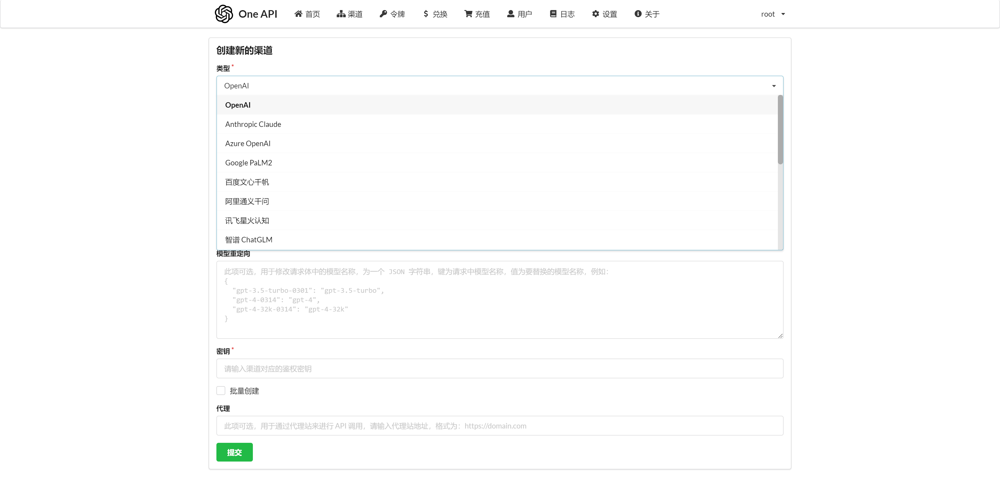

# Configuring Other Conversation Models

By default, FastGPT is configured with three GPT models. If you need to integrate other models, you'll need to perform some additional configuration.

## Step 1: Install OneAPI

First, you need to deploy a [OneAPI](/docs/develop/oneapi) instance and add the corresponding "Channel."



## Step 2: Add FastGPT Configuration

You can find the configuration file in `/client/src/data/config.json` (copy it as `config.local.json` for local development). Inside the configuration file, there is a section for configuring conversation models:

```json
"ChatModels": [
    {
      "model": "gpt-3.5-turbo", // The model name should correspond to the OneAPI model
      "name": "FastAI-4k", // Display name
      "contextMaxToken": 4000, // Maximum context tokens, calculated based on GPT-3.5; models outside GPT should calculate this value roughly
      "quoteMaxToken": 2000, // Maximum tokens for quoted knowledge base content
      "maxTemperature": 1.2, // Maximum temperature
      "price": 1.5, // Price per token => 1.5 / 100000 * 1000 = 0.015 yuan per 1k tokens
      "defaultSystem": "" // Default system prompt
    },
    {
      "model": "gpt-3.5-turbo-16k",
      "name": "FastAI-16k",
      "contextMaxToken": 16000,
      "quoteMaxToken": 8000,
      "maxTemperature": 1.2,
      "price": 3,
      "defaultSystem": ""
    },
    {
      "model": "gpt-4",
      "name": "FastAI-Plus",
      "contextMaxToken": 8000,
      "quoteMaxToken": 4000,
      "maxTemperature": 1.2,
      "price": 45,
      "defaultSystem": ""
    }
],
```

### Adding a New Model

Let's use "ERNIE-Bot" as an example:

```json
"ChatModels": [
...
{
  "model": "ERNIE-Bot",
  "name": "ERNIE Bot",
  "contextMaxToken": 4000,
  "quoteMaxToken": 2000,
  "maxTemperature": 1,
  "price": 1.2
}
...
]
```

After adding the new model, restart the application, and you'll be able to choose the "ERNIE Bot" model for conversations.