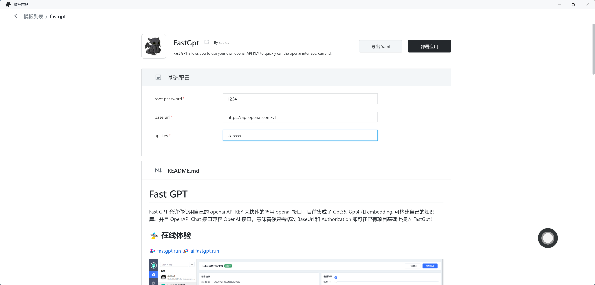
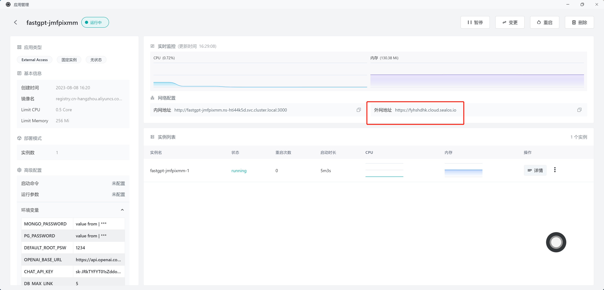

# Sealos One-Click Deployment

No need for a server, no need for magic, no need for a domain – just click to deploy 👇

Since it needs to deploy a database, you'll have to wait for 2-4 minutes after deployment to access it normally. The default configuration uses the lowest resources, so the initial access might be a bit slow.

## Getting Started

Click on the provided **External Network Address** by Sealos to start using the deployment. The login username is `root`, and the password is the one you set as an environment variable (e.g., 1234 as shown in the screenshot above).

