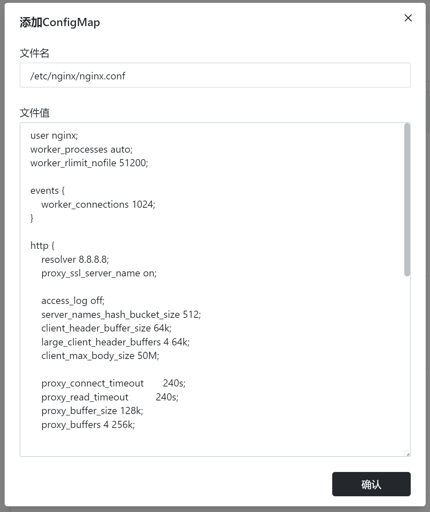

# Deploying Nginx as a Reverse Proxy using Sealos

## Login to Sealos Cloud

[Sealos Cloud](https://cloud.sealos.io/)

## Step 1: Create an Application

Navigate to App Launchpad and create a new application.

  


## Step 2: Fill in Basic Configuration

Make sure to enable external access and copy the provided external access URL.


## Step 3: Add ConfigMap File

1. Copy the following configuration. Replace the content after `server_name` with the external access URL from Step 2.

```nginx
user nginx;
worker_processes auto;
worker_rlimit_nofile 51200;

events {
    worker_connections 1024;
}

http {
    resolver 8.8.8.8;
    proxy_ssl_server_name on;

    access_log off;
    server_names_hash_bucket_size 512;
    client_header_buffer_size 64k;
    large_client_header_buffers 4 64k;
    client_max_body_size 50M;

    proxy_connect_timeout       240s;
    proxy_read_timeout          240s;
    proxy_buffer_size 128k;
    proxy_buffers 4 256k;

    server {
        listen 80;
        server_name tgohwtdlrmer.cloud.sealos.io; # Replace with the provided Sealos content

        location ~ /openai/(.*) {
            proxy_pass https://api.openai.com/$1$is_args$args;
            proxy_set_header Host api.openai.com;
            proxy_set_header X-Real-IP $remote_addr;
            proxy_set_header X-Forwarded-For $proxy_add_x_forwarded_for;
            # For streaming response
            proxy_set_header Connection '';
            proxy_http_version 1.1;
            chunked_transfer_encoding off;
            proxy_buffering off;
            proxy_cache off;
            # For regular response
            proxy_buffer_size 128k;
            proxy_buffers 4 256k;
            proxy_busy_buffers_size 256k;
        }
    }
}
```

2. Click on "Advanced Configuration".
3. Click on "Add ConfigMap".
4. Enter the file name as `/etc/nginx/nginx.conf`.
5. Enter the content as the previously copied configuration.
6. Click "Confirm".



## Step 4: Deploy the Application

After completing the form, click "Deploy Application" in the upper right corner to finish.

## Step 5: Update FastGpt Environment Variables

1. Go to the details of the deployed application and copy the external access URL.

Note: This is an API URL. Clicking on it won't open a page. To verify, you can access: 【\*\*\*.close.sealos.io/openai/api】. If it shows "Invalid URL (GET /api)", then it's successful.


2. Update the environment variable in FastGpt (not in Sealos):

```bash
OPENAI_BASE_URL=https://tgohwtdlrmer.cloud.sealos.io/openai/v1
```

**Done!**