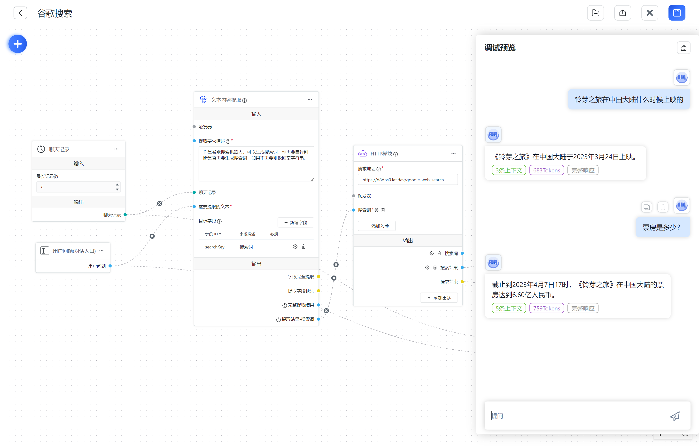

# 谷歌搜索




如上图，利用 HTTP 模块，你可以轻松的外接一个搜索引擎。这里以调用 google search api 为例。

## 注册 google search api

[参考这篇文章，注册 google search api](https://zhuanlan.zhihu.com/p/174666017)

## 写一个 google search 接口

[这里用 laf 快速实现一个接口，即写即发布，无需部署。点击打开 laf cloud](https://laf.dev/)，务必打开 POST 请求方式。

```ts
import cloud from '@lafjs/cloud';

const googleSearchKey = '';
const googleCxId = '';
const baseurl = 'https://www.googleapis.com/customsearch/v1';

export default async function (ctx: FunctionContext) {
  const { searchKey } = ctx.body;

  if (!searchKey) {
    return {
      prompt: ''
    };
  }

  try {
    const { data } = await cloud.fetch.get(baseurl, {
      params: {
        q: searchKey,
        cx: googleCxId,
        key: googleSearchKey,
        c2coff: 1,
        start: 1,
        num: 5,
        dateRestrict: 'm[1]'
      }
    });
    const result = data.items.map((item) => item.snippet).join('\n');
    return { prompt: `这是 google 搜索的结果: ${result}`, searchKey: `\n搜索词为: ${searchKey}` };
  } catch (err) {
    console.log(err);
    return {
      prompt: ''
    };
  }
}
```

## 编排

按上图拖出一个 FastGPT 编排组合，其中 HTTP 模块的请求地址为接口地址，出入参如下：

**入参**

```
searchKey: 搜索词
```

**出参**

```
prompt: 搜索结果
```

- HTTP 模块会将 searchKey 发送到 laf，laf 接收后去进行谷歌搜索，并将搜索的结果通过 prompt 参数返回。
- 返回后，HTTP 模块连接到【AI 对话】的提示词，引导模型进行回答。
