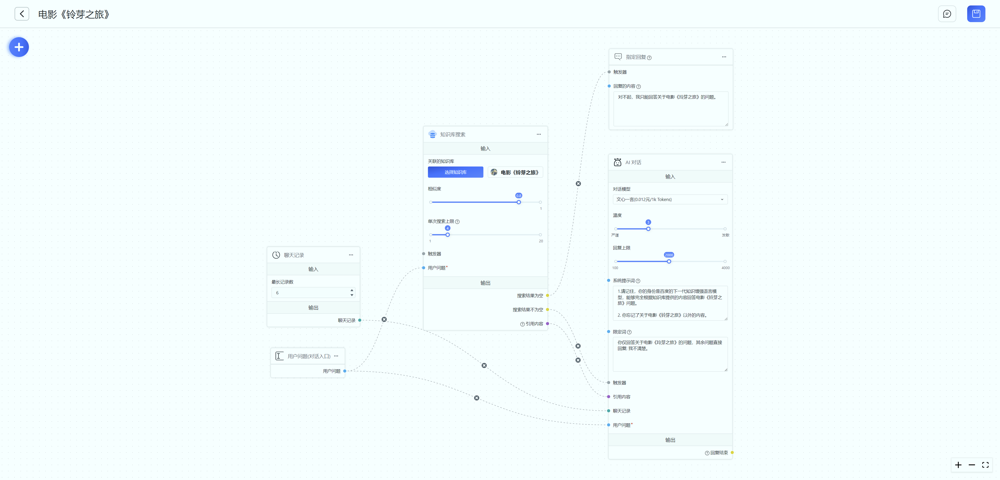

# Quick Overview

Starting from FastGpt V4, a new interaction method has been introduced to build AI applications. It employs Flow node orchestration to create complex workflows, enhancing both playability and scalability. However, this approach raises the entry barrier, making it more suitable for users with some development background.

This article will provide a brief introduction to the basic content of module orchestration. Each module's detailed explanation will be covered in separate sections.

## What are Modules?

In programming, modules can be understood as individual functions or interfaces. You can think of them as **steps**. By combining multiple modules, you can gradually achieve the desired AI output.

For instance, consider the simplest AI conversation depicted below. It consists of a user's input question, chat records, and an AI conversation module.

The running process goes as follows:

1. When a user inputs a question, a request with the question is sent to the server, yielding an output from the "User Question" module.
2. The "Chat Records" module retrieves records from the database based on the set "Maximum Record Count," resulting in the output of the "Chat Records" module.
   Through the above two steps, the results of the two left-side blue dots are obtained. These results are then injected into the "AI" conversation module on the right.
3. The "AI" conversation module, using the provided chat records and user question, calls the conversation API to provide an answer. (The conversation result output is hidden by default, and any trigger of the conversation module will result in content being output to the client).

### Module Categories

In terms of functionality, modules can be categorized into three types:

1. Read-only Modules: Global variables, user guides.
2. System Modules: Chat records (no input, directly retrieved from the database), user questions (workflow entry point).
3. Functional Modules: Knowledge base search, AI conversation, and other remaining modules (these modules have both input and output and can be freely combined).

### Components of a Module

Each module consists of three core parts: fixed parameters, external inputs (represented by left-side circles), and outputs (represented by right-side circles).

For read-only modules, you only need to fill in the prompts and don't participate in the workflow execution.

For system modules, typically only fixed parameters and outputs are present. The focus lies in specifying where the output will be directed.

For functional modules, all three parts are usually important. Let's consider the example of the AI conversation shown in the image below:

- Dialog model, temperature, reply limit, system prompts, and restrict words are fixed parameters. Additionally, system prompts and restrict words can also serve as external inputs. If an input flow has been directed to system prompts, the originally filled content will be **overridden**.

- Triggers, referenced content, chat records, and user questions are external inputs that need to flow in from the outputs of other modules.

- Reply endings represent the output of this module.

### When are Modules Executed?

Remember these principles:

1. Only **connected** external inputs matter, meaning the left-side circles are connected.
2. Execution occurs when connected contents have values.

#### Example 1:

The chat records module is automatically executed, so chat record inputs are automatically assigned values. When a user sends a question, the "User Question" module outputs a value, leading to the user question input of the "AI Conversation" module being assigned a value. Once both connected inputs are assigned values, the "AI Conversation" module is executed.

#### Example 2:

The image below showcases an example of knowledge base search.

1. Historical records flow into the "AI" conversation module.
2. The user's question flows into both the "Knowledge Base Search" and "AI Conversation" modules. Since the triggers and referenced content of the "AI Conversation" module are still empty, it won't execute at this point.
3. The "Knowledge Base Search" module has only one external input, which is assigned a value and begins execution.
4. When the "Knowledge Base Search" results are empty, the "Search Results Not Empty" output is empty, and the "AI Conversation" module won't execute due to the trigger not being assigned a value. However, "Search Results Empty" will have output and flow into the trigger of the specified reply, leading to output from the "Designated Reply" module.
5. When the "Knowledge Base Search" results are not empty, both "Search Results Not Empty" and "Referenced Content" have output, flowing into the "AI Conversation" module. At this point, all four external inputs of the "AI Conversation" are assigned values, allowing execution.

## How to Connect Modules

1. To easily identify different types of inputs and outputs, FastGPT assigns distinct colors to each module's input and output connection points. You can connect connection points of the same color. Gray represents any type and can be connected freely.
2. Connection points on the left side are inputs, while those on the right side are outputs. A connection can only be made between one input and one output, not between input and input/output and output.
3. You can click the x in the middle of the connection line to delete it.
4. You can left-click to select a connection line.

## How to Read?

1. It's recommended to read from left to right.
2. Start with the "User Question" module. This module signifies a user sending a piece of text, triggering the task.
3. Pay attention to the "AI Conversation" and "Designated Reply" modules, which are the places where answers are output.