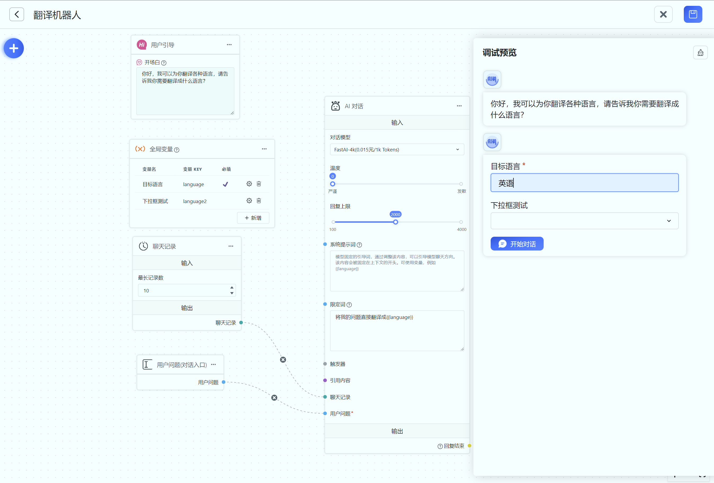

# 全局变量

- 仅可添加 1 个
- 手动配置
- 对其他模块有影响
- 可作为用户引导

可以在对话前设置一些问题，让用户输入或选择，并将用户输入/选择的结果注入到其他模块中。目前仅会注入到 string 类型的数据里（对应蓝色的圆圈）。

如下图，定义了两个变量：目标语言和下拉框测试（忽略）

用户在对话前会被要求先填写目标语言，配合用户引导，我们就构建了一个简单的翻译机器人。**目标语言**的 key：language 被写入到【AI 对话】模块的限定词里。

通过完整对话记录我们可以看到，实际的限定词从：“将我的问题直接翻译成{{language}}” 变成了 “将我的问题直接翻译成英语”，因为 {{language}} 被变量替换了。

