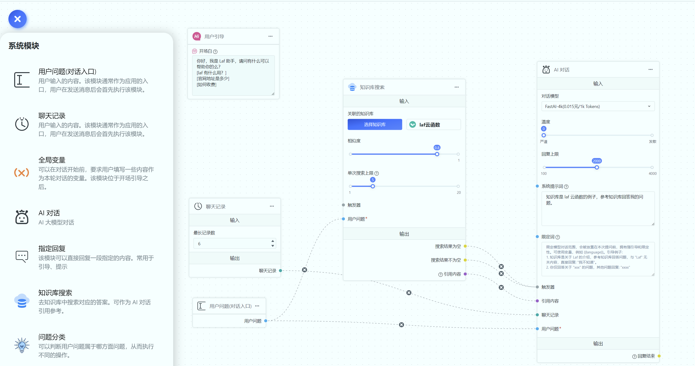

# Quick Overview FastGpt

FastGPT is a knowledge base question-answering system based on a large language model (LLM). It offers out-of-the-box capabilities for data processing, model invocation, and more. Additionally, it allows complex question-answering scenarios to be achieved through visual workflow orchestration using Flow.

|                            |                            |
| -------------------------- | -------------------------- |
|  |  |
|  |  |

## FastGPT 能力

### 1. AI capabilities

"By importing documents or existing question-answer pairs for training, you enable the AI model to answer questions based on your documents."

### 2. Automatic Data Preprocessing

Provides multiple data import methods such as manual input, direct segmentation, LLM automatic processing, and CSV, balancing accuracy and rapid training scenarios.

### 3. Workflow Orchestration

Based on the Flow module, workflow orchestration can help you design more complex question-and-answer processes. For example, querying databases, checking inventory, scheduling laboratory appointments, and more.

### 4. Seamless Integration OpenAPI

The FastGPT API interface aligns with the official GPT API interface. You can seamlessly integrate FastGPT into your existing GPT applications by modifying the BaseURL and Authorization.

## FastGPT Features

1. Open Source Project: FastGPT follows the Apache License 2.0 open-source protocol. You can clone FastGPT from GitHub for secondary development and publishing. The community version of FastGPT retains core features, while the commercial version extends using API, without affecting learning and usage.
2. Unique QA Structure: Designed for customer service and Q&A scenarios, FastGPT employs a unique QA structure that enhances accuracy in scenarios with large amounts of data.
3. Visual Workflow: The Flow module presents a complete process from inputting a question to model output, facilitating debugging and the design of intricate workflows.
4. Unlimited Extension: FastGPT supports expansion through HTTP, allowing integration into existing programs without modifying the FastGPT source code.
5. Convenient Debugging: Various debugging methods are available, including search testing, reference modification, and complete dialogue preview.
6. Multiple Model Support: FastGPT supports various LLM models such as GPT, Claude, and Wenxin Yiyu, with plans to support custom vector models in the future.

## Core Process Diagram of Knowledge Base:

