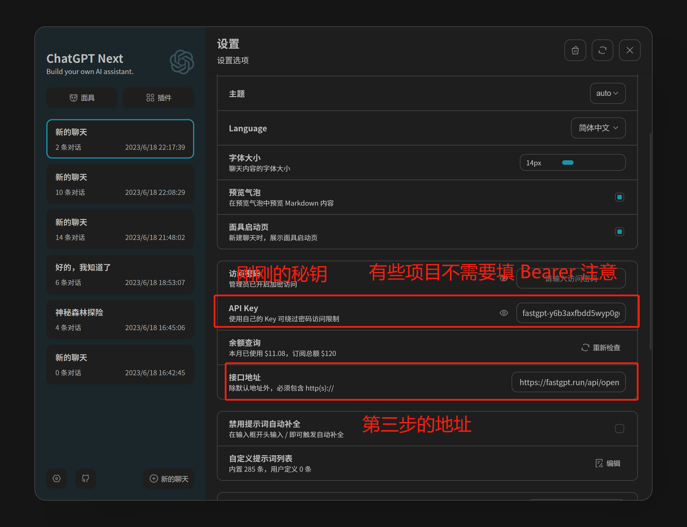

# Integrating with Third-Party Applications via OpenAPI

## 1. Obtain API Key

Be sure to copy the key. Remember to keep it secure, as we will need to create a new one.

## 2. Combine the Key

Combine the copied API key with the AppId to form a new key. The format is: API Key-AppId, for example: `fastgpt-z51pkjqm9nrk03a1rx2funoy-642adec15f04d67d4613efdb`

## 3. Replace Variables in the Third-Party Application

Replace the following variables in your third-party application with appropriate values:

- OPENAI_API_BASE_URL: Change it to the domain where you have deployed your application.
- OPENAI_API_KEY: Use the combined key obtained in step 2.

**Example for [chatgpt next](https://github.com/Yidadaa/ChatGPT-Next-Web):**

**Example for [chatgpt web](https://github.com/Chanzhaoyu/chatgpt-web):**

By following these steps, you can integrate your FastGPT deployment with third-party applications via the OpenAPI.