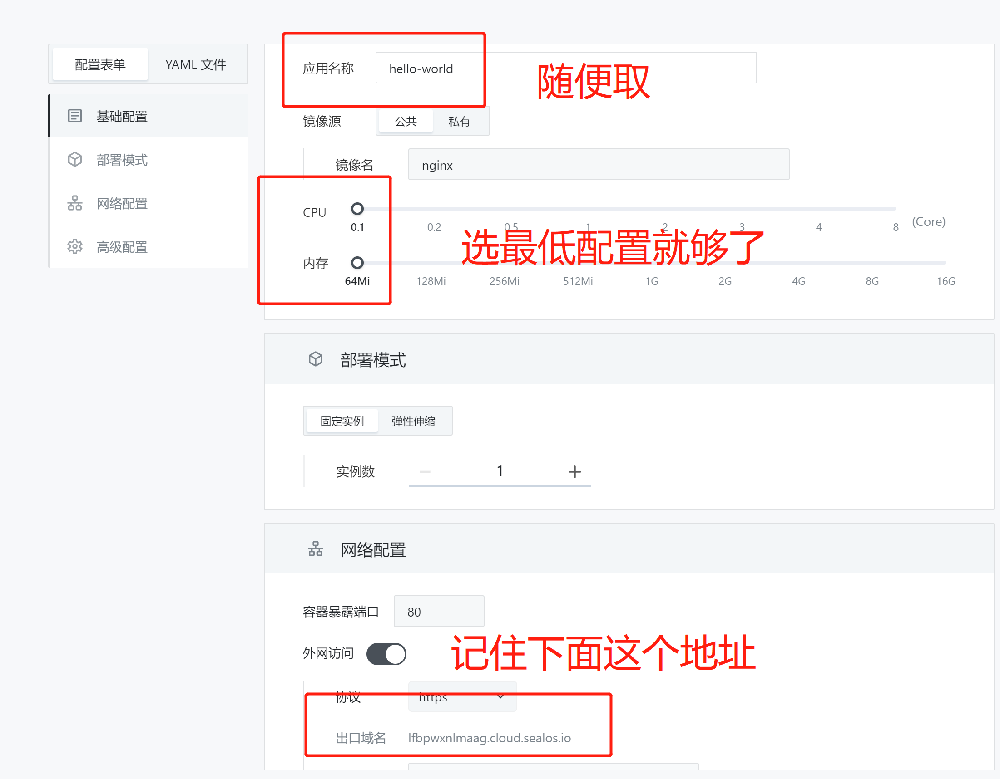
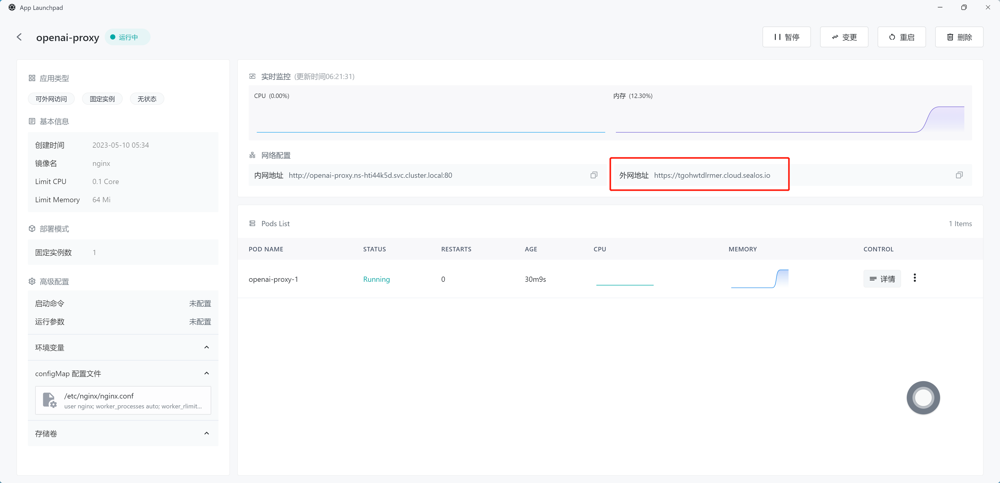

# sealos 部署 openai 中转

## 登录 sealos cloud

[sealos cloud](https://cloud.sealos.io/)

## 创建应用

打开 App Launchpad -> 新建应用

  


### 开启外网访问



### 添加 configmap 文件

1. 复制下面这段代码，注意 `server_name` 后面的内容替换成上图的地址。

```
user nginx;
worker_processes auto;
worker_rlimit_nofile 51200;

events {
    worker_connections 1024;
}

http {
    resolver 8.8.8.8;
    proxy_ssl_server_name on;

    access_log off;
    server_names_hash_bucket_size 512;
    client_header_buffer_size 64k;
    large_client_header_buffers 4 64k;
    client_max_body_size 50M;

    proxy_connect_timeout       240s;
    proxy_read_timeout          240s;
    proxy_buffer_size 128k;
    proxy_buffers 4 256k;


    server {
        listen 80;
        server_name tgohwtdlrmer.cloud.sealos.io; # 这个地方替换成 sealos 提供的内容

        location ~ /openai/(.*) {
            # auth check
            if ($http_auth != "auth") { # 安全凭证
                return 403;
            }

            proxy_pass https://api.openai.com/$1$is_args$args;
            proxy_set_header Host api.openai.com;
            proxy_set_header X-Real-IP $remote_addr;
            proxy_set_header X-Forwarded-For $proxy_add_x_forwarded_for;
            # 如果响应是流式的
            proxy_set_header Connection '';
            proxy_http_version 1.1;
            chunked_transfer_encoding off;
            proxy_buffering off;
            proxy_cache off;
            # 如果响应是一般的
            proxy_buffer_size 128k;
            proxy_buffers 4 256k;
            proxy_busy_buffers_size 256k;
        }
    }
}
```

2. 点开高级配置
3. 点击新增 configmap
4. 文件名写: `/etc/nginx/nginx.conf`
5. 文件值为刚刚复制的那段代码
6. 点击确认


### 部署应用

填写完毕后，点击右上角的 `部署应用`，即可完成。

## 修改 FastGpt 环境变量

1. 进入刚刚部署应用的详情，复制外网地址
   

2. 修改环境变量（是 FastGpt 的环境变量，不是 sealos 的）:

```
OPENAI_BASE_URL=https://tgohwtdlrmer.cloud.sealos.io/openai/v1
OPENAI_BASE_URL_AUTH=auth
```

**Done!**
