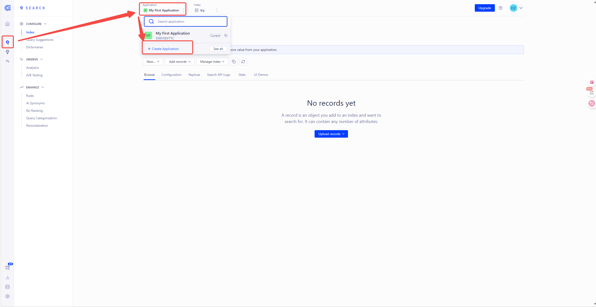
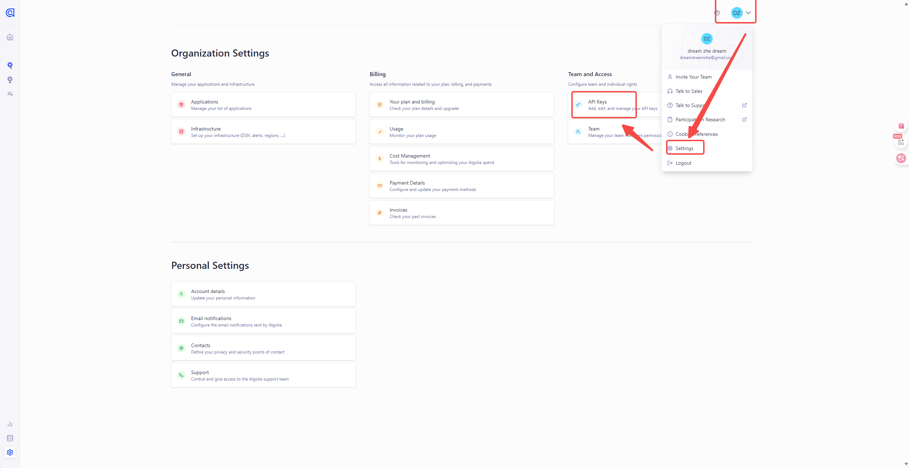
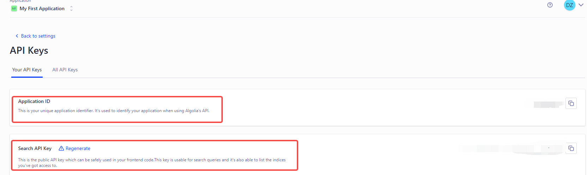
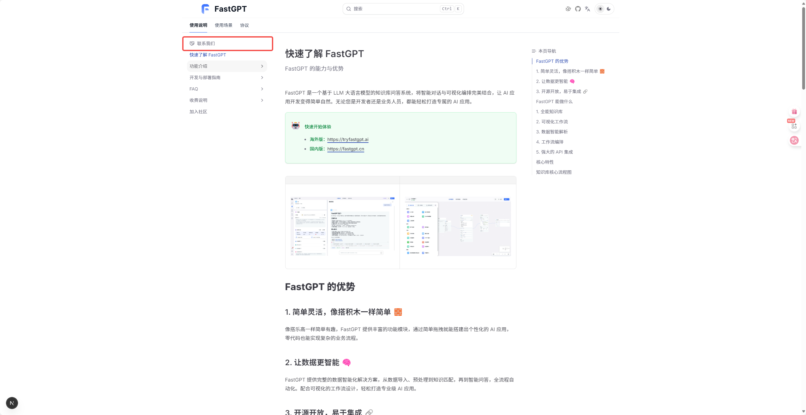

# fast

这是FastGPT的官方文档，采用fumadoc框架。

# 获取搜索应用

点击[Algolia](https://dashboard.algolia.com/account/overview),进行注册账号，注册成功后需要点击页面的搜索,然后查看应用，默认会有一个应用。



拥有应用后点击个人头像，点击设置，点击`API Keys`查看自己的应用id和key。



页面中的`Application ID`和`Search API Key`，`Write API KEY`就是环境变量对应的`NEXT_PUBLIC_SEARCH_APPID`和`NEXT_PUBLIC_SEARCH_APPKEY`，`NEXT_PUBLIC_SEARCH_APPWRITEKEY`



# 运行项目

要运行文档，首先需要进行环境变量配置，在文档的根目录下创建`.env.local`文件，填写以下环境变量:

```bash
NEXT_PUBLIC_SEARCH_APPWRITEKEY =  #这是上面获取的Write api key
NEXT_PUBLIC_SEARCH_APPKEY = #这是上面获取的搜索key
NEXT_PUBLIC_SEARCH_APPID =  #这是上面的搜索id
NEXT_PUBLIC_DOMAIN =    #要跳转的FastGPT项目的域名，默认海外版
```

你可以在FastGPT项目根目录下执行以下命令来运行文档。

```bash
npm install #只能npm install，不能pnpm
npm run dev
```
项目会默认跑在`http:localhost:3000`端口

# 书写文档

文档采用`mdx`格式，大体和`md`一致，但是现在文档的元数据只支持`title` `description`和`icon`三个字段，参考以下示例代码：

```bash
---
title: FastGPT 文档
description: FastGPT 官方文档
icon: menu #icon采用`lucide-react`第三方库。
---

import { Alert } from '@/components/docs/Alert'; #高亮块组件

<Alert icon="🤖" context="success">
快速开始体验
- 海外版：[https://fastgpt.io](https://fastgpt.io)
- 国内版：[https://fastgpt.cn](https://fastgpt.cn)
</Alert>

import {Redirect} from '@/components/docs/Redirect' #重定向组件，如果你希望用户点击这个文件跳转到别的文件的话，详情参考 `FAQ`的`Docker 部署问题`文档。

<Redirect to="/docs/introduction/development/docker/#faq" />

<Tabs items={['Javascript', 'Rust']}> #tabs组件用法，渲染效果参考`introduction`下`development`的`faq`文档
  <Tab value="Javascript">Javascript is weird</Tab>
  <Tab value="Rust">Rust is fast</Tab>


import FastGPTLink from '@/components/docs/linkFastGPT'; #FastGPT跳转链接组件，通过接收一个域名环境变量，来实现跳转到海外或者国内

本文档介绍了如何设置开发环境以构建和测试 <FastGPTLink>FastGPT</FastGPTLink>。
</Tabs>

```

在书写完文档后，需要在对应的目录下的`meta.json`文件的`pages`字段合适位置添加自己的文件名。例如在`content/docs`(默认这是所有文档的根目录)的`introduction`目录下书写了一个`hello.mdx`文件。则需要去`introduction`目录下的`meta.json`添加以下内容:

```bash
{
  "title": "FastGPT Docs",
  "root": true,
  "pages": ["[Handshake][联系我们](https://fael3z0zfze.feishu.cn/share/base/form/shrcnRxj3utrzjywsom96Px4sud)","index","guide","development","FAQ","shopping_cart","community","hello"], #"hello"原本没有，此外，这里的顺序就是最后文档的展示顺序，现在"hello"文档将会在`introduction`的最后展示
  "order": 1
}
```

# i18n

在`content/docs`下的所有`.mdx`文件为默认语言文件(当前默认语言中文)，`.en.mdx`文件为`i18n`支持的英文文件，例如，你可以将`hello.mdx`文档翻译后，写一个`hello.en.mdx`,同时，在对应目录的`meta.en.json`的`"pages"`字段写下对应的文件名来支持英文文档。

# ps

`meta.json`的`"pages"`中的`"[Handshake][联系我们](https://fael3z0zfze.feishu.cn/share/base/form/shrcnRxj3utrzjywsom96Px4sud)"`这个字段是目录的链接形式，表现效果为，点击后跳转到对应的url。



最后，如果依然有问题，可以进入`https://fumadocs.dev/docs/ui`官网，询问官网提供的ai来了解文档框架的使用。