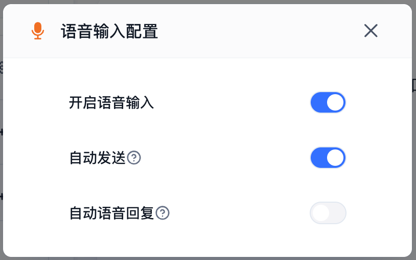

语音输入支持用户在前台对话中进行语音录入，并自动识别转换为文字。该能力适合移动端、客服、现场记录等不方便打字的场景。

## 配置入口

在应用编辑页中，找到 **语音输入** 配置项，点击右侧的设置按钮，即可打开语音输入配置弹窗。

|                                                   |                                                   |
| ------------------------------------------------- | ------------------------------------------------- |
|  |  |

## 开启语音输入

开启后，前台对话输入框中会显示语音录入入口。用户点击后可以开始录音，录音完成后系统会将语音识别为文字。

如果浏览器或当前环境不支持语音录入，前台会提示浏览器不支持语音输入。

## 自动发送

开启 **自动发送** 后，用户完成语音录入并识别为文字后，系统会自动发送该内容，不需要用户再手动点击发送按钮。

如果希望用户在发送前检查识别结果，可以关闭自动发送，让用户确认文字内容后再发送。

## 自动语音回复

开启 **自动语音回复** 后，通过语音输入发送的问题，AI 的回复也会自动以语音形式播放。

该能力需要同时开启语音播报配置。若未开启语音播报，AI 仍会正常生成文字回复，但不会自动播放语音。

## 使用建议

- 面向移动端或现场场景的应用，可以开启语音输入提升输入效率。
- 对识别准确性要求较高的场景，建议关闭自动发送，让用户先确认识别文本。
- 需要连续语音交互时，可以同时开启自动发送和自动语音回复。
