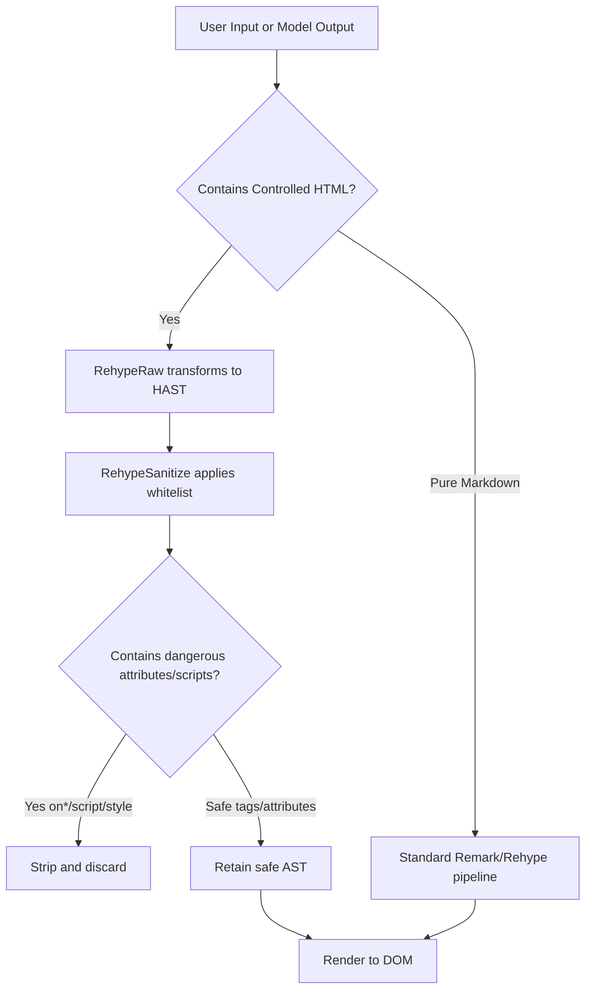

|     Interactive Charts (ECharts)     |  Math Formula Typesetting (KaTeX)  | Flowcharts & State Diagrams (Mermaid) |
| :----------------------------------: | :--------------------------------: | :-----------------------------------: |
|  |  |   |

FastGPT chat dialogs natively support controlled HTML tags along with a rich collection of custom interactive components. While ensuring robust system security, large language models can directly output interactive charts, audio/video streams, mathematical formulas, collapsible sections, and diverse rich-text typography.

---

### 1. Design Background & Security

#### 1.1 Design Background

In previous versions, embedded HTML within Markdown relied on an isolated `iframe` sandbox. Because container height could not be automatically determined, layouts often appeared disjointed. Furthermore, audio and video players previously fetched full media files via JavaScript and converted them into Blobs, frequently triggering CORS errors on third-party CDNs and causing browser memory spikes with large files.

FastGPT has now transitioned to a **native controlled HTML pipeline**:

- **Deprecated Iframe Sandbox**: HTML tags are parsed directly in the primary DOM tree, seamlessly adapting to layout dimensions and dark mode themes.
- **Native Cross-Origin Streaming Media**: Replaced Blob fetching with native HTML5 media streaming. Full HTTP Range request support allows large video and audio files to play while buffering, with timeline seeking and zero CORS blockers.
- **Smooth Streaming Guard**: When large models output text token-by-token, a built-in streaming guard buffers incomplete trailing HTML tags to prevent AST mutations and premature network requests.

#### 1.2 Security Architecture

Security is paramount when rendering HTML. Because server-side CSRF defenses cannot mitigate cross-site scripting (XSS) executing within the same origin, FastGPT enforces strict AST-level sanitization (via `rehype-sanitize`):

- **Executable Scripts Blocked**: All `<script>` tags and external script loaders are stripped.
- **Inline Events Stripped**: All `on*` attributes (such as `onclick`, `onerror`, `onload`) are completely removed.
- **Inline Styles Disallowed**: Generic inline `style` attributes are rejected to eliminate phishing overlays and layout spoofing.
- **Strict Protocol Whitelist**: URL attributes (`src`, `href`, `poster`, etc.) only permit safe protocols like `http`, `https`, `mailto`, `tel`, `cite`, and `quote`. Dangerous schemes like `javascript:`, `vbscript:`, `data:text/html`, and `file:` are blocked.
- **Restricted Form Controls**: Input elements are limited to static display; `type="file"` and `type="password"` are strictly forbidden.

#### 1.3 Limitations

- Running arbitrary custom JavaScript inside chat dialogs is not supported.
- Unwhitelisted HTML tags and attributes are automatically stripped during AST processing without interrupting message reading.
- Full independent web applications should still be integrated through dedicated app publishing channels or external links.

---

### 2. Supported Controlled HTML Tags

The supported HTML tags and allowed attributes are summarized below:

| Category                      | Allowed Tags                                                                                      | Allowed Attributes                                                                                             | Description                                                                                    |
| :---------------------------- | :------------------------------------------------------------------------------------------------ | :------------------------------------------------------------------------------------------------------------- | :--------------------------------------------------------------------------------------------- |
| **Multimedia**                | `<video>`, `<audio>`, `<source>`, `<track>`                                                       | `src`, `controls`, `poster`, `width`, `height`, `preload`, `loop`, `muted`, `type`, `kind`, `srclang`, `label` | Native cross-origin streaming playback with seeking and subtitles                              |
| **Collapsible Sections**      | `<details>`, `<summary>`                                                                          | `open`, `data-think`                                                                                           | Collapsible containers; `data-think` is optimized for CoT reasoning displays                   |
| **Typography & Highlighting** | `<mark>`, `<kbd>`, `<font>`, `<sub>`, `<sup>`, `<abbr>`, `<ruby>`, `<rt>`, `<rp>`, `<s>`, `<del>` | `font: ['color', 'size', 'face']`<br/>`abbr: ['title']`                                                        | Text highlighter, keyboard keycaps, font color/size, subscripts/superscripts, ruby annotations |
| **Metrics & Figures**         | `<progress>`, `<meter>`, `<figure>`, `<figcaption>`                                               | `progress: ['value', 'max']`<br/>`meter: ['value', 'min', 'max', 'low', 'high', 'optimum']`                    | Native progress indicators, scalar gauges, and captioned illustrations                         |
| **Extended Tables**           | `<table>`, `<thead>`, `<tbody>`, `<tr>`, `<th>`, `<td>`, `<caption>`, `<colgroup>`, `<col>`       | `th/td: ['rowspan', 'colspan', 'align']`<br/>`col: ['span', 'width']`                                          | Complex table layouts with cell row/column spanning (rowspan/colspan) and alignment            |
| **Static Input Elements**     | `<button>`, `<input>`, `<textarea>`, `<label>`                                                    | `input: [['type', 'checkbox', 'radio', 'text'], 'value', 'checked', 'disabled', 'readOnly']`                   | Checkboxes, radio buttons, and read-only text fields for structured display                    |

---

### 3. Custom Enhanced Components

Beyond standard HTML tags, FastGPT incorporates custom-built components tailored for LLM chat environments.

#### 3.1 Syntax Highlighting Code Block & Image Gallery (CodeBlock & PhotoView)

Built-in code renderer supporting syntax highlighting alongside a full-screen image gallery:

- **Syntax Highlighting Code Block**: Supports dozens of programming languages, language badges, one-click copying, line numbers, and smooth horizontal scrolling.
- **Image Gallery**: Supports standard Markdown `` and HTML `` tags with full-screen zoom, rotation, and multi-image gallery switching.
- **Demonstration**:


- **Markdown Example**:

````md
```typescript
import { useState, useCallback } from 'react';

// FastGPT state controller
export const useMediaController = (initialUrl: string) => {
  const [isPlaying, setIsPlaying] = useState<boolean>(false);
  const handlePlayToggle = useCallback(() => setIsPlaying((prev) => !prev), []);
  return { isPlaying, handlePlayToggle };
};
```


````

---

#### 3.2 ECharts Dynamic Interactive Charts (echarts code block)

When models output statistical data, returning an `echarts` code block renders an interactive chart directly in the chat window.

- **Features**: Responsive auto-scaling, hover tooltips, legend filtering, loading skeletons, and error boundary cards.
- **Demonstration**:


- **Markdown Example**:

````md
```echarts
{
  "title": { "text": "FastGPT RAG Retrieval Latency Breakdown (ms)" },
  "tooltip": { "trigger": "axis" },
  "xAxis": {
    "type": "category",
    "data": ["Query Rewriting", "Vector Search", "Reranking", "Model Inference", "Streaming Output"]
  },
  "yAxis": { "type": "value" },
  "series": [
    {
      "data": [18, 52, 35, 160, 25],
      "type": "bar"
    }
  ]
}
```
````

---

#### 3.3 KaTeX Mathematical Formula Rendering (Math LaTeX)

Integrated KaTeX engine for rendering calculus, matrices, and scientific notation.

- **Features**: Supports inline math ($ ... $) and centered multi-line block equations ($$ ... $$) with flicker-free streaming rendering.
- **Demonstration**:


- **Markdown Example**:

```md
Inline formulas:
Einstein mass-energy equation: $E = mc^2$, Euler identity: $e^{i\pi} + 1 = 0$.

Block formulas:

$$
\int_{-\infty}^{+\infty} e^{-x^2} dx = \sqrt{\pi}
$$

$$
x = \frac{-b \pm \sqrt{b^2 - 4ac}}{2a}
$$
```

---

#### 3.4 Mermaid Diagrams & State Charts (mermaid code block)

Generates vector charts directly from `mermaid` code blocks.

- **Features**: Renders flowcharts, sequence diagrams, Gantt charts, state machines, and class diagrams in crisp SVG format.
- **Demonstration**:


- **Markdown Example**:

````md

````

---

#### 3.5 Native Streaming Media Player (Video & Audio)

Embed audio and video using standard HTML tags.

- **Features**: Native playback without Blob conversions, supporting external MP4, WebM, MP3, and WAV media streams with seeking and zero CORS issues.
- **Demonstration**:


- **HTML Example**:

```html
<video src="https://example.com/oceans.mp4" controls width="100%"></video>

<audio src="https://example.com/sample-3s.mp3" controls></audio>
```

---

#### 3.6 Structured Collapsible Sections (Details & Summary) & Static Form Controls

Organize lengthy text and interactive options.

- **Collapsible Sections**: Expandable sections for technical deep dives, appendices, and CoT reasoning chains (`data-think`).
- **Static Form Controls**: Checkboxes, radio buttons, and read-only text fields.
- **Demonstration**:


- **HTML Example**:

```html
<details data-think="true">
  <summary>Reasoning and Thought Process</summary>
  Step-by-step reasoning details emitted during chain-of-thought derivation.
</details>

<ul>
  <li><input type="checkbox" checked disabled /> Dataset vector retrieval and semantic rerank</li>
  <li><input type="checkbox" checked disabled /> AST controlled whitelist sanitization</li>
  <li><input type="checkbox" disabled /> User final acceptance test</li>
</ul>
```

---

#### 3.7 Progress Bars, Complex Tables & Rich Typography

Fine-grained data metrics and advanced typesetting support.

- **Progress Bars**: Visual progress indicator for confidence scores and match ratios.
- **Complex Tables**: Full support for `rowspan`, `colspan`, and `align`, with responsive horizontal scrolling and CSV export.
- **Rich Typography**: Keyboard keycaps (`<kbd>`), highlighter (`<mark>`), custom colors (`<font color="...">`), chemical formulas and exponents (`<sub>` / `<sup>`), and acronym tooltips (`<abbr>`).
- **Demonstration**:


- **HTML Example**:

```html
Search Match Ratio (75%):
<progress value="75" max="100"></progress>

Keyboard shortcut: press <kbd>Ctrl</kbd> + <kbd>C</kbd> to copy, <kbd>Ctrl</kbd> + <kbd>V</kbd> to
paste. Highlighter: <mark>AST sanitization with streaming guard</mark> protects the application.
Custom font colors: this is <font color="red">red warning text</font>, and this is
<font color="#3370FF">blue information</font>. Subscripts and superscripts: water formula is
H<sub>2</sub>O, relativity formula E = mc<sup>2</sup>. Acronym tooltip: integrating
<abbr title="Retrieval-Augmented Generation">RAG</abbr> with Agents.
```
