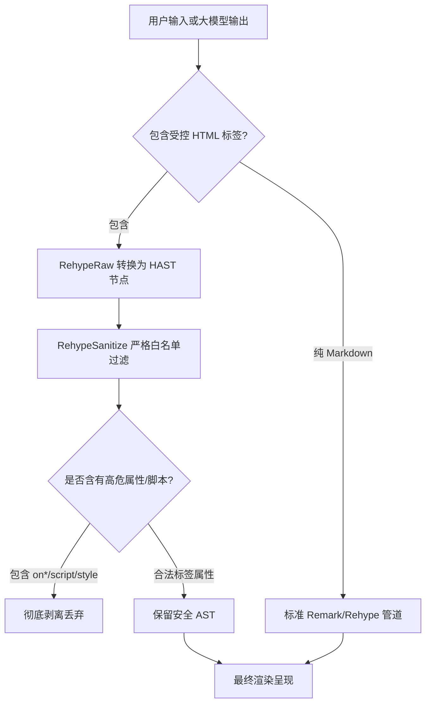

|        动态交互图表 (ECharts)        |        数学公式排版 (KaTeX)        |       流程图与状态图 (Mermaid)       |
| :----------------------------------: | :--------------------------------: | :----------------------------------: |
|  |  |  |

FastGPT 对话框全面支持受控原生 HTML 标签与多款自定义增强组件。系统在保障运行安全的前提下，使大模型能够直接输出图表、音视频、数学公式、折叠块及多样化的富文本排版，呈现更生动的交互体验。

---

### 1. 设计背景与安全说明

#### 1.1 设计背景

在以往版本中，Markdown 内部嵌入的 HTML 需借由 `iframe` 沙箱承载。由于难以自适应动态内容高度，界面常出现尺寸割裂，且外部音视频播放器依赖前端下载全量数据转为 Blob，导致外部媒体频繁遭遇跨域（CORS）拦截或引发浏览器内存溢出。

FastGPT 现已全面升级为**原生受控 HTML 流水线**：

- **废弃 Iframe 隔离**：HTML 标签直接在主 DOM 树中受控解析，自适应上下文容器排版与暗黑模式。
- **原生多媒体跨源流式播放**：废除全量下载逻辑，全面回归 HTML5 原生播放机制。支持 HTTP Range 分段请求，大体积音视频可边缓冲边播放、自由拖动进度条，且不受第三方服务器 CORS 跨域限制。
- **平滑流式输出保护**：大模型逐字打字输出时，系统内置未闭合标签拦截机制（Streaming Guard），防止半截 HTML 标签造成界面频繁突变或提前触发无效网络请求。

#### 1.2 安全机制说明

在开放 HTML 渲染时，安全防护始终是首要原则。由于服务端 CSRF 防护无法防御前端同源跨站脚本（XSS）攻击，FastGPT 依托 AST 语法树层级的严格白名单机制（基于 `rehype-sanitize`）进行深度清洗：

- **坚决剔除可执行脚本**：彻底禁止 `<script>` 标签以及任何外部脚本加载。
- **禁用全部行内事件**：严格过滤所有 `on*` 属性（如 `onclick`、`onerror`、`onload` 等），拦截事件注入。
- **禁止全局内联样式**：不开放通用 `style` 属性注入，杜绝利用 CSS 实现全屏欺诈遮罩或样式污染。
- **严格协议白名单**：URL 资源路径（如 `src`、`href`、`poster` 等）仅允许 `http`、`https`、`mailto`、`tel`、`cite`、`quote` 等安全协议，严格封锁 `javascript:`、`vbscript:`、`data:text/html`、`file:` 等高危伪协议。
- **受限表单输入**：表单组件仅供只读与交互状态展示，严厉封禁 `type="file"` 与 `type="password"`。

#### 1.3 限制说明

- 不支持在对话框中运行任何自定义 JavaScript 代码。
- 不支持未纳入安全白名单的 HTML 标签及属性，非法内容将在语法树解析阶段被安全剔除，不影响正文阅读。
- 复杂独立网页展示需求仍推荐通过专用的应用发布或外链接入。

---

### 2. 支持的受控 HTML 标签

系统支持的主要 HTML 标签与属性规范如下：

| 分类               | 标签名称                                                                                                    | 允许属性                                                                                                                  | 功能说明                                                              |
| :----------------- | :---------------------------------------------------------------------------------------------------------- | :------------------------------------------------------------------------------------------------------------------------ | :-------------------------------------------------------------------- |
| **多媒体播放**     | `<video>` , `<audio>` , `<source>` , `<track>`                                                              | `src` , `controls` , `poster` , `width` , `height` , `preload` , `loop` , `muted` , `type` , `kind` , `srclang` , `label` | 支持原生流式视频与音频播放，支持外挂字幕与封面图                      |
| **折叠交互**       | `<details>` , `<summary>`                                                                                   | `open` , `data-think`                                                                                                     | 支持折叠展示内容；搭配 `data-think` 属性可用于大模型深度思考过程展示  |
| **文本排版与高亮** | `<mark>` , `<kbd>` , `<font>` , `<sub>` , `<sup>` , `<abbr>` , `<ruby>` , `<rt>` , `<rp>` , `<s>` , `<del>` | `font: ['color', 'size', 'face']`<br/>`abbr: ['title']`                                                                   | 支持荧光笔标记高亮、快捷键按键样式、字号颜色调整、上下角标及注音排版  |
| **数据指标展示**   | `<progress>` , `<meter>` , `<figure>` , `<figcaption>`                                                      | `progress: ['value', 'max']`<br/>`meter: ['value', 'min', 'max', 'low', 'high', 'optimum']`                               | 提供原生进度指示条、数值度量刻度及带图注的排版结构                    |
| **复杂表格扩展**   | `<table>` , `<thead>` , `<tbody>` , `<tr>` , `<th>` , `<td>` , `<caption>` , `<colgroup>` , `<col>`         | `th/td: ['rowspan', 'colspan', 'align']`<br/>`col: ['span', 'width']`                                                     | 弥补标准 Markdown 无法跨行、跨列合并单元格（rowspan / colspan）的不足 |
| **静态交互控件**   | `<button>` , `<input>` , `<textarea>` , `<label>`                                                           | `input: [['type', 'checkbox', 'radio', 'text'], 'value', 'checked', 'disabled', 'readOnly']`                              | 支持复选框、单选框及文本输入框的静态排版与禁用态展示                  |

---

### 3. 自定义增强组件

除了标准 HTML 标签之外，FastGPT 还针对大模型常用场景内置了一系列功能强大的自定义增强组件。

#### 3.1 语法高亮代码块与图片画廊 (CodeBlock & Image PhotoView)

对话框内置专业代码高亮渲染器与图片画廊预览：

- **语法高亮代码块**：支持数十种主流编程语言的语法解析，顶部展示语言标识，支持一键复制代码内容、行号高亮与横向平滑滚动。
- **图片画廊**：支持标准 Markdown 图片语法 `` 及 HTML `` 标签。集成全屏图片预览画廊（PhotoView），支持手势缩放、滚轮放大、多角度旋转与多图快速翻页切换。
- **效果演示**：


- **Markdown 示例**：

````md
```typescript
import { useState, useCallback } from 'react';

// FastGPT 状态控制器
export const useMediaController = (initialUrl: string) => {
  const [isPlaying, setIsPlaying] = useState<boolean>(false);
  const handlePlayToggle = useCallback(() => setIsPlaying((prev) => !prev), []);
  return { isPlaying, handlePlayToggle };
};
```


````

---

#### 3.2 ECharts 动态交互图表 (echarts 代码块)

当大语言模型需要呈现统计数据时，无需调用外部服务生成静态图片，只需输出 `echarts` 代码块，即可原地渲染为完整的交互式图表。

- **特性**：自适应对话框容器宽度，鼠标悬停可触发数据悬浮提示（Tooltip），图表支持图例筛选、点击联动，并在数据生成期间提供骨架屏占位与语法容错。
- **效果演示**：


- **Markdown 示例**：

````md
```echarts
{
  "title": { "text": "FastGPT RAG 检索耗时构成 (ms)" },
  "tooltip": { "trigger": "axis" },
  "xAxis": {
    "type": "category",
    "data": ["Query重写", "向量检索", "语义重排", "模型推理", "流式输出"]
  },
  "yAxis": { "type": "value" },
  "series": [
    {
      "data": [18, 52, 35, 160, 25],
      "type": "bar"
    }
  ]
}
```
````

---

#### 3.3 KaTeX 数学公式渲染 (Math LaTeX)

深度集成高性能 KaTeX 排版引擎，支持渲染微积分、矩阵方程及物理化学生物公式。

- **特性**：支持行内公式与多行居中块级公式，即便在流式打字生成中也能保证渲染无闪烁。
- **效果演示**：


- **Markdown 示例**：

```md
行内公式：
爱因斯坦质能方程：$E = mc^2$，欧拉公式：$e^{i\pi} + 1 = 0$。

块级高数公式：

$$
\int_{-\infty}^{+\infty} e^{-x^2} dx = \sqrt{\pi}
$$

$$
x = \frac{-b \pm \sqrt{b^2 - 4ac}}{2a}
$$
```

---

#### 3.4 Mermaid 流程图与状态图 (mermaid 代码块)

模型输出 `mermaid` 代码块即可自动绘制矢量图形。

- **特性**：支持流程图（Flowchart）、时序图（Sequence Diagram）、甘特图（Gantt）、状态机（State Diagram）及类图，清晰呈现系统架构与业务逻辑走向。
- **效果演示**：


- **Markdown 示例**：

````md

````

---

#### 3.5 原生流式多媒体播放 (Video & Audio)

通过原生受控 HTML 标签嵌入音频和视频。

- **特性**：摆脱历史版本 Blob 加载带来的跨域限制，支持外链 MP4、WebM、MP3、WAV 媒体资源分段流式播放与进度拖拽。
- **效果演示**：


- **HTML 示例**：

```html
<video src="https://example.com/oceans.mp4" controls width="100%"></video>

<audio src="https://example.com/sample-3s.mp3" controls></audio>
```

---

#### 3.6 交互与思维折叠 (Details & Summary) 与静态表单控件

利用 HTML 折叠标签整理长篇信息，结合表单控件呈现任务选项。

- **折叠交互**：支持长代码分析、参考资料附录，以及深度推理模型（如 DeepSeek-R1 等）的思维链（`data-think`）折叠展开。
- **静态控件**：支持 Checkbox 任务列表、单选框及只读输入展示。
- **效果演示**：


- **HTML 示例**：

```html
<details data-think="true">
  <summary>查看思考过程与决策逻辑</summary>
  大模型在生成答案时的深度推理内容，支持展开收起。
</details>

<ul>
  <li><input type="checkbox" checked disabled /> 知识库向量检索与语义重排</li>
  <li><input type="checkbox" checked disabled /> AST 受控白名单安全清洗</li>
  <li><input type="checkbox" disabled /> 用户最终验收测试</li>
</ul>
```

---

#### 3.7 进度条、复杂表格跨行跨列与丰富排版文本

提供细粒度的数据可视化度量与高级排版能力。

- **进度条 (Progress)**：支持展示任务匹配度、置信度等指标进度。
- **复杂表格 (Table)**：支持 `rowspan`、`colspan`、`align` 单元格跨行跨列排版，支持横向自适应滚动与一键导出完整 CSV。
- **丰富排版**：支持快捷键按键样式（`<kbd>`）、荧光笔高亮（`<mark>`）、自定义颜色（`<font color="...">`）、化学式上下角标（`<sub>` / `<sup>`）以及术语缩写浮层（`<abbr>`）。
- **效果演示**：


- **HTML 示例**：

```html
检索匹配度 (75%)：
<progress value="75" max="100"></progress>

快捷键提示：按 <kbd>Ctrl</kbd> + <kbd>C</kbd> 复制，按 <kbd>Ctrl</kbd> + <kbd>V</kbd> 粘贴。
荧光笔高亮：这段文字中的 <mark>安全 AST 净化与流式防抖</mark> 是系统的第一道防线。
自定义字体颜色：这是一段 <font color="red">红色警告信息</font>，这是一段
<font color="#3370FF">蓝色提示信息</font>。 化学式与数学角标：水分子式是 H<sub>2</sub>O，相对论公式
E = mc<sup>2</sup>。 术语缩写浮层：将 <abbr title="Retrieval-Augmented Generation">RAG</abbr> 与
Agent 深度融合。
```
